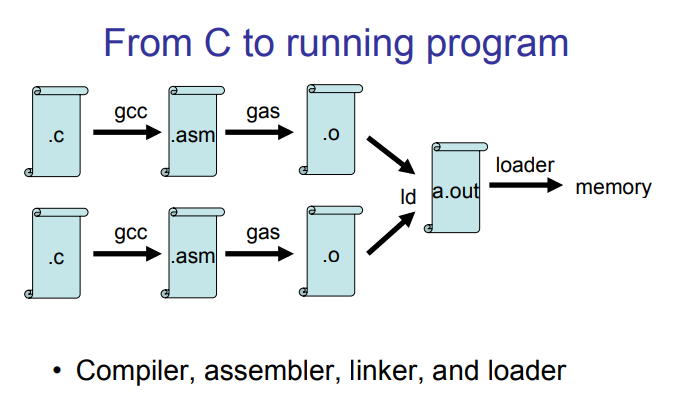

## 课程简介和感悟

先把课程的链接抛出来：

 https://pdos.csail.mit.edu/6.828/2018/schedule.html 

给的是课程的安排表，学习这个课程主要是做安排表上相应的Lab内容和homework内容，安排表上还给出了贼全面的参考资料。那么简单来说这个课程是MIT给他们本科生开设的一门关于操作系统的课程，但是比较不同的是，该课程除了通过一个内核源码带你了解内核之外，还会让你实现另一个相对简单的内核源码，并且最后让这个内核成功的运行起来，当然这个实现不是从0开始编写内核源码，而是基于课程已经提供的内核框架来实现内核的几大功能，比如内存管理、进程管理等等。

那么如上所述，个人认为这是两条学习线（可能看剧看多了），一条是Lab系列，也就是需要我们去实现内核的，这是我们主攻的一条线，另一条是homework，你可以当做是了解内核，并且辅助我们建立比较全面的认识。但是这两个学习线所使用的内核是不同的：

- Lab使用的内核名字叫做JOS，这是我们需要通过下面一系列Lab实现的一个内核，当然更多的是要我们自己去编写部分内核代码，而不是实现整个内核源码。总的来说JOS是一个微内核的，是一个类UNIX内核。

  Lab1主要讲的是PC启动的相关内容，如BIOS、boot loader，以及内核程序的第一个文件；

  Lab2主要讲的是PC的内存管理，包括了物理内存管理和虚拟内存管理；

  Lab3主要讲的是进程管理，虽然Lab没有使用process这个术语而是使用了environment，但是这两种在概念上是类似的，只是JOS中没有实现一些UNIX接口，估计作者怕不严谨所以使用了environment来描述。

  Lab5主要讲的是文件系统的实现，

  Lab6主要讲的是PC网络功能的实现

- homework路线使用的内核名字叫做xv6，这个是一个已经成型的类UNIX内核，是专门用于教学使用的，源码通过课程也会得到。那么homework路线个人感觉是带你了解操作系统中较为上层的内容，比如shell、线程等等。xv6对应的资料是xv6_book。

对于lab和homework的另一种区别就是，homework是国内高校开设的操作系统理论课，做的只是一些简单的实验，所以叫做homework，而lab相当于国内高校开设的操作系统实验课。

下面说说个人感悟：在做完所有的Labs和homeworks之后，我觉得以前学的操作系统是白学，只是停留在一些理论概念上，很抽象，不是真正的理解。但是通过课程编写内核源代码，我对操作系统有了一个全新的认识，或者说从头学了一遍操作系统。假如你想对底层的知识更加了解，比如分段、分页具体的实现，系统调用的流程和实现，进程的上下文切换的实现等等，那很建议您系统的跟一下这个课程，假如您基础比较好的话，那么一个月左右的时间就可以完成整个课程了，那么基础不太够的话，大概要2个月左右（Hint：我学这门课的时候，仅剩一点点操作系统的知识或者说啥都没有了，那么跟完这个课程大概花了2个月的时间）。

然而比较痛苦的是，人家既然是MIT开设的课程，那自然是全英文的，所以为了方便您的学习以及在您做实验有个参考和借鉴，我最近用中英文结合的方式（因为有些术语还是英文解释比较清楚）对实验过程进行了记录，整个实验记录的笔记在下面链接中：

那么各个Lab最终实现的代码以及最终实现的内核源码如下所示（十分希望各位大佬点个start）：

## 材料汇总

下面我稍微整理了一下，这个课程中会使用到的一些用处比较大的公共资料。

1.  https://pdos.csail.mit.edu/6.828/2018/reference.html 

   这个链接里面包含了整个课程学习中都会用到的一些资料；

2.  https://pdos.csail.mit.edu/6.828/2018/xv6/book-rev11.pdf 

   这个PDF是xv6这个操作系统对应的书籍；

3.   https://pdos.csail.mit.edu/6.828/2018/xv6/xv6-rev11.pdf 

    这个PDF是xv6的源代码

4.   https://pdos.csail.mit.edu/6.828/2018/readings/i386/toc.htm 

    这个是Intel 80386的参考文档

5. 汇编语言的资料

6. Intel 80386 Reference Programmer's Manual

    https://pdos.csail.mit.edu/6.828/2018/readings/i386/toc.htm 

## 学习Tips

在学习完整个课程之后，我根据自己学习过程遇到的一些问题，稍微总结了以下这些tips，希望对您的学习有一点帮助（仅供参考）

1. 这个公开课是全英文的，也不像吴恩达老师的机器学习课程一样有中文字幕的视频。当然你去网上找会有相应翻译版本的博客啥的，比如我上面给的实验记录，也就相当于把Lab内容给翻译了一遍，但是翻译的终究没有原味好，而且翻译中会带着个人的一些理解，所以推荐还是**按照课程安排中给出的内容，就纯英文的资料去学习**，而博客一类的这些都作为参考资料，可能全英文刚开始确实比较难顶，但是跟着跟着你就会习惯了，并且英文阅读还会有所提升。

2. 在学习这个课程之前，我没学过汇编啥的，所以在学习Lab1的时候，处处碰壁，所以个人建议对汇编语言先了解一些，当然这个课程也考虑到了这点，所以Lab1中也会要求你先熟悉一下汇编语言，也有给出相应的资料；

3. 对C语言编译的过程需要知道一下，如下所示（该图来自课程官方的slides）：

   

4. 对于Lab中有些不懂的问题，个人建议是先记录下来，因为你在后面的Labs的时候会发现这些问题都会迎刃而解；

5. 

## 参考的博客

在完成整个课程的过程中，参考比较多的博客已经列在下面了，感谢这些大佬的帮助，同时也感谢那些线上提供过帮助的大佬。

1. https://www.cnblogs.com/fatsheep9146/p/5060292.html 

   这位大佬的博客只有前面几个Lab，但是每一个都是超详细的，我刚开始做的时候就是看这位大佬的。

2. https://github.com/shishujuan/mit6.828-2017/tree/master/docs 

   这位大佬的github是将每个Lab分成两部分，一部分是理论讲解，另一部分是exercise。

3.  https://www.jianshu.com/p/782cb80c7690 

   这位大佬做的实验记录，个人感觉更多是他自己梳理过了的，并不是完全按照Lab中的顺序来的，在总结上我觉得超级nice。

4.  https://blog.csdn.net/bysui/article/category/6232831 

   这位大佬的博客，主要是后面的几个Lab有参考。