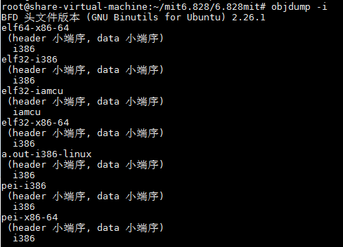

# 环境的搭建 

MIT 6.828课程采用软件模拟的方式来调试整个操作系统，也就是说让xv6操作系统运行在一个用软件仿真出来的x86计算机上。这个软件叫做qemu，下面是安装qemu的步骤。

## 0. 前言

此次搭建是在`Ubuntu 16.04 x64`上进行搭建的。

```bash
$ uname -a
Linux share-virtual-machine 4.15.0-54-generic #58~16.04.1-Ubuntu SMP Mon Jun 24 13:21:41 UTC 2019 x86_64 x86_64 x86_64 GNU/Linux
```

## 1. 安装工具链

执行以下命令，安装工具链

```bash
$ sudo apt-get install build-essential gdb gcc-multilib libsdl1.2-dev libtool-bin libglib2.0-dev libz-dev libpixman-1-dev
```

>  执行这条命令之前，最好先执行一下`sudo apt-get update`。
>
> 另外上述有些包你已经安装，但还是建议执行上述的安装命令，上述命令是把接下去所需要的包都给安装了。

安装完之后，执行`objdump -i`，会在第二行看到`elf32-i386`



执行`gcc -m32 -print-libgcc-file-name`，将会看到 `/usr/lib/gcc/x86_64-linux-gnu/version/32/libgcc.a`或者 `/usr/lib/gcc/i486-linux-gnu/version/libgcc.a`


## 2. 安装qemu

要用MIT修改版（加强了debug功能），执行以下命令即可安装。下面的是非官方的，是某位大牛fork之后的，主要是因为官方的不容易clone

```bash
$ git clone https://github.com/gou4shi1/qemu
$ cd qemu
$ ./configure --disable-kvm --target-list="i386-softmmu x86_64-softmmu"
$ make
$ sudo make install
```

## 3. 进行测试

qemu安装好之后，就可以用它来运行我们的操作系统了，我们clone代码进行测试，下面是非官方的代码（相对于官方是有修改过了的）

```bash
$ git clone  https://github.com/fatsheepzzq/6.828mit.git
```

clone完成之后，切换到`lab`目录，`lab`目录中存放的就是所有操作系统的源码，下面使用`make`编译这个操作系统源码，来生成能够运行在qemu上的操作系统影响文件。make编译的过程如下所示：

```bash
root@share-virtual-machine:~/mit6.828/6.828mit# clear
root@share-virtual-machine:~/mit6.828/6.828mit# ls
assignment  lab  ReadMe.md  resources
root@share-virtual-machine:~/mit6.828/6.828mit# cd lab
root@share-virtual-machine:~/mit6.828/6.828mit/lab# ls
boot  CODING  conf  fs  GNUmakefile  grade-lab1  grade-lab2  grade-lab3  gradelib.py  handin-prep  inc  init.d  init.s  kern  lib  mergedep.pl  user
root@share-virtual-machine:~/mit6.828/6.828mit/lab# make
+ as kern/entry.S
+ cc kern/entrypgdir.c
+ cc kern/init.c
+ cc kern/console.c
+ cc kern/monitor.c
+ cc kern/pmap.c
+ cc kern/env.c
+ cc kern/kclock.c
+ cc kern/printf.c
+ cc kern/trap.c
+ as kern/trapentry.S
+ cc kern/syscall.c
+ cc kern/kdebug.c
+ cc lib/printfmt.c
+ cc lib/readline.c
+ cc lib/string.c
.....
+ ld boot/boot
boot block is 390 bytes (max 510)
+ mk obj/kern/kernel.img
```

通过最后的输出信息`+ mk obj/kern/kernel.img`，我们可以看到编译生成了`kernel.img`，而这个就是内核映像文件。另外obj目录也是`make`生成的。编译完成之后就可以把它运行在qemu上了，在当前目录即编译后的lab目录中输入`make qemu`，即可让qemu自动加载我们的操作系统内核映像文件了。如下图所示，如果输出以下信息，则代表运行成功了。


但是我们接下去的课程是需要用到官方实验代码的，所以我们最好是clone官方代码，并且我们之后的实验都是基于官方代码进行修改的，下面是获取官方代码的示例

```bash
$ git clone https://pdos.csail.mit.edu/6.828/2017/jos.git
```


**本文参考及推荐**

1. [官方提供的安装文档](https://pdos.csail.mit.edu/6.828/2018/tools.html)
2. [MIT 6.828 JOS学习笔记1. Lab 1 Part 1: PC Bootstrap](https://www.cnblogs.com/fatsheep9146/p/5068353.html)
3. [强撸MIT之6.828](https://goushi.me/mit-6-828/#Overview)


