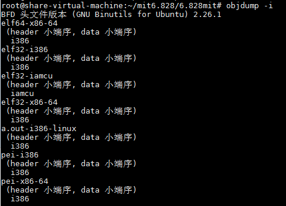
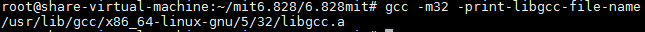
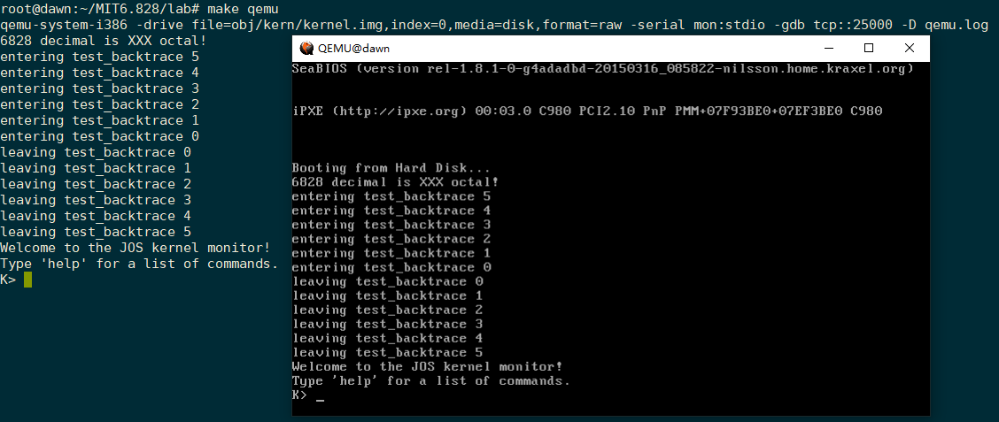

在整个课程开始之前，我们首先需要搭建相应的环境，比如安装所需要的编译工具链、qemu软件等。

## 0. 前言

此次搭建是在`Ubuntu 16.04 x64`上进行的。

```bash
$ uname -a
Linux share-virtual-machine 4.15.0-54-generic #58~16.04.1-Ubuntu SMP Mon Jun 24 13:21:41 UTC 2019 x86_64 x86_64 x86_64 GNU/Linux
```

## 1. 安装编译器工具链

执行以下命令，安装编译器工具链所需要的东西

```bash
$ sudo apt-get install build-essential gdb gcc-multilib
```

>  执行这条命令之前，最好先执行一下`sudo apt-get update`。
>
> 另外上述有些包你已经安装，但还是建议执行上述的安装命令，上述命令是把接下去所需要的包都给安装了。

安装完之后，执行`objdump -i`，会在第二行看到`elf32-i386`



执行`gcc -m32 -print-libgcc-file-name`，将会看到 `/usr/lib/gcc/x86_64-linux-gnu/version/32/libgcc.a`或者 `/usr/lib/gcc/i486-linux-gnu/version/libgcc.a`



## 2. 安装qemu

MIT 6.828课程采用软件模拟的方式来调试运行整个内核，也就是说让JOS内核或者xv6内核运行在一个用软件仿真出来的x86计算机上。这个软件叫做qemu，然而对于原生的qemu的debug功能来说存在一些不存之处，同时在后面的几个Lab中会比较依赖于debug功能，所以需要使用MIT修改版的（加强了debug功能），执行以下命令clone相应的git repository，到qemu目录

```bash
git clone https://github.com/mit-pdos/6.828-qemu.git qemu
```

> 也可以使用下面这个git repository，是某位大牛fork之后的
>
> ```
> git clone https://github.com/gou4shi1/qemu
> ```

qemu下载完成之后对于Linux系统来说，还需要安装几个libraries

```bash
sudo apt-get install libsdl1.2-dev libtool-bin libglib2.0-dev libz-dev libpixman-1-dev
```

上述步骤都完成之后配置相应的源代码、编译源代码、安装等，如下

```bash
$ cd qemu
$ ./configure --disable-kvm --target-list="i386-softmmu x86_64-softmmu"
$ make
$ sudo make install
```

## 3. 进行测试

环境搭建好了之后，就可以用它来运行我们的内核了，我们clone相应的内核代码进行测试，这边我们使用后面Lab系列中将会用到的JOS 内核源码。

```bash
git clone https://pdos.csail.mit.edu/6.828/2018/jos.git
```

clone完成之后，进入jos目录，该目录下存放的就是内核相关的代码了，下面使用`make`命令编译内核源码，生成相应的内核映像文件。make编译的过程如下所示

```bash
root@dawn:~/MIT6.828/lab# make
+ as kern/entry.S
+ cc kern/entrypgdir.c
+ cc kern/init.c
+ cc kern/console.c
+ cc kern/monitor.c
+ cc kern/printf.c
+ cc kern/kdebug.c
+ cc lib/printfmt.c
+ cc lib/readline.c
+ cc lib/string.c
+ ld obj/kern/kernel
ld: warning: section `.bss' type changed to PROGBITS
+ as boot/boot.S
+ cc -Os boot/main.c
+ ld boot/boot
boot block is 390 bytes (max 510)
+ mk obj/kern/kernel.img
```

通过最后的输出信息`+ mk obj/kern/kernel.img`，我们可以看到编译生成了`kernel.img`，这个就是内核映像文件。另外obj目录也是`make`生成的。编译完成之后，在当前目录下输入`make qemu`或者`make qemu-nox`，即可让qemu加载我们的操作系统内核映像文件了。如下图所示，如果输出以下信息，则代表运行成功了。

```bash
root@dawn:~/MIT6.828/lab# make qemu-nox
***
*** Use Ctrl-a x to exit qemu
***
qemu-system-i386 -nographic -drive file=obj/kern/kernel.img,index=0,media=disk,format=raw -serial mon:stdio -gdb tcp::25000 -D qemu.log
6828 decimal is XXX octal!
entering test_backtrace 5
entering test_backtrace 4
entering test_backtrace 3
entering test_backtrace 2
entering test_backtrace 1
entering test_backtrace 0
leaving test_backtrace 0
leaving test_backtrace 1
leaving test_backtrace 2
leaving test_backtrace 3
leaving test_backtrace 4
leaving test_backtrace 5
Welcome to the JOS kernel monitor!
Type 'help' for a list of commands.
K>
```

`make qemu-nox`跟`make qemu`相比，前者不会有图形界面，而后者会有，运行`make qemu`的效果如下所示




**本文参考及推荐**

1. [官方提供的安装文档](https://pdos.csail.mit.edu/6.828/2018/tools.html)
2. [MIT 6.828 JOS学习笔记1. Lab 1 Part 1: PC Bootstrap](https://www.cnblogs.com/fatsheep9146/p/5068353.html)
3. [强撸MIT之6.828](https://goushi.me/mit-6-828/#Overview)


