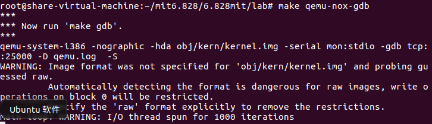
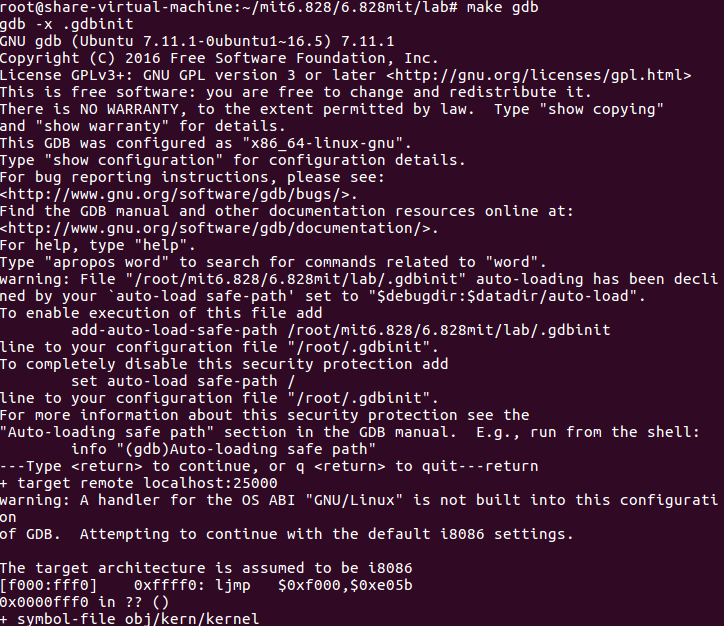

# PC Bootstrap

## PC机的物理地址

通常一个PC的物理地址空间的布局如下所示，PS：建议记住下面的物理地址：


第一代PC处理器是16位字长的Intel 8088处理器，这类处理器只能访问1MB的物理地址空间，即0x00000000~0x000FFFFF（虽然是处理器是16位字长的，但是总线是20位的）。但是这1MB也不是用户都能利用到的，只有低640KB(0x00000000~0x000A0000)的RAM地址空间（Low Memory）是用户程序可以使用的。而剩下的384KB的高地址空间则被保留有特殊的用处，其中最重要的一部分就是**BIOS，占据了0x000F0000~0x00100000的地址空间**。早期PC机中，BIOS是在ROM区，但是目前的PC机将BIOS存储在可更新的flash memory中。**BIOS负责进行一些基本的系统初始化任务，比如开启显卡，检测该系统的内存大小等等工作。在初始化完成后，BIOS就会从某个合适的地方加载操作系统，并将机器的控制权交给操作系统。**

虽然Intel处理器突破了1MB内存空间，在80286和80386上已经实现了16MB，4GB的地址空间，但是PC的架构必须仍旧把原来的1MB的地址空间的结构保留下来，这样才能实现向后兼容性。所以现代计算机的地址0x000A0000~0x00100000区间是一个空洞，不会被使用。因此这个空洞就把整个地址空间划分成了两个部分，第一部分就是从0x00000000~0x000A0000，叫做传统内存。剩下的不包括空洞的其他部分叫做扩展内存。另外在这种32位字长处理器的顶端，通常存储着BIOS。

最近x86处理器可以支持4GB以上的RAM了，在这种情况BIOS必须在32位RAM的顶部留下第二个空洞为了兼容32位的设备。

**对于本科本课程用到的xv6操作系统来说，由于设计的一些限制，它只利用第一块的256MB的物理地址空间，所以我们现在假装所有的PC机都只有一个32位可寻址的物理存储空间。**

## BIOS的启动流程

我们通过qemu的debug工具去模拟一个x86架构兼容的PC机的启动过程，首先我们进入lab目录，并在终端中输入`make qemu-gdb`或者`make qemu-nox-gdb`，如下所示：



之后我们再打开一个终端，还是进入lab目录，输入`make gbd`



最后的**输出结果`[f000:fff0] 0xffff0:	ljmp   $0xf000,$0xe05b`是PC启动之后，执行BIOS的第一条指令。**之后我们可以通过gdb的`si`指令，去追踪BIOS后面的指令。

首先是第一条指令，也就是我们上述所提到的：

```bash
0xffff0:	ljmp   $0xf000,$0xe05b
```

这是一条跳转指令，跳转到0xfe05b地址处。

> 至于为什么是0xfe05b这个地址，是因为当PC机启动时，CPU运行在实模式下，而进入操作系统之后将会运行在保护模式下（实模式和保护模式可以见下文）。实模式是早期CPU比如8088处理器的工作模式，这类处理器由于只有20根地址线，所以只能访问1MB的内存空间，但是CPU也在不断发展，之后的80286/80386已经具备32位地址总线，能访问4GB内存空间，为了很好的管理这么大的内存空间，保护模式被研发出来。所以现代处理器都是工作在保护模式下的，但是为了实现向后兼容性，即原来运行在8088处理器上的软件仍旧能在现代处理器上运行，所以现代的CPU都是在启动时运行在实模式下，启动完成之后运行在保护模式下。BIOS就是PC刚启动时运行的，所以它必然工作在实模式下。下面讲一下这种模式地址的计算方法，在实模式下，指令出现的地址都是采用`（段基址：段内偏移）`的形式，如[f000:fff0] 。这两个字段的值，通常都是存放在寄存器中的，其中段基址必须放在段寄存器中，包括CS（代码段）、DS（数据段）、SS（堆栈段）、ES（扩展段），不同的段寄存器存放的是你程序不同段的起始地址。这边也就是说，把内存分成了一个一个段。但是8088CPU中寄存器都是16位的，而CPU地址总线是20位的，怎么通过16位的寄存器去拼接得到20位的地址呢？所以采用下面这种方法：把段寄存器中的值左移4位，形成20位段基址，然后和16位段内偏移相加，就得到了真实的地址。所以上述中真实地址为0f0000<<4+0xe05b=0xfe05b

```bash
0xfe05b: cmpl $0x0, $cs:0x6ac8
```

这一条指令，把\$0x0这个立即数和\$cs:0x6ac8所代表的内存地址的值比较，其中\$cs:0x6ac8就是上面介绍的实模式下地址形成的格式，其中$cs就代表CS段寄存器的值。

....（这边省略好多条，挑一些重点的讲）

```bash
0xfd16b:  in  $0x92, %al
0xfd16d:  or  $0x2, %al
0xfd16f:  out  %al, $0x92
```

这边`in`和`out`指令，是用于操作IO端口的。`in %al, PortAddress`向端口地址为PortAddress的端口写入值，值为al寄存器中的值，`out PortAddres,%al`把端口地址为PortAddress的端口中的值读入寄存器al中。标准规定端口操作必须要用al寄存器作为缓冲。其中IO端口对应的是什么设备可以查看如下链接:http://bochs.sourceforge.net/techspec/PORTS.LST

> 扼要说一下IO端口的概念：CPU与外部设备通讯时，通常是通过访问、修改设备控制器中的寄存器来实现的。那么这些位于设备控制器当中的寄存器也叫IO端口。为了管理方便，80x86CPU采用IO端口单独编制的方式，即所有设备的端口都被命名到一个IO端口地址空间中，这个空间是独立于内存地址空间的，所以采用的访问内存的指令也不一样。

通过查看上述链接，我们可以看到0x92端口控制的是PS/2系统控制端口A，而`or`和`out`这两条指令操作明显是在把这个端口的1号bit置为1，这个端口的bit1的功能是`bit 1= 1 indicates A20 active`，即A20地址线被激活，该地址线被激活，那么系统工作在保护模式下。**但是！！！之后的boot loader程序中，首先是要工作在实模式下的，所以这里的操作是去测试可用内存空间，在boot loader之前它肯定还会转换回实模式。参考地址：http://kernelx.weebly.com/a20-address-line.html **

```bash
0xfd171:  lidtw  %cs:0x6ab8
```

lidt指令：加载中断向量表寄存器（IDTR）。这个指令会把从地址0xf6ab8起始的后面6个字节的数据读入到中断向量表寄存器中。

```bash
0xfd177:  lgdtw  %cs:0x6a74 
```

把从0xf6a74为起始地址处的6个字节的值加载到全局描述符表格寄存器（GDTR）中，这个表是实现保护模式非常重要的一部分，下面boot loader时会介绍它。

...（再次省略一部分的指令讲解）

```bash
0xfd187:  ljmpl  $0x8, $0xfd18f
0xfd18f:   mov  $0x10, %eax
0xfd194:  mov  %eax, %ds
0xfd196:  mov  %eax, %es
0xfd198:  mov  %eax, %ss
0xfd19a:  mov  %eax, %fs
0xfd19c:  mov  %eax, %gs
```

修改这些段寄存器的值，如果加载完GDTR寄存器，我们必须要重新加载所有的段寄存器的值，这样才能使GDTR的值生效。

上面只是挑了一部分讲解，更加全面的BIOS指令讲解可以参考该网址[MIT 6.828 JOS学习笔记3. Exercise 1.2](https://www.cnblogs.com/fatsheep9146/p/5078179.html)

从上面，我们可以看到BIOS的操作就是在控制、初始化、检测各种底层的设备，比如时钟，GTDR寄存器。以及设置中断向量表。但是**作为PC启动后运行的第一段程序，BIOS最重要的功能是把操作系统从磁盘中导入内存，然后再把控制权转交给操作系统**。所以BIOS在运行的最后会去检测可以从当前系统的哪个设备中找到操作系统，通常来说是我们的磁盘。假如BIOS确定了操作系统位于磁盘，那么它就将这个磁盘的第一个扇区，通常把它叫做启动区（boot sector）先加载到内存中，这个启动区包含一个非常重要的程序boot loader，boot loader会负责完成把整个操作系统从磁盘导入内存，以及一些其他的非常重要的配置工作，最后操作系统才会开始运行，加载到内存之后，BIOS会将控制权交给boot loader。

**本块参考**

1.http://bochs.sourceforge.net/techspec/PORTS.LST

2.http://kernelx.weebly.com/a20-address-line.html 

3.[MIT 6.828 JOS学习笔记3. Exercise 1.2](https://www.cnblogs.com/fatsheep9146/p/5078179.html)

## Boot Loader

> 首先提一下扇区的概念，对于PC的硬盘或者软盘来说，它们是被划分为512字节的区域，这一个个区域叫做扇区（sector）。扇区是一次磁盘操作的最小粒度，每一次读取或者写入都必须是一个或多个扇区。

如果**一个磁盘是可以被用来启动操作系统的，那么这个磁盘的第一个扇区就叫做启动扇区，boot loader程序就位于这个启动扇区中**。当BIOS找到可以启动的磁盘或者软盘后，它就**会把这512个字节的启动扇区加载到物理内存为0x7c00~0x7dff的地址区域中。**之后通过一条`jmp`指令设置CS:IP为0000:7c00，**并将控制权交给boot loader。**

对于课程6.828来说，我们将采用传统的硬盘启动机制（因为对应的还有CD-ROM方式，CD-ROM方式使用的扇区大小是2014字节的），这也就意味着boot loader程序的大小必须小于512字节。这**boot loader程序包括了一个汇编文件`boot/boot.S`和一个C语言文件`boot/main.c`**，boot loader程序首先是执行`boot/boot.S`里面的内容，再执行`boot/main.c`，主要实现了以下两个功能：

1. 首先，boot loader程序将处理器从实模式转换为32位的保护模式，只有在保护模式下软件才能访问超过1MB的物理内存空间。同时你需要理解，在保护模式下，分段地址(段基址:段内偏移)在保护模式下转换为物理地址的方式是不同的，后面将会用到分页方式。
2. 其次，boot loader程序使用x86特定的I/O指令从磁盘中读取内核。

为了更好的理解boot loader这个程序除了`boot/boot.S`和`boot/main.c`这两个文件，我们还可以参考`obj/boot/boot.asm`这个文件，这个文件是boot loader程序的反汇编文件。通过这个反汇编文件，我们可以更好找到boot loader程序是被真正的放到物理内存的哪了，同时也可以更好的理解boot loader程序。

>  Likewise, `obj/kern/kernel.asm` contains a disassembly of the JOS kernel, which can often be useful for debugging.

### boot loader程序的理解之boot.S

为了对boot loader程序有一个更好的理解，我们首先来看一下`boot/boot.S`这个文件的内容：

```assembly
.globl start
start:
	.code16                # Assemble for 16-bit mode
	cli                    # Disable interrupts
```

上述几条指令就是`boot/boot.S`中最开始的几句，起这种cli是boot loader的第一条指令，这一条指令用于把所有的中断都关闭，因为BIOS运行期间有可能打开了中断。**此时CPU处于实模式下**。

```assembly
 cld                         # String operations increment
```

上述指令用于指定之后发生的串处理操作的指针移动方向。

```assembly
# Set up the important data segment registers (DS, ES, SS).
xorw    %ax,%ax             # Segment number zero
movw    %ax,%ds             # -> Data Segment
movw    %ax,%es             # -> Extra Segment
movw    %ax,%ss             # -> Stack Segment
```

上述指令主要是把这三个段寄存器ds、es、ss全部清零，因为经历了BIOS不能保证里面存放的是什么数，同时也为后面进入保护模式做准备。

```assembly
# Enable A20:
#   For backwards compatibility with the earliest PCs, physical
#   address line 20 is tied low, so that addresses higher than
#   1MB wrap around to zero by default.  This code undoes this.
seta20.1:
inb     $0x64,%al               # Wait for not busy
testb   $0x2,%al
jnz     seta20.1
movb    $0xd1,%al               # 0xd1 -> port 0x64
outb    %al,$0x64
seta20.2:
inb     $0x64,%al               # Wait for not busy
testb   $0x2,%al
jnz     seta20.2
movb    $0xdf,%al               # 0xdf -> port 0x60
outb    %al,$0x60
```

上面这部分指令是在准备把CPU的工作模式从实模式切换到保护模式。通过查询[IO端口的详情](http://bochs.sourceforge.net/techspec/PORTS.LST)可以看到最后使能了A20线，**代表可以进入保护模式了，PS：注意可以这两个字**。

```assembly
# Switch from real to protected mode, using a bootstrap GDT
# and segment translation that makes virtual addresses 
# identical to their physical addresses, so that the 
# effective memory map does not change during the switch.
lgdt    gdtdesc
movl    %cr0, %eax
orl     $CR0_PE_ON, %eax
movl    %eax, %cr0
```

`lgdt  gdtdesc`这条指令是把gdtdesc这个标识符的值送入全局映射描述符表寄存器GDTR中，其中gdtdesc是一个标识符，标识着一个内存地址，从这个内存地址开始之后的6个字节存放着GDT表的长度和起始地址，那么换言之，该操作就是把关于GDT表的长度和起始地址存放到GDTR寄存器中，这个寄存器是由48位组成，其中低16位表示该表长度，高32位表示该表在内存中的起始地址。而**GDT表是处理器工作在保护模式下一个非常重要的表。**

> gdtdecs这个标识符的定义，我们可以在文件末尾看到
>
> ```assembly
> # Bootstrap GDT
> .p2align 2                               # force 4 byte alignment
> gdt:
>   SEG_NULL                               # null seg
>   SEG(STA_X|STA_R, 0x0, 0xffffffff)      # code seg
>   SEG(STA_W, 0x0, 0xffffffff)            # data seg
> 
> gdtdesc:
>   .word   0x17                           # sizeof(gdt) - 1
>   .long   gdt                            # address gdt
> ```
>
> 该段的第三行`gdt`这是一个标识符，标识从这里开始就是GDT表了，可见这个GDT表中三个表项，分别表示三个段，null seg、code seg、data  seg。由于xv6没有使用分段机制，也就是说数据和代码都是写在一起的，所以数据段和代码段的其实地址都是0x0，大小都是0xffffffff=4GB。
>
> 在gdt标识符中`SEG()`子程序是来构造GDT表项的，这个子函数定义在`mmu.h`中，形式如下：
>
> ```c
> #define SEG(type,base,lim)                    \
>                     .word (((lim) >> 12) & 0xffff), ((base) & 0xffff);   \
>                     .byte (((base) >> 16) & 0xff), (0x90 | (type)),        \
>                     (0xC0 | (((lim) >> 28) & 0xf)), (((base) >> 24) & 0xff)
> ```
>
> 可见函数需要3个参数，一是type即这个段的访问权限；二是base，这个段的起始地址；三是lim，即这个段的大小界限。gdt表中的每一个表项的结构如图所示：
>
> 
>
> 其中limit_low就是limit的低16位，base_low就是base的低16位，依次类推，可知每个表项一共8字节，那么可以的得到GDT表的长度为24字节。
>
> 之后是`gdtdesc`标识符处了，那么这个地方就是要存放GDT表的信息了，其中0x17就是这个表的大小0x17=24-1，至于为什么不直接存表的大小，这是官方规定的，之后紧接着就是这个表的起始地址了。

紧接着的3个操作，明显是在修改CR0寄存器的内容，CR0和CR1~CR3寄存器都是80x86的控制寄存器，其中`$CR0_PE_ON`的值定义在`mmu.h`头文件中，为0x00000001，那么可见上面的操作是把CR0寄存器的bit0置为1，CR0寄存器的bit0是保护模式启动位，该位为1表示保护模式启动。

```assembly
ljmp    $PROT_MODE_CSEG, $protcseg
```

这只是一个简单的跳转指令，**这条指令的目的在于把当前的运行模式切换到32位地址模式**。

```assembly
protcseg:
# Set up the protected-mode data segment registers
movw    $PROT_MODE_DSEG, %ax    # Our data segment selector
movw    %ax, %ds                # -> DS: Data Segment
movw    %ax, %es                # -> ES: Extra Segment
movw    %ax, %fs                # -> FS
movw    %ax, %gs                # -> GS
movw    %ax, %ss                # -> SS: Stack Segment
```

上面主要是修改段寄存器的值，因为之前上面的指令刚刚加载完GDTR寄存器，我们必须要重新加载所有的段寄存器的值，这样才能使GDTR的值生效。

```assembly
# Set up the stack pointer and call into C.
42  movl    $start, %esp
43  call bootmain
```

最后接下来的指令就是设置当前的esp寄存器了，esp寄存器在后面堆栈中相当重要是x86堆栈指针寄存器，设置完之后就是一个`call`指令。准备跳转到`boot/main.c`文件中的`bootmain()`函数处，接下来我们就跑到这个函数处看一下。

### boot loader程序的理解之main.c

```c
// read 1st page off disk
readseg((uint32_t) ELFHDR, SECTSIZE*8, 0);
```

在`bootmian()`函数中最开始的时候调用了`readseg()`函数，`readseg()`函数具体实现如下所示：

```c
// Read 'count' bytes at 'offset' from kernel into physical address 'pa'.
// Might copy more than asked
void readseg(uint32_t pa, uint32_t count, uint32_t offset)
{
        uint32_t end_pa;

        end_pa = pa + count;

        // round down to sector boundary
        pa &= ~(SECTSIZE - 1);

        // translate from bytes to sectors, and kernel starts at sector 1
        offset = (offset / SECTSIZE) + 1;

        // If this is too slow, we could read lots of sectors at a time.
        // We'd write more to memory than asked, but it doesn't matter --
        // we load in increasing order.
        while (pa < end_pa) {
                // Since we haven't enabled paging yet and we're using
                // an identity segment mapping (see boot.S), we can
                // use physical addresses directly.  This won't be the
                // case once JOS enables the MMU.
                readsect((uint8_t*) pa, offset);
                pa += SECTSIZE;
                offset++;
        }
}
```

从这个函数的注释来看，把距kernel起始地址offset个偏移量的地址处作为起始地址，将它和它之后的count个字节的内容读出送入以pa为起始地址的内存物理地址处。所以这条指令就是把内核的第一个页（4KB=4096=SECTSIZE\*8=512\*8）的内容读取出来放到内存地址为ELFHDR（0x10000）的地方，**实际上这步操作相当于把内核映像文件的ELF头部读取出来放入内存地址为0x10000的地方。**

> ELF文件：ELF文件是一种文件格式，主要用来把程序存放到磁盘上，在程序被编译和链接后被创建出来的。一个ELF文件包括很多段，对一个可执行程序而言，通常包含存放代码的text段，存放全局变量的data段，存放字符串常量的rodata段。而ELF文件的头部就是用来描述这个ELF文件如何在存储器中存储的。需要注意的是，可链接文件还是可执行文件会有不同的ELF头部格式。

```c
// is this a valid ELF?
if (ELFHDR->e_magic != ELF_MAGIC)
        goto bad;
```

读取完这个内核的elf头部信息后，需要对这个elf文件头部信息进行验证。其中magic字段是整个elf头部信息的开端，并且假如这个文件格式是ELF格式的话，文件的`elf->magic`域应该是ELF_MAGIC，所以**这条语句就是判断这个输入文件是否是合法的elf可执行文件。**

```c
// load each program segment (ignores ph flags)
ph = (struct Proghdr *) ((uint8_t *) ELFHDR + ELFHDR->e_phoff);
```

头部中一定包含了Program Header Table，这个表格中存放着程序中所有段的信息，通过这个表我们可以找到执行的代码段，数据段。上述这行代码中ELFHDR是表头起址，phoff字段代表Program Header Table距离表头的偏移量，所以ph被指定为Program Header Table表头。

```c
eph = ph + ELFHDR->e_phnum;
```

phnum中存放的是Program Header Table中表项的个数，即段的个数，所以这部操作是把eph指向该表末尾。

```c
for (; ph < eph; ph++)
    // p_pa is the load address of this segment (as well
    // as the physical address)
    readseg(ph->p_pa, ph->p_memsz, ph->p_offset);
```

这个for循环就是在加载所有的段的到物理内存中，即把内核的各个段从外存读入内存。ph->p_pa是这个段在物理内存中的地址，ph->p_memsz则是指这个段被实际装入内存后的大小，ph->p_offset字段指的是这一段的开头相对于kernel开头的偏移量。

```c
((void (*)(void)) (ELFHDR->e_entry))();
```

e_entry字段指向的是这个文件的执行入口地址，所以这里就相当于开始运行内核映像文件了。**自此boot loader就把控制权转交给了操作系统的内核。**

**针对问题的回答：**

在boot.S文件中，计算机首先工作于实模式下，此时是16bit工作模式，当执行完`ljmp    $PROT_MODE_CSEG, $protcseg`指令之后，正式进入32位工作模式，也就是保护模式。

boot loader执行的最后一条语句是`((void (*)(void)) (ELFHDR->e_entry))()`，即跳转到内核程序的起始指令处，内核被加载到内存后执行的第一条语句是` movw $0x1234, 0x472`在`kern/entry.S`文件中。

关于内核一共有多少段，每段又有多少个扇区的信息位于内核文件ELF头部信息中的Program Header Table中，这个表中的每个表项分别对应内核文件的一个段，并且每个表项的内容包括这个段的大小、段的起始地址、段偏移等等信息。

### main.c中内核加载的详细讲解（这块需要重写）

上面可能对于boot loader加载ELF文件头部信息以及加载内核程序还是会有点迷离，那么下面结合kernel文件来具体讲解一下boot loader中的加载过程。

因为boot loader加载的是一个ELF文件，先来讲解一下ELF文件。当你在编译和链接一个C语言程序时，比如JOS kernel，这时候编译器会把每一个C语言源文件（.c后缀）转化成一个个目标文件（.o后缀），这个目标文件中包含了机器期望的二进制格式的汇编语言指令。之后链接器把所有的目标文件组合成一个单独的二进制映像文件，如`obj/kern/kernel`文件，那么这类文件就是ELF格式的。在6.828中，你可以认为一个ELF格式可执行文件由：带着加载信息的文件头，之后是程序头表，在之后紧跟着的是几个程序段（program sections）。其中每一段都是一块连续的代码或者数据，它们在被运行时会被加载到指定地址。而boot loader就是把它们加载到内存中，然后执行。

一个ELF文件以一个固定长度的ELF文件头开始，C语言中关于ELF头部的定义是在`inc/elf.h`文件中。对于接下去的程序头表和程序段，其中我们感兴趣的程序段是：

- .text段：存放程序的可执行代码
- .rodata段：存放所有只读数据，如字符串常量（然而我们不会麻烦到设置硬件去禁止写入）
- .data：存放所有被初始化过的数据段，比如初始化的全局变量（int x=5;）

当链接器在计算整个程序的内存布局时，它会将没有初始化过的全局变量如`int x`保存到一个叫`.bss`的段中，这个段在内存中是紧跟在`.data`段后面的。因为C语言要求一个未初始化的全局变量，全都被赋值为0，因此没有必要将`.bss`的这边变量的值存储到ELF文件中，然而链接器需要记录`.bss`段变量的地址和大小。当程序被装入内存后，需要将`.bss`段赋值为0。

下面我们通过`objdump`指令来查看该内核文件的具体信息：

- 首先使用`objdump -h obj/kern/kernel`考察JOS内核中所有段的名字、大小和地址，结果如下所示：

  

  从上图中我们可以看到这个kernel文件的所有段的信息，其中不仅仅包括我们之前提到的四个段，还有一些其他段，他们主要用于存放一些debug信息等等，这些段只是存放在可执行程序中，但是并不会被加载到内存中。另外我们从上述中还可以看到每一个段中都有两个比较重要的字段，VMA（链接地址）、LMA（加载地址）。其中加载地址代表的就是这个段被加载到内存后的地址，而链接地址是这个段被期望加载的逻辑地址。

- 每一个ELF文件都有一个Program Headers Table，用来指明ELF文件中哪些部分被加载到内存，以及被加载到内存中的地址。可以使用`objdump -x obj/kern/kernel`来获取kernel中Program Headers Table的信息：

  

  其中程序头中列出的是所有被加载到内存中的段的信息，这也是Program Headers Table的表项。每一个表项，上图中都把这个表项中涉及到的所有字段都列出来了，如virtual address ("vaddr")，physical address ("paddr")，加载的大小 ("memsz" and "filesz")。当然只有被标记为“LOAD”的段才会被加载到内存中，可见有一些段最后没有被加入到内存之中。

- BIOS通常会把boot sector加载到内存地址0x7c00处，这是boot sector的加载地址，也是它的链接地址。我们可以通过`boot/Makefrag`文件中的`-Ttext 0x7c00`语句来设置boot loader的链接地址，这样子链接器在生成代码中才会产生正确的内存地址。回顾内核中的加载地址和链接地址，和boot loader不同，内核的这两个地址是不同的，内核告诉boot loader把它加载到低地址（加载地址），但是它又希望运行在高地址处。

  除了各个段的信息之外，在ELF头部中，还有一个非常重要的信息就是`e_entry`字段，这个字段存放的是这个可执行程序的执行入口的链接地址，通过`objdump -f obj/kern/kernel`命令，我们可以看到内核程序入口：

  

  **从上图可知内核程序的入口地址是0x0010000c**


综上所述，boot loader主要包含两个文件boot.S和main.c，BIOS执行完之后，首先将机器的控制权交给boot.S，那么boot.S文件的主要任务是将CPU模式从实模式转化到32bit保护模式，同时设置好GDTR寄存器，最后调用main.c中的bootmain()，在这个函数中首先把内核文件的ELF头部信息先加载到内存地址为0x10000的地方，之后根据ELF头部中Program Headers Table将kernel程序中的所有段加载到以0x00100000开始的内存处，最后跳转到地址为0x0010000c的地方开始执行内核程序，自此控制权交给了内核程序。


**本块参考**

1.https://www.cnblogs.com/fatsheep9146/p/5115086.html

2.https://www.cnblogs.com/fatsheep9146/p/5216681.html

## Kernel

同boot loader类似，kernel开始的时候也是一些汇编语言，用来设置一些东西，以确保C语言程序能够正确的执行。

### 虚拟内存的使用

在boot loader被加载的时候，它的链接地址和加载地址是一致的，但是在kernel程序中，这两种地址就不再相同了。操作系统内核往往喜欢会被链接到一个非常高的虚拟地址空间处，比如0xf0100000，目的就是把处理器的低地址留给用户程序使用。但是很多机器没有其实没有能够支持0xf0100000这种地址那么大的物理内存，所以我不能在0xf0100000处开始存储kernel程序。为此我们使用处理器内存管理硬件把虚拟地址0xf0100000（链接地址）映射到物理地址0x00100000（kernel实际被加载的地方）。这种方式，尽管kernel的虚拟地址是非常高可以留下足够的地址空间给用户进程，但是它还是会被加载到物理地址为1MB（0x00100000）的地方。

然而现在我们只需要映射4MB的物理内存，我们使用`kern/entrypgdir.c`中手工编写的页目录和页表来实现。但是这个只能将虚拟地址0xf0000000~0xf0400000转化到物理地址0x00000000~0x00400000，同时也可以将虚拟地址范围为0x00000000~0x00400000转化到物理地址0x00000000~0x004000000上。任何不在这两个虚拟地址范围内的虚拟地址都会引起一个硬件异常。

### 格式化输出到控制台

我们在使用C语言编程时会经常使用到`printf`函数，但是在操作系统中必须自己手动实现IO操作。内核IO操作中主要的三个文件分别是 `kern/printf.c`，`kern/console.c`, `lib/printfmt.c`，通过对这三个文件的阅读，我们可以发现

`kern/pritnf.c`中的cprinf函数和vcprintf函数都会直接或间接的用到`lib/printfmt.c`中的vprintfmt函数，`kern/printf.c`中的putch函数调用了`kern/console.c`中的cputchar函数，并且`lib/printfmt.c`的一些程序也调用了`kern/console.c`中的cputchar函数。所以总的来说，`kern/printf.c`文件使用了`kern/console.c`和`lib/printfmt.c`中的函数，并且`lib/printfmt.c`文件也使用了`kern/console.c`中的函数。所以我们先来看一下`kern/console.c`这个文件的内容

#### kern/console.c

因为上述代码中我们都用了该文件中的`cputchar`函数，所以我们先来看一下这个函数的实现：

```c
// `High'-level console I/O.  Used by readline and cprintf.
void
cputchar(int c)
{
    cons_putc(c);
}

// output a character to the console
static void
cons_putc(int c)
{
    serial_putc(c);
    lpt_putc(c);
    cga_putc(c);
}
```

通过注释我们可以看到这个函数是最高层的console的IO控制函数，直接被readline和cprintf所使用。而这个函数又是通过调用`cons_putc`这个函数完成，这个函数的注释很明显的说了这个函数是的作用是输出一个字符到控制台。而 `serial_putc(c)`、`lpt_putc(c)`和`cga_putc(c)`这三个函数的实现可以参考[MIT 6.828 JOS学习笔记11 Exercise 1.8](https://www.cnblogs.com/fatsheep9146/p/5066690.html)

#### lib/printfmt.c

接下来我们看一下这个文件的内容，这个文件刚开头的注释

```
// Stripped-down primitive printf-style formatting routines,
// used in common by printf, sprintf, fprintf, etc.
// This code is also used by both the kernel and user programs.
```

简化原始版的printf输出风格规则，经常被printf, sprintf, fprintf等等函数所使用。这代码也被内核和用户程序所使用的。通过这个注释，我们大概可以知道这个文件中定义的函数是我们在编程时式化输出的关键。那么下面我们先来看一下`vprintfmt`这个函数

```c
void
vprintfmt(void (*putch)(int, void*), void *putdat, const char *fmt, va_list ap)
{
    register const char *p;
    register int ch, err;
    unsigned long long num;
    int base, lflag, width, precision, altflag;
    char padc;

    while (1) {
        while ((ch = *(unsigned char *) fmt++) != '%') {
            if (ch == '\0')
                return;
            putch(ch, putdat);
        }

        // Process a %-escape sequence
        padc = ' ';
        width = -1;
        precision = -1;
        lflag = 0;
        altflag = 0;
    reswitch:
        switch (ch = *(unsigned char *) fmt++) {

        // flag to pad on the right
        case '-':
            padc = '-';
            goto reswitch;

        // flag to pad with 0's instead of spaces
        case '0':
            padc = '0';
            goto reswitch;

        // width field
        case '1':
        case '2':
        case '3':
        case '4':
        case '5':
        case '6':
        case '7':
        case '8':
        case '9':
            for (precision = 0; ; ++fmt) {
                precision = precision * 10 + ch - '0';
                ch = *fmt;
                if (ch < '0' || ch > '9')
                    break;
            }
            goto process_precision;

        case '*':
            precision = va_arg(ap, int);
            goto process_precision;

        case '.':
            if (width < 0)
                width = 0;
            goto reswitch;

        case '#':
            altflag = 1;
            goto reswitch;

        process_precision:
            if (width < 0)
                width = precision, precision = -1;
            goto reswitch;

        // long flag (doubled for long long)
        case 'l':
            lflag++;
            goto reswitch;

        // character
        case 'c':
            putch(va_arg(ap, int), putdat);
            break;

        // error message
        case 'e':
            err = va_arg(ap, int);
            if (err < 0)
                err = -err;
            if (err >= MAXERROR || (p = error_string[err]) == NULL)
                printfmt(putch, putdat, "error %d", err);
            else
                printfmt(putch, putdat, "%s", p);
            break;

        // string
        case 's':
            if ((p = va_arg(ap, char *)) == NULL)
                p = "(null)";
            if (width > 0 && padc != '-')
                for (width -= strnlen(p, precision); width > 0; width--)
                    putch(padc, putdat);
            for (; (ch = *p++) != '\0' && (precision < 0 || --precision >= 0); width--)
                if (altflag && (ch < ' ' || ch > '~'))
                    putch('?', putdat);
                else
                    putch(ch, putdat);
            for (; width > 0; width--)
                putch(' ', putdat);
            break;

        // (signed) decimal
        case 'd':
            num = getint(&ap, lflag);
            if ((long long) num < 0) {
                putch('-', putdat);
                num = -(long long) num;
            }
            base = 10;
            goto number;

        // unsigned decimal
        case 'u':
            num = getuint(&ap, lflag);
            base = 10;
            goto number;

        // (unsigned) octal
        case 'o':
            // Replace this with your code.
            putch('X', putdat);
            putch('X', putdat);
            putch('X', putdat);
            break;

        // pointer
        case 'p':
            putch('0', putdat);
            putch('x', putdat);
            num = (unsigned long long)
                (uintptr_t) va_arg(ap, void *);
            base = 16;
            goto number;

        // (unsigned) hexadecimal
        case 'x':
            num = getuint(&ap, lflag);
            base = 16;
        number:
            printnum(putch, putdat, num, base, width, padc);
            break;

        // escaped '%' character
        case '%':
            putch(ch, putdat);
            break;

        // unrecognized escape sequence - just print it literally
        default:
            putch('%', putdat);
            for (fmt--; fmt[-1] != '%'; fmt--)
                /* do nothing */;
            break;
        }
    }
}
```

首先来看一下这个函数的参数：

- void (\*putch)(int, void\*)

  这个参数是一个函数指针，包含了两个输入参数int,void*，int参数表示一个要输出的字符的值，void\*则代表这个字符输出的地址的存储单元的地址。比如这个字符应该输出到0x01处，但是这个0x01的地址存储在地址为0x11上，那么void \*参数值是0x11。比如我们要将字符值为0x30（'0'）的字符输出到地址0x01处，那么代码的实现如下：

  ```c
  int addr = 0x01; 
  int ch = 0x30;
  putch(ch, &addr);
  ```

- void *putdat

  这个参数与上面putch函数的第二个输入参数是一个含义

- const char \*fmt

  这个参数是你在编写类似于printf这种格式化输出函数时，你指定格式的字符串，即printf的第一个输入参数，比如printf("This is %d test", n)中"This is %d test"

- va_list ap

  这个参数代表的是多个输入参数，即printf函数第二个参数开始之后的参数，比如printf("These are %d test and %d test", n, m)中的n和m

那么这个函数的主要功能是通过while循环，实现格式化输出。上面代码中需要补充的地方是关于`case 'o'`即八进制情况下的代码，参考十六进制和无符号十进制的情况，补充代码如下：

```c
// (unsigned) octal
case 'o':
    // Replace this with your code.
    //putch('X', putdat);
    //putch('X', putdat);
    //putch('X', putdat);
    //break;

    putch('0', putdat);     //八进制要打印一个0先
    num = getuint(&ap, lflag);
    base = 8;
    goto number;
```

另外这个函数中还涉及到一个非常重要的函数`va_arg`，与这个函数的配套使用的还有`va_start()`、`va_end()`以及一个数据类型va_list，这四个是为了让计算机能够处理输入参数不固定的程序，比如下面这样子的程序声明

```c
void fun(int arg_num, ...)
```

关于这块不固定参数的3个函数和一个数据类型的分析，可以参考http://www.cnblogs.com/justinzhang/archive/2011/09/29/2195969.html 

#### kern/printf.c

这个文件中定义的就是我们在编程中会用到的最顶层的一些格式化输出函数，比如`printf`，`sprintf`函数等。首先看一下这个文件中`cprintf`函数

```c
int
cprintf(const char *fmt, ...)
{
        va_list ap;
        int cnt;

        va_start(ap, fmt);
        cnt = vcprintf(fmt, ap);
        va_end(ap);

        return cnt;
}
```

这个函数与`printf`函数类似，第一个参数为输出的格式字符串，而后面就是要输出的一些参数，我们可以看到va_list、va_start、va_end的使用。这个函数把fmt之后的输入参数都转换到va_list类型的一个参数，然后把fmt和新生成的ap都传给vcprintf函数

```c
int
vcprintf(const char *fmt, va_list ap)
{
        int cnt = 0;

        vprintfmt((void*)putch, &cnt, fmt, ap);
        return cnt;
}
```

vcprintf函数中调用了vprintfmt函数，把fmt和ap传给了vprintfmt函数的第三个参数和第四个参数，这与我们上面分析的一直。另外再看一下第一个参数，它是一个函数指针，函数的实现如下：

```c
static void
putch(int ch, int *cnt)
{
        cputchar(ch);
        *cnt++;
}
```

它调用了上述分析的cputchar函数，这样子就把字符输出到屏幕上了。而第二参数，在这里并不是我们开始分析的内存地址，它在这里的作用只是计算器。


### 堆栈


 i386_init 函数执行内核初始化操作，包括BSS清零，屏幕显示初始化，然后初始化内存分配(mem_init函数)，内存分配的实现主要在 `kern/pmap.c` 文件中。

## 总结

**启动代码Boot Loader则被加载到了 0x7C00 处，接着 Boot Loader 代码执行后，会将内核代码的ELF文件头读取到 0x10000(64KB) 开始的4KB内存中，然后根据 ELF文件头将内核代码读取到 0x10000(1MB) 开始的处。**

逻辑地址==虚拟地址==链接地址


## 附：实模式和保护模式

实模式是早期CPU运行的工作模式，而保护模式则是现代CPU运行模式，为了实现软件的向后兼容性，现代CPU在运行boot loader时仍要先进入实模式。那么什么是实模式（real mode），什么又是保护模式（protected mode）呢？

### 实模式

实模式出现于早期8088CPU时期，只有20位地址线（所以地址空间只有1MB），以及8个16位的通用寄存器，4个16位的段寄存器。为了能够通过这些16位寄存器去构成20位的主存地址，必须采用一种特殊的方式。当某个指令想要访问某个内存地址时，它通常需要用**下面的这种格式来表示：(段基址：段偏移量)**。其中第一个字段是段基址，它的值由段寄存器提供的。段寄存器有4种，cs、ds、ss、es。第二字段是段内偏移量，代表你要访问这个内存地址距离这个段基址的偏移，它的值就是由通用寄存器来提供的。那么如何通过两个16位的值组成一个20位的地址呢？所以采用的是把所提供的段基址先左移4位，然后再与段偏移量相加。所以**物理地址=段基址<<4+段内偏移。**比如%cs中的值是0xff00，%ax=0x0110，则（%cs,%ax）这个地址对应的真实物理地址是0xff00<<4+0x0110=0xff110。上面就是在实模式下访问地址的原理了。

### 保护模式

但是随着CPU的发展，CPU的地址个数从原来的20根也变成了现在的32根，所以可以访问的内存空间也从1MB变成了现在的4GB，寄存器的位数也变成32位。所以实模式下的内存地址计算方式就不再适合了，也就引入了现在的保护模式，实现更大空间的，更灵活的内存访问。在介绍保护模式的工作原理之前，我们先来了解一下逻辑地址（logical address）、虚拟地址（virtual address）、线性地址（linear address）、物理地址（physical address）:

- 虚拟地址

  如今在**编写程序时，程序是运行在虚拟地址空间下**，也就是说，在程序员编写程序时指令中出现的地址并不一定是这个程序在内存中运行时真正要访问的内存地址。这样做的目的是为了能够让程序员在编程时不需要直接操作真实地址，因为它在真正运行时，内存中各个程序的分布情况是不可能在你编写程序时就知道。所以这个程序的这条指令到底要访问哪个内存单元是由操作系统来确定的，所以后面就有了一个从虚拟地址（virtual address）到真实主存中的物理地址（physical address）的转换。

- 逻辑地址&&线性地址

  在虚拟地址中，程序员编写时看的是虚拟地址，这个虚拟地址不是直接写在指令中的，而是通过逻辑地址推导而成。所以指令中真正出现的是逻辑地址。一个逻辑地址由两部分组成，一个是段选择子（segment selector），一个段内偏移量（offset），通常被写作（segment:offset）。而采用哪个段选择子通常也是在指令中隐含的，程序员通常只需要指明段内偏移量。然后分段管理机构（segmentation hardware）将这个逻辑地址（logical address）转换为线性地址（linear addresss）。如果机器中没有采用分页机制（paging hardware）的话，此时线性地址（linear address）就是做最后的物理地址。但是假如机器中还有分页设备的话，分页机构把这个线性地址转换为最终真实的物理地址。下面是逻辑地址、线性地址、物理地址的转换关系。

  

那么在保护模式下，是如何通过逻辑地址（segment:offset）得到物理地址呢？

在计算机中存在两个表GDT（全局段描述符表）、LDT（本地段描述符表）。它们两个是同类型的表，都是用来存放关于某个运行在内存中的程序的分段信息的，如程序的代码段从哪开始，有多大；数据段从哪开始，有多大。GDT表是全局可见的，也就是每一个运行在内存中的程序都能看到这个表，所以内核程序的段信息就存在这里面。LDT表，是每一个在内存中的程序所包含的，里面指明了每一个程序的段信息，我们可以看一下这两个表的结构。如下所示：


每一个表项都包括三个字段：

Base：32位，代表这个程序的这个段的基地址

Limit：20位，代表这个程序的这个段的大小

Flags：12位，代表这个程序的这个段的访问权限

当程序中给出逻辑地址（segment:offset）时，它并不是像实模式那样，用segment的值作为段基址，而是把这个segment的值作为一个selector，代表这个段的段表项在GDT/LDT表的索引。比如你当前要访问的地址segment:offset = 0x01:0x0000ffff，此时由于每个段表项的长度为8，所以此时应该取出地址为8处的段表项。然后根据Flags字段来判断是否可以访问这个段的内容，这样做是了能够实现进程间地址的保护。如果能访问，则把Base字段的内容取出，直接与offset相加，就得到了线性地址（linear address）了。之后假如有分页机构的话，那么就根据分页机构进行地址转换。

**本段参考**

1.https://www.cnblogs.com/fatsheep9146/p/5116426.html

## 附：ELF文件

首先我们来讲一下什么是ELF文件：当你在编译和链接一个C语言程序时，比如JOS kernel，这时候编译器会把每一个C语言源文件（.c后缀）转化成一个个目标文件（.o后缀）。之后链接器把所有的目标文件组合成一个单独的二进制映像文件，如`obj/kern/kernel`文件，那么这类文件就是ELF格式的。

接下去我们讲解一下ELF文件格式：

ELF文件可以分为一下几个部分：ELF文件头，程序头表（program header table）、文件内容和节头表(section header table)。文件内容部分又可以分为这样的几个节：.text节、.rodata节、.stab节、.stabstr节、.data节、.bss节、.comment节。

```
					  +------------------+ 
                        |    ELF 文件头     |
                        +------------------+  
                        |    程序头表       |
                        +------------------+  
                        |    .text 节      |
                        +------------------+                  
                        |    .rodata 节    |
                        +------------------+   
                        |    .stab 节      |
                        +------------------+        
                        |    .stabstr 节   |
                        +------------------+                       
                        |    .data 节      |
                        +------------------+  
                        |    .bss 节       |
                        +------------------+  
                        |    .comment 节   |
                        +------------------+      
                        |    节头表         |
                        +------------------+       
```

再接下去我们讲解一下6.828中定义的ELF文件的结构体，定义在`inc/elf.h`文件中

```c
// ELF 文件头
struct Elf {
    uint32_t e_magic; // 标识是否是ELF文件
    uint8_t e_elf[12]; // 魔数和相关信息 
    uint16_t e_type; // 文件类型
    uint16_t e_machine; 
    uint16_t e_version; // 版本信息
    uint32_t e_entry; // 程序入口点
    uint32_t e_phoff; // 程序头表偏移值
    uint32_t e_shoff; // 节头表偏移值
    uint32_t e_flags; 
    uint16_t e_ehsize;  // 文件头长度
    uint16_t e_phentsize; // 程序头部长度 
    uint16_t e_phnum; // 程序头部个数 
    uint16_t e_shentsize; // 节头部长度 
    uint16_t e_shnum; // 节头部个数 
    uint16_t e_shstrndx; // 节头部字符索引
};
```

其中**e_entry是可执行程序的入口地址，即从内存的这个位置开始执行，在这里入口地址是虚拟地址VMA，也就是链接地址**。 e_phoff 和 e_phnum 可以用来找到所有的程序头表项，e_phoff 是程序头表的第一项相对于 ELF 文件的开始位置的偏移，而 e_phnum 则是表项的个数;同理 e_ shoff 和 e_ shnum 可以用来找到所有的节头表项。

```c
struct Proghdr { 
    uint32_t p_type; // 段类型
    uint32_t p_align; // 段在内存中的对齐标志
    uint32_t p_offset; // 段位置相对于文件开始处的偏移量
    uint32_t p_va; // 段的虚拟地址
    uint32_t p_pa; // 段的物理地址
    uint32_t p_filesz; // 段在文件中长度
    uint32_t p_memsz; // 段在内存中的长度 
    uint32_t p_flags; // 段标志
}
```

上述是程序头表中表项的结构体，其中通过 p_offset可以找到该段在磁盘中的位置，通过p_va可以知道应该把这个段放在内存的哪个位置（虚拟地址），而之所以需要p_filesz和p_memsz这两个长度是因为.bss这种节在硬盘没有存储空间，而在内存中需要为其分配空间。

那么通过ELF文件头与程序头表项找到文件的第i段地址的方法如下：首先找到第 i 段程序头表表项位置= 文件起始位置 + 程序头表偏移e_phoff + i * 程序头表项字节数，找到表项位置之后，p_offset的值就是第i段的地址了。

ELF文件还有节点表，通过ELF文件头和节头表可以找到对应节的位置，方式与找第i段的位置类似。ELF的数据结构和几个重要的节的说明如下。**需要注意的是：这里的段是不同于之前节的概念，几个节可能会包含在同一个段里。**

```c
// 节头信息
struct Secthdr { 
    uint32_t sh_name;// 节名称
    uint32_t sh_type; // 节类型
    uint32_t sh_flags; // 节标志
    uint32_t sh_addr; // 内存中的虚拟地址
    uint32_t sh_offset; // 相对于文件首部的偏移
    uint32_t sh_size; // 节大小
    uint32_t sh_link; // 与其他节关系
    uint32_t sh_info; // 其他信息
    uint32_t sh_addralign; // 字节对齐标志 
    uint32_t sh_entsize; // 表项大小
};
// 各个节说明
.text 节: 可执行指令的部分。
.rodata 节: 只读全局变量部分。
.stab 节: 符号表部分，在程序报错时可以提供错误信息。
.stabstr 节: 符号表字符串部分。
.data 节: 可读可写的全局变量部分。
.bss 节: 未初始化全局变量部分，这一部分不会在磁盘有存储空间，但在内存中会分配空间。
.comment 节:注释部分，这一部分不会被加载到内存
```


**本文参考**

1.https://www.jianshu.com/p/af9d7eee635e

## 附：加载地址和链接地址

ELF文件的节的链接地址实际上就是它期望开始执行的内存地址，链接器可以用多种方式编码二进制可执行文件中的链接地址，编译器在编译的时候会认定程序将会连续的存放从链接地址起始处开始的内存空间。程序的链接地址实际上就是链接器对代码中的变量，函数等符号进行一个地址编排，赋予这些抽象的符号一个地址，然后在程序中通过地址访问相应变量和函数。要清楚的一点是，在ELF文件中的汇编代码或者机器指令中，符号已经不复存在，一切引用都是地址。使用ld等链接等链接程序时通过`-Ttext xxxx`和`-Tdata xxxx`指定代码段/数据段的链接地址，运行期间代码指令和数据变量的地址都在相对-T指定的基址的某个偏移量处。这个地址实际上就是链接地址。

而加载地址则是可执行程序在物理内存中真正存放的位置，在JOS中，Boot loader是被BIOS装载到内存的，而这里BIOS实际上规定Boot loader是要存放在物理内存的0x7c00处，于是不论程序的链接地址怎么变，它的加载地址都不会改变。在JOS中，Boot loader的链接地址在`boot/Makefrag`里面定义的，为0x7C00。所以假如把`boot/Makefrag`中的链接地址从0x7c00改为0x7c10，那么会在`jmp 0008:7c42`后报错，这是因为这条指令是根据改后的链接地址0x7c10来的，这样子在执行完`ljmp 0008:7c42`这条指令之后，要去寻找0x7c42处的指令`movw ax, 1`0运行，然而实际上这个地址处并不是合法的指令，因为加载地址是没有变的，`movw ax, 1`这条指令还是在0x7c32处，因为会报错。

## 附：问题汇总

1. 对于80386来说，32位字长处理器通常把BIOS存放在整个存储空间的顶端处，但是BIOS在执行的时候，不是处于实模式下嘛？处于实模式下最高只能访问的不是只能1MB嘛？
2. bios的位置？
3. C语言程序时调试时我们看到的地址都是虚拟地址嘛？
4. 这种就是情况下应该就是段页式存储把
5. 


