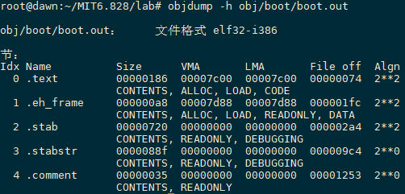

## Introduction

这个Lab分成3个部分

1. 第一部分主要专注于熟悉x86汇编语言、qemu x86仿真软件以及PC的上电之后的启动过程；
2. 第二部分主要讲的是6.828 kernel的boot loader，可见相应的`boot`目录；
3. 第三部分主要讲6.828 kernel的初始化，这个kernel叫做JOS，可见相应的`kernel`目录；

### JOS内核下载

整个的Lab系列是基于JOS内核来讲解内核，以及实现添加相应的功能。所以我们需要下载相应的JOS源码，建议从官方下，因为官方是原版最靠谱的。

```c
git clone https://pdos.csail.mit.edu/6.828/2018/jos.git
```

接下去主要就是讲一些git的简单使用，提交注意事项等，git的使用可以搜索相关教程学习一下，而对于提交注意事项，不是MIT的学生，这些提交事项都可以不用太关注，但是`make grade`这个我们需要及其关注，这条命令会测试你实现的代码，如果没有满分，可能是实现的代码存在一定的问题，可以检查相应的输出内容（resp-lab*.txt），来查看是在哪一块出错了。

## Part1：PC Bootstrap

这部分的目的就是让你熟悉x86的汇编语言和PC 启动的过程，以及开始qemu和qemu/gdb的调试。

### Getting Started with x86 assembly

如果你对x86的汇编语言不太了解，那么在这个课程中你将会很快熟悉它。 [PC Assembly Language Book](https://pdos.csail.mit.edu/6.828/2018/readings/pcasm-book.pdf)是一本很不错的书用来学习汇编语言。但是这本书中的例子是为NASM汇编器写的，然而我们使用的GNU汇编器。NASM使用的是Intel syntax，但是GNU使用的是AT&T syntax。虽然语义上是等价的，但因为使用的语法是不一样的，那么汇编文件的也将会大不同。但是比较幸运的是，这两种语法之间的转化是很简单的，可以参考[Brennan's Guide to Inline Assembly](http://www.delorie.com/djgpp/doc/brennan/brennan_att_inline_djgpp.html ).

*Exercise 1*：熟悉在 [the 6.828 reference page](https://pdos.csail.mit.edu/6.828/2018/reference.html) 上的汇编语言材料。你不需要现在就阅读这些，但是当你阅读或者编写x86汇编的时候，可以参考这些。很推荐参考[Brennan's Guide to Inline Assembly]( http://www.delorie.com/djgpp/doc/brennan/brennan_att_inline_djgpp.html )中“The Syntax”这一节，这一节对AT&T syntax做了一个很好并且相对简略的描述。

当然最后x86汇编语言编程的参考材料是 Intel's instruction set architecture reference ，这些也可以在我们上面提到的[the 6.828 reference page](https://pdos.csail.mit.edu/6.828/2018/reference.html)上找到，有两个版本：

1. HTML版本的、老的[80386 Programmer's Reference Manual](https://pdos.csail.mit.edu/6.828/2018/readings/i386/toc.htm)，这个版本相对最近的版本是更加简单和容易上手的，但是已经将我们将会在6.828这个课程中所使用的x86的处理器特性都描述了；
2. 最近最全并且是最好为Intel设计的[IA-32 Intel Architecture Software Developer's Manuals](http://www.intel.com/content/www/us/en/processors/architectures-software-developer-manuals.html) ，包含了最近大部分处理器的全部特性，这些特性可能在6.828中不会被使用到

还有一个由AMD提供的等价的[manuals]( https://developer.amd.com/resources/developer-guides-manuals/ )。 保存Intel/AMD架构手册以备以后使用，或者当您想要查找特定处理器特性或指令的权威解释时，可以使用它们作为参考。 

### Simulating the x86

> 这块在我们搭建环境的时候有提到过

我们并不是在一个真实的物理机上开发我们的OS，我们使用一个程序来模拟一整个PC机:针对这个模拟器所编写的代码，也可以在一台真实的PC上运行。但是使用一个模拟器可以简化debugging，比如给模拟的x86设置一个断点，但是在真实的x86机子上这是很困难的。

这里我们使用[QEMU Emulator](http://www.qemu.org/) ，一个现代和相对快速的模拟器。但是QEMU的内置monitor仅仅提供有限的debugging支持，但是QMEU可以作为GDB（[GNU debugger](http://www.gnu.org/software/gdb/)）的远程调试目标，那么在Lab中我们将使用这种方式来完成早期的启动过程。下图是QEMU和JOS在Linux上运行的架构图（来自课程的slides）：


下面进入上面已经clone的git仓库，在clone的目录中输入`make`来build最小化的6.828 boot loader和kernel，这些是我们将要启动的( It's a little generous to call the code we're running here a "kernel," but we'll flesh it out throughout the semester. )。如下所示

```
root@dawn:~/MIT6.828/lab# make
+ as kern/entry.S
+ cc kern/entrypgdir.c
+ cc kern/init.c
+ cc kern/console.c
+ cc kern/monitor.c
+ cc kern/printf.c
+ cc kern/kdebug.c
+ cc lib/printfmt.c
+ cc lib/readline.c
+ cc lib/string.c
+ ld obj/kern/kernel
ld: warning: section `.bss' type changed to PROGBITS
+ as boot/boot.S
+ cc -Os boot/main.c
+ ld boot/boot
boot block is 390 bytes (max 510)
+ mk obj/kern/kernel.img
```

> 如果出现了  "undefined reference to `__udivdi3' "的错误，那么可能是没有 32-bit gcc multilib ，如果使用的是Debian或者Ubuntu的话，可以尝试安装 gcc-multilib package 

现在准备运行QEMU，提供上述生成的`obj/kern/kernel.img`文件，这个文件是作为模拟的PC的“virtual hard disk”。这个hard disk image 包含了boot loader(obj/boot/boot)和kernel(obj/kernel)。`make qemu`或者`make qemu-nox`将会执行QEMU，同时将会设置hard disk和将direct serial port输出到termnial。下面是启动之后的一些输出内容

```
qemu-system-i386 -nographic -drive file=obj/kern/kernel.img,index=0,media=disk,format=raw -serial mon:stdio -gdb tcp::25000 -D qemu.log
6828 decimal is XXX octal!
entering test_backtrace 5
entering test_backtrace 4
entering test_backtrace 3
entering test_backtrace 2
entering test_backtrace 1
entering test_backtrace 0
leaving test_backtrace 0
leaving test_backtrace 1
leaving test_backtrace 2
leaving test_backtrace 3
leaving test_backtrace 4
leaving test_backtrace 5
Welcome to the JOS kernel monitor!
Type 'help' for a list f commands.
K>
```

`k>`是由包含在kernel中small monitor或者交互控制程序所打印的。如果使用`make qemu`，那么上述内容将会出现在shell window也会出现在QEMU display window。这是因为为了测试和实验打分的目的，我们让JOS kernel的console output不仅仅输出到virtual VGA display同时输出到我们模拟的PC的虚拟串行串口中。类似的，JOS kernel从keyboard或者serial port中获取输入，所以你可以在VGA window或者terminal 中输入命令。当然，你可以通过运行`make qemu-nox`仅仅使用serial console而不使用virtual VGA。退出QEMU，输入`Ctrl+a x`（先按Ctrl+a，再按x）。

```
K> help
help - Display this list of commands
kerninfo - Display information about the kernel
K> kerninfo
Special kernel symbols:
  _start                  0010000c (phys)
  entry  f010000c (virt)  0010000c (phys)
  etext  f0101871 (virt)  00101871 (phys)
  edata  f0112300 (virt)  00112300 (phys)
  end    f0112940 (virt)  00112940 (phys)
Kernel executable memory footprint: 75KB
K> 
```

上面我们键入`help`和`kerninfo`命令，我们注意到kernel monitor是直接运行在simulated PC的raw(virtual) hardware的。那么当你将`obj/kern/kernel.img`的内容拷贝到一个real hard disk的第一扇区中，之后将这个hard disk 添加到real PC中，开机，那么你将会在PC real screen中看到跟QEMU window中相同的输出内容。

### The PC's Physical Address Space

下面我们将进一步更加详细讨论PC是如何启动的。一台PC的物理地址空间是硬连接的，并且有如下的布局：


第一代PCs，是基于16位字长的Intel 8088处理器，这类处理器只能访问1MB的物理地址空间，即0x00000000\~0x000FFFFF（虽然是处理器是16位字长的，但是总线是20位的）。但是这1MB也不是用户都能利用到的，只有低640KB(0x00000000\~0x000A0000)的RAM地址空间（Low Memory）是可以使用的（在最早的PCs中，只能配置16KB，32KB或者64KB的RAM）。而剩下的384KB高地址空间（ 0x000A0000\~ 0x000FFFFF）则被保留下来为了特殊的用处，比如做为video display buffers或者将firmware（固件）保存在nonvolatile memory（非易失性内存中）。而保留的区域的最重要一部分就是**BIOS（Basic Input/Output System），它占据了0x000F0000\~0x00100000的64KB地址空间**。**早期PC机中，BIOS是在ROM区，但是目前的PC机将BIOS存储在可更新的flash memory中。BIOS负责执行一些基本的系统初始化任务，比如开启显卡，检测已安装的内存大小等工作。**在执行这些初始化之后，BIOS就会从某些合适的地比如floppy disk，hard disk，CD-ROM或者网络中加载操作系统，并将机器的控制权交给操作系统。

虽然Intel处理器突破了1MB内存的壁垒，在80286和80386处理器上实现对16MB，4GB的物理地址空间的支持，但是PC的架构仍然保留了低1MB物理地址空间的原始布局，这样才能确保与现有软件的向后兼容性。**所以现代计算机0x000A0000\~0x00100000的物理内存区域是一个空洞，**因此这个空洞就把整个RAM划分成了两个部分，第一部分就是从0x00000000\~0x000A0000的640KB内存区域，叫做传统内存（  "conventional memory"  ），第二部分是剩下的不包括空洞的内存区域，叫做扩展内存（ "extended memory" ）。另外，在PC的32bit物理地址空间的顶端的一些空间现在通常被BIOS所保留，为了32-bit PCI设备的使用。

最近x86处理器可以支持4GB以上的物理RAM了，那么RAM可以在0xFFFFFFFF的基础之上进一步扩展了。在这种情况下BIOS必须在系统RAM的32-bit 可编址区域的顶部留下第二个空洞，这样做可以为32-bit 设备的映射留下空间（后面我们会看到对于某些硬件的操作是通过内存的，那么这些设备的就是被映射到了内存区域）。但是由于JOS设计的限制，JOS将仅仅使用前256MB的PC物理内存，所以我们现在假设所有的PCs都只有32-bit的物理地址空间。**但是处理复杂的物理地址空间和硬件组织的其他方面仍然是OS发展中重要的实践挑战之一。**

### The ROM BIOS

在这个部分中我们将会使用QEMU的调试工具来研究一台IA-32 兼容的计算机是怎么启动的。打开两个terminal窗口，两个都cd到JOS内核所在的目录，在其中一个terminal中输入`make qemu-gdb`或者`make qemu-nox-gdb`，这将启动QEMU，但是QEMU将会在执行第一条指令之前停下来，并且等待来自GDB的调试连接。在第二个terminal中输入`make gdb`，你将会看到如下所示的内容：

```bash
root@dawn:~/MIT6.828/lab# make gdb
gdb -n -x .gdbinit
GNU gdb (Ubuntu 7.11.1-0ubuntu1~16.5) 7.11.1
Copyright (C) 2016 Free Software Foundation, Inc.
	......
The target architecture is assumed to be i8086
[f000:fff0]    0xffff0: ljmp   $0xf000,$0xe05b
0x0000fff0 in ?? ()
+ symbol-file obj/kern/kernel
(gdb)
```

> 我们提供了一个.gdbinit文件，用于设置GDB去调试在早期引导期间使用的16位代码，并将其定向到处于监听状态的QEMU（如果这些没有成功运行的话，你可能需要在主目录中的.gdbinit中添加add-auto-load-safe-path，来方便gdb去处理我们提供的.gdbinit。如果你必须得做这些事情的话，那么gdb将会告诉你如何去做）。

上述输出结果有这么一行：

```
[f000:fff0] 0xffff0:	ljmp   $0xf000,$0xe05b
```

它是GDB对将要执行的第一条语句的反汇编。从这一条语句中，我们可以看到

- IBM PC在物理地址0x000ffff0的地方开始执行，这个地址是为ROM BIOS所保留的64KB区域的上部分；
- PC从CS=0xf000和IP=0xfff0的地方开始；
- 第一条要执行的指令是`jmp`指令，这条指令将会让我们跳到segement地址CS=0xf000和IP=0xe05b的地方；

为什么QEMU设计成这样来开始执行呢？因为BIOS是“hard-wired”到物理地址0x000f0000-0x000fffff的地方，这样子设计可以确保在power-up之后，BIOS总可以在第一时间内获得机器的控制权，这点也是很重要的，因为在power-up的时候，在机器的RAM中不存在processor可以执行的其他软件，只有BIOS。QEMU 模拟器有自己的BIOS，它将这个BIOS放置在模拟的物理地址空间的相应位置。在处理器重启之后，模拟的处理器进入real mode并且设置CS为0xf000,IP设置为0xfff0，那么这样子执行就从那个（CS:IP）的segment地址开始了。那么如何将segmented 地址0xf000:0xfff0转变为一个物理地址呢？那么这个时候我们需要real mode的相关知识了，PC启动时候的mode就是 real mode，那么在real mode中，地址转化是根据以下的公式`  physical address = 16 * segment + offset`来的，那么比如CS 被设置为0xf000，IP被设置为0xfff0，那么相应的物理地址是：

```
16 * 0xf000 + 0xfff0   # in hex multiplication by 16 is
   = 0xf0000 + 0xfff0     # easy--just append a 0.
   = 0xffff0 
```

>至于为什么是0xfe05b这个地址，是因为当PC机启动时，CPU运行在实模式下，而进入操作系统之后将会运行在保护模式下（实模式和保护模式可以见下文）。实模式是早期CPU比如8088处理器的工作模式，这类处理器由于只有20根地址线，所以只能访问1MB的内存空间，但是CPU也在不断发展，之后的80286/80386已经具备32位地址总线，能访问4GB内存空间，为了很好的管理这么大的内存空间，保护模式被研发出来。所以现代处理器都是工作在保护模式下的，但是为了实现向后兼容性，即原来运行在8088处理器上的软件仍旧能在现代处理器上运行，所以现代的CPU都是在启动时运行在实模式下，启动完成之后运行在保护模式下。BIOS就是PC刚启动时运行的，所以它必然工作在实模式下。在实模式下，指令出现的地址都是采用`（段基址：段内偏移）`的形式，如[f000:fff0] 。这两个字段的值，通常都是存放在寄存器中的，其中段基址必须放在段寄存器中，包括CS（代码段）、DS（数据段）、SS（堆栈段）、ES（扩展段），不同的段寄存器存放的是你程序不同段的起始地址。这边也就是说，把内存分成了一个一个段。但是8088CPU中寄存器都是16位的，而CPU地址总线是20位的，怎么通过16位的寄存器去拼接得到20位的地址呢？所以采用下面这种方法：把段寄存器中的值左移4位，形成20位段基址，然后和16位段内偏移相加，就得到了真实的地址。

所以我们对BIOS第一条执行的指令是`jmp`到BIOS中一个较早的位置不必感到惊讶，毕竟在仅仅的16bytes内容里面，完成不了什么东西，所以我们需要跳转到之前的位置让BIOS完成更多的任务。

*Exercise 2*：使用GDB的si（step instruction）命令来跟踪ROM BIOS中更多的instructions，并且尝试猜测这条指令是在做什么，可能需要  [Phil Storrs I/O Ports Description](http://web.archive.org/web/20040404164813/members.iweb.net.au/~pstorr/pcbook/book2/book2.htm) 这个参考资料和在  [6.828 reference materials page](https://pdos.csail.mit.edu/6.828/2018/reference.html)上的其他资料。不需要弄懂所有细节，只需要弄懂BIOS大概做了什么即可。

首先是第一条指令，也就是我们上述所提到的：

```bash
0xffff0:	ljmp   $0xf000,$0xe05b
```

这是一条跳转指令，跳转到0xfe05b地址处，这个地址的计算方法和上述所阐述的是一致的。

```bash
0xfe05b: cmpl $0x0, $cs:0x6ac8
```

这一条指令，把\$0x0这个立即数和\$cs:0x6ac8所代表的内存地址的值比较，其中\$cs:0x6ac8就是上面介绍的实模式下地址形成的格式，其中$cs就代表CS段寄存器的值。

....（这边省略好多条，挑一些重点的讲）

```bash
0xfd16b:  in  $0x92, %al
0xfd16d:  or  $0x2, %al
0xfd16f:  out  %al, $0x92
```

这边`in`和`out`指令，是用于操作IO端口的。`in %al, PortAddress`向端口地址为PortAddress的端口写入值，值为al寄存器中的值，`out PortAddres,%al`把端口地址为PortAddress的端口中的值读入寄存器al中。标准规定端口操作必须要用al寄存器作为缓冲。其中IO端口对应的是什么设备可以查看如下链接:http://bochs.sourceforge.net/techspec/PORTS.LST

> 扼要说一下IO端口的概念：CPU与外部设备通讯时，通常是通过访问、修改设备控制器中的寄存器来实现的。那么这些位于设备控制器当中的寄存器也叫IO端口。为了管理方便，80x86CPU采用IO端口单独编制的方式，即所有设备的端口都被命名到一个IO端口地址空间中，这个空间是独立于内存地址空间的，所以采用的访问内存的指令也不一样。

通过查看上述链接，我们可以看到0x92端口控制的是PS/2系统控制端口A，而`or`和`out`这两条指令操作明显是在把这个端口的1号bit置为1，这个端口的bit1的功能是`bit 1= 1 indicates A20 active`，即A20地址线被激活，该地址线被激活，那么系统工作在保护模式下。**但是！！！之后的boot loader程序中，首先是要工作在实模式下的，所以这里的操作是去测试可用内存空间，在boot loader之前它肯定还会转换回实模式。参考地址：http://kernelx.weebly.com/a20-address-line.html **

```bash
0xfd171:  lidtw  %cs:0x6ab8
```

lidt指令：加载中断向量表寄存器（IDTR）。这个指令会把从地址0xf6ab8起始的后面6个字节的数据读入到中断向量表寄存器中。

```bash
0xfd177:  lgdtw  %cs:0x6a74 
```

把从0xf6a74为起始地址处的6个字节的值加载到全局描述符表格寄存器（GDTR）中，这个表是实现保护模式非常重要的一部分，下面boot loader时会介绍它。

...（再次省略一部分的指令讲解）

```bash
0xfd187:  ljmpl  $0x8, $0xfd18f
0xfd18f:   mov  $0x10, %eax
0xfd194:  mov  %eax, %ds
0xfd196:  mov  %eax, %es
0xfd198:  mov  %eax, %ss
0xfd19a:  mov  %eax, %fs
0xfd19c:  mov  %eax, %gs
```

修改这些段寄存器的值，如果加载完GDTR寄存器，我们必须要重新加载所有的段寄存器的值，这样才能使GDTR的值生效。上面只是挑了一部分讲解，更加全面的BIOS指令讲解可以参考该网址[MIT 6.828 JOS学习笔记3. Exercise 1.2](https://www.cnblogs.com/fatsheep9146/p/5078179.html)

当BIOS启动，那么它将会设置一个interrupt descriptor table并且初始化各种不同的设备比如VGA display。QEMU window上显示的“Staring SeaBIOS”这条消息就是从BIOS中来的。在初始化PCI bus和BIOS已知的所有的重要的设备，那么BIOS将会寻找bootable device比如floppy，hard drive 或者 CD-ROM。最后当找到bootable disk之后，BIOS从该disk中读取boot loader，然后将控制权交给它。

### 总结

从上面，我们可以看到BIOS的操作就是在控制、初始化、检测各种底层的设备，比如时钟，GDTR寄存器。以及设置中断向量表。但是**作为PC启动后运行的第一段程序，BIOS最重要的功能是把操作系统从磁盘中导入内存，然后再把控制权转交给操作系统**。所以BIOS在运行的最后会去检测可以从当前系统的哪个设备中找到操作系统，通常来说是我们的磁盘。假如BIOS确定了操作系统位于磁盘，那么它就将这个磁盘的第一个扇区，通常把它叫做启动区（boot sector）先加载到内存中，这个启动区包含一个非常重要的程序boot loader，boot loader会负责完成把整个操作系统从磁盘导入内存，以及一些其他的非常重要的配置工作，最后操作系统才会开始运行。


**本章节参考**

1.http://bochs.sourceforge.net/techspec/PORTS.LST

2.http://kernelx.weebly.com/a20-address-line.html 

3.[MIT 6.828 JOS学习笔记3. Exercise 1.2](https://www.cnblogs.com/fatsheep9146/p/5078179.html)


## Part2：Boot Loader

PC的floppy 和 hard disks是被分成512 byte 区域，叫做sectors。sectos是disk最小的操作粒度（granularity）：每次读写操作都必须是一个或多个扇区，并且要求是跟sector边界对齐的。如果一个disk是bootable（bootable可以理解为存在操作系统，可以被用来启动操作系统的），那么这个disk的first sector被叫做boot sector，boot loader就存储在这个区域。当BIOS找到可以启动的磁盘或者软盘后，它就会把这512个字节的启动扇区加载到物理内存为0x7c00\~0x7dff的地址区域中。之后BIOS通过一条`jmp`指令设置CS:IP为0000:7c00，并将控制权交给boot loader。就像BIOS的load address，这些地址是相当随意的，但是对PC来说是固定并且是标准的。

对于课程6.828来说，我们将采用传统的硬盘启动机制（因为对应的还有CD-ROM方式，CD-ROM方式使用的扇区大小是2014字节的），这也就意味着boot loader程序的大小必须小于512字节。这**boot loader程序包括了一个汇编文件`boot/boot.S`和一个C语言文件`boot/main.c`**，boot loader程序首先是执行`boot/boot.S`里面的内容，再执行`boot/main.c`。主要实现了以下两个功能：

1. **boot loader将processor从real mode转变到32-bit protected mode**，因为只有在32-bit protected mode下software才可以访问物理地址空间1MB以上的内存（在real mode下最多只能1MB）。在  [PC Assembly Language](https://pdos.csail.mit.edu/6.828/2018/readings/pcasm-book.pdf) 的section 1.2.7和1.2.8，有简略阐述protected mode，那么更详细的细节可以参考Intel architecture manuals。在这里只需要理解在protected mode下，将segmented addresses（segment:offset pairs）转化为物理地址跟real mode下是不同的，转化后的offset是32bit而不是16位。

2. **boot loader**通过x86 特殊的IO 指令，直接访问IDE disk devicer registers，**从hard disk中读取kernel**。如果你想更好的理解特殊IO指令是什么意思，那么可以查看 [the 6.828 reference page](https://pdos.csail.mit.edu/6.828/2018/reference.html) 中“IDE hard drive controller“这一节。

   > 在这个课程中，你不需要学习太多关于specific devices编程的知识。 编写设备驱动程序实际上是操作系统开发的一个非常重要的部分，但是从概念（conceptual)或架构（architectural）的角度来看，它也是最无趣的部分之一。 

`obj/boot/boot.asm`，这个文件是boot loader的反汇编，在编译完boot loader之后由GNUmakefile生成的。 这个反汇编文件可以很容易地查看物理内存中所有引导加载程序的代码所在的位置，并且可以更容易地跟踪在GDB中step through boot loader发生的情况。类似的，`obj/kern/kernel.asm`是JOS kernel的反汇编，对debugging来说是很有帮助的。

你可以使用GDB调试的`b`命令来设置地址断点，比如`b *0x7c00`那么就在地址0x7C00的地方设置了一个断点。那么一旦设置了断点之后，你可以使用`c`或者`si`命令，`c`命令（continue）让QEMU继续执行直到断点处或者直到按下`ctrl-c`，`si N`可以一次性step through N条指令。为了检查memory中指令（GDB会自动打印下一条要执行的指令），你可以使用`x/i`命令，这条命令的格式为`x/Ni Addr`，其中N表示接下去将会被反汇编的指令数，ADDR是开始反汇编的内存地址。

*Exercise 3*.参考[lab tools guide](https://pdos.csail.mit.edu/6.828/2018/labguide.html) ，尤其是关于GDB命令这一节，这一节包括了一些对OS work相当有用的GDB命令。在地址0x7C00处设置一个断点，这个地址是boot sector被加载的地方，之后使用`c`命令执行到这个断点处。使用`boot/boot.S`这个源代码和反汇编文件`obj/boot/boot.asm`来跟踪你调试到了哪一步。同样也使用`x/i`命令来反汇编指令序列，并且使用original boot loader source code和`obj/boot/boot.asm`以及GDB进行比较。
跟踪到`boot/main.c`中的`bootmain()`，之后跟踪到`readsect()`，识别出`readsect()`中每条语句对应的汇编指令。跟踪`readsect()`剩下的部分，然后回退到`bootmain()`，确认从磁盘中读取剩下sectors的那个`for`循环的开始和结束。找出在循环结束之后会运行什么代码，然后在那设置一个断点，然后执行到这个断点处。之后执行完boot loader剩下的部分。

### Loading the kernel

在讲解boot loader的C语言部分之前，即`boot/main.c`我们先来回顾一下C编程的一些基础知识。

*Exercise 4*.阅读C语言关于指针部分的编程。最好的参考书是由 Brian Kernighan 和Dennis Ritchie (known as 'K&R').撰写的《 *The C Programming Language*》。阅读这本书中5.1（ Pointers and Addresses ）到5.5（Character Pointers and Functions）的章节。下载[pointers.c](https://pdos.csail.mit.edu/6.828/2018/labs/lab1/pointers.c)的代码，并且运行它，确保你理解输出的值是怎么来的。
千万不要跳过这个Exercise，除非你已经完全精通C了。如果你不是真正的理解C语言中的指针，你将会遭受无数的痛苦在接下来的labs中，最后很难理解他们。

在理解`boot/main.c`之前，你需要知道ELF binary是什么？在编译和链接一个C语言程序时，比如JOS kernel，这时候compiler会把每一个C语言源文件（.c后缀）转化成一个个目标文件（.o后缀），之后链接器把所有的目标文件组合成一个单独的二进制映像文件，如`obj/kern/kernel`文件，那么这类文件就是ELF（Executable and Linkable Format）格式的。整个C语言编译和链接的过程如下图所示（来自课程官方的slides）：


我们在[our reference page](https://pdos.csail.mit.edu/6.828/2018/reference.html)中的[the ELF specification](https://pdos.csail.mit.edu/6.828/2018/readings/elf.pdf)上可以找到关于ELF格式的所有信息，但是在这个课程中我们不需要这么深入研究。虽然作为一个整体，这个格式是相当强大和复杂的，但是大部分复杂的部分是对shared libraries动态加载的支持。 [Wikipedia page](http://en.wikipedia.org/wiki/Executable_and_Linkable_Format) 有一个简短的介绍。

在6.828中，你可以认为一个ELF exectuable（ELF 可执行文件）是由带有loading information的头部，以及紧接的几个program sections（每一个section都是连续的代码块或者数据块，这些section会被加载到内存特定的地址处）组成的。boot loader不修改code 或者data，它只是把这些加载进内存然后开始执行它们。那么ELF header是一个固定的长度，接下去是可变长度的程序头，在这个程序头里面列出了要被加载的program sections，C语言中关于ELF头部的定义是在`inc/elf.h`文件中。其中我们感兴趣的program sections是：

- .text：存放程序的可执行代码
- .rodata：存放所有只读数据，如由C编译器生成的字符串常量（然而我们不会设置硬件去禁止写入，也就是说对.rodate部分还是可以写入的）
- .data节：存放程序的初始化数据，比如使用`int x=5`这种形式初始化的全局变量；

当linker计算整个程序的内存布局时，它会将没有初始化过的全局变量如`int x`保存到一个叫`.bss` section中，这个section在内存中是紧跟在`.data` section后面的。因为C语言要求一个未初始化的全局变量，全都被赋值为0，因此没有必要在ELF binary中存储`.bss`的内容，然而链接器需要记录`.bss` section的地址和大小，因为还需要将这个section加载到内存中。当程序被装入内存后，需要将`.bss` section赋值为0。

下面我们通过`objdump`命令来查看内核可执行（executable）文件中所有sections的names、size和link address：

使用`objdump -h obj/kern/kernel`考察JOS内核中所有sections的名字、大小和地址，结果如下所示：


从上图中我们可以看到这个kernel文件的所有节的信息，其中不仅仅包括我们之前提到的四个节，还有一些其他节，它们主要用于存放一些debug信息等等，典型的是被包含在程序的executable file中，但是并不会被加载到内存中。我们需要特别关注`.text`section的VMA（或者link address）和LMA（或者load address）。section中的load address代表的就是这个section应该被加载到内存后的内存地址，而link address是这个section期望被执行的内存地址。linker会以不同方式来对binary文件中的link address进行编码，比如当代码需要全局变量的地址时，如果从一个没有被链接到的地址开始执行，那么这个binary将不会work。

使用`objdump -h obj/boot/boot.out`可以发现boot loader 的link address和load address是一样的



使用`objdump -x obj/kern/kernel`可以看到ELF program headers中是如何加载sections。program header指示了ELF对象的哪一部分需要被加载到内存以及它们需要占用的目的地址。


其中程序头中列出的是所有被加载到内存中的段的信息，这也是Program Headers Table的表项。每一个表项，上图中都把这个表项中涉及到的所有字段都列出来了，如virtual address ("vaddr")，physical address ("paddr")，加载的大小 ("memsz" and "filesz")。当然只有被标记为“LOAD”的段才会被加载到内存中，可见有一些段最后没有被加入到内存之中。再下面是段（一个段可以包括多个节）包括的节，可以看到（通过地址来判断） kernel 的第一段包含了 ELF 文件的.test 节、.rodata 节、.stab、stabstr节，而文件的第二段包含了.data 节以及在硬盘上不占用空间但在内存中占据 0x648字节的.bss 节，这样 Boot Loader 便会在从硬盘读入第二段的同时为 .bss 节在内存中分配空间。

回顾`boot/main.c`，每一个program header的`ph->p_ha`field包含了这个segment的目的物理地址。同时我们可以看到BIOS是将boot sector加载到内存地址0x7c00开始的地方，所以这个地址是boot sector的load address，这也是boot sector开始执行的地方，所以这也是link address。我们可以通过`boot/Makefrag`文件中的`-Ttext 0x7c00`语句来设置boot loader的链接地址，因此linker将会在产生的代码中生成正确的内存地址。

*Exercise 5*：从新跟踪boot loader前面的几条instructions，判断出在boot loader的link address错误的情况下，发生“break”或其他wrong thing的第一条指令。之后修改`boot/Makefrag`中的link address为一些错误的值，运行`make clean`，使用`make`重新编译，并且再次调试boot loader看看发生了什么。之后不要忘记把link address改回来，并重新编译。

回顾内核中的加载地址和链接地址，和boot loader不同，内核的这两个地址是不同的，内核告诉boot loader把它加载到低地址（加载地址），但是它又希望运行在高地址处。

除了各个段的信息之外，在ELF头部中，还有一个非常重要的信息就是`e_entry`字段，这个字段存放的是这个可执行程序的entry point的link address：程序text section的内存地址，程序也应该从这个地址开始执行。通过`objdump -f obj/kern/kernel`命令，我们可以看到内核程序入口：


**从上图可知内核程序的入口地址是0x0010000c**，到目前这一步，`boot/main.c`中最小化的ELF loader，它从disk中读取kernel的每一个 section到内存中该section的load address处，然后跳转到kernel的entry point处。

*Exercise 6*：使用GDB的`x`命令来检查memory，[GDB manual](https://sourceware.org/gdb/current/onlinedocs/gdb/Memory.html)有全面的细节，但是对于现在来说，知道`x/Nx ADDR`将会打印内存中ADDR处的N works的内容就足够了（warning：word的大小不是一个国际标准，在GNU assembly中，一个word是two bytes）。重启机器，也就是退出 QEMU/GDB然后再次启动它们。在BIOS进入boot loader的时候，检查内存中0x00100000处8words的内容，之后在boot load进入内核的时候再次检查内存中0x00100000处8words的内容。为什么它们是不同的？在第二个断点处的地方有什么呢？（你不需要真正使用QEMU来回答这个问题，可以只思考）。

### boot loader程序的理解

#### boot.s

为了对boot loader程序有一个更好的理解，我们首先来看一下`boot/boot.S`这个文件的内容：

```assembly
.globl start
start:
	.code16                # Assemble for 16-bit mode
	cli                    # Disable interrupts
```

上述几条指令就是`boot/boot.S`中最开始的几句，cli是boot loader的第一条指令，这一条指令用于把所有的中断都关闭，因为BIOS运行期间有可能打开了中断。**此时CPU处于实模式下**。

```assembly
 cld                         # String operations increment
```

上述指令用于指定之后发生的串处理操作的指针移动方向。

```assembly
# Set up the important data segment registers (DS, ES, SS).
xorw    %ax,%ax             # Segment number zero
movw    %ax,%ds             # -> Data Segment
movw    %ax,%es             # -> Extra Segment
movw    %ax,%ss             # -> Stack Segment
```

上述指令主要是把这三个段寄存器ds、es、ss全部清零，因为经历了BIOS不能保证里面存放的是什么数，同时也为后面进入保护模式做准备。

```assembly
# Enable A20:
#   For backwards compatibility with the earliest PCs, physical
#   address line 20 is tied low, so that addresses higher than
#   1MB wrap around to zero by default.  This code undoes this.
seta20.1:
inb     $0x64,%al               # Wait for not busy
testb   $0x2,%al
jnz     seta20.1
movb    $0xd1,%al               # 0xd1 -> port 0x64
outb    %al,$0x64
seta20.2:
inb     $0x64,%al               # Wait for not busy
testb   $0x2,%al
jnz     seta20.2
movb    $0xdf,%al               # 0xdf -> port 0x60
outb    %al,$0x60
```

上面这部分指令是在做把CPU的工作模式从实模式切换到保护模式的准备工作---使能A20。通过查询[IO端口的详情](http://bochs.sourceforge.net/techspec/PORTS.LST)可以看到上述操作最后使能了A20线，代表可以进入保护模式了，PS：注意可以这两个字，也就是可以进入了，但是真正切换到保护模式还得看下面。

```assembly
# Switch from real to protected mode, using a bootstrap GDT
# and segment translation that makes virtual addresses 
# identical to their physical addresses, so that the 
# effective memory map does not change during the switch.
lgdt    gdtdesc
movl    %cr0, %eax
orl     $CR0_PE_ON, %eax
movl    %eax, %cr0
```

`lgdt  gdtdesc`这条指令是把gdtdesc这个标识符的值送入全局映射描述符表寄存器GDTR中，其中gdtdesc是一个标识符，标识着一个内存地址，从这个内存地址开始之后的6个字节存放着GDT表的长度和起始地址，那么换言之，该操作就是把关于GDT表的长度和起始地址存放到GDTR寄存器中，这个寄存器是由48位组成，其中低16位表示该表长度，高32位表示该表在内存中的起始地址。而**GDT表是处理器工作在保护模式下一个非常重要的表。**

> gdtdecs这个标识符的定义，我们可以在文件末尾看到
>
> ```assembly
> # Bootstrap GDT
> .p2align 2                               # force 4 byte alignment
> gdt:
> SEG_NULL                               # null seg
> SEG(STA_X|STA_R, 0x0, 0xffffffff)      # code seg
> SEG(STA_W, 0x0, 0xffffffff)            # data seg
> 
> gdtdesc:
> .word   0x17                           # sizeof(gdt) - 1
> .long   gdt                            # address gdt
> ```
>
> 该段的第三行`gdt`这是一个标识符，标识从这里开始就是GDT表了，可见这个GDT表中三个表项，分别表示三个段，null seg、code seg、data  seg。由于JOS没有使用分段机制，也就是说数据和代码都是写在一起的，所以数据段和代码段的其实地址都是0x0，大小都是0xffffffff=4GB。
>
> 在gdt标识符中的`SEG_NULL`、 `SEG()`是来构造GDT表项的，定义在`mmu.h`中，形式如下：
>
> ```c
> #define SEG_NULL            \ 
>   .word 0, 0;           \     
>   .byte 0, 0, 0, 0            
> 
> #define SEG(type,base,lim)                    \
>                  .word (((lim) >> 12) & 0xffff), ((base) & 0xffff);   \
>                  .byte (((base) >> 16) & 0xff), (0x90 | (type)),        \
>                  (0xC0 | (((lim) >> 28) & 0xf)), (((base) >> 24) & 0xff)
> ```
>
> 可见`SEG()`函数需要3个参数，一是type即这个段的访问权限；二是base，这个段的起始地址；三是lim，即这个段的大小界限。gdt表中的每一个表项的结构如下所示：
>
> ```c
> // Segment Descriptors                                                    
> struct Segdesc {                                                          
>   unsigned sd_lim_15_0 : 16;  // Low bits of segment limit                
>   unsigned sd_base_15_0 : 16; // Low bits of segment base address         
>   unsigned sd_base_23_16 : 8; // Middle bits of segment base address      
>   unsigned sd_type : 4;       // Segment type (see STS_ constants)        
>   unsigned sd_s : 1;          // 0 = system, 1 = application              
>   unsigned sd_dpl : 2;        // Descriptor Privilege Level               
>   unsigned sd_p : 1;          // Present                                  
>   unsigned sd_lim_19_16 : 4;  // High bits of segment limit               
>   unsigned sd_avl : 1;        // Unused (available for software use)      
>   unsigned sd_rsv1 : 1;       // Reserved                                 
>   unsigned sd_db : 1;         // 0 = 16-bit segment, 1 = 32-bit segment   
>   unsigned sd_g : 1;          // Granularity: limit scaled by 4K when set 
>   unsigned sd_base_31_24 : 8; // High bits of segment base address        
> };                                                                        
> ```
>
> 可知每个表项一共8字节，那么可以的得到GDT表的长度为24字节。
>
> 之后是`gdtdesc`标识符处了，那么这个地方就是要存放GDT表的信息了，其中0x17就是这个表的大小0x17=24-1（2个字节），至于为什么不直接存表的大小，这是官方规定的，之后紧接着就是这个表的起始地址了(4个字节)。

紧接着的3个操作，明显是在修改CR0寄存器的内容，CR0和CR1\~CR3寄存器都是80x86的控制寄存器，其中`$CR0_PE_ON`的值定义在`mmu.h`头文件中，为0x00000001，那么可见上面的操作是把CR0寄存器的bit0置为1，CR0寄存器的bit0是保护模式启动位，该位为1表示保护模式启动。

```assembly
ljmp    $PROT_MODE_CSEG, $protcseg
```

这只是一个简单的跳转指令，将$PROT_MODE_CSEG的值作为CS寄存器，protcseg的值做为EIP寄存器的值，这条指令也就相当于跳转到下一条的指令的值，但是是在32-bit模式下的，其实也就相当于把当前的运行模式切换到32位地址模式

```assembly
protcseg:
# Set up the protected-mode data segment registers
movw    $PROT_MODE_DSEG, %ax    # Our data segment selector
movw    %ax, %ds                # -> DS: Data Segment
movw    %ax, %es                # -> ES: Extra Segment
movw    %ax, %fs                # -> FS
movw    %ax, %gs                # -> GS
movw    %ax, %ss                # -> SS: Stack Segment
```

上面主要是修改段寄存器的值，因为之前上面的指令刚刚加载完GDTR寄存器，我们必须要重新加载所有的段寄存器的值，这样才能使GDTR的值生效，也就算是真正地进入32-bit模式了，但是上述只是运行模式切换到了32bit模式，执行的地址还是那样子（通过调试可以看到）。

```assembly
# Set up the stack pointer and call into C.
movl    $start, %esp
call bootmain
```

最后接下来的指令就是设置esp寄存器了（stack指针寄存器），esp寄存器的值也就是start的值，也就是boot loader开始的值，为0x7c00。设置完之后就是一个`call`指令。准备跳转到`boot/main.c`文件中的`bootmain()`函数处，接下来我们就跑到这个函数处看一下。

#### main.c

```c
// read 1st page off disk
readseg((uint32_t) ELFHDR, SECTSIZE*8, 0);
```

在`bootmian()`函数中最开始的时候调用了`readseg()`函数，`readseg()`函数具体实现如下所示：

```c
// Read 'count' bytes at 'offset' from kernel into physical address 'pa'.
// Might copy more than asked
void readseg(uint32_t pa, uint32_t count, uint32_t offset)
{
        uint32_t end_pa;

        end_pa = pa + count;

        // round down to sector boundary
        pa &= ~(SECTSIZE - 1);

        // translate from bytes to sectors, and kernel starts at sector 1
        offset = (offset / SECTSIZE) + 1;

        // If this is too slow, we could read lots of sectors at a time.
        // We'd write more to memory than asked, but it doesn't matter --
        // we load in increasing order.
        while (pa < end_pa) {
                // Since we haven't enabled paging yet and we're using
                // an identity segment mapping (see boot.S), we can
                // use physical addresses directly.  This won't be the
                // case once JOS enables the MMU.
                readsect((uint8_t*) pa, offset);
                pa += SECTSIZE;
                offset++;
        }
}
```

从这个函数的注释来看，把距kernel起始地址offset个偏移量的地址处作为起始地址，将它和它之后的count个字节的内容读出送入以pa为起始地址的内存物理地址处。所以这条指令就是把kernel的第一个页（4KB=4096=SECTSIZE\*8=512\*8）的内容读取出来放到内存地址为ELFHDR（0x10000）的地方，**实际上这步操作相当于把内核映像文件的ELF头部读取出来放入内存地址为0x10000的地方。**

> [ELF文件](#附：ELF文件)：ELF文件是一种文件格式，主要用来把程序存放到磁盘上，在程序被编译和链接后被创建出来的。一个ELF文件包括很多节，对一个可执行程序而言，通常包含存放代码的text节，存放全局变量的data节，存放字符串常量的rodata节。而ELF文件的头部就是用来描述这个ELF文件如何在存储器中存储的。需要注意的是，可链接文件还是可执行文件会有不同的ELF头部格式。

```c
// is this a valid ELF?
if (ELFHDR->e_magic != ELF_MAGIC)
        goto bad;
```

读取完这个内核的elf头部信息后，需要对这个elf文件头部信息进行验证。其中magic字段是整个elf头部信息的开端，并且假如这个文件格式是ELF格式的话，文件的`elf->magic`域应该是ELF_MAGIC，所以**这条语句就是判断这个输入文件是否是合法的elf可执行文件。**

```c
// load each program segment (ignores ph flags)
ph = (struct Proghdr *) ((uint8_t *) ELFHDR + ELFHDR->e_phoff);
```

头部中一定包含了Program Header Table，这个表格中存放着程序中所有段的信息。Program Header Table也就是如下所示的内容：


上述这行代码中ELFHDR是ELF head在内存中的起始地址，phoff字段代表Program Header Table距离ELF head起始地址的偏移量，所以ph是Program Header Table的起始地址。

```c
eph = ph + ELFHDR->e_phnum;
```

phnum中存放的是Program Header Table中表项的个数，所以这部操作是把eph指向该表末尾。

```c
for (; ph < eph; ph++)
    // p_pa is the load address of this segment (as well
    // as the physical address)
    readseg(ph->p_pa, ph->p_memsz, ph->p_offset);
```

这个for循环就是在加载所有的program segment到物理内存中，即把内核的各个program segment从disk读入内存。ph->p_pa是这个段在物理内存中的地址，ph->p_memsz则是指这个段被实际装入内存后的大小，ph->p_offset字段指的是这一段的开头相对于kernel开头的偏移量。

```c
((void (*)(void)) (ELFHDR->e_entry))();
```

e_entry字段指向的是这个ELF可执行文件的执行入口地址了，所以这里就相当于开始运行内核映像文件了。**自此boot loader就把控制权转交给了操作系统的内核。**

综上所述，boot loader主要包含两个文件boot.S和main.c，BIOS执行完之后，首先将机器的控制权交给boot.S，那么boot.S文件的主要任务是将CPU模式从实模式转化到32bit保护模式，同时设置好GDTR寄存器，最后调用main.c中的bootmain()，在这个函数中首先把内核文件的ELF头部信息先加载到内存地址为0x10000的地方，之后根据Program Headers Table将kernel程序中的所有段加载到以0x00100000开始的内存处，**最后跳转到地址为0x0010000c的地方开始执行内核程序，自此控制权交给了内核程序。**


**附：针对问题的回答：**

在boot.S文件中，计算机首先工作于实模式下，此时是16bit工作模式，**当执行完`ljmp    $PROT_MODE_CSEG, $protcseg`指令之后，正式进入32位工作模式，也就是保护模式。**

boot loader执行的最后一条语句是`((void (*)(void)) (ELFHDR->e_entry))()`，即跳转到内核程序的起始指令处，内核被加载到内存后执行的第一条语句是` movw $0x1234, 0x472`在`kern/entry.S`文件中。

关于内核一共有多少段，每段又有多少个扇区的信息位于内核文件ELF头部信息中的Program Header Table中，这个表中的每个表项分别对应内核文件的一个段，并且每个表项的内容包括这个段的大小、段的起始地址、段偏移等等信息。


**本章节参考**

1.https://www.cnblogs.com/fatsheep9146/p/5115086.html

2.https://www.cnblogs.com/fatsheep9146/p/5216681.html


## Part3：The kernel

同boot loader类似，kernel也是以汇编语言开始，主要用来进行设置，以确保C语言程序能够正确的执行。

### Using virtual memory to work around position dependence

boot loader中的链接地址和加载地址是一致的，但是在kernel中，这两种地址就不再相同了（链接kernel比链接boot loader更复杂，所以link 和 load address是在`kern/kernel.ld`的顶部）。如下所示


OS kernel往往喜欢被链接到并且运行在非常高的virtual address，比如0xf0100000，为了把处理器的虚拟地址的地址部分留给user programs使用。至于什么是虚拟地址，虚拟地址空间是什么，为什么kernel运行在虚拟地址的高地址区域，这些都会在下一个lab中讲述。

但是很多机器其实没有能够支持0xf0100000这么大地址的物理内存，所以我不能指望在0xf0100000处存储kernel。相反，我们会使用处理器的内存管理硬件把virtual address 0xf0100000（link address，这是kernel code期望运行的地址）映射到physical address 0x00100000（kernel被真正加载的物理地址）。这种方式，尽管kernel的虚拟地址是非常高可以留下足够的地址空间给用户进程，但是它还是会被加载到物理地址为1MB（0x00100000）的地方。这种方式要求PC至少有几MB的物理内存，这样子物理地址0x00100000才能工作，那么在1990之后的PC机都可以了。

在下个lab中，我们将会把PC物理地址空间底部256MB的部分（0x00000000\~0x0fffffff）映射到虚拟地址0xf0000000\~0xffffffff处。那么你也就知道为啥JOS只能使用第一块256MB的物理内存了。然而现在我们只需要映射4MB的物理内存，我们在`kern/entrypgdir.c`中使用hand-written、statically-initialized page directory和page table。现在暂时不需要理解它是怎么工作的，只需要知道这么实现的作用会有哪些。直到`kern/entry.S`设置了`CR0_PG` flag，memory references才会被当成physical address，直接点说就是，它们是linear addresses，但是`boot/boot.S`设置了从linear addresses到physical address的转换。一旦`CR0_PG`被设置了，memory references是virtual addresses，这些virtual addresses将会被virtual memory硬件转换为physical addresses。`entry_pgdir`将虚拟地址0xf0000000\~0xf0400000转化到物理地址0x00000000\~0x00400000，也可以将虚拟地址范围为0x00000000\~0x00400000转化到物理地址0x00000000\~0x004000000上。任何不在这两个虚拟地址范围内的虚拟地址都会引起一个  hardware exception , 由于还没有设置interrupt handling，所以将会让QEMU开始dump这台机器并且退出或者如果没有使用6.828-patched 版本的QEMU，那么将会无休止的reboot。

*Exercise 7*：使用QEMU和GDB跟踪进入到JOS kernel并且停止在  `movl %eax, %cr0`。检查  0x00100000 和 0xf0100000 处的内存。现在使用`stepi`这条 GDB 命令单步跳过那条指令。再次检查0x00100000 和 0xf0100000 处的内存。确保你理解发生了什么。
新的映射被建立起来之后，如果mapping 没有就位，那么第一条work失败的指令是什么？给`kern/entry.S`中的  `movl %eax, %cr0` 添加注释，跟踪进去，并且看一下你的判断是否正确。

### Formatted Printing to the Console

我们在使用C语言编程时会经常使用到`printf`函数，但是在OS kernel中必须手动实现IO操作。阅读 `kern/printf.c`，`kern/console.c`, `lib/printfmt.c`这三个文件，同时搞清楚这三者之间的联系，那么在接下去的labs中你将会清楚的知道为啥`printfmt.c`是在`lib`目录中。

*Exercise 8*：我们以后一小段代码，这段代码对于使用"%o"的格式打印octal numbers是必须的。找到并且填补这段代码。[这个Exercise 看下面对于`lib/printfmt.c`的讲解，里面有讲到实现]。

下面我们阅读上述这三个文件并且完成Exercise 8。`kern/pritnf.c`中的cprinf函数和vcprintf函数都会直接或间接的用到`lib/printfmt.c`中的vprintfmt函数，`kern/printf.c`中的putch函数调用了`kern/console.c`中的cputchar函数，并且`lib/printfmt.c`的一些程序也调用了`kern/console.c`中的cputchar函数。所以总的来说，`kern/printf.c`文件使用了`kern/console.c`和`lib/printfmt.c`中的函数，并且`lib/printfmt.c`文件也使用了`kern/console.c`中的函数。所以我们先来看一下`kern/console.c`这个文件的内容

#### kern/console.c

因为上述代码中我们都用了该文件中的`cputchar`函数，所以我们先来看一下这个函数的实现：

```c
// `High'-level console I/O.  Used by readline and cprintf.
void
cputchar(int c)
{
    cons_putc(c);
}

// output a character to the console
static void
cons_putc(int c)
{
    serial_putc(c);
    lpt_putc(c);
    cga_putc(c);
}
```

通过注释我们可以看到这个函数是最高层的console的IO控制函数，直接被readline和cprintf所使用。而这个函数又是通过调用`cons_putc`这个函数完成，这个函数的注释很明显的说了这个函数是的作用是输出一个字符到控制台。而 `serial_putc(c)`、`lpt_putc(c)`和`cga_putc(c)`这三个函数的实现可以参考[MIT 6.828 JOS学习笔记11 Exercise 1.8](https://www.cnblogs.com/fatsheep9146/p/5066690.html)

#### lib/printfmt.c

接下来我们看一下这个文件的内容，这个文件刚开头的注释

```
// Stripped-down primitive printf-style formatting routines,
// used in common by printf, sprintf, fprintf, etc.
// This code is also used by both the kernel and user programs.
```

简化原始版的printf输出风格规则，经常被printf, sprintf, fprintf等等函数所使用。这代码也被内核和用户程序所使用的。通过这个注释，我们大概可以知道这个文件中定义的函数是我们在编程时式化输出的关键。那么下面我们先来看一下`vprintfmt`这个函数

```c
void
vprintfmt(void (*putch)(int, void*), void *putdat, const char *fmt, va_list ap)
{
    register const char *p;
    register int ch, err;
    unsigned long long num;
    int base, lflag, width, precision, altflag;
    char padc;

    while (1) {
        while ((ch = *(unsigned char *) fmt++) != '%') {
            if (ch == '\0')
                return;
            putch(ch, putdat);
        }
        	......

        // string
        case 's':
            if ((p = va_arg(ap, char *)) == NULL)
                p = "(null)";
            if (width > 0 && padc != '-')
                for (width -= strnlen(p, precision); width > 0; width--)
                    putch(padc, putdat);
            for (; (ch = *p++) != '\0' && (precision < 0 || --precision >= 0); width--)
                if (altflag && (ch < ' ' || ch > '~'))
                    putch('?', putdat);
                else
                    putch(ch, putdat);
            for (; width > 0; width--)
                putch(' ', putdat);
            break;

        // (signed) decimal
        case 'd':
            num = getint(&ap, lflag);
            if ((long long) num < 0) {
                putch('-', putdat);
                num = -(long long) num;
            }
            base = 10;
            goto number;

        // unsigned decimal
        case 'u':
            num = getuint(&ap, lflag);
            base = 10;
            goto number;

        // (unsigned) octal
        case 'o':
            // Replace this with your code.
            putch('X', putdat);
            putch('X', putdat);
            putch('X', putdat);
            break;

           	......
        }
    }
}
```

首先来看一下这个函数的参数：

- void (\*putch)(int, void\*)

  这个参数是一个函数指针，包含了两个输入参数int,void*，int参数表示一个要输出的字符的值，void\*则代表这个字符输出的地址的存储单元的地址。比如这个字符应该输出到0x01处，但是这个0x01的地址存储在地址为0x11上，那么void \*参数值是0x11。比如我们要将字符值为0x30（'0'）的字符输出到地址0x01处，那么代码的实现如下：

  ```c
  int addr = 0x01; 
  int ch = 0x30;
  putch(ch, &addr);
  ```

- void *putdat

  这个参数与上面putch函数的第二个输入参数是一个含义

- const char \*fmt

  这个参数是你在编写类似于printf这种格式化输出函数时，你指定格式的字符串，即printf的第一个输入参数，比如printf("This is %d test", n)中"This is %d test"

- va_list ap

  这个参数代表的是多个输入参数，即printf函数第二个参数开始之后的参数，比如printf("These are %d test and %d test", n, m)中的n和m

那么这个函数的主要功能是通过while循环，实现格式化输出。上面代码中需要补充的地方是关于`case 'o'`即八进制情况下的代码，参考十六进制和无符号十进制的情况，补充代码如下：

```c
// (unsigned) octal
case 'o':
    // Replace this with your code.
    //putch('X', putdat);
    //putch('X', putdat);
    //putch('X', putdat);
    //break;

    putch('0', putdat);     //八进制要打印一个0先
    num = getuint(&ap, lflag);
    base = 8;
    goto number;
```

另外这个函数中还涉及到一个非常重要的函数`va_arg`，与这个函数的配套使用的还有`va_start()`、`va_end()`以及一个数据类型va_list，这四个是为了让计算机能够处理输入参数不固定的程序，比如下面这样子的程序声明

```c
void fun(int arg_num, ...)
```

关于这块不固定参数的3个函数和一个数据类型的分析，可以参考http://www.cnblogs.com/justinzhang/archive/2011/09/29/2195969.html 

#### kern/printf.c

这个文件中定义的就是我们在编程中会用到的最顶层的一些格式化输出函数，比如`printf`，`sprintf`函数等。首先看一下这个文件中`cprintf`函数

```c
int
cprintf(const char *fmt, ...)
{
        va_list ap;
        int cnt;

        va_start(ap, fmt);
        cnt = vcprintf(fmt, ap);
        va_end(ap);

        return cnt;
}
```

这个函数与`printf`函数类似，第一个参数为输出的格式字符串，而后面就是要输出的一些参数，我们可以看到va_list、va_start、va_end的使用。这个函数把fmt之后的输入参数都转换到va_list类型的一个参数，然后把fmt和新生成的ap都传给vcprintf函数

```c
int
vcprintf(const char *fmt, va_list ap)
{
        int cnt = 0;

        vprintfmt((void*)putch, &cnt, fmt, ap);
        return cnt;
}
```

vcprintf函数中调用了vprintfmt函数，把fmt和ap传给了vprintfmt函数的第三个参数和第四个参数，这与我们上面分析的一直。另外再看一下第一个参数，它是一个函数指针，函数的实现如下：

```c
static void
putch(int ch, int *cnt)
{
        cputchar(ch);
        *cnt++;
}
```

它调用了上述分析的cputchar函数，这样子就把字符输出到屏幕上了。而第二参数，在这里并不是我们开始分析的内存地址，它在这里的作用只是计算器。

> i386_init 函数执行内核初始化操作，包括BSS清零，屏幕显示初始化，然后初始化内存分配(mem_init函数)，内存分配的实现主要在 `kern/pmap.c` 文件中。

Be able to answer the following questions这里的问题，有些是上面已经有提到了，有些也不是特别难，所以这边暂时就不列出来了。

### The stack

我们将会探究在x86上C语言使用stack的细节，并且在process中写一个有用的new kernel monitor function，这个function可以打印stack的backtrace，backtrace是指到当前这个执行点的时候，一系列`call`过程中所保存的值。也就相当于函数的调用过程中栈里面所保存的值

*Exercise 9*：确定kernel从什么地方开始初始化它的stack，stack又位于内存的什么地方。内核是如何为它的stack保留空间的？stack pointer被初始化之后指向了该保留区域的哪一“端”？

x86的stack pointer（esp 寄存器）指向了当前正在使用的stack的最低位置。这个位置下面的区域对于stack来说都是空闲的。将一个值压入stack中，那么将会减小stack pointer，之后会把值写入stack pointer所指的位置。从stack中弹出一个值，首先从stack pointer所指的位置读取值，之后增加stack pointer。在32-bit mode下，stack只能存放32-bit的值，esp总能被4整除。`call`指令是被“hard-wired”来使用stack pointer寄存器的。

ebp（base pointer）寄存器，是由软件convention的，主要也是跟stack相关。在进入一个C函数之后，这个函数刚开始的时候就会通过把base pointer压入stack来保存前面那个函数的base pointer，之后把当前esp的值复制到ebp中。如果所有的函数都遵守这个convention，那么对于任何给定的point，都有可能通过stack溯回，只要跟着保存的ebp的值走。这种能力是相当有用的，当一个function因为给它传递了错误的参数值，而发生了`assert` failure或者`panic`，但是你不能确定谁传递了这些错误的参数，那么此时一个stack backtrace可以让你找到导致错误的那个function。

*Exercise 10*：为了熟悉x86上C语言调用的convention，找到`obj/kern/kernel.asm`中`test_backtrace`这个函数的地址，然后在那设置一个断点，检查在kernel启动后每一次调用这个函数发生了什么。`test_backtrace`的每一次循环嵌套都会往stack中压入多少32-bit words？这些words是什么？
为了让这个exercise能work 正确，你应该使用QEMU的pathed version，可以在  [tools](https://pdos.csail.mit.edu/6.828/2018/tools.html) 这个网页上获得。那么否则的话，你必须手动将breakpoint和memory 地址转化为线性地址。

上面的练习应该给了你实现一个stack backtrace function的信息，这个函数叫做`mon_backtrace()`。这个函数的原型已经在`kern/monitor.c`中给你写好了。你可以使用C来实现它，但是你也有可能发现`inc/x86.h`的`read_ebp()`这个函数十分有用。同时你也需要将这个函数hook到kernel monitor的命令列表中，这样子才可以被用户调用。这个backtrace function应该以如下的格式显示function call frames的情况：

```
Stack backtrace:
  ebp f0109e58  eip f0100a62  args 00000001 f0109e80 f0109e98 f0100ed2 00000031
  ebp f0109ed8  eip f01000d6  args 00000000 00000000 f0100058 f0109f28 00000061
  ...
```

每一个行都包括了`ebp`、`eip`和`args`。`ebp`的值表示的是这个function使用stack的base pointer：stack pointer的位置刚刚好在function被进入之后和函数的prologue code设置base pointer之后的位置。`eip` 的值是函数的返回指令指针，当函数返回的时候，会返回到这个指令的地址处。return instruction pointer一般都是指向`call`指令的后面。最后，在`args`后面5个hex value是传递给这个函数的头5个参数值，这些参数值在function被调用之后都会压入stack。如果被调用的函数少于5个参数，那么这五个值并不是都有用的。

*Exercise 11：实现上面所阐述的backtrace function。使用如例子中所阐述的那样的格式，假如不是的话，grading script会疑惑。当你觉得可以work right的时候，运行`make grade`看一下你编写的代码的输出是否符合grading script的期望，如果不是的话，那么修改代码。一旦你提交了你Lab1 的code，那么你随便改这个输出格式都是可以了的。
如果你使用`read_ebp()`，那么需要注意GCC将会产生"optimized"code，在`mon_backtrace()` 的function prologue之前调用`read_ebp()`，那么将会导致不完整的stack trace(大部分最近的函数调用的stack frame将会missing)。虽然我们尝试禁止造成这个乱序的优化，但是你可能想要检查`mon_backtrace()`的assembly，并确保对`read_ebp()`的调用发生在function prologue之后。*

从这一点看来，你的backtrace function将会给出，`mon_backtrace()`被执行时，在stack上函数调用的地址。但是实际上，你只想知道跟这些地址相关的函数名字。比如，你可能想知道哪一个函数包含了导致造成你kernel crash的bug。为了实现了这个功能，我们提供了`debuginfo_eip()`这个函数，这个函数将会在symbol table中寻找`eip`然后返回那个地址的调试信息，这个函数定义在`kern/kdebug.c`

*Exercise 12*：修改编写的stack backtrace函数，对于每一个`eip`，展示跟这个`eip`相关的function name、source file name和line number。
在`debuginfo_eip`中，`__STAB_*`是从哪里来的？这个问题有一个很长的回答，为了发现这个回答，需要做以下这些事情:

- 查看`kern/kernel.ld`的`__STAB*_`
- 运行` objdump -h obj/kern/kernel `
- 运行`objdump -G obj/kern/kernel`
-  运行`gcc -pipe -nostdinc -O2 -fno-builtin -I. -MD -Wall -Wno-format -DJOS_KERNEL -gstabs -c -S kern/init.c`，并且查看`init.s`
- 查看boot loader是否会把symbol table作为kernel binary的一部分加载到内存

通过插入`stab_binsearch`的调用来实现给定一个地址找到该地址的line number，从而完成`debuginfo_eip`的实现。给kernel monitor 添加一个`backtrace`的命令，同时扩展`mon_backtrace`的实现，调用`debuginfo_eip`然后为每一个stack frame打印一行，如下面这种格式：

```
K> backtrace
Stack backtrace:
  ebp f010ff78  eip f01008ae  args 00000001 f010ff8c 00000000 f0110580 00000000
         kern/monitor.c:143: monitor+106
  ebp f010ffd8  eip f0100193  args 00000000 00001aac 00000660 00000000 00000000
         kern/init.c:49: i386_init+59
  ebp f010fff8  eip f010003d  args 00000000 00000000 0000ffff 10cf9a00 0000ffff
         kern/entry.S:70: <unknown>+0
K> 
```

每一行都给出了file name和line number，function name以及eip相对函数第一条指令的offset，比如` monitor+106 `意味着返回的`eip`距`monitor`开始是106 bytes。确保将file和function name打印在一个单独的行上，为了避免给grading script造成混淆。（Tip：printf格式字符串提供一种简单的的方式去打印non-null-terminated字符串，就像STABS tables中的那样。` printf("%.*s", length, string) `至少打印length个字符的string。可以看一下printf man page。）
你可以发现在backtrace中miss掉了一些functions。比如，你将会可能看见`monitor()`的调用，但是没有看见`runcmd()`，这是因为compiler in-lines一些函数调用。另外一些优化可能会让你看到意想不到的line numbers。如果你从GNUMakefile中移除了-02，那么这个backtrace将会变得更合理，但是kernel将会运行的更慢。

### kernel entry.S的分析

下面我们通过qemu和gdb工具并结合entry.S文件来对entry.S文件进行一个学习。打开两个终端后，先在一个终端中执行`make qemu-nox-gdb`命令，之后在另一个终端中执行`make gdb`命令，并通过`b`指令在0x0010000c处设置一个端点，运行`c`指令调试至断点处，然后一步一步接下去一步步调试。首先是运行至断点处，情况如下，entry.S的第一条指令是`movx $0x1234, 0x472 `，指令地址是0x0010000c。这个是因为上述boot loader程序是把内核文件全部加载到物理内存为0x100000处了。


之后继续运行，直到运行到`jmp *%eax`这条指令后，我们发现地址都变成了虚拟地址了。


上图中我们发现指令地址都变成了虚拟地址了，我们需要将其转化为物理地址才行。如上述的0xf010002f这个虚拟地址，这个地址对应的实际物理地址是0x0010002f，因为所有的内核代码都放在这个区域中。为了实现这种转化的机制即把虚拟地址转换为物理地址，那么entry.S中的是通过下面这些代码来实现这个机制的：

```assembly
# We haven't set up virtual memory yet, so we're running from
# the physical address the boot loader loaded the kernel at: 1MB
# (plus a few bytes).  However, the C code is linked to run at
# KERNBASE+1MB.  Hence, we set up a trivial page directory that
# translates virtual addresses [KERNBASE, KERNBASE+4MB) to
# physical addresses [0, 4MB).  This 4MB region will be
# sufficient until we set up our real page table in mem_init
# in lab 2.

# Load the physical address of entry_pgdir into cr3.  entry_pgdir
# is defined in entrypgdir.c.
movl    $(RELOC(entry_pgdir)), %eax
movl    %eax, %cr3
# Turn on paging.
movl    %cr0, %eax
orl     $(CR0_PE|CR0_PG|CR0_WP), %eax
movl    %eax, %cr0
```

上述代码中，第一句`movl $(RELOC(entry_pgdir)), %eax`的功能是把entry_pgdir这个页表的起始物理地址送给%eax，这里RELOC宏的功能是计算输入参数的物理地址。第二句`movl %eax, %cr3`是把entry_pgdir这个页表的起始地址传送给寄存器%cr3。后面几句就是修改%cr0寄存器的值，把cr0的PE位，PG位, WP位都置位1，其中PG位是分页标识符，如果这一位置为1则代表开启了分页机制。

上述代码的功能我们通过注释也可以看到，在执行上述代码之前还没有建立虚拟地址。而上述代码就是实现转换的机制，主要是写了一个C语言的页表，entry_pgdir，这个手写的页表可以自动的把[0xf0000000-0xf0400000]这4MB的虚拟地址空间映射为[0x00000000-0x00400000]的物理地址空间，可见这个页表的映射能力是有限的，只能映射一个区域。但是对当前执行的指令来说，这个映射空间已经足够了，因为内核程序他们的虚拟空间地址范围就是在[0xf0000000-0xf0400000]之内，但是当操作系统真正的运起来之后，这个映射就不够用了。必须采用更全面的页表机制，所以entry_pgdir这个页表就将不会再使用了（lab2中会建立更加全面的页表机制）。

再接下去就是这两条指令，

```assembly
mov    $relocated, %eax
jmp    *%eax
```

在实际调试过程中，这两条指令如下，可见relocated的值为0xf010002f，此时这个分页系统会把这个虚拟地址转换为真实的物理地址。


最后就到了堆栈初始化阶段了，

```assembly
# Clear the frame pointer register (EBP)
# so that once we get into debugging C code,
# stack backtraces will be terminated properly.
movl    $0x0,%ebp                       # nuke frame pointer

# Set the stack pointer
movl    $(bootstacktop),%esp
```

在实际调试过程中，这两条指令情况如下所示：


上述指令中，第一条指令`movl $0x0,%ebp`是将ebp的值设为0。第二条指令`movl    $(bootstacktop),%esp`中bootstacktop的值为0xf0110000（虚拟地址），那么相应的esp的值也就设为了0xf0110000，其中esp为x86的堆栈指针寄存器，指向整个堆栈正在被使用的部分的最低地址，需要注意的是堆栈由于是向下生长的，所以栈底为0xf0110000.

```assembly
bootstack:
        .space          KSTKSIZE
        .globl          bootstacktop
bootstacktop:
```

文件末尾还定义了一个值，bootstack，这个数据段代表的是用于堆栈的大小，其中KSTKSIZE=8\*PGSIZE=8\*4KB=32KB，所以用于堆栈的地址空间为0xf0108000\~0xf0110000，但是这是虚拟地址，所以实际上这个堆栈坐落在内存为

0x00108000\~0x00110000的物理地址空间中。

最后一条指令是

```assembly
# now to C code
call    i386_init
```

这条指令是调用`kern/init.c`文件的i386_init()函数。

## 总结

1.PC机的物理地址中，最开始的第一代PC机只能访问0x00000000\~0x000FFFFF处（1MB），其中最重要的BIOS就位于0x000F0000\~0x00100000处。当现代的计算机的内存突破了1MB的内存空间，并且为了向后兼容，0x000A0000\~0x00100000区间成为了一个空洞。

2.BIOS启动过程中，CPU采用的是实模式，地址计算为：段基址<<4+段内偏移，获得地址即为真实的物理地址。BIOS主要在控制、初始化、检测底层的设备，但是最重要的是最后加载Boot loader，BIOS把boot loader加载到0x7c00\~0x7dff的地址区域，并将控制权交给boot loader。

3.boot loader程序中包括了boot.S和main.c文件，首先执行的是boot.S文件，**这个文件最重要的功能是将CPU转换为32位的保护模式**；而main.c最主要的功能是加载内核程序，首先是将内核文件的ELF头部读取到0x10000处，之后根据ELF头部信息和Program Header Table，再把内核加载到0x00100000处开始的地方。最后跳转到内核文件的执行入口，自此控制权就转交给了内核。

4.内核文件是一个ELF文件，文件格式为：ELF文件头，程序头表（program header table）、文件内容（包括.text节、.rodata节、.data节等）和节头表(section header table)。其中节内容希望被加载的逻辑地址（链接地址或者虚拟地址）和实际加载的地址（加载地址或物理地址）是不一样的，为此这涉及到了一个地址映射，在内核程序执行期间，这种映射由entry.S文件中手写的一个C语言页表实现。再实现了映射之后，接下去就是堆栈的初始化，堆栈中最重要的是esp、ebp寄存器，esp寄存器存放栈顶的内存地址，ebp和esp之间的内容为栈帧。最后是内核级别的输出，其中console.c文件主要是负责将字符输出显示到控制台，printfmt.c文件的内容主要是输出内容的格式转换，printf.c则是编程时最顶层的格式化输出函数的。


## 附：堆栈讲解

在讲解堆栈的使用之前时候，我们首先来提一下堆栈会用到的几个寄存器。

- **esp**寄存器

  x86的堆栈指针寄存器，指向整个堆栈正在被使用的部分的最低地址，在这个地址下面的更低的地址空间都是还没有被利用的堆栈空间（堆栈是向下生张长的）。当计算机要完成一个值压入堆栈的动作时，通常它需要先把esp寄存器中的值减4（减4还是减1，由机器字长决定），然后把需要压入的值存放到当前esp寄存器中存放的地址值。而从堆栈中弹出一个值，则需要计算机首先从esp寄存器中存放的地址值处读取一个数据，然后将esp寄存器中的值加4。简单来说esp寄存器中存放的值就是栈顶的位置。

- **ebp寄存器**

  ebp寄存器是记录每一个函数栈帧相关信息一个非常重要的寄存器。每一个函数在运行时都会分配一个栈帧，栈帧用于存放一些局部变量和函数返回地址。当在函数A中调用另一个函数B的时候，最先要做的就是先把函数A的ebp寄存器的值压入堆栈中保存起来，然后ebp的值更新为当前esp寄存器的值。之后函数B有新的局部变量产生时还是压入栈堆，因此ebp\~esp中间的内容即为函数B的栈帧，即ebp寄存器的值是栈帧的一个边界。假如所有程序都遵守这样子的规则，那运行到这个程序的任何一点时，都可以通过保存在堆栈中ebp寄存器的值来回溯。

这些是堆栈讲解过程中会用到的一些指令


> leave：这个指令是函数开头的`pushl %ebp`和`movl %esp, %ebp`的逆操作，即将 ebp的值赋给 esp，这样esp指向的栈顶保存着上一个函数的 ebp 的值。然后执行 popl %ebp，将栈顶元素弹出到 ebp 寄存器，同时esp的值加4指向上一个函数的下一条指令地址。
>
> ret：弹出栈顶元素并将eip设置为该值，跳转到该地址执行。

下面我们来看一下操作系统内核是从哪条指令开始初始化它的堆栈空间的，boot loader程序最后会跳转到kern/entry.S文件中的entry地址处，此时控制权交给了entry.S文件（内核程序）。在跳转到entry之前，并没有对esp、ebp等寄存器的内容进行修改，可见boot loader程序中并没有初始化堆栈空间，初始化堆栈空间留到了内核程序。下面进入entry.S，entry.S中最后一条指令是调用`kern/init.c`中i386_init()这个函数

```assembly
# now to C code
call    i386_init
```

在i386_init()这个函数中已经开始调用其他函数了，也就说明在执行这个函数的时候，内核的堆栈已经设置好了。所以内核的堆栈的初始化应该是在entry.S中并且位于`call i386_init`之前，可以找到如下两条语句，下面这两条语句是修改ebp、esp两个寄存器的值，而这两个寄存器上文提到了是和堆栈息息相关的。

```assembly
# Clear the frame pointer register (EBP)
# so that once we get into debugging C code,
# stack backtraces will be terminated properly.
movl    $0x0,%ebp                       # nuke frame pointer

# Set the stack pointer
movl    $(bootstacktop),%esp
```

## 附：实模式和保护模式

实模式是早期CPU运行的工作模式，而保护模式则是现代CPU运行模式，为了实现软件的向后兼容性，现代CPU在运行boot loader时仍要先进入实模式。那么什么是实模式（real mode），什么又是保护模式（protected mode）呢？

### 实模式

实模式出现于早期8088CPU时期，只有20位地址线（所以地址空间只有1MB），以及8个16位的通用寄存器，4个16位的段寄存器。为了能够通过这些16位寄存器去构成20位的主存地址，必须采用一种特殊的方式。当某个指令想要访问某个内存地址时，它通常需要用**下面的这种格式来表示：(段基址：段偏移量)**。其中第一个字段是段基址，它的值由段寄存器提供的。段寄存器有4种，cs、ds、ss、es。第二字段是段内偏移量，代表你要访问这个内存地址距离这个段基址的偏移，它的值就是由通用寄存器来提供的。那么如何通过两个16位的值组成一个20位的地址呢？所以采用的是把所提供的段基址先左移4位，然后再与段偏移量相加。所以**物理地址=段基址<<4+段内偏移。**比如%cs中的值是0xff00，%ax=0x0110，则（%cs,%ax）这个地址对应的真实物理地址是0xff00<<4+0x0110=0xff110。上面就是在实模式下访问地址的原理了。

### 保护模式

但是随着CPU的发展，CPU的地址个数从原来的20根也变成了现在的32根，所以可以访问的内存空间也从1MB变成了现在的4GB，寄存器的位数也变成32位。所以实模式下的内存地址计算方式就不再适合了，也就引入了现在的保护模式，实现更大空间的，更灵活的内存访问。在介绍保护模式的工作原理之前，我们先来了解一下逻辑地址（logical address）、虚拟地址（virtual address）、线性地址（linear address）、物理地址（physical address）:

- 虚拟地址

  如今在**编写程序时，程序是运行在虚拟地址空间下**，也就是说，在程序员编写程序时指令中出现的地址并不一定是这个程序在内存中运行时真正要访问的内存地址。这样做的目的是为了能够让程序员在编程时不需要直接操作真实地址，因为它在真正运行时，内存中各个程序的分布情况是不可能在你编写程序时就知道。所以这个程序的这条指令到底要访问哪个内存单元是由操作系统来确定的，所以后面就有了一个从虚拟地址（virtual address）到真实主存中的物理地址（physical address）的转换。

- 逻辑地址&&线性地址

  在虚拟地址中，程序员编写时看的是虚拟地址，这个虚拟地址不是直接写在指令中的，而是通过逻辑地址推导而成。所以指令中真正出现的是逻辑地址。一个逻辑地址由两部分组成，一个是段选择子（segment selector），一个段内偏移量（offset），通常被写作（segment:offset）。而采用哪个段选择子通常也是在指令中隐含的，程序员通常只需要指明段内偏移量。然后分段管理机构（segmentation hardware）将这个逻辑地址（logical address）转换为线性地址（linear addresss）。如果机器中没有采用分页机制（paging hardware）的话，此时线性地址（linear address）就是做最后的物理地址。但是假如机器中还有分页设备的话，分页机构把这个线性地址转换为最终真实的物理地址。下面是逻辑地址、线性地址、物理地址的转换关系。

  

那么在保护模式下，是如何通过逻辑地址（segment:offset）得到物理地址呢？

在计算机中存在两个表GDT（全局段描述符表）、LDT（本地段描述符表）。它们两个是同类型的表，都是用来存放关于某个运行在内存中的程序的分段信息的，如程序的代码段从哪开始，有多大；数据段从哪开始，有多大。GDT表是全局可见的，也就是每一个运行在内存中的程序都能看到这个表，所以内核程序的段信息就存在这里面。LDT表，是每一个在内存中的程序所包含的，里面指明了每一个程序的段信息，我们可以看一下这两个表的结构。如下所示：


每一个表项都包括三个字段：

Base：32位，代表这个程序的这个段的基地址

Limit：20位，代表这个程序的这个段的大小

Flags：12位，代表这个程序的这个段的访问权限

当程序中给出逻辑地址（segment:offset）时，它并不是像实模式那样，用segment的值作为段基址，而是把这个segment的值作为一个selector，代表这个段的段表项在GDT/LDT表的索引。比如你当前要访问的地址segment:offset = 0x01:0x0000ffff，此时由于每个段表项的长度为8，所以此时应该取出地址为8处的段表项。然后根据Flags字段来判断是否可以访问这个段的内容，这样做是了能够实现进程间地址的保护。如果能访问，则把Base字段的内容取出，直接与offset相加，就得到了线性地址（linear address）了。之后假如有分页机构的话，那么就根据分页机构进行地址转换。

**本段参考**

1.https://www.cnblogs.com/fatsheep9146/p/5116426.html

## 附：ELF文件

首先我们来讲一下什么是ELF文件：当你在编译和链接一个C语言程序时，比如JOS kernel，这时候编译器会把每一个C语言源文件（.c后缀）转化成一个个目标文件（.o后缀）。之后链接器把所有的目标文件组合成一个单独的二进制映像文件，如`obj/kern/kernel`文件，那么这类文件就是ELF格式的。

接下去我们讲解一下ELF文件格式：

ELF文件可以分为一下几个部分：ELF文件头，程序头表（program header table）、文件内容和节头表(section header table)。文件内容部分又可以分为这样的几个节：.text节、.rodata节、.stab节、.stabstr节、.data节、.bss节、.comment节。

```
					  +------------------+ 
                        |    ELF 文件头     |
                        +------------------+  
                        |    程序头表       |
                        +------------------+  
                        |    .text 节      |
                        +------------------+                  
                        |    .rodata 节    |
                        +------------------+   
                        |    .stab 节      |
                        +------------------+        
                        |    .stabstr 节   |
                        +------------------+                       
                        |    .data 节      |
                        +------------------+  
                        |    .bss 节       |
                        +------------------+  
                        |    .comment 节   |
                        +------------------+      
                        |    节头表         |
                        +------------------+       
```

再接下去我们讲解一下6.828中定义的ELF文件的结构体，定义在`inc/elf.h`文件中

```c
// ELF 文件头
struct Elf {
    uint32_t e_magic; // 标识是否是ELF文件
    uint8_t e_elf[12]; // 魔数和相关信息 
    uint16_t e_type; // 文件类型
    uint16_t e_machine; 
    uint16_t e_version; // 版本信息
    uint32_t e_entry; // 程序入口点
    uint32_t e_phoff; // 程序头表偏移值
    uint32_t e_shoff; // 节头表偏移值
    uint32_t e_flags; 
    uint16_t e_ehsize;  // 文件头长度
    uint16_t e_phentsize; // 程序头部长度 
    uint16_t e_phnum; // 程序头部个数 
    uint16_t e_shentsize; // 节头部长度 
    uint16_t e_shnum; // 节头部个数 
    uint16_t e_shstrndx; // 节头部字符索引
};
```

其中**e_entry是可执行程序的入口地址，即从内存的这个位置开始执行，在这里入口地址是虚拟地址VMA，也就是链接地址**。 e_phoff 和 e_phnum 可以用来找到所有的程序头表项，e_phoff 是程序头表的第一项相对于 ELF 文件的开始位置的偏移，而 e_phnum 则是表项的个数;同理 e_ shoff 和 e_ shnum 可以用来找到所有的节头表项。

```c
struct Proghdr { 
    uint32_t p_type; // 段类型
    uint32_t p_align; // 段在内存中的对齐标志
    uint32_t p_offset; // 段位置相对于文件开始处的偏移量
    uint32_t p_va; // 段的虚拟地址
    uint32_t p_pa; // 段的物理地址
    uint32_t p_filesz; // 段在文件中长度
    uint32_t p_memsz; // 段在内存中的长度 
    uint32_t p_flags; // 段标志
}
```

上述是程序头表中表项的结构体，其中通过 p_offset可以找到该段在磁盘中的位置，通过p_va可以知道应该把这个段放在内存的哪个位置（虚拟地址），而之所以需要p_filesz和p_memsz这两个长度是因为.bss这种节在硬盘没有存储空间，而在内存中需要为其分配空间。

那么通过ELF文件头与程序头表项找到文件的第i段地址的方法如下：首先找到第 i 段程序头表表项位置= 文件起始位置 + 程序头表偏移e_phoff + i * 程序头表项字节数，找到表项位置之后，p_offset的值就是第i段的地址了。

ELF文件还有节点表，通过ELF文件头和节头表可以找到对应节的位置，方式与找第i段的位置类似。ELF的数据结构和几个重要的节的说明如下。**需要注意的是：这里的段是不同于之前节的概念，几个节可能会包含在同一个段里。**

```c
// 节头信息
struct Secthdr { 
    uint32_t sh_name;// 节名称
    uint32_t sh_type; // 节类型
    uint32_t sh_flags; // 节标志
    uint32_t sh_addr; // 内存中的虚拟地址
    uint32_t sh_offset; // 相对于文件首部的偏移
    uint32_t sh_size; // 节大小
    uint32_t sh_link; // 与其他节关系
    uint32_t sh_info; // 其他信息
    uint32_t sh_addralign; // 字节对齐标志 
    uint32_t sh_entsize; // 表项大小
};
// 各个节说明
.text 节: 可执行指令的部分。
.rodata 节: 只读全局变量部分。
.stab 节: 符号表部分，在程序报错时可以提供错误信息。
.stabstr 节: 符号表字符串部分。
.data 节: 可读可写的全局变量部分。
.bss 节: 未初始化全局变量部分，这一部分不会在磁盘有存储空间，但在内存中会分配空间。
.comment 节:注释部分，这一部分不会被加载到内存
```


**本文参考**

1.https://www.jianshu.com/p/af9d7eee635e

## 附：加载地址和链接地址

ELF文件的节的链接地址实际上就是它期望开始执行的内存地址，链接器可以用多种方式编码二进制可执行文件中的链接地址，编译器在编译的时候会认定程序将会连续的存放从链接地址起始处开始的内存空间。程序的链接地址实际上就是链接器对代码中的变量，函数等符号进行一个地址编排，赋予这些抽象的符号一个地址，然后在程序中通过地址访问相应变量和函数。要清楚的一点是，在ELF文件中的汇编代码或者机器指令中，符号已经不复存在，一切引用都是地址。使用ld等链接等链接程序时通过`-Ttext xxxx`和`-Tdata xxxx`指定代码段/数据段的链接地址，运行期间代码指令和数据变量的地址都在相对-T指定的基址的某个偏移量处。这个地址实际上就是链接地址。

而加载地址则是可执行程序在物理内存中真正存放的位置，在JOS中，Boot loader是被BIOS装载到内存的，而这里BIOS实际上规定Boot loader是要存放在物理内存的0x7c00处，于是不论程序的链接地址怎么变，它的加载地址都不会改变。在JOS中，Boot loader的链接地址在`boot/Makefrag`里面定义的，为0x7C00。所以假如把`boot/Makefrag`中的链接地址从0x7c00改为0x7c10，那么会在`jmp 0008:7c42`后报错，这是因为这条指令是根据改后的链接地址0x7c10来的，这样子在执行完`ljmp 0008:7c42`这条指令之后，要去寻找0x7c42处的指令`movw ax, 1`0运行，然而实际上这个地址处并不是合法的指令，因为加载地址是没有变的，`movw ax, 1`这条指令还是在0x7c32处，因为会报错。


