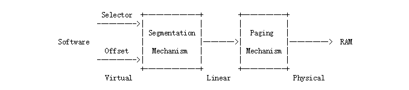
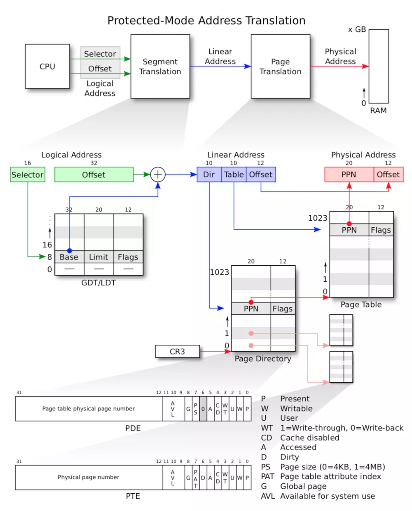

# Memory Management

## 0. 前言

由前面的启动那章我们已经大致了解到，BIOS最后会将启动代码Boot Loader加载到0x7C00处，接着 Boot Loader 代码执行的后面会将内核代码的ELF文件头读取到0x1000开始的4KB内存中，然后根据ELF文件头将内核代码加载到0x100000开始的地方，之后先执行entry.S文件中的内容，在entry.S文件的最后调用`i386_init()`函数执行内核初始化操作，其中就包括初始化内存分配函数`mem_init()`函数，内存分配的实现主要在`kern/pmap.c`文件中。

```c
void
i386_init(void)
{
        extern char edata[], end[];

        // Before doing anything else, complete the ELF loading process.
        // Clear the uninitialized global data (BSS) section of our program.
        // This ensures that all static/global variables start out zero.
        memset(edata, 0, end - edata);

        // Initialize the console.
        // Can't call cprintf until after we do this!
        cons_init();

        cprintf("6828 decimal is %o octal!\n", 6828);

        // Lab 2 memory management initialization functions
        mem_init();

        // Drop into the kernel monitor.
        while (1)
                monitor(NULL);
}
```

## 1. 理论知识

### 虚拟地址和物理地址

x86保护模式下内存管理的架构是：分段和分页的（页转化的）。并且x86中的一个**虚拟地址**就包括了一个段选择子（segment selector）和一个段内偏移（segment offset ）。虚拟地址通过段地址转化机制之后就成了**线性地址**（Linear Address），线性地址再经过分页地址转化机制就得到了物理地址（Physical Address）。整个转化如下图所示：



>  需要注意的是我们编写的C语言程序中的指针的值其实是虚拟地址中段内偏移部分的值。

更加详细的过程转化如下




**对于段机制转化来说**，GDT表每一个表项都包括三个字段：

- Base：32位，代表这个程序的这个段的基地址

- Limit：20位，代表这个程序的这个段的大小

- Flags：12位，代表这个程序的这个段的访问权限

当程序给出逻辑地址（segment:offset）时，把这个segment的值作为一个selector，代表这个段的段表项在GDT/LDT表的索引，之后根据该段表项的Flags字段来判断是否可以访问这个段的内容，如果可以访问则把Base字段的内容取出，直接与offset相加，就得到了线性地址（linear address）了。然而对于JOS操作系统来说，因为`boot/boot.S`中引入了GDT这么一个全局描述符表，这个表把所有的段的基址设置为0，界限设置为0xffffffff，相当于禁止了分段转化功能，因此这段选择子没有实际上的作用了，相当于虚拟机地址的偏移量就是线性地址了。

```assembly
.p2align 2                                # force 4 byte alignment
gdt:
  SEG_NULL                              # null seg
  SEG(STA_X|STA_R, 0x0, 0xffffffff)     # code seg
  SEG(STA_W, 0x0, 0xffffffff)           # data seg
```

之后是对分页地址机制的分析，开启分页之后，当处理碰到一个线性地址后，它的MMU部件会把这个地址分成3部分，分别是页目录索引（Directory）、页表索引（Table）和页内偏移（offset），这3个部分把原来32位的线性地址分成了10+10+12的3个片段。CPU首先从CR3寄存器中获得页目录物理地址，之后根据线性地址的高10位获得页目录项，由页目录项所存储的高20位找到页表首地址，之后取出中间10位取得页表项，由页表项所存储的高20位获得物理页的起始地址，将该地址+12位页内偏移就得到了真正的物理地址。

>  其中每个页的大小为4KB（因为页内偏移为12位）。

回顾lab1的part3，引入了一个简单的页表，使得内核程序可以跑在它所要求的链接地址上（虚拟地址）0xf0100000上，当然内核程序真实的跑在0x00100000上。但是这个页表只能映射4MB的内存，但是在JOS操作系统，我们希望把这种映射扩展到头256MB的物理内存中，同时把256MB的物理内存映射到虚拟内存为0xf0000000开始处，同时映射到其他的虚拟空间中去。

###  分页管理

### 分页存储管理方式（本科书本）

分页存储管理将进程的逻辑地址空间分成若干个页，并为各页加以编号；同时把内存的物理地址空间分成若干个块，同时也为它们加以编号。在为进程分配内存时，以块为单位，将进程的若干个页分别装入到多个可以不相邻接的物理块中。

页表：在分页系统中，允许将进程的各个页分散地存储在内存的任一物理块中，为保证进程仍然能够正确地运行，即能在内存中找到每个页面所对应的物理块，系统又为每个进程建立了一张页面影响表，简称页表。进程地址空间内的所有页（0~n），依次在页表中有一页表项，其中记录了相应页在内存中对应的物理块号。**页表的作用是实现从页号到物理块号的地址映射。**

【此处需要一张图】

## 2. 物理内存的管理

这块主要实现的是物理内存的管理，在内存管理中，操作系统必须要追踪记录哪些内存区域是空闲，哪些是被占用的，JOS内核是以页（page）为最小粒度来进行管理的，页大小为4KB，它使用MMU去映射和保护每一块被分配出去的内存。在上文中`i386_init`函数我们已经看到了`mem_init`函数的调用，下面来看一下`kern/pmap.c`中的`mem_init`函数。在这个函数中，首先是调用了`i386_detect_memory()`这个函数，这个函数的功能就是检测现在系统中有多少可用的内存空间。

```c
static void
i386_detect_memory(void)
{
        size_t basemem, extmem, ext16mem, totalmem;

        // Use CMOS calls to measure available base & extended memory.
        // (CMOS calls return results in kilobytes.)
        basemem = nvram_read(NVRAM_BASELO);
        extmem = nvram_read(NVRAM_EXTLO);
        ext16mem = nvram_read(NVRAM_EXT16LO) * 64;

        // Calculate the number of physical pages available in both base
        // and extended memory.
        if (ext16mem)
                totalmem = 16 * 1024 + ext16mem;
        else if (extmem) 
                totalmem = 1 * 1024 + extmem;
        else
                totalmem = basemem;

        npages = totalmem / (PGSIZE / 1024); 
        npages_basemem = basemem / (PGSIZE / 1024);

        cprintf("Physical memory: %uK available, base = %uK, extended = %uK\n",
                totalmem, basemem, totalmem - basemem);
}
```

最开始的时候说过，0xA0000\~0x100000，这部分是IO hole，是不可用的；那么剩下的，0x00000\~0xA0000，这部分叫做basemem，是可用的；IO hole后面那段0x100000~0x，这部分则叫做extmem，也是可以用的，是最重要的内存区域。这个函数一些变量的意思如下：

```
#define PGSIZE      4096   // 页大小为4096B，即4KB
npages:整个内存的页数
npages_basemem:basemem段的页数
```

获得了可使用的物理内存空间之后，之后要为页目表分配一块内存空间，大小为一个`PGSIZE`即一个页的大小，这个页目表在上文已经提到是分页转化机制中一个非常重要的表：

```c
// create initial page directory.
kern_pgdir = (pde_t *) boot_alloc(PGSIZE);
memset(kern_pgdir, 0, PGSIZE);
```

而`boot_alloc`是我们要实现的一个函数，这个函数的核心就是维护一个静态变量`nextfree`，这个变量代表下一个可以使用的空闲内存空间的虚拟地址，所以每次想要分配n个字节的内存时，我们都需要修改这个变量的值。

```c
static void *
boot_alloc(uint32_t n)
{
        static char *nextfree;  // virtual address of next byte of free memory
        char *result;

        // Initialize nextfree if this is the first time.
        // 'end' is a magic symbol automatically generated by the linker,
        // which points to the end of the kernel's bss segment:
        // the first virtual address that the linker did *not* assign
        // to any kernel code or global variables.
        // 个人理解：假如是第一次分配出来的内存的话，
        // 这个分配出来的内存是不给任何内核代码或者全局变量使用的，
        // 所以还需要在分配
        if (!nextfree) {
                extern char end[];
                nextfree = ROUNDUP((char *) end, PGSIZE);
        }

        // Allocate a chunk large enough to hold 'n' bytes, then update
        // nextfree.  Make sure nextfree is kept aligned
        // to a multiple of PGSIZE.
        //
        // LAB 2: Your code here.
        cprintf("boot_alloc, nextfree:%x\n", nextfree);
        result = nextfree;
        if(n != 0){
                nextfree = ROUNDUP(nextfree+n, PGSIZE);
                //if((uint32_t)nextfree - KERNBASE > (npages * PGSIZE)){
        }


        return result;
}
```


