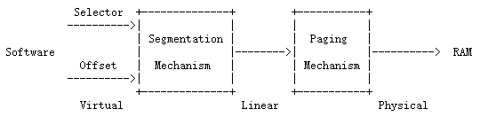
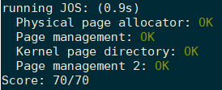

## Introduction

在这个Lab中，将会为OS编写内存管理的代码。内存管理有以下两个部分：

- 第一部分是kernel的physical memory allocator，kernel通过allocator来分配内存并且之后释放掉它。allocator将以4096bytes为单元来进行操作。你的任务是维持数据结构，这个数据结构记录哪一物理页是空闲哪一页是被分配的，同时记录每一个被分配的物理页有多少进程共享。同时你需要编写这个routines来分配内存的空闲页。
- 第二部分是virtual memory的管理，它可以将kernel和user software所使用的virtual address映射为物理地址。**当指令需要使用内存的时候**，x86 的memory management unit（MMU)使用page tables来执行这种映射。根据提供的specification，修改JOS来建立MMU的page tables。

### Getting started

在这个Lab以及今后的Lab中，我们将逐渐建立属于自己的kernel。当然我们也会提供一些额外的源代码，为了获取这些最近版本的course repository，你可以创建一个local branch叫做lab2，这个建立在课程origin/lab2的基础之上。

```bash
$ git pull
Already up-to-date.

$ git checkout -b lab2 origin/lab2
Branch lab2 set up to track remote branch refs/remotes/origin/lab2.
Switched to a new branch "lab2"

$ git merge lab1
Merge made by recursive.
 kern/kdebug.c  |   11 +++++++++--
 kern/monitor.c |   19 +++++++++++++++++++
 lib/printfmt.c |    7 +++----
 3 files changed, 31 insertions(+), 6 deletions(-)
```

`git checkout -b`命令做了两件事：首先是在origin/lab的基础上创建了local branch lab2，其次它改变目录中的内容，变成存储在lab2分支上的文件。可以使用`git checkout branch-name`在已存在的branches之间转换。

`git merge lab1`将会把你在lab1 branch上做的修改合并到lab2 branch。在有些情况下，git可能不知道怎么和你新的lab任务进行合并（比如你修改了那些在第二个lab中会被改变的代码）。在这种情况下，`git merge`将会告诉你哪些文件是conflicted，那么你将要首先解决这个冲突（编辑相关的文件）并且通过`git commit -a`来commit你修改过后的文件。

> 这些git操作在今后的lab中都会使用到，并且经常会发生冲突，都需要手动去解决这些冲突，所以你可以按照上面的方法来。

---

Lab2包含了以下new source files，你应该先浏览一下这些文件：

- `inc/memlayout.h`
- `kern/pmap.c`
- `kern/pmap.h`
- `kern/kclock.h`
- `kern/kclock.c`

`memlayout.h`将会描述virtual address space的布局情况，virtual address space需要通过`pmap.c`来进行实现。`memlayout.h`和`pmap.h`定义了`PageInfo`的结构体，你将会使用这个结构体来跟踪哪一些物理页是空闲的。`kclock.c`和`kclock.h`操作PC的battery-backed clock和CMOS RAM ，在这个CMOS RAM中，BIOS存储了物理内存的数量和其他一些内容。`pmap.c`中的代码会去读取硬件设备来计算出有多少物理内存，但是这个文件中剩下部分的代码需要你来完成，你不需要知道CMOS hardware工作的细节。
在这些文件中，请特别注意`memlayout.h`和`pmap.h`，由于这个lab要求你使用和理解这两个文件包含的很多定义。你也需要去看一下`inc/mmu.h`，这个文件中也包含了一些对这个lab很有用的定义。

Hint：物理地址转虚拟地址可以通过 `KADDR(pa)`，反之用`PADDR(va)`,`page2pa(page)` 得到该 PageInfo 结构对应的物理内存的起始位置；

> 接下去的lab中都会有新的文件，最好都是先浏览一下，那么在完成lab中的exercise的时候，将会更加很有帮助

### Lab Requirements && Hand-In Procedure

这两部分跟我们这些学公开课的都没啥关系，可以直接跳过了的。但是`make grade`这条命令还是需要的，因为这条指令将会测试你完成的任务，假如你拿到了满分，那么说明你写的代码在这个Lab中是没啥问题了的。需要注意的是，测试grade的程序不要去修改。

## Part 1: Physical Page Management

操作系统必须跟踪physical RAM哪一部分是free，哪一部分是正在使用的。JOS内核是以页（page）为最小粒度来进行管理的，这样才能使用MMU来映射和保护每一块分配出去的内存。

现在要写physical page allocator，这个allocator使用`sturct PageInfo`的链表来跟踪哪些页是free的（这点跟xv6是不同的，JOS中的`struct PageInfo`没有嵌入到free page本身），每一个结构体跟一个physical page相关连。在编写virtual memory的实现之前需要先编写physical page allocator，因为你的page table 管理的代码也需要分配物理内存来存储page tables。

*Exercise 1*.在`kern/pmap.c`文件中，你必须实现下面函数中的代码（可能以给出的顺序实现）:`boot_alloc()`、
`mem_init() `(只需要实现到对`check_page_free_list(1)`的调用为止)、`page_init()`、`page_alloc()`、`page_free()`。
`check_page_free_list()`和`check_page_alloc()` 会测试你的physical page allocator。你应该启动JOS并且看看`check_page_alloc()`是否report success。添加自己的`assert()`函数对于验证你的假设是正确的是相当有帮助的。

这个lab已经所有的6.828 的labs，将会要求你做点探索性的工作来弄清楚你到底需要做什么。这个任务并没有描述你需要添加到JOS中所有代码的细节。可以查看你必须修改的JOS源代码的那部分注释，这些注释经常包含了hint。你也需要查看Intel manuals中跟JOS部分相关的内容，可能还需要6.004和6.033课程的笔记。

### Exercise实现

如上面所述在物理内存管理中，操作系统必须要追踪记录哪些内存区域是空闲，哪些是被占用的，JOS内核是以页（page）为最小粒度来进行管理的，即将内存分成一个一个页，然后对页进行管理，页大小为4KB，JOS用到的结构体是`struct PageInfo`（定义在`inc/memlayout.h`）

```c
struct PageInfo {
    struct PageInfo *pp_link;
    uint16_t pp_ref;
};
```

然而**PageInfo不是物理页本身，但是它和物理页有一一对应的关系**，`pp_ref`变量是用来保存PageInfo对应物理页面的引用次数，在后面的实验中会常将多个虚拟地址空间映射到同一物理地址，当`pp_ref`为0时，才可以回收这个物理页面了。内核代码映射的物理页面不能被释放，因此它们也不需要引用计数（如UTOP的页面映射基本都是内核设置好了的）。对物理页的管理主要通过`pages`和`page_free_list`这两个全局变量，这两个变量主要定义在`kern/pmap.c`中，`pages`是记录所有物理页的，`page_free_list`是记录空闲物理页的。

```c
struct PageInfo *pages;         // Physical page state array
static struct PageInfo *page_free_list; // Free list of physical pages
```

---

上述讲完一些概况之后，那么整个物理内存管理的实现主要是在`kern/pmap.c`这个文件中，下面是这个文件中的一些全局变量：

```c
// These variables are set by i386_detect_memory()
size_t npages;                  // Amount of physical memory (in pages)
static size_t npages_basemem;   // Amount of base memory (in pages)

// These variables are set in mem_init()
pde_t *kern_pgdir;              // Kernel's initial page directory
struct PageInfo *pages;         // Physical page state array
static struct PageInfo *page_free_list; // Free list of physical pages
```

接下来看一下`mem_init`这个函数，这个函数首先是调用了`i386_detect_memory()`这个函数，这个函数的功能就是检测现在系统中有多少可用的内存空间。

```c
static void
i386_detect_memory(void)
{
        size_t basemem, extmem, ext16mem, totalmem;

        // Use CMOS calls to measure available base & extended memory.
        // (CMOS calls return results in kilobytes.)
        basemem = nvram_read(NVRAM_BASELO);
        extmem = nvram_read(NVRAM_EXTLO);
        ext16mem = nvram_read(NVRAM_EXT16LO) * 64;

        // Calculate the number of physical pages available in both base
        // and extended memory.
        if (ext16mem)
                totalmem = 16 * 1024 + ext16mem;
        else if (extmem) 
                totalmem = 1 * 1024 + extmem;
        else
                totalmem = basemem;

        npages = totalmem / (PGSIZE / 1024); 
        npages_basemem = basemem / (PGSIZE / 1024);

        cprintf("Physical memory: %uK available, base = %uK, extended = %uK\n",
                totalmem, basemem, totalmem - basemem);
}
```

最开始的时候说过，0xA0000\~0x100000，这部分是IO hole，是不可用的；那么剩下的，0x00000\~0xA0000，这部分叫做basemem，是可用的；IO hole后面那段0x100000~0x，这部分则叫做extmem，也是可以用的，是最重要的内存区域。

获得了可使用的物理内存空间之后，回到`mem_init()`函数，之后要为页目表分配一块内存空间，大小为一个`PGSIZE`即一个页的大小，这个页目录是分页转化机制中一个非常重要的表：

```c
// create initial page directory.
kern_pgdir = (pde_t *) boot_alloc(PGSIZE);
memset(kern_pgdir, 0, PGSIZE);
```

而`boot_alloc`是我们要实现的一个函数，这个函数的核心就是维护一个静态变量`nextfree`，这个变量代表下一个可以使用的空闲内存空间的虚拟地址，所以每次想要分配n个字节的内存时，我们都需要修改这个变量的值。`boot_alloc`实现的代码如下所示：

```c
static void *
boot_alloc(uint32_t n)
{
        static char *nextfree;  // virtual address of next byte of free memory
        char *result;

        // Initialize nextfree if this is the first time.
        // 'end' is a magic symbol automatically generated by the linker,
        // which points to the end of the kernel's bss segment:
        // the first virtual address that the linker did *not* assign
        // to any kernel code or global variables.
        // 个人理解：假如是第一次分配出来的内存的话，
        // 这个分配出来的内存是不给任何内核代码或者全局变量使用的，
        // 所以还需要在分配
        if (!nextfree) {
                extern char end[];
                nextfree = ROUNDUP((char *) end, PGSIZE);
        }

        // Allocate a chunk large enough to hold 'n' bytes, then update
        // nextfree.  Make sure nextfree is kept aligned
        // to a multiple of PGSIZE.
        //
        // LAB 2: Your code here.
        cprintf("boot_alloc, nextfree:%x\n", nextfree);
        result = nextfree;
        if(n != 0){
                nextfree = ROUNDUP(nextfree+n, PGSIZE);
                //if((uint32_t)nextfree - KERNBASE > (npages * PGSIZE)){
        }
    
        return result;
}
```

分配完一定的物理内存并将分配的内存置为0之后，接下去就是为这个页目录设置目录项了。

```c
kern_pgdir[PDX(UVPT)] = PADDR(kern_pgdir) | PTE_U | PTE_P;
```

其中`kern_pgdir`为新的页目录，UVPT为当前页目录的首地址，是虚拟地址，PDX为取得这个线性地址的页目录索引，`PADDR(kern_pgdir)`为kern_pgdir对应的物理地址，这个相当于设置新的页目录的一个表项，只是这个这个表项指向的是页目录本身，这一步操作在后面将会特别有用。（PS：这两步的操作更多是跟虚拟地址空间有关）

再接下去是需要分配一定的物理内存来存储PageInfo数组的，代码如下所示

```c
pages =(struct PageInfo *) boot_alloc(npages * sizeof(struct PageInfo));
memset(pages, 0, npages * sizeof(struct PageInfo));
cprintf("npages is %d\n", npages);
```

至此`mem_init()`中要求我们实现的代码在这个exercise中已经完成了。接下来就是`page_init()`的实现，`page_init()`实现的代码如下

```c
void
page_init(void)
{
  size_t page_i;
  page_free_list = NULL;
  // num_alloc: 在extmem区域已经被占用的页的个数
  int num_alloc = ((uint32_t)boot_alloc(0) - KERNBASE)/PGSIZE;
  // num_iohole = 96;
  int  num_iohole =96; //iohole为0x0A0000~0x100000

  for(page_i = 0; page_i < npages; page_i++){
    if(page_i == 0){  //标记第0块为使用
      pages[page_i].pp_ref = 1;
    }else if(page_i >=npages_basemem && page_i < npages_basemem + num_alloc + num_iohole){
      pages[page_i].pp_ref = 1;
    }else{
      pages[page_i].pp_ref = 0;
      pages[page_i].pp_link = page_free_list;
      page_free_list = &pages[page_i];
    }
  }
}
```

接下去`mem_init()`中会调用`check_page_free_list()`和`check_page_alloc()`来检查`page_free_list`这个变量是否正确，以及检查`page_alloc()`和`page_free()`是否正确，所以我们接下去要去实现这两个函数。`page_alloc()`实现如下，整体实现上来说就是对链表的操作，将`page_free_list`所指的结构体分配出来，之后更新`page_free_list`。

```c
struct PageInfo *
page_alloc(int alloc_flags)
{
  // Fill this function in
  struct PageInfo *result;
  result = page_free_list;
  if(result == NULL){
    return NULL;
  }
  page_free_list = result->pp_link;
  result->pp_link = NULL;

  if(alloc_flags & ALLOC_ZERO){
    memset(page2kva(result), 0, PGSIZE);
  }

  return result;
}
```

`page_free()`实现如下，整理实现上来说就是链表的删除，但是需要先判断ref和link的情况，之后将page_free_list赋值给可以释放的结构体，之后更新page_free_list。

```c
void
page_free(struct PageInfo *pp)
{
  // Fill this function in
  // Hint: You may want to panic if pp->pp_ref is nonzero or
  // pp->pp_link is not NULL.
  assert(pp->pp_ref == 0);
  assert(pp->pp_link == NULL);

  pp->pp_link = page_free_list;
  page_free_list = pp;
}
```

## Part 2: Virtual Memory

在这个部分，**请先熟悉x86的保护模式下的内存管理体系**：叫做 segmentation和page translation.

*Exercise 2*：请一定要先查阅 [Intel 80386 Reference Manual](https://pdos.csail.mit.edu/6.828/2018/readings/i386/toc.htm) 的chapters 5和6。阅读关于与page translation和page-based protection更close的sections，比如5.2和6.4。当然也推荐你看一下关于segmentation的sections，虽然在x86上，JOS上并不使用segment translation和segment-based protection，它仅使用paging hardware来提供虚拟内存和保护，但是对它有个基础的理解比较好。

### Virtual, Linear, and Physical Addresses

在x86中，一个virtual address包括了一个段选择子（segment selector）和一个段内偏移（segment offset ）( a *virtual address* consists of a segment selector and an offset within the segment)。在segment translation之后，但是在page translation之前得到的将会是linear address。在segment 和page translation之后，得到的将是physical address，这个地址将通过总线最终到达RAM。整个转换过程如图所示



**C语言的指针是virtual address的offset部分。在`boot/boot.S`中，我们设置了一个Global Descriptor Table（GDT），这个表通过设置所有的segment base addresses为0，limits为0xffffffff来禁止掉segment translation。因此selector没有任何作用，那么linear address总是等于virtual address的offset。**在Lab3中，我们将会在segmentation中建立privilege levels，但是对于整个memory translation来说，我们在JOS中完成可以忽视segmentation，而仅仅专注于page translation。

在Lab1的part 3，我们设置一个简单的page table，这样子kernel可以运行在它的链接地址0xf0100000上，尽管在物理内存中它是被加载在0x00100000上。这个page table仅仅映射了4MB的内存。在这个Lab中我们将为JOS建立一个virtual space address。我们将会扩展这个映射，把第一块256MB的内存映射到virtual address 0xf0000000的地方，并且映射virtual address space的其他区域。

*Exercise 3*：虽然GDB只能通过virtual address来访问QEMU的内存，但是在设置virtual memory的时候inspect物理内存是很有用的。复习QEMU的[monitor commands](https://pdos.csail.mit.edu/6.828/2018/labguide.html#qemu) ，特别是`xp`指令，这个指令将会inspect physical memory。为了访问QEMU monitor，在terminal中按下`Ctrl+a c`（先同时按下 ctrl+a，再按下c），同样的操作将会返回serial console。在GDB中使用`x`命令可以来inspect 虚拟地址内存。
我们patched version的qemu提供了`info pg`命令，这个命令可以显示当前page table细节的描述，包括了所有被映射的内存、 permissions和flags。qemu还提供了`info mem`命令，可以显示映射的虚拟地址的范围以及它们的 permissions 。

一旦进入了保护模式，在CPU上执行的代码没有办法直接使用一个linear address或者physical address。所有的内存引用都是被当做virtual addresses，并且是由MMU部件进行转换的，这还是同样说明C语言中的指针都是virtual address。

JOS kernel经常需要把地址处理为opaque values或者integers，而不dereferencing它们。比如在physical memory allocator中，它们可能是 virtual addresses, ，也有时候它们是physical addresses。为了帮助ducument这代码，JOS source对这两种情况进行了区分：type `uintptr_t`代表opaque virtual addresses，`physaddr_t`代表physical addresses，这些类型都是32-bit integers(`uint32_t`)，所以compiler允许你将这其中一种类型赋值给另一种类型(not pointers)，但是如果你尝试去dereference它们，那么compiler会complain。JOS kernel可以通过将`uintptr_t`转换为一个指针类型并且dereference `uintptr_t`类型的数据。相反，kernel不能dereference一个物理地址，因为MMU转换所有的内存引用。如果你将`physaddr_t`转换为一个指针，并且dereference这个地址，那么将不会得到正确的memory location。虚拟、物理地址总结如下：

| C type     | Address type |
| ---------- | ------------ |
| T*         | Virtual      |
| uintptr_t  | Virtual      |
| physaddr_t | Physical     |

JOS有时候需要读取或者修改只知道物理地址的内存。比如，在page table中添加一个映射的时将会要求分配物理内存来存储page directory，之后初始化这块memory。但是内核不能饶过虚拟地址的转换，因此不能直接加载或者存储到这个物理地址中。为此JOS将物理地址0开始的内存重新映射到虚拟地址0xf0000000开始的地方就是为了让kernel在只知道物理地址读取内存。为了将一个物理地址转换为虚拟地址，kernel必须将物理地址加上0xf0000000来找到它在重新映射区域相关联的虚拟地址，可以使用`KADDR(pa)`来实现这个。

JOS有时候需要在给定一个虚拟地址的情况下找到一个物理地址。kernel的全局变量和由`boot_alloc()`分配的内存都是在kernel会加载的区域也就是0xf0000000开始的区域，而我们也正好将所有物理内存都映射到这个区域。因此这个区域中虚拟地址转换为物理地址，kernel只需要简单的减去0xf0000000，可以使用`PADDR(va)`来实现这个。

### Reference counting

在接下来的lab中，我们会经常将相同的物理页同时映射到多个虚拟地址中，或者映射到多个environment的地址空间中。你将会对每一个物理页的引用数量进行计数，这个引用计数值保存在与物理页相关联的`struct PageInfo`的`pp_ref`field中。当对于一个物理页来说这个计数值变为了0，这个物理页是可以被释放了的，因为它不再使用了。generally，一个物理页的这个计数应该等于该物理页出现在所有page tables的UTOP下面的次数，映射在UTOP上面的大部分是在boot 阶段由kernel设置的，这些将不会被释放，所以也就没有必要对这些进行计数。另外 我们还将使用它来跟踪保存到 page directory pages 的指针数量，进而跟踪  page directories  对 page table pages 的引用数量。

使用`page_alloc`的时候需要格外小心，因为返回的page的计数都是0，所以`pp_ref`应该被立马增加只要你对返回的物理页做了些操作，比如将它插入到一个page table中。有些时候这个操作是由其他函数来处理的，比如	`page_insert`（当我们调用`page_insert`函数的时候，那么这个函数已经时候已经实现增加引用的操作了），有些时候调用`page_alloc`的函数需要自己做增加引用的操作。

### Page Table Management

现在你需要编写一系列函数来管理page tables：比如插入、移除linear-to-physical映射，需要时创建page table pages。

*Exercise 4*：在`kern/pmap.c`文件中，你必须实现下面这些函数的代码。`pgdir_walk()`、`boot_map_region()`、`page_lookup()`、`page_remove()`、`page_insert()`。那么在`mem_init()`中将会调用`check_page()`来测试你上述函数的实现是否正确。

`pgdir_walk()`的实现如下所示

```c
pte_t *
pgdir_walk(pde_t *pgdir, const void *va, int create)
{
  // Fill this function in
  int pde_index = PDX(va);// page dir  中的index
  int pte_index = PTX(va);// page table 中 index

  pde_t *pde = pgdir + pde_index;// 在page dir中的位置
  if(!(*pde & PTE_P)){
    if(create == false){
      return NULL;
    }else{
      struct PageInfo *new_page = page_alloc(ALLOC_ZERO);
      if(!new_page){
        return NULL;
      }
      new_page->pp_ref++;
      *pde = page2pa(new_page)|PTE_P|PTE_U|PTE_W;
    }
  }


  pte_t *pta = (pte_t *)KADDR(PTE_ADDR(*pde));

  return pta+pte_index;
}
```

`boot_map_region`的实现如下所示

```c
static void
boot_map_region(pde_t *pgdir, uintptr_t va, size_t size, physaddr_t pa, int perm)
{
  // Fill this function in
  int sizeAdd = 0;
  pte_t *new_entry = NULL;
  for(sizeAdd = 0; sizeAdd < size; sizeAdd += PGSIZE){
    new_entry = pgdir_walk(pgdir, (void *)va, 1);
    *new_entry = (pa | perm | PTE_P);

    pa += PGSIZE;
    va += PGSIZE;
  }
}
```

`page_lookup()`的实现如下所示

```c
struct PageInfo *
page_lookup(pde_t *pgdir, void *va, pte_t **pte_store)
{
  // Fill this function in
  pte_t *entry = NULL;
  struct PageInfo *re_page = NULL;

  entry = pgdir_walk(pgdir, va, 0);
  if(entry == NULL || !(*entry & PTE_P)){
    return NULL;
  }

  re_page = pa2page(PTE_ADDR(*entry));
  if(pte_store != NULL){
    *pte_store = entry ;
  }
  return re_page;
}
```

`page_remove()`的实现如下所示

```c
void
page_remove(pde_t *pgdir, void *va)
{
  // Fill this function in
  pte_t *entry = NULL;
  struct PageInfo *re_page = NULL;

  re_page = page_lookup(pgdir, va, &entry);
  if(re_page == NULL){
    return;
  }

  page_decref(re_page);
  tlb_invalidate(pgdir, va);
  *entry = 0;
}
```

`page_insert()`的实现如下所示

```c
int
page_insert(pde_t *pgdir, struct PageInfo *pp, void *va, int perm)
{
  // Fill this function in
  pte_t *entry = NULL;
  entry = pgdir_walk(pgdir, va, 1);
  if(entry == NULL){
    return -E_NO_MEM;
  }

  pp->pp_ref++; //这句要放在前面，假如放在remove之后
  if(*entry & PTE_P){
    page_remove(pgdir, va);
  }

  *entry = page2pa(pp) | perm |PTE_P;

  return 0;
}
```

## Part 3: Kernel Address Space

JOS将处理器的32-bit 线性地址空间分成两部分。在Lab3被加载和运行的user environment(processes)，将会占据 lower part，而kernel将会维持upper part的完成控制。这dividing line由`inc/memlayout.h`中`ULIM`定义的。我们为kernel保留了大约256MB的虚拟地址空间。这也就解释了在Lab1中为什么我们需要给kernel一个如此高的link address，否则的话，kernel的虚拟地址空间中将没有足够多的空间来映射user environment。

在`inc/memlayout.h`中给出了图示版的JOS memory layout，这对这个Lab以及之后的Lab都是很有用的。


### Permissions and Fault Isolation

由于kernel和user memory在每一个environment的address space中都会出现，那么我们将会在x86 page tables中使用permissions bits来使得user code只能访问address space的user part。否则的话，user code中的bugs可能会重写kernel data，造成crash或者其他故障（malfuncion）；user code可能也会steal其他environment的private data。注意writable permissions bit(PTE_W)将同时影响user 和kernel code。

user environment对于在ULIM上的任何内存都是没有permission的，然而kernel可以读写这块内存。对于[UTOP,ULIM)的地址区域，kernel和user environment都有相同的permission：它们可以读但是不能写这块地址区域。这个地址区域用来向user environment公开那些read-only的kernel data structures。最后，UTOP以下的address space是给user environment所使用的；user environment将会设置访问这块内存的权限。

### Initializing the Kernel Address Space

现在你将要去设置UTOP上面的address space，也就是地址空间的kernel part。`inc/memlayout.h`显示了应该要使用的layout。你将会使用上面编写的函数来建立合适的linear-to-physical的映射。

*Exercise 5*：将`mem_init()`中在`check_page()`调用后面缺失的代码补充完整。你编写的代码应该通过`check_kern_pgdir()`和`check_page_installed_pgdir()`的检查。

整个实现如下所示

```c
//////////////////////////////////////////////////////////////////////
// Map 'pages' read-only by the user at linear address UPAGES
// Permissions:
//    - the new image at UPAGES -- kernel R, user R
//      (ie. perm = PTE_U | PTE_P)
//    - pages itself -- kernel RW, user NONE
// Your code goes here:
boot_map_region(kern_pgdir, UPAGES, PTSIZE, PADDR(pages), PTE_U);
cprintf("boot_map_region UPAGES SUCCESS\n");

//////////////////////////////////////////////////////////////////////
// Use the physical memory that 'bootstack' refers to as the kernel
// stack.  The kernel stack grows down from virtual address KSTACKTOP.
// We consider the entire range from [KSTACKTOP-PTSIZE, KSTACKTOP)
// to be the kernel stack, but break this into two pieces:
//     * [KSTACKTOP-KSTKSIZE, KSTACKTOP) -- backed by physical memory
//     * [KSTACKTOP-PTSIZE, KSTACKTOP-KSTKSIZE) -- not backed; so if
//       the kernel overflows its stack, it will fault rather than
//       overwrite memory.  Known as a "guard page".
//     Permissions: kernel RW, user NONE
// Your code goes here:
boot_map_region(kern_pgdir, KSTACKTOP-KSTKSIZE, KSTKSIZE, PADDR(bootstack), PTE_W);
cprintf("boot_map_region bootstack SUCCESS\n");

//////////////////////////////////////////////////////////////////////
// Map all of physical memory at KERNBASE.
// Ie.  the VA range [KERNBASE, 2^32) should map to
//      the PA range [0, 2^32 - KERNBASE)
// We might not have 2^32 - KERNBASE bytes of physical memory, but
// we just set up the mapping anyway.
// Permissions: kernel RW, user NONE
// Your code goes here:
boot_map_region(kern_pgdir, KERNBASE, 0xffffffff-KERNBASE, 0, PTE_W);
cprintf("boot_map_region KERNBASE SUCCESS\n");
```

### Address Space Layout Alternatives

这一小节是challenge的练习，就是不给处理器它自己保留任何固定的linear或者virtual address space，而是允许user-level的进程可以无条件使用整个4GB的虚拟地址空间，但是仍然要保护kernel不被其他进程访问，并且不同的进程之间相关隔离，有兴趣的话可以看一下。

最终使用`make grade`命令来测试上述编写的代码是否能通过测试。



## Questions

Question1：

x是虚拟地址，主要掌握一点C语言中的指针都是虚拟地址。

Question2：就是说页目录中，分别对应的是什么？

因为我们根据linear address中10、10、12的分法，最高的10位是指在页目表中的索引，所以对于KERNBASE来说，它的虚拟地址为0xf0000000，取最高10位为0x3c0，所以这个目录索引0x3c0对应的是KERNBASE.

Question3：我们把kernel和用户环境放在相同的地方，为什么用户的程序不能写或者读内核的内存？什么样特殊的机制保护内核的地址。

正常的操作系统通常采用两个部件来完成对内核地址的保护，一个是通过段地址机制来实现，但是JOS中分段功能并没有实现（因为全都设为0了）。二就是通过分页机制来实现，通过把页表项中的Supervisor/User位置0，那么用户态的代码就不能访问这个内存中的这个页了。

Question4：这个操作系统最大支持的内存大小是多大？

因为这个操作系统，分配了4MB的空间来存放所有物理页的PageInfo结构体信息，每个结构体的大小为8B，所以能存放512K个的PageInfo结构体，所以一共可以出现512K个物理页，每个物理页大小为4KB，所以支持的最大内存为2GB。

Question5：如何达到了最大数量的物理内存，那么所需要的额外开支是多大？

首先是需要存放所有的PageInfo，需要4MB，需要存放页目表表，kern_pgdir，4KB，之后是存放页表512*4KB = 2MB，所以额外需要6MB+4KB

Question6：`entry.S`文件中，当分页机制开启的时候，寄存器EIP的值是一个很小的值，在哪个位置代码才开始运行在高于KERNBASE的虚拟地址空间中的？当程序位于开启分页之后到运行在KERNBASE之上这之间的时候，EIP的值是很小的值，怎么保证可以把这个值转化为真实物理地址？

在`entry.S`文件中有一个指令`jmp *%eax`，这个指令要完成跳转，就会重新设置EIP的值，把它设置为寄存器eax中的值，而这个值是大于KERNBASE的，所以就完成了EIP从小的值到大于KERNBASE的值的转换。

## 附：地址大杂烩

这边讲一下到目前为止所涉及到的地址：逻辑地址、虚拟地址、线性地址、物理地址、加载地址、链接地址。

对于虚拟地址和逻辑地址的理解，虚拟地址空间是相对于物理地址来说的，也就是我们虚拟出来这么一块地址空间，这块地址空间是不存在的，上面的地址就叫做虚拟地址。那么逻辑地址是什么呢？个人觉得逻辑地址在某种程度上等同于虚拟地址，但是逻辑地址更多的是在编程的时候，用到的，逻辑地址经过推导就得到了虚拟地址。


## 附：段转化机制的详细讲解

其中段表项也就是所谓的段描述符，它是由编译器、链接器、加载程序或者操作系统生成的。上图中的段表项示例图是整合之后的，实际上常见的两种段表项格式如下所示：


**对于Base字段而言**，处理器会将三个Base片段（fragment）整合到一块，形成一个32bit的值；

**对于Limit字段而言**，处理器会整合Limit区域的两个部分，形成一个20bit的值。同时处理器解析这个字段有两种方式，方式的选择由`granularity `位决定：

- 当该位没有被设置的时候，单位为1byte，定义limit的上限为1MB
- 当该位被设置了的时候，单位为4KB，定义limit的上限为4GB

**Granularity bit（G）**：决定limit区单位的大小，具体如上所阐述的那样；

**TYPE**：区别不同种类的描述符

**DPL**：用作保护机制

**Segement-Present bit（P）**：

- 当该位设置为0的时候，那么这个描述符在地址转换中是无效。当这个描述符对应的段选择器被加载到段寄存器的时候（a selector for the descriptor is loaded into a segment register.），处理器将会产生一个异常，同时段描述符变为如下格式：

  

- 当该位设置为1的时候，那么操作系统可以自由访问。

同时操作系统只有在以下两种情况的时候才会清除该位：

- 当段所生成的线性地址空间没有被叶机制所映射时；
- 当该段没有出现在内存中时

**Accessed bit（A）**：当这个段是可以被访问的时候，那么该位为1。比如：一个段描述符的段选择器（selector）被加载到段寄存器的时候或者这个段选择器被一条测试语句的时候。实现虚拟地址的操作系统，在段层面通过检测和清除该位来监控段的使用。所以说创建和维护描述符是系统软件的责任。

------

段描述符是存储在描述符表中，有GDT/LDT这两种表，每张表由8字节长的描述符条目组成的数组组成，表的长度是可变的，可能包含的数量会达到8192（2^13）个描述符。但是无论如何，GDT第一条条目（index=0）是不会被处理器所使用的。同时处理器通过GDTR（GDT寄存器）或LDTR（LDT寄存器）来定位GDT或LDT在内存中的位置，这两个寄存器会存放表开始的线性地址和段的限制。


------

段选择器通过指定段描述符表并在表中标注出描述符的索引来找到一个描述符。段选择器可以作为指针变量中的一个字段对应用程序可见的，但是选择器的值通常由链接器或者链接加载器所指定。


**Index**：在段描述符表中选择描述符。处理器只需将这个索引值乘以8(描述符的长度)，并将结果添加到描述符表的基本地址中，以便访问表中适当的段描述符；

**Table Indicator**： 代表哪种描述符表，0是GDT，1是LDT；

**Requested Privilege Level**：被保护机制所使用。

------

段寄存器（Segment Registers）：

80386将描述符信息存储在段寄存器中，因此避免每次访问内存时都需要访问描述符表。每一个段寄存器有一个可见的部分也有一个不可见的部分，如下图所示：


这些可见的部分可以被程序所操作，就像他们是一个16位的寄存器一样，这些不可见的部分是被处理器所操作。处理器自动从描述符表中提取基本地址、限制、类型和其他信息，并将它们加载到段寄存器的不可见部分。当指令需要操作段中的数据时，因为段中的选择器已经被段寄存器了，一些相关信息也被加载到了段寄存器，所以处理器可以将指令中提供的段相对偏移量直接添加到段的基址中，而不需要额外的开销。

## 附：分页、分段、段页式存储管理方式（本科书本）

分页存储管理将进程的逻辑地址空间分成若干个页，并为各页加以编号；同时把内存的物理地址空间分成若干个块，同时也为它们加以编号。在为进程分配内存时，以块为单位，将进程的若干个页分别装入到多个可以不相邻接的物理块中。

页表：在分页系统中，允许将进程的各个页分散地存储在内存的任一物理块中，为保证进程仍然能够正确地运行，即能在内存中找到每个页面所对应的物理块，系统又为每个进程建立了一张页面影响表，简称页表。进程地址空间内的所有页（0~n），依次在页表中有一页表项，其中记录了相应页在内存中对应的物理块号。**页表的作用是实现从页号到物理块号的地址映射。**

 