在这个Lab中，我们将要实现基础的内核设施，让一个被保护的用户模式的environment成功运行（比如process）。我们将要去实现一个可以跟踪用户environment的数据结构，创建一个单独的用户environment并且把一个程序的镜像加载到里面，最后还要运行它。我们也会让JOS有能力去处理任何的system call并且处理它产生的异常。

> 上述中，术语`environment`和`process`是可以交换的，他们都指向一个抽象的东西，可以让你运行一个程序。我么使用`environment`而不是传统的`process`是为了强调JOS environment和UNIX进程提供的是不同的接口。所以在不好理解`environment`的时候，我们可以拿`process`的概念来理解。

经过Lab3中git的相关操作之后，Lab3多出了以下这些文件

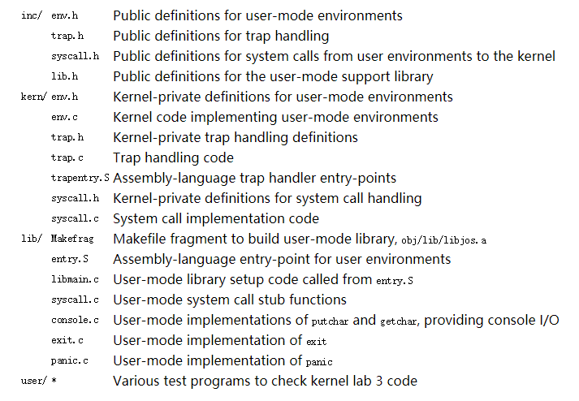

同时一些文件中的内容相对Lab2来说也有修改。可以输出`git diff lab2`来查看。

## Part A: User Environments and Exception Handling

`inc/env.h`中包含了JOS中用户环境的基本定义，在该文件中内核使用`Env`这个数据结构去跟踪每一个用户环境（user environment），并且在`kern/env.c`中有三个全局变量是跟enviroments有关的:

```c
struct Env *envs = NULL;		// All environments
struct Env *curenv = NULL;		// The current env
static struct Env *env_free_list;	// Free environment list
```

- `envs`是Env结构体的数组，代表系统中所有的environments，在JOS内核中将最多同时支持`NENV`个活动的environments，虽然任何时候运行的都比设定的少的多（`NENV`定义在`inc/env.h`），一旦`envs`被分配了，那么`envs`对于`NENV`个中每一个可能的environment都将有一个Env数据结构实例；

- `env_free_list`包含所有的不活跃的Env结构体，这种设计使environment分配与释放变得容易，因为他们只要向这个链表添加或者移掉一个结构体即可；

- `curenv`表示当前执行的environment，在第一个environment启动之前，curenv是被初始化为NULL的；

下面讲一下`Env`结构体，如下所示（下面只是暂时的，在Lab的实现过程中，我们还会往这里面加字段）：

```c
struct Env {
	struct Trapframe env_tf;	// Saved registers
	struct Env *env_link;		// Next free Env
	envid_t env_id;			// Unique environment identifier
	envid_t env_parent_id;		// env_id of this env's parent
	enum EnvType env_type;		// Indicates special system environments
	unsigned env_status;		// Status of the environment
	uint32_t env_runs;		// Number of times environment has run

	// Address space
	pde_t *env_pgdir;		// Kernel virtual address of page dir
};
```

- **env_tf**

  这个结构体定义在`inc/trap.h`中，是用于保存environment寄存器的值（当这个environment没有在运行的时候）。**当从user转变到kernel模式的时候，kernel将寄存器的值保存下来**，这样子这个environment可以从它离开的地方重新开始。

- **env_link**

  指向env_free_list上的下一个空闲的Env，env_free_list是指向list中第一个空闲environment。

- **env_id**

  唯一标志着当前正在使用这个Env结构体的environment（可以理解成PID）。当一个environment终止之后，kernel可能会重新将同样的Env结构体分配给不同的environment，但是这个新的environment将会有一个不同的env_id，即使这个新的environment使用了envs数组相同位置的slot。

- **env_parent_id**

  代表创建这个environment的environment的env_id（相当于一个进程中的父进程id）。通过这种id，environment可以成一个“family tree”，这在决定一个environment允许给谁做什么的时候是相当有用的

- **env_type**

  用于区别特别的environment，对于绝大多数来说这个值是`ENV_TYPE_USER`.

- **env_status**

  表示当前environment的状态，有一下这些值：

  - `ENV_FREE`:

    表明这个Env结构是不活跃的，那么因此是在env_free_list上

  - `ENV_RUNNABLE`:

    表明这个Env所代表的environment正在等待在处理上运行

  - `ENV_RUNNING`:

    表示当前的environment正在运行

  - `ENV_NOT_RUNNABLE`:

    表示当前的environment是一个活跃的environment，但是还没有准备好运行，比如正在等待来自另一个environment的进程间通信的信息

  - `ENV_DYING`:

    表示这个Env结构体所指的environment是一个zombie environment。一个zombie environment将会被释放在下一次捕获kernel之后。

- **env_pgdir**

  这个environment的页目录的内核虚拟地址

就像一个Unix 内核，一个JOS environment也将“thread”和“address space”的概念耦合起来。thread主要由保存的寄存器值定义（env_tf），addree space 由页目表和页表来定义（env_pgdir）。要想真正的运行一个环境，kernel必须用保存的寄存器的值和合适的address space设置好CPU.

> struct Env和xv6中struct proc是类似的，它们**两个都将user mode中的寄存器状态存在Trapframe结构中**。但是在JOS中一个environment没有拥有它自己的kernel stack（xv6是有的），所以在kernel的某一个时间点只能有一个JOS environment，因此JOS有一个kernel stack就好了。
>
> Lab中我们只需初始化一个environment，但是你需要将JOS设计成支持多个environments的。

### Allocating the Environments Array

在`kern/pmap.c`中添加envs的内存分配以及对envs的映射即可，在相应位置添加如下代码即可：

```c
//////////////////////////////////////////////////////////////////////
// Make 'envs' point to an array of size 'NENV' of 'struct Env'.
// LAB 3: Your code here.
envs = (struct Env *)boot_alloc(NENV * sizeof(struct Env));
memset(envs, 0, NENV * sizeof(struct Env));

//////////////////////////////////////////////////////////////////////
// Map the 'envs' array read-only by the user at linear address UENVS
// (ie. perm = PTE_U | PTE_P).
// Permissions:
//    - the new image at UENVS  -- kernel R, user R
//    - envs itself -- kernel RW, user NONE
// LAB 3: Your code here.
boot_map_region(kern_pgdir, UENVS, PTSIZE, PADDR(envs), PTE_U);
```

### Creating and Running Environments

接下去就是创建和运行一个environment了，因为我们还没有文件系统，所以kernel会加载一个静态二进制镜像，将它嵌入到内核中，JOS将它作为一个ELF可执行image。在`kern/init.c`中的`i386_init()`函数中将会有代码在环境中运行这些二进制镜像。为了可以让其真正的运行起来，我们需要在`env.c`中补充完成一些函数。

我们首先需要补充的是`env_init`，这个函数主要做的工作是初始化envs数组中所有的Env结构体（Env结构体中的env_ids设置为0），并且将它们添加到env_free_list中，同时需要保证env_free_list中的Env顺序是与envs数组中的顺序是一样，也就是说当我们第一次调用`env_alloc()`的时候，分配给我们的是envs[0]。所添加的代码如下，除了env_ids设置为0之外，对Env结构的其他属性也进行了初始化。

```c
void
env_init(void)
{
  // Set up envs array
  // LAB 3: Your code here.
  int i;
  for(i = 0; i < NENV; i++){
    if(i == NENV - 1){
      envs[i].env_link = NULL;
    }else{
      envs[i].env_link = &envs[i+1];
    }
    envs[i].env_id = 0;
    envs[i].env_parent_id = 0;
    envs[i].env_type = ENV_TYPE_USER;
    envs[i].env_status = ENV_FREE;
    envs[i].env_runs = 0;
    envs[i].env_pgdir = NULL; 
  }
  env_free_list = envs;
  // Per-CPU part of the initialization
  env_init_percpu();
}
```

---

再接下去是`env_setup_vm`的实现，这个函数主要实现的是给一个新的environment分配一个page directory，并且初始化新environment地址空间的kernel位置，整体代码如下：

```c
static int
env_setup_vm(struct Env *e)
{
  int i; 
  struct PageInfo *p = NULL;
  
  // Allocate a page for the page directory
  if (!(p = page_alloc(ALLOC_ZERO)))
    return -E_NO_MEM;

  // LAB 3: Your code here.
  e->env_pgdir =(pde_t *)page2kva(p);
  p->pp_ref++;

  // the below code i can't think
  for(i = 0; i < PDX(UTOP); i++){
    e->env_pgdir[i] = 0;
  }  
  for(i = PDX(UTOP); i<NPDENTRIES; i++){
    e->env_pgdir[i] = kern_pgdir[i];
  }
  // UVPT maps the env's own page table read-only.
  // Permissions: kernel R, user R
  e->env_pgdir[PDX(UVPT)] = PADDR(e->env_pgdir) | PTE_P | PTE_U;

  return 0;
}
```

其中`p = page_alloc(ALLOC_ZERO)`分配了一个新的页用作page directory，所以需要将这个页的物理地址赋值给`e->env_pgdir`，同时该页的引用需要+1。接下去的两个循环中的代码是我没想到的，主要是对页目录进行初始化，因为从Lab2中的那张虚拟地址空间分布图，我们可以知道从UTOP以上在kern_pgdir中已经映射好了的，所有environment的地址空间都应该有这个映射，所以从UTOP到NPDENTRIES（页目录项最多为1024）为kern_pgdir中相应的内容。

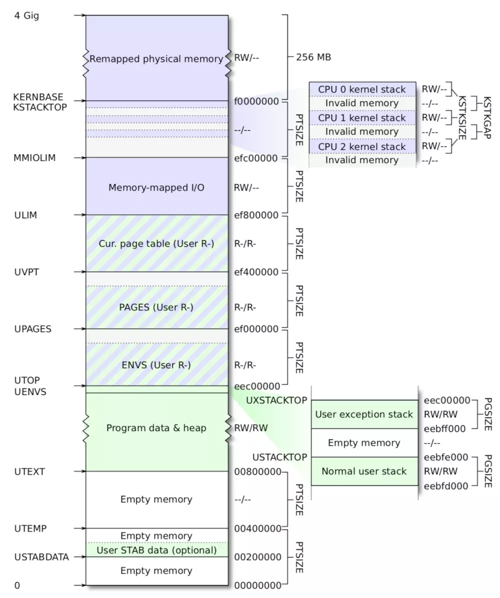

---

在接下来是`region_alloc`函数的实现，`region_alloc`函数主要是给environment分配一块真正的物理内存（虚拟地址的开始处和内存的大小已经通过参数给定了），并对该内存进行映射（换句话说就是把这个分配的物理页insert到page table中）。实现主要借助了Lab2中的实现的一些函数，先通过`page_alloc`函数分配一块内存，然后通过`page_insert`函数实现映射。

```c
static void
region_alloc(struct Env *e, void *va, size_t len)
{
  // LAB 3: Your code here.
  // (But only if you need it for load_icode.)
  //
  // Hint: It is easier to use region_alloc if the caller can pass
  //   'va' and 'len' values that are not page-aligned.
  //   You should round va down, and round (va + len) up.
  //   (Watch out for corner-cases!)
  uint32_t start = (uint32_t)ROUNDDOWN(va, PGSIZE);
  uint32_t end = (uint32_t)ROUNDUP(va + len, PGSIZE);
  struct PageInfo *p = NULL;
  int re = -1;
  for(; start<end; start += PGSIZE){
    p = page_alloc(0);
    if(p == NULL){
      panic("the page allocation failed!\n");
    }

    re = page_insert(e->env_pgdir, p, (void *)start, PTE_U | PTE_W);
    if(re != 0){
      panic("the page insert failed!\n");
    }
  }
}
```

---

`load_icode()`函数是把要执行的程序加载到environment的地址空间中（这就意味着需要先分配一个实际存放的物理地址，之后需要进行映射），所以会调用上面已经实现的`region_alloc`函数。整体的实现类似于boot loader中加载ELF文件的那样，只是一个是从硬盘中加载一个是从已加载到内存的内核中加载。所以在实现这部分代码的时候，我们可以参考boot loader中加载内核程序的步骤。

```c
static void
load_icode(struct Env *e, uint8_t *binary)
{   
  // LAB 3: Your code here.
  struct Elf *elf_head = (struct Elf *)binary;
  struct Proghdr *ph,*eph ;

  if(elf_head->e_magic != ELF_MAGIC){
    panic("load_icode:the file is not elf!\n");
  }

  if(elf_head->e_entry == 0){
    panic("load_icode:the entry is null\n");
  }
  e->env_tf.tf_eip = elf_head->e_entry;

  ph = (struct Proghdr *)((uint8_t *)elf_head + elf_head->e_phoff);
  eph = ph + elf_head->e_phnum;

  lcr3(PADDR(e->env_pgdir));
  for(; ph < eph; ph++){
    if(ph->p_type == ELF_PROG_LOAD){
      if(ph->p_filesz > ph->p_memsz){
        panic("load_icode:the filesz > memsz!\n");
      }

      region_alloc(e, (void *)ph->p_va, ph->p_memsz);
      memmove((void *)ph->p_va, binary+ph->p_offset, ph->p_filesz);
      memset((void *)(ph->p_va + ph->p_filesz), 0, ph->p_memsz- ph->p_filesz);

    }
  }

  // Now map one page for the program's initial stack
  // at virtual address USTACKTOP - PGSIZE.
  region_alloc(e, (void *)(USTACKTOP-PGSIZE), PGSIZE);
  // LAB 3: Your code here.
}
```

在上述代码中，我们需要对elf文件的e_magic进行判断，判断它是不是一个ELF文件，之后判断入口地址是不是存在，同时我们需要这一步：` e->env_tf.tf_eip = elf_head->e_entry;`，该步在调用enviroment中二进制程序的时候会用到，同时`lcr3(PADDR(e->env_pgdir));`这一步我个人的理解是，因为下面的加载操作都是把ELF文件加载到该environment的地址空间中，所以需要使用这个地址空间的page directory。

---

`env_create`函数主要是创建一个environment，首先是要分配得到一个Env结构体，之后是将这个environment的类型进行标记，再之后就是把要执行的程序加载到这个environment中。

```c
void
env_create(uint8_t *binary, enum EnvType type)
{
  // LAB 3: Your code here.
  struct Env *e;

  if(env_alloc(&e, 0) != 0){
    panic("env_create faild!\n");
  }

  e->env_type = type;
  load_icode(e, binary);
}
```

---

最后的最后就是`env_run`，这个函数的功能就是让这个environment运行起来，因为environment要运行起来了，那么相应的`env_status`和`env_runs`都要进行修改，同时地址空间也要变成这个environment的了，所以需要`lcr3(PADDR(curenv->env_pgdir));`.

```c
void
env_run(struct Env *e)
{
  // LAB 3: Your code here.
  if(curenv != NULL && curenv->env_status == ENV_RUNNING){
    curenv->env_status = ENV_RUNNABLE;
  }

  curenv = e;
  curenv->env_status = ENV_RUNNING;
  curenv->env_runs ++;
  lcr3(PADDR(curenv->env_pgdir));

  env_pop_tf(&(curenv->env_tf));
  panic("env_run not yet implemented");
}
```

---

实现上述进程的相关函数之后，总体来看一下用户代码运行之前，按顺序会调用的代码：

```
start (kern/entry.S)
i386_init (kern/init.c)
    cons_init
    mem_init
    env_init
    trap_init (still incomplete at this point)
    env_create
    env_run
    env_pop_tf
```

将上述代码完成之后，当你编译整个JOS内核代码的并运行在qemu上的时候，它会成功运行。系统会进入用户空间并且执行`hello`二进制程序直到它使用`int`指令调用system call。由于JOS在硬件上还没有允许任何从user态模式到kernel态模式的状态，所以这是将会出错。当CPU发现还没有设置处理system call中断的时候，它将会产生一个通用的保护异常；当发现不能处理这个保护异常的时候，又会产生一个not present fault（double fault），结果发现两个都不能处理，最后以“triple fault”放弃。

> 一旦产生上述的`triple fault`之后，CPU将会重置系统将会重启，但是6.828给qemu打了一个补丁，所以你将会看见寄存器转储和一条"Triple fault"消息。

下面我们通过调试来发现上述的triple fault，并且检查是否进入了user mode。依次使用`make qemu-nox-gdb`和`make gdb`之后，先是在`env_pop_tf`处设置一个断点，这个函数是进入user mode之前的最后一个函数。

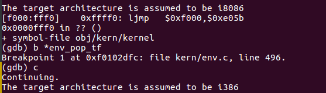

运行到这个函数之后，使用单步调试指令`si`，在`iret`指令之后将会进入user mode，这时候你将会user environment的执行程序的第一条指令`cmp`。

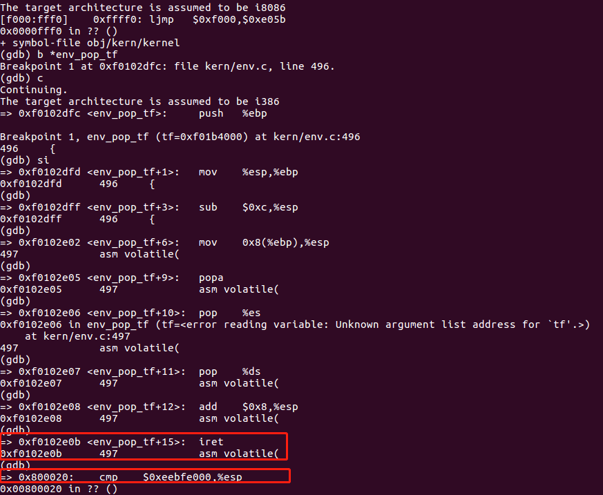

现在我们使用`b*0x...`指令在`int $0x30`处打上一个断点，我们通过查看`obj/user/hello.asm`来找到`int $0x30`这个指令的地址，

```assembly
asm volatile("int %1\n"
800a29: b8 00 00 00 00        mov    $0x0,%eax
800a2e: 8b 4d 0c              mov    0xc(%ebp),%ecx
800a31: 8b 55 08              mov    0x8(%ebp),%edx
800a34: 89 c3                 mov    %eax,%ebx
800a36: 89 c7                 mov    %eax,%edi
800a38: 89 c6                 mov    %eax,%esi
800a3a: cd 30                 int    $0x30
```

可以看到`int $0x30`的地址为800a3a，这个`int`指令将会调用system call，效果是将会在控制台上打印一个字符。但是由于我们没有实现相应的system call中断的处理，这个处理产生的异常也法处理，所以我们将会看到"Triple fault"。下面我们在800a3a处设置断点，并使用`c`命令执行都该处（PS:下图中的`v`纯属手误，可以忽略）：

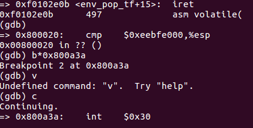

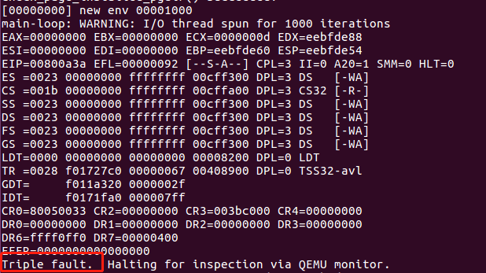

如果你在调试过程中发现不能执行到`int`指令处，那么上述实验中所写的代码是有误的。

### Handling Interrupts and Exceptions

#### 基础知识

首先我们了解下x86的中断和异常机制，可以查看[80386的手册_中断和异常](https://pdos.csail.mit.edu/6.828/2018/readings/i386/c09.htm)，也可以参考本目录中的”appendix_80386手册.md“。

异常和中断会造成**处理器从user mode 转换到kernel mode（CPL=0）**，这样子可以让user-mode code没有任何机会接近kernel的函数或者其他environment。在Intel中中断通常是由处理器外的异步事件产生，比如device I/O的提示等；而异常往往是由当前运行的代码同步产生的，比如除以0或者访问一个无效的地址。每一个中断或异常都有一个中断向量，中断向量是由中断的来源决定的：比如不同的device、error conditions、应用程序对内核的请求都将会产生一个中断向量。**x86处理器使用中断向量0~31来表示x86内部产生的同步异常（比如page fault是14），比31大的中断向量仅仅被用于software interrupts（比如由int 指令引发的）或者不同步的hardware interrupts（由外部devices产生）。**

为了确保中断/异常发生时不是自主选择kernel的进入点以及进入的方式，而是在一定的控制条件下，从一些特定、提前定义好的进入点进入内核，那么处理器从以下两方面实现上述的保护：

-  **Interrupt Descriptor Table**

  x86允许通过256个不同中断或异常的进入点进入kernel，256个中断或异常都有唯一一个interrupt vector（从0~255）。CPU使用中断向量作为IDT表（IDT表建立在kernel-private 内存中）的index，然后从适当的table条目（ Interrupt Descriptor）中加载

  - 要**加载到EIP（instruction pointer）寄存器**的值，这个值指向了处理指定异常的kernel处理代码；
  - 要**加载到CS（code segement）寄存器**的值，值里面包含了第0-1位的特权等级值，异常处理程序正是运行在这个特权等级下。（JOS中所有的异常都是在kernel mode下处理的，特权等级全都为0）

- **Task State Segment**

  因为中断或异常处理的时候会从用户态模式转到内核态模式，那么在处理器调用异常处理程序之前，需要一块空间来保存old process的状态（比如EIP和CS），这样子异常处理程序执行完成之后可以通过old state，从中断发生离开时的那个地方重新开始。但是**这块空间必须是没有特权的user-mode code不能访问的**，否则用户恶意的代码或者bug会危及内存，因此会在内核空间中选择一个stack来存储。TSS（task state segement）这个结构中就指明了segement selector和stack的地址。那么之后会把SS、ESP、EFLAGS、CS、EIP的值以及可选的error code的值压入到新栈中。然后从IDT表中的Interrupt Descriptor中加载CS和EIP，并设置ESP和SS指向新的栈。

  > TSS可能有其他用途，但是JOS只把TSS用于定义一个内核栈，这个栈是用户态模式转换到内核态模式时该选择的。JOS的内核态模式的特权等级为0，在进入内核的时候处理器使用TSS中的ESP0和SS0来定义kernel stack，TSS中的其他位则不用。

下面取个例子，假设处理器正在一个user environment中处理代码，但是它遇到了一个divide指令要除以0，此时会产生异常，接下去：

1. 处理器通过TSS中SS0和ESP0（在JOS中TSS保存着GD_KD和KSTACKTOP）来定义一个kernel stack；

2. 处理器把相关参数压入从KSTACKTOP开始的栈中，如下
   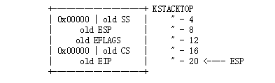

   对于某些类型的x86异常，除了上述内容之外，可能还会压入error code（比如page fault）。那么这个栈看起来如下所示：

   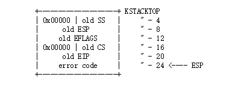

3. 由于divide的中断向量是0，所以处理器会读取IDT的entry 0，然后设置CS:EIP指向相应的处理函数

4. 处理函数开始处理异常，比如关掉user environment

但是无论是在kernle mode下或者user mode下，都可能再次发生中断或者异常，假如在kernel mode下发生了中断或异常（CS寄存器低两位的值为0，比如说在异常或中断的处理过程中还会发生中断或者异常），那么此时会把更多的值压入相同的kernel stack，这样kernel就可以处理嵌套的异常（system call中会用到这种）。由于使用的是同一个stack，所以不用保存SS和ESP寄存器的值了，那么对于一个不用把error code压入的异常类型来说，栈变化如下：

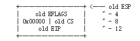

而对于有error code的异常来说，只需要再压入一个error code就可以。但是对于嵌套的异常来说，假如在异常处理过程又出现异常或中断，但是此时不能把old state的值压入栈中，那么处理器只是简单的重启。

#### 实验---IDT表的建立

现在我们要建立IDT表去处理0\~31的中断向量，`inc/trap.h`定义了中断和异常的中断向量，这些对于user-level的程序或者libraries是有用的，而`kern/trap.h` 是trap.c中一些函数的声明，但是这些函数仅仅属于kernel的，`kern/trap.h`中有以下这些内容：

```
#ifndef JOS_KERN_TRAP_H
#define JOS_KERN_TRAP_H
#ifndef JOS_KERNEL
# error "This is a JOS kernel header; user programs should not #include it"
#endif
```

我们要实现的整体控制流程如下图所示

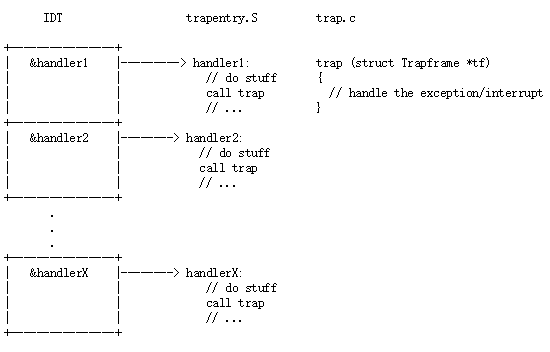

在`kern/trapentry.S`中每一个异常或中断都要有它自己的handler，而在`trap_init()`需要用这些handler的地址来初始化IDT。每一个handler都应该在stack上建立一个`struct Trapframe`，然后调用`trap.c`中的`trap()`函数，`trap()`函数中处理中断/异常或调用另一个特别的处理函数来处理。

首先我们根据上述要求在`kern/trapentry.S`每一个异常或中断都要有自己的handler，那么下面我们来看一下这个文件

```assembly
#define TRAPHANDLER(name, num)            \
  .globl name;    /* define global symbol for 'name' */ \
  .type name, @function;  /* symbol type is function */   \
  .align 2;   /* align function definition */   \
  name:     /* function starts here */    \
  pushl $(num);             \
  jmp _alltraps

#define TRAPHANDLER_NOEC(name, num)         \
  .globl name;              \
  .type name, @function;            \
  .align 2;             \
  name:               \
  pushl $0;             \
  pushl $(num);             \
  jmp _alltraps

```

这个文件中有两个宏定义分别是`TRAPHANDLER`和`TRAPHANDLER_NOEC`，其实这两个宏定义的作用就是创建一个函数，函数名为传入的参数值name，另一个参数是中断向量，两个宏定义唯一的区别是前者会自动压入error code，而后者是压入一个0值来代替error code，所以我们需要根据这个中断/异常有无error code来选择哪个宏定义来创建（Hint:是否有error code 可以参考这个网址：https://pdos.csail.mit.edu/6.828/2018/readings/i386/s09_10.htm），接下去我们就根据这个链接的内容来创建handlers，这样子在`kern/trapentry.S`中每一个异常或中断自己的handler了。

```assembly
/*
 * Lab 3: Your code here for generating entry points for the different traps.
 */
TRAPHANDLER_NOEC(divide_handler, T_DIVIDE)
TRAPHANDLER_NOEC(debug_handler, T_DEBUG)
TRAPHANDLER_NOEC(nmi_handler, T_NMI)
TRAPHANDLER_NOEC(brkpt_handler, T_BRKPT)
TRAPHANDLER_NOEC(oflow_handler, T_OFLOW)
TRAPHANDLER_NOEC(bound_handler, T_BOUND)
TRAPHANDLER_NOEC(illop_handler, T_ILLOP)
TRAPHANDLER_NOEC(device_handler, T_DEVICE)
TRAPHANDLER(dblflt_handler, T_DBLFLT)
TRAPHANDLER(tss_handler, T_TSS)
TRAPHANDLER(segnp_handler, T_SEGNP)
TRAPHANDLER(stack_handler, T_STACK)
TRAPHANDLER(gpflt_handler, T_GPFLT)
TRAPHANDLER(pgflt_handler, T_PGFLT)
TRAPHANDLER_NOEC(fperr_handler, T_FPERR)
TRAPHANDLER_NOEC(align_handler, T_ALIGN)
TRAPHANDLER_NOEC(mchk_handler, T_MCHK)
TRAPHANDLER_NOEC(simderr_handler, T_SIMDERR)
TRAPHANDLER_NOEC(syscall_handler, T_SYSCALL)
```

每一个handler都要建立自己的`struct Trapframe`，并且最后要调用trap()函数，而每一个handler都会调用`_alltraps`，所以我们需要在`_alltraps`中实现上述要求即可。 根据Lab中的提示，`_alltraps`实现如下

```assembly
/*
 * Lab 3: Your code here for _alltraps
 */
_alltraps:
  pushl %ds
  pushl %es
  pushal

  movl $GD_KD, %eax
  movl %eax, %ds
  movl %eax, %es
  pushl %esp

  call trap
```

在`kern/trapentry.S`中已经实现了异常/中断的handler（也就相当添加了相应的entry pointer），那么下面我们需要在`trap_init()`函数中把这些给添加到IDT中。根据`kern/trapentry.S`中的提示

```
* You shouldn't call a TRAPHANDLER function from C, but you may
 * need to _declare_ one in C (for instance, to get a function pointer
 * during IDT setup).  You can declare the function with
 *   void NAME();
 * where NAME is the argument passed to TRAPHANDLER.
```

上述的个人理解是：在实现的`trap_init()`的时候，因为我们不能直接在这个函数里面调用`trapentry.S`中一系列handler函数，我们需要在C中先声明。再接下来我们看一下Lab中的提到使用`SETGATE`：`#define SETGATE(gate, istrap, sel, off, dpl) `，gate是IDT表的index入口（IDT相应的表项），istrap是选择是trap gate还是interrupt gate，sel为中断/异常处理器程序所在段的segement selector，off表示相对偏移量，dpl代表相应的权限等级（软件调用所需要的权限）。最终实现如下：

```c
void
trap_init(void)
{
  extern struct Segdesc gdt[];
  
  // LAB 3: Your code here.
  void divide_handler();
  void debug_handler();
  void nmi_handler();
  void brkpt_handler();
  void oflow_handler();
  void bound_handler();
  void illop_handler();
  void device_handler();
  void dblflt_handler();
  void tss_handler();
  void segnp_handler();
  void stack_handler();
  void gpflt_handler();
  void pgflt_handler();
  void fperr_handler();
  void align_handler();
  void mchk_handler();
  void simderr_handler();
  void syscall_handler();

  SETGATE(idt[T_DIVIDE], 0, GD_KT, divide_handler, 0);
  SETGATE(idt[T_DEBUG], 0, GD_KT, debug_handler, 0);
  SETGATE(idt[T_NMI], 0, GD_KT, nmi_handler, 0);
  SETGATE(idt[T_BRKPT], 0, GD_KT, brkpt_handler, 3);
  SETGATE(idt[T_OFLOW], 0, GD_KT, oflow_handler, 0);
  SETGATE(idt[T_BOUND], 0, GD_KT, bound_handler, 0);
  SETGATE(idt[T_ILLOP], 0, GD_KT, illop_handler, 0);
  SETGATE(idt[T_DEVICE], 0, GD_KT, device_handler, 0);
  SETGATE(idt[T_DBLFLT], 0, GD_KT, dblflt_handler, 0);
  SETGATE(idt[T_TSS], 0, GD_KT, tss_handler, 0);
  SETGATE(idt[T_SEGNP], 0, GD_KT, segnp_handler, 0);
  SETGATE(idt[T_STACK], 0, GD_KT, stack_handler, 0);
  SETGATE(idt[T_GPFLT], 0, GD_KT, gpflt_handler, 0);
  SETGATE(idt[T_PGFLT], 0, GD_KT, pgflt_handler, 0);
  SETGATE(idt[T_FPERR], 0, GD_KT, fperr_handler, 0);
  SETGATE(idt[T_ALIGN], 0, GD_KT, align_handler, 0);
  SETGATE(idt[T_MCHK], 0, GD_KT, mchk_handler, 0);
  SETGATE(idt[T_SIMDERR], 0, GD_KT, simderr_handler, 0);
  SETGATE(idt[T_SYSCALL], 0, GD_KT, syscall_handler, 3);
  // Per-CPU setup 
  trap_init_percpu();
}
```

> 上述有两个dpl设置为3，我们在后面可以看到为什么设置为3，当然设置为0对PartA来说没有啥影响。

最后我们使用`make grade`来测试一下，如下所示表示可以了！

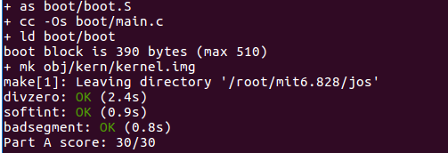

### question

1. 为什么要对每个中断向量设置不同的中断处理函数，而不是放在一个函数里面统一处理呢？

   因为不同中断或异常有不同的处理方式，TRAPHANDLER在栈中压入了中断向量trapno和错误码errno，在以方便后面根据异常/中断类型做对应处理。

2. 为什么`user/softinit.c`程序调用的是`int $14`，但是报的错是13呢（general protection fault）？

   这是因为softinit.c是一个用户程序，它CPL=3，而中断向量14中的DPL设置的是0（表示需要权限为0的软才能调用），所以会触发13异常。

## appendix:关于CPU和程序的执行

在CPU进行进程切换的时候，**需要将寄存器中和当前进程有关的状态数据写入内存对应的位置(内核中该进程的栈空间)保存起来，当切换回该进程时，需要从内存中拷贝回寄存器中**。即上下文切换时，需要保护现场和恢复现场。

除了嵌入式系统，多数CPU都有两种工作模式：内核态和用户态。这两种工作模式是由PSW寄存器上的一个二进制位来控制的。内核态的CPU，可以执行指令集中的所有指令，并使用硬件的所有功能。用户态的CPU，只允许执行指令集中的部分指令。一般而言，IO相关和把内存保护相关的所有执行在用户态下都是被禁止的，此外其它一些特权指令也是被禁止的，比如用户态下不能将PSW的模式设置控制位设置成内核态。用户态CPU想要执行特权操作，需要发起系统调用来请求内核帮忙完成对应的操作。其实是在发起系统调用后，CPU会执行trap指令陷入(trap)到内核。当特权操作完成后，需要执行一个指令让CPU返回到用户态。


https://mp.weixin.qq.com/s/RwS5LgTK2J5bwKsiRK6wMw