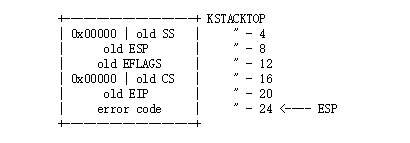

## Part B: Page Faults, Breakpoints Exceptions, and System Calls

Remember that you can boot JOS into a particular user program using make run-*x* or make run-*x*-nox. For instance, make run-hello-nox runs the *hello* user program.

### Handling Page Faults

**中断向量是14（T_PGFLT），当处理器检测到一个page fault的时候，它先将造成错误的linear address存到一个特殊的处理器控制寄存器中CR2。**在trap.c中`page_fault_handler()`函数是处理page fault异常的。我们首先修改`trap_dispatch()`函数让page fault异常到`page_fault_handler()`中处理。

因为trapentry.S的TRAPHANDLER操作会把当前中断的中断码也压入栈中，再根据 inc/trap.h中的Trapframe结构体可知`tf->tf_trapno`的值即为中断向量，所以我们将`trap_dispatch()`修改如下，即假如它的值是`T_PGFLT`的话那么就调用`page_fault_handler()`函数

```c
static void
trap_dispatch(struct Trapframe *tf)
{
  // Handle processor exceptions.
  // LAB 3: Your code here.
 
  switch(tf->tf_trapno){
  case T_PGFLT:
    page_fault_handler(tf);
    break;
  default:
    // Unexpected trap: The user process or the kernel has a bug.
    print_trapframe(tf);
    if (tf->tf_cs == GD_KT)
      panic("unhandled trap in kernel");
    else {
      env_destroy(curenv);
      return;
    }
  }
}
```

添加完成之后，使用`make grade`可以看到`faultread`, `faultreadkernel`, `faultwrite`, and `faultwritekernel`都是运行成功的。

### The Breakpoint Exception

中断向量是3（T_BRKPT），允许debugger在程序代码中插入断点，断点使用一字节的`int 3`软件中断指令临时代替相关程序指令。在JOS内核中将会把这个异常转换为一个基本的pseudo-system call，任何user environment都可以使用pseudo-system call调用JOS kenrel monitor。比如用户态模式下实现的panic()（lib/panic.c），在展示消息之后会执行`int 3`。

```c
void
_panic(const char *file, int line, const char *fmt, ...)
{
  va_list ap;

  va_start(ap, fmt);

  // Print the panic message
  cprintf("[%08x] user panic in %s at %s:%d: ",
    sys_getenvid(), binaryname, file, line);
  vcprintf(fmt, ap);
  cprintf("\n");

  // Cause a breakpoint exception
  while (1)
    asm volatile("int3");
}
```

修改`trap_dispatch()`让breakpoint异常可以调用kernel monitor。这个的实现跟上面的实现是类似，调用`kernel monitor`其实也就是调用`monitor()`函数。

```c
static void
trap_dispatch(struct Trapframe *tf)
{   
  // Handle processor exceptions.
  // LAB 3: Your code here.
  struct PushRegs *regs = &(tf->tf_regs);
  int32_t re ;
  
  switch(tf->tf_trapno){
  case T_BRKPT:
    monitor(tf);
    break; 
  case T_PGFLT:
    page_fault_handler(tf);
    break;
  default:
    // Unexpected trap: The user process or the kernel has a bug.
    print_trapframe(tf); 
    if (tf->tf_cs == GD_KT)
      panic("unhandled trap in kernel");
    else {
      env_destroy(curenv);
     return;
    }
  }
}
```

当使用`make grade`的时候可以成功通过`breakpoint`测试。

---

**Questions3**：这个breakponit 测试的例子产生break point exception还是general protection fault，取决于我们之前对IDT中break point这条目的初始化？我们该如何设置可以让breakpoint exception可以像上面说的那样被处理（即产生的是breakpoint exception）？并且什么样不正确的操作将会引发general protection fault？

下面我们看一下初始化IDT时候，`SETGATE`这个函数，这个函数的最后一个参数是descriptor privilege level。假如我们给参数设置为3（user mode），那么会触发break point exception，假如设置为0，那么将会触发general protection exception。当我们当前执行的程序（user mode）发生中断或异常之后想要跳转到这个描述符所指向的程序继续执行的话，就是DPL得比当前程序运行的CPL值要大或等于，否则就会触发general protection exception。测试程序是运行在用户态下的，它的CPL为3，当异常发生时，它会执行`int 3`指令，假如IDT表把break point这个表项的DPL设置为0的话，那么会触发general protection exception，但是假如设置为3的话，因为可以访问所以还是break point exception。

**Questions4**：你认为这些机制的重点是什么？特别是考虑到`user/softint`测试程序。

我认为这些机制的重点是权限的控制。

### System calls：

用户进程通过请求（invoke）system call来让kernel执行一些程序。**当用户进程invoke一个system call，处理器进入内核态模式，处理器和内核合作将用户进程的状态保存下来，kernel执行合适的代码为了执行system call，然后恢复到用户进程。**

在JOS内核中，使用`int`指令可以引起处理器中断，对于system call而言将使用`int $0x30`（因为已经在`inc/trap.h`中定义了T_SYSCALL为48即0x30），那么当执行该指令之后，因为我们已经在IDT表中设置了system call的中断描述符，并且DPL设置为3，所以可以让用户进程引起这个中断（Hint：中断0x30不能由硬件产生，所以用户代码去产生的时候是没问题的）。

应用程序将在寄存器中传递system call number和system call参数。system call number会放入%eax中，参数（最多5个）分别放入 `%edx`, `%ecx`, `%ebx`, `%edi`和`esi`，kernel执行完之后，将返回值放回%eax中。在`lib/syscall.c`的`syscall()`中，已经用汇编代码写好了一个system call的请求:

```assembly
static inline int32_t
syscall(int num, int check, uint32_t a1, uint32_t a2, uint32_t a3, uint32_t a4, uint32_t a5)
{ 
  int32_t ret;

  // Generic system call: pass system call number in AX,
  // up to five parameters in DX, CX, BX, DI, SI.
  // Interrupt kernel with T_SYSCALL.
  //
  // The "volatile" tells the assembler not to optimize
  // this instruction away just because we don't use the
  // return value.
  //
  // The last clause tells the assembler that this can
  // potentially change the condition codes and arbitrary
  // memory locations.

  asm volatile("int %1\n"
         : "=a" (ret)
         : "i" (T_SYSCALL),
           "a" (num),
           "d" (a1),
           "c" (a2),
           "b" (a3),
           "D" (a4),
           "S" (a5)
         : "cc", "memory");

  if(check && ret > 0)
    panic("syscall %d returned %d (> 0)", num, ret);
  return ret;
}   
```

> 在C语言中使用内联汇编，`asm`是必要的用于说明随后的字符串是内联汇编代码块，`volatile`是可选的，表示禁止编译器的优化。其中`:`表示输入输出；`=a`表示输出将%eax的值保存到ret中；“i”表示使用一个立即整数操作数(值固定)，而`"int %1\n"`中的`%1`表示值正是`T_SYSCALL`；接下去的a、b、c、d、D、S代表的分别可以参考附录[appendix：内联汇编](#appendix：内联汇编)中的表格，第二冒号后面的表示的输入，比如把num值放入%eax中；最后的`"cc", "memory"`就是通知GCC不再假定内存中的值依然合法，CPU中的registers和cache中已缓存的内存单元中的数据将作废，CPU将不得不在需要的时候重新读取内存中的数据。

修改` kern/trapentry.S`和`kern/trap.c`中的`trap_init()`，给中断向量T_SYSCALL添加一个处理程序。这一步我们可以参考Lab3 partA部分对于这个部分的操作。首先是`kern/trapentry.S`

```assembly
TRAPHANDLER_NOEC(syscall_handler, T_SYSCALL)
```

接下是`trap_init()`函数

```c
void trap_init(void){
   		......
    void syscall_handler();
    	......
    SETGATE(idt[T_SYSCALL], 0, GD_KT, syscall_handler, 3);
	    ......
}	
```

上面添加完之后，我们同样还需要修改`trap_dispatch()`函数，对于system call interrupt会调用`syscall()`函数（定义在`kern/syscall.c`中），之后会将返回值放回%eax中。

```c
static void
trap_dispatch(struct Trapframe *tf)
{
  // Handle processor exceptions.
  // LAB 3: Your code here.
  struct PushRegs *regs = &(tf->tf_regs);
  int32_t re ;

  switch(tf->tf_trapno){
  case T_BRKPT:
    monitor(tf);
    break;
  case T_SYSCALL:
    re = syscall(regs->reg_eax, regs->reg_edx, regs->reg_ecx, regs->reg_ebx, regs->reg_edi, regs->reg_esi);
    regs->reg_eax = re;
    break;
  case T_PGFLT:
    page_fault_handler(tf);
    break;
  default:
    // Unexpected trap: The user process or the kernel has a bug.
    print_trapframe(tf);
    if (tf->tf_cs == GD_KT)
      panic("unhandled trap in kernel");
    else {
      env_destroy(curenv);
      return;
    }
  }
}
```

> 需要注意的是，`struct PushRegs *regs = &(tf->tf_regs);`，假如你跟我一样想要先把tf->tf_regs的值先拿到，之后根据拿到的值，再给syscall传参数的话，那么这边的最好是`struct PushRegs *`，而不能是`struct PushRegs`，假如是后者的话，并且将返回值放回%eax是通过`regs.reg_eax = re;`这一步操作来的话，那么是将值放回局部变量中了，我们应该放回全局变量的reg_eax中。

最后我们需要实现`kern/syscall.c`中的`syscall()`函数，如果system call的number是无效的话，那么返回`-E_INVAL`，需要让列在`inc/syscall.h`中的system calls分别去调用相应的kernel function。`inc/syscall.h`的内容如下所示

```c
#ifndef JOS_INC_SYSCALL_H
#define JOS_INC_SYSCALL_H

/* system call numbers */
enum {
  SYS_cputs = 0,
  SYS_cgetc,
  SYS_getenvid,
  SYS_env_destroy,
  NSYSCALLS
};

#endif /* !JOS_INC_SYSCALL_H */
```

根据上述所列的system call numbers，相应的`syscall`函数如下所示：

```c
// Dispatches to the correct kernel function, passing the arguments.
int32_t
syscall(uint32_t syscallno, uint32_t a1, uint32_t a2, uint32_t a3, uint32_t a4, uint32_t a5)
{
  // Call the function corresponding to the 'syscallno' parameter.
  // Return any appropriate return value.
  // LAB 3: Your code here.
  // panic("syscall not implemented");
  int re ;


  switch (syscallno) {
  case SYS_cputs:
    sys_cputs((const char *)a1, (size_t)a2);
    return 0;
  case SYS_cgetc:
    re = sys_cgetc();
    return (int32_t)re;
  case SYS_getenvid:
    re = sys_getenvid();
    return (int32_t)re;
  case SYS_env_destroy:
    re = sys_env_destroy((uint32_t)a1);
    return (int32_t)re;
  default:
    return -E_INVAL;
  }
}
```

假如使用`make run-hello`或者`make run-hello-nox`命令运行`user/hello`程序的话，那么将会在屏幕上打印"hello,world"，然后会造成一个page fault。也可以使用`make grade`来测试一下，它将会成功运行`testbss`测试程序。

> 这边我们可以看到`lib/syscall.c`中的内容跟`kern/syscall.c`中的内容是很像的，而且两个文件中都有`syscall`这个函数，那么先后顺序是个咋回事呢？从目录的名字上可以看出**kern目录是kernel调用将会用到的，而lib目录是给用户程序的**，所以我们可以看到，`lib/syscall.c`中的`sys_cputs`、`sys_cgetc`等函数将会调用同文件下的`syscall`函数（有7个参数），那么这个函数通过`int`指令引起中断（中断向量为`T_SYSCALL`），那么我们将会进入kernel，因为IDT等已经针对T_SYSCALL进行了初始化，所以会成功进入`trap_dispatch`函数，那么trap_dispatch函数中调用的`syscall`（6个参数）是`kern/syscall.c`中的。这块，我们将会在总结这边更加详细的讲解。

### User-mode startup

一个用户程序从`lib/entry.S`最上面的地方开始运行，之后它会调用`lib/libmain.c`中的`libmain()`函数。我们需要修改`libmain()`中的`thisenv`，让它指向当前environment的struct Env。（Hint：使用sys_getenvid以及查看inc/env.h）。

我们首先来看一下`sys_getenvid`这个函数，这个函数就是返回当前environment的envid

```c
// Returns the current environment's envid.
static envid_t
sys_getenvid(void)
{
  return curenv->env_id;
}
```

那么我们下面来看一下`inc/env.h`文件中的内容，

```c
#define LOG2NENV    10
#define NENV      (1 << LOG2NENV)
#define ENVX(envid)   ((envid) & (NENV - 1))

	......
        
struct Env {
  struct Trapframe env_tf;  // Saved registers
  struct Env *env_link;   // Next free Env
  envid_t env_id;     // Unique environment identifier
  envid_t env_parent_id;    // env_id of this env's parent
  enum EnvType env_type;    // Indicates special system environments
  unsigned env_status;    // Status of the environment
  uint32_t env_runs;    // Number of times environment has run

  // Address space
  pde_t *env_pgdir;   // Kernel virtual address of page dir
};
```

从文件中可以看到env_id的类型是envid_t，那么envid_t的组成如下所示，低10位是environment的Index，而`ENVX`则是传入env_id获得Index

```c
+1+---------------21-----------------+--------10--------+
|0|          Uniqueifier             |   Environment    |
| |                                  |      Index       |
+------------------------------------+------------------+
                                      \--- ENVX(eid) --/
```

综合上面的内容，最终修改libmain如下所示

```c
void libmain(int argc, char **argv)
{ 
  // set thisenv to point at our Env structure in envs[].
  // LAB 3: Your code here.
  thisenv = &envs[ENVX(sys_getenvid())];
   
  // save the name of the program so that panic() can use it
  if (argc > 0)
    binaryname = argv[0];

  // call user main routine
  umain(argc, argv);

  // exit gracefully
  exit();
} 
```

libmain()函数之后会调用umain()这个函数，这个函数在`user/hello.c`中的内容如下所示：

```c
void umain(int argc, char **argv)
{
  cprintf("hello, world\n");
  cprintf("i am environment %08x\n", thisenv->env_id);
} 
```

在打印"hello,world"之后，它尝试去访问`thisenv->env_id`，假如我们没有对`thisenv`进行设置（之前的时候），那么将会报错。现在已经对`thisenv`进行了设置，那么将不会报错。假如还是报错了，那么可能在Lab3 partA的时候没有成功映射`UENVS`区域。

添加完上述代码之后，当运行`user/hello`的时候打印"hello,world"，然后打印"i am environment 00001000"。当我们运行`make grade`的时候，我们会发现`hello`这个程序测试成功。

### Page faults and memory protection

操作系统经常借助硬件的支持来实现内存保护，操作系统会通知硬件哪些虚拟地址是有效的那些是无效的。当一个程序尝试去访问一个无效的地址或者访问一个超出它权限的地址时，处理器会在造成fault的指令处停止程序，并且带着相关操作的信息进入内核。对于这种情况又可分为两类：

- 假如fault是可以修复的话，那么内核将会修复这个fault，然后程序继续运行；对于修复来说，考虑一个可以自动扩张的stack。在大部分系统中，kernel初始化分配一个单独的stack page，之后如果一个程序访问stack下的页面出错时，kernel将会自动给程序分配pages，然后让程序继续。这样，kernel可以仅仅分配program 所需要的stack内存，但是如此一来会给程序造成一个假象那就是它可以在一个很大stack下面工作。
- 假如fault不能修复，程序不能继续运行，因为它永远无法跳过造成fault的指令；

同时system call给内存保护带来了一个有趣的问题，大部分system call接口可以让用户程序把指针传给kernel，这些指针指向用户的缓冲区为了读或者写。当执行system call的时候，内核将会dereferences这些指针，但是会存在以下两个问题：

- 通过system call传给内核的指针可能会引起page fault，然而内核中出现page fault比用户程序中出现page fault更加严重，如果内核在操作它自己的数据结构时出现page fault，那是一个kernel bug，这个故障处理应该是panic kernel。但是当内核在dereferences用户程序给它的指针时，它需要一种方式去记住这些dereferences造成的page fault实际上代表的都是user program。

- 通过system call传给内核的指针还可能会破坏内核窃取内存等，因为内核比用户程序有更多的内存权限，用户程序可能会把一个指针传给system call，这个指针指向的内存区域是kernel可以访问的，但是用户程序不能。此时内核必须小心不要去dereference这个指针，一旦dereference这个指针可能会揭露个人信息或者破坏内核的完整性。

> `int *p;` would define a pointer to an integer, and `*p` would dereference that pointer, meaning that it would actually retrieve the data that p points to。

所以综上所述，在处理用户程序传过来的指针时，内核必须十分小心的。现在我们将安全检查所有从用户空间传到内核的指针来解决这两个问题。当一个程序把一个地址传给内核，内核将会检查该地址是否位于地址空间的用户部分，如果是的话page table会允许相关的内存操作。因此kernel在dereference用户提供的地址的时候，将永不会发生page fault。

改变`kern/trap.c`当page fault发生在kernel mode下的时候执行panic()函数（Hint：决定一个fault是发生在user mode还是kernel mode，我们可以检查tf_cs的低位）。其中CS的第0-1位是特权等级位，用户模式下的特权等级是3，kernel mode下的特权等级是0，也就是说tf_cs的低两位是去判断陷入进来的程序是用户程序还是内核程序。那么所撰写代码如下：

```c
void
page_fault_handler(struct Trapframe *tf)
{
  uint32_t fault_va;

  // Read processor's CR2 register to find the faulting address
  fault_va = rcr2();

  // Handle kernel-mode page faults.

  // LAB 3: Your code here.
  // user mode is 3, kernel mode is 0
  if(!(tf->tf_cs & 0x03)){
    panic("page fault in kernel mode");
  }
  // We've already handled kernel-mode exceptions, so if we get here,
  // the page fault happened in user mode.

  // Destroy the environment that caused the fault.
  cprintf("[%08x] user fault va %08x ip %08x\n",
    curenv->env_id, fault_va, tf->tf_eip);
  print_trapframe(tf);
  env_destroy(curenv);
}
```

> 现在涉及到的特权等级模式只有user mode和kernel mode，所以可以直接根据与`0x03`相与来判断，假如为kernel mode的话，那么`tf->tf_cs & 0x03`为0。

阅读`kern/pmap.c`中的`user_mem_assert` 函数，来实现`user_mem_check`函数，

```c
// Checks that environment 'env' is allowed to access the range
// of memory [va, va+len) with permissions 'perm | PTE_U | PTE_P'.
// If it can, then the function simply returns.
// If it cannot, 'env' is destroyed and, if env is the current
// environment, this function will not return.
//
void
user_mem_assert(struct Env *env, const void *va, size_t len, int perm)
{
  if (user_mem_check(env, va, len, perm | PTE_U) < 0) {
    cprintf("[%08x] user_mem_check assertion failure for "
      "va %08x\n", env->env_id, user_mem_check_addr);
    env_destroy(env); // may not return
  }
}
```

> `user_mem_assert` 函数是调用`user_mem_check`函数来判断，这块地址空间是否允许去访问，假如不能访问的话，那么destroy这个environment。

`user_mem_check`函数是具体来检查[va, va+len)这块地址区是否可以访问的，比如这块地址区域是否有`perm | PTE_P`的权限，虚拟地址是否在ULIM下面，检查权限主要是检查页表表项中是否有相应的权限，可以通过`pgdir_walk`直接获取相应的页表表项。同时需要注意对va和va+len这两个地址进行ROUNDDOWN和ROUNDUP处理。最后别忘记将错误的第一段地址赋值给`user_mem_check_addr`。

```c
int
user_mem_check(struct Env *env, const void *va, size_t len, int perm)
{
  // LAB 3: Your code here.
  uint32_t start = ROUNDDOWN((uint32_t)va, PGSIZE); // page begin address
  uint32_t end = ROUNDUP((uint32_t)va+len, PGSIZE); // page end address
  pte_t *pte = NULL;  // page table entry


  for(; start < end; start += PGSIZE ){
    pte = pgdir_walk(env->env_pgdir,(void *)start, 0);
    // address need below ULIM && pte is not NULL
    if((uint32_t)ULIM < (uint32_t)start || pte == NULL || ((*pte & perm) != perm) || !(*pte & PTE_P)){
      // user_mem_check_addr =  start < (uint32_t)va ? start : (uint32_t)va;
      user_mem_check_addr = start < (uint32_t)va ? (uint32_t)va : start;
      return -E_FAULT;
    }
  }

  return 0;
}
```

之后还需要修改`kern/syscall.c`，在某些system call中先检查参数。其实主要是修改`kern/syscall.c`中的`sys_cputs`函数，检查是否可以访问参数所指定的地址。

```c
static void
sys_cputs(const char *s, size_t len)
{ 
  // Check that the user has permission to read memory [s, s+len).
  // Destroy the environment if not.

  // LAB 3: Your code here.part B
  user_mem_assert(curenv, s, len, 0);
  // Print the string supplied by the user.
  cprintf("%.*s", len, s);
}
```

> 记得是使用`user_mem_assert`函数哦，因为`user_mem_check`只负责检查，不负责处理，而`user_mem_assert`函数还会进行处理。

最后当我们运行user/buggyhello的时候，这个environment将会被destroyed，并且不会执行panic。结果最终输出如下内容：

```
[00001000] user_mem_check assertion failure for va 00000001
[00001000] free env 00001000
Destroyed the only environment - nothing more to do!
```

> 为什么会跟出现上述这种情况呢？我们可以来看一下`user/buggyhello.c`这个文件的内容
>
> ```c
> // buggy hello world -- unmapped pointer passed to kernel
> // kernel should destroy user environment in response
> 
> #include <inc/lib.h>
> 
> void
> umain(int argc, char **argv)
> {
>   sys_cputs((char*)1, 1);
> }
> ```
>
> 这个文件里面调用了`sys_cputs`，传入的地址是1，而这个地址1是没有进行的映射的，所以在执行`kern/syscall.c`中`sys_cputs()`的时候是会出错的。

最后我们修改`kern/kdebug.c`中的`debuginfo_eip()`函数，对usd、stabs、stabstr调用`user_mem_check`函数。

```c
// Make sure this memory is valid.
// Return -1 if it is not.  Hint: Call user_mem_check.
// LAB 3: Your code here.
if(user_mem_check(curenv, usd, sizeof(struct UserStabData), PTE_U) != 0){
    return -1;
}
......
// Make sure the STABS and string table memory is valid.
// LAB 3: Your code here.
if(user_mem_check(curenv, stabs, stab_end-stabs, PTE_U) != 0){
    return -1;
}
if(user_mem_check(curenv, stabs, stabstr_end-stabstr, PTE_U) != 0){
    return -1;
}
```

假如我们去运行user/breakpoint程序，之后我们再去运行backtrace命令，你会发现出现page fault，如下所示：

```
K> backtrace
ebp  efffff20  eip  f01008e9  args 00000001 efffff38 f01b7000 00000000 f0175840      kern/monitor.c:147: monitor+276
ebp  efffff90  eip  f0103657  args f01b7000 efffffbc 00000000 00000082 00000000      kern/trap.c:190: trap+153
ebp  efffffb0  eip  f0103770  args efffffbc 00000000 00000000 eebfdfd0 efffffdc      kern/syscall.c:68: syscall+0
ebp  eebfdfd0  eip  800073  args 00000000 00000000 eebfdff0 00800049 00000000        lib/libmain.c:26: libmain+58
ebp  eebfdff0  eip  800031  args 00000000 00000000Incoming TRAP frame at 0xeffffe94
kernel panic at kern/trap.c:278: page fault in kernel mode
Welcome to the JOS kernel monitor!
Type 'help' for a list of commands.
```

backtrace命令会调用我们lab1时候写的`mon_backtrace`函数，这个函数是不断把栈中的内容打印出来的，显示函数的调用过程，其中调用`libmain`函数的是`lib/entry.S`这个文件，这个文件往栈里push了两个参数之后就去调用libmain了，`mon_backtrace`函数打印完libmain的5个参数之后，会去打印调用libmain之前栈的内容，然而`mon_backtrace`函数是默认打印5个参数的，但是只push进去了两个，所以访问第三个的时候会page fault。

> 参考：https://www.jianshu.com/p/f67034d0c3f2

我们刚刚实现的机制对于恶意的用户程序也是有用的，比如user/evilhello。当我们运行user/evilhello的时候，这个environment将会被destroyed，并且kernel不会panic

```
[00000000] new env 00001000
	...
[00001000] user_mem_check assertion failure for va f010000c
[00001000] free env 00001000
```

> 我们可以先来看一下`user/evilhello.c`这个文件的内容：
>
> ```c
> // evil hello world -- kernel pointer passed to kernel
> // kernel should destroy user environment in response
> 
> #include <inc/lib.h>
> 
> void
> umain(int argc, char **argv)
> {
>   // try to print the kernel entry point as a string!  mua ha ha!
>   sys_cputs((char*)0xf010000c, 100);
> }
> ```
>
> evilhello这个程序使用了kernel进入点的地址0xf010000c，那么在地址检查的时候，因为没有对这个地址的访问权限，所以出错。


最后当我们运行`make grade`的时候，将会通过所有测试。


## Lab3总结

### hello程序启动总结---make qemu-nox之后

整个hello程序是怎么启动和执行的，我们可以看一下整个内核的启动状态：

1. 首先是初始化所有用户环境状态信息`envs`，之后是初始化IDT中的entries（分别指向对应handler的入口地址）；

2. 之后是创建一个environment，并且把二进制文件`binary_obj_user_hello_start`加载到该environment的用户内存中；

3. 之后是调用`env_run()`函数，准备开始运行这个environment，但是现在还是处于kernel mode，之后`env_run()`函数又会调用`env_pop_tf()`这个函数加载好所有寄存器的值，最后调用`iret`指令进入user mode；

4. 进入user mode之后，执行的第一条指令从CS:EIP中去找，找到的是`lib/entry.S/start`，在这里又调用了`libmain`函数；

5. 进入`libmain()`函数之后，调用`lib/sys_getenvid()`获得`thisenv`的值，之后会调用`umain()`函数，由于选择的是hello程序，那么将会执行`user/hello.c`中的`umain()`函数，这个函数中调用的`cprintf()`函数是`lib/printf.c`中的，而这个函数最终会调用`sys_cputs()`函数（lib/syscall.c中的），而这个函数最终也会通过`T_SYSCALL`这个中断从而调用`kern/syscall.c`中的`sys_cputs()`函数，从而打印出"hello,world"。在打印完之后，通过`trap()`函数中的`env_run()`函数中的`env_pop_tf()`函数返回用户态继续执行。

   > lib/syscall(…)里int %T_SYSCALL指令从用户态陷入内核态，内核里调用env_pop_tf()返回用户态继续执行.

6. 等`umain()`这个函数执行完之后，`libmain()`这个函数又会调用`exit()`这个函数，这个函数最终调用`sys_env_destroy()`结束hello程序（`sys_env_destroy()`是`lib/syscall.c`中的）

7. `sys_env_destroy()`这个函数会最终调用`kern/syscall.c`中的`sys_env_destroy()`函数，而这个函数会调用`env_destroy()`函数，最终会调用`monitor()`函数，进行控制台。

> 个人建议，自己看的时候再推一边，这样子会有一个更加清楚的认识


偶尔看到的链接：https://blog.csdn.net/a747979985/article/details/96427773

### system call的整个执行过程

这边我们通过一个system call的例子，来讲解一下整个异常的处理机制。还是讲一下我们的`user/hello`程序，但是此次会涉及到中断异常这块。

1. 通过`kern/trapentry.S`和`trap_init()`函数，我们已设置好了IDT表；

2. 首先是`user/hello.c`中调用了`lib/printf.c`中的`cprintf()`函数，而`cprintf()`函数又会调用`lib/syscall.c`中的sys_cputs()函数；
3. `lib/syscall.c`中的`sys_cputs()`函数会调用`lib/syscall.c`中的`syscall()`函数，而这个函数会通过`int T_SYSCALL`指令引起中断，并且将system call number会放入%eax中，其他参数（最多5个）分别放入 `%edx`, `%ecx`, `%ebx`, `%edi`和`esi`中，同时将`%eax`中的值赋给`ret`；
4. 由于我们之前已经在IDT表中设置了system call的条目，并且DPL设置为了3，那么中断发生之后，它首先将system call的中断向量T_SYSCALL作为IDT的index找到相应的描述符，由于用户程序的CPL是3，设置DPL也为3，那么它可以调用中断向量T_SYSCALL的handler，那么也就是说处理器会先通过TSS来定一个kernel stack，然后将相关参数压入到kernel stack中，之后将会从描述符中加载`EIP`的值（这个指向了处理异常的kernel处理代码）和`CS寄存器`的值，来定位相应的handler的位置
5. 该handler会将用户程序的中断向量、error code（假如有的话）、以及一些寄存器的值压入内核栈，然后调用`trap()`函数，`trap()`函数又会调用`trap_dispatch()`函数从而实现对于中断或者异常的处理；

> 这边的流程少了一段，那就是中断发生后，对于IDT相关的操作；

### lib目录和kern目录的看法

kern目录和lib目录中很多文件都是类似的，并且很多函数在kern目录和在lib目录中都有，但是**kern目录下的函数是供kernel调用的、lib目录下的函数是供用户程序调用的**。所以需要注意调用的是哪个目录中的，可以通过原理去判断。比如`syscall.c`和`printf.c`这两个文件在lib目录和kern目录下都有，那么`user/hello.c`中调用的`cprintf()`函数是`lib/printf.c`中的。

### Trapframe的讲解

要讲Trapframe这个结构，其实我们得从kernel stack建立之后，往里面push的值开始来说：

1. 首先是我们通过TSS结构体定义kernel stack，为了可以在执行完中断处理程序之后能返回到用户程序，所以需要在kernel stack压入一些参数；

2. 最先压入kernel stack的是以下这些值

   

   之后根据是否有error code再考虑是否把error code压入

   

3. 上述参数压入完之后，之后会调用相应的handler函数，在handler函数中分为两类，一类是有error code不需要再压入error code了，直接把中断向量压入，一类是没有error code拿0来当error code压入，然后再把中断向量压入

   ```assembly
   #define TRAPHANDLER(name, num)            \
     .globl name;    /* define global symbol for 'name' */ \
     .type name, @function;  /* symbol type is function */   \
     .align 2;   /* align function definition */   \
     name:     /* function starts here */    \
     pushl $(num);             \
     jmp _alltraps
     
   #define TRAPHANDLER_NOEC(name, num)         \
     .globl name;              \
     .type name, @function;            \
     .align 2;             \
     name:               \
     pushl $0;             \
     pushl $(num);             \
     jmp _alltraps
   
   ```

4. 在这之后会跳转到`_alltraps`继续压入参数

   ```assembly
   _alltraps:
     pushl %ds
     pushl %es
     pushal
   
     movl $GD_KD, %eax
     movl %eax, %ds
     movl %eax, %es
     pushl %esp
   
     call trap
   ```

   依次压入的是ds、es，之后使用`pushal`再把一些寄存器的值全都给压入。那么现在我们来比较一些上述的压入过程跟Trapframe的结构

   ```c
   struct PushRegs {
     /* registers as pushed by pusha */
     uint32_t reg_edi;
     uint32_t reg_esi;
     uint32_t reg_ebp;
     uint32_t reg_oesp;    /* Useless */
     uint32_t reg_ebx;
     uint32_t reg_edx;
     uint32_t reg_ecx;
     uint32_t reg_eax;
   } __attribute__((packed));
     
   struct Trapframe {
     struct PushRegs tf_regs;
     uint16_t tf_es;
     uint16_t tf_padding1;
     uint16_t tf_ds;
     uint16_t tf_padding2;
     uint32_t tf_trapno;
     /* below here defined by x86 hardware */
     uint32_t tf_err;
     uintptr_t tf_eip;
     uint16_t tf_cs;
     uint16_t tf_padding3;
     uint32_t tf_eflags;
     /* below here only when crossing rings, such as from user to kernel */
     uintptr_t tf_esp;
     uint16_t tf_ss;
     uint16_t tf_padding4;
   } __attribute__((packed));
   ```

   你会发现压入的过程的顺序和Trapfram的顺序是一直的，比如会先压入ss，那么Trapframe中最下面的就是tf_ss

## appendix：内联汇编

**asm** 和 **\_\_asm\_\_**几乎是相同的，惟一的区别是，当预处理程序宏中使用内联汇编时，**asm** 在编译过程中可能会引发警告。

|  r   |   Register(s)   |
| :--: | :-------------: |
|  a   | %eax, %ax, %al  |
|  b   | %ebx, %bx, %bl  |
|  c   | %ecx, %cx, %cl  |
|  d   | %edx, %dx, %adl |
|  S   |    %esi, %si    |
|  D   |    %edi, %di    |

参考：https://www.jianshu.com/p/1782e14a0766

