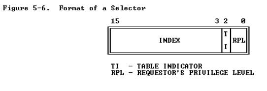
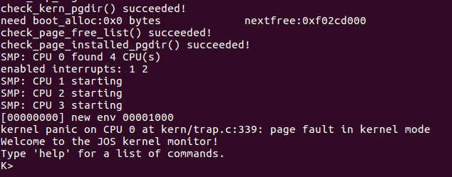
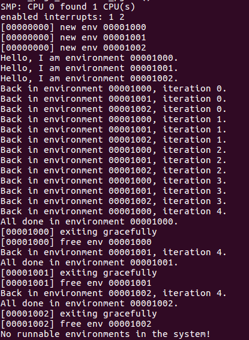
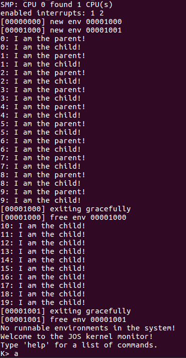
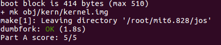

## Introduction

- partA 让JOS支持多处理器，实现轮询调度法（round-robin scheduling），并且添加基础的environment管理的system calls（create和destroyenvironment，allocate/map memory）;

- partB 将会实现一个类Unix的`fork`函数，这个函数可以让user-mode-environment复制它自己；

- partC 将会实现进程间的通信（inter-process communication），允许不同user-mode environments彼此通信和显示地同步；同时还会增加对硬件时钟中断和抢占式的支持；

## Part A: Multiprocessor Support and Cooperative Multitasking

1. 第一部分是让JOS运行在一个多处理器系统上；
2. 实现一些新的JOS kernel 的system calls，允许user-level environment可以创建额外新的environments。
3. 实现合作式的轮询调度，在当前environment自愿放弃CPU或者exit时，允许kernel从一个environment转到另一个environment；（partC是实现抢占式调度，在一个environment已经执行一段时间之后，kernel将会重新获得CPU的控制权，即使这个environment不合作）

### Multiprocessor Support

JOS将会支持"symmetric multiprocessing" (SMP)，在这种多处理器模式下，CPUs会有相同的系统资源比如内存或者IO buses。虽然SMP中的CPUs的功能是相同的，但是在启动过程中它们被分为两类：一类是bootstrap processor（BSP），这类主要负责系统的初始化和启动操作系统；另一类是application processors（APs），这一类是在操作系统启动并运行之后由BSP激活，哪一个处理器是BSP是由硬件和BIOS决定的。

> 到目前为止所有的JOS代码都是运行在BSP上的

在SMP系统中，每一个CPU都有一个相关联的local APIC （LAPIC）unit。LAPIC单元负责在系统之间传递interrupts，同时LAPIC给它相关联的CPU提供唯一的标识符。在这个Lab中我们使用下面这些LAPIC unit的基本功能：

- 读取LAPIC标识符来知道当前的代码运行在哪个CPU上---cpunum()
- 发送STARTUP interprocessor interrupt(IPI)，从BSP到APs来启动其他CPU---lapic_startap()
- 在partC中，我们对LAPIC的built-in timeer编程，为了引发clock interrupt来支持抢占式多任务---apic_init()

一个处理器使用memory-mapped I/O（MMIO）来访问它的LAPIC。在MMIO中，一部分物理内存是硬连接到一些IO设备的寄存器，所以load/store等访问内存的指令也可以用来访问设备寄存器了。比如之前提到的IO hole，它的物理地址就是0xA0000，我们使用这块物理地址来向VGA 显示缓存写入数据。而LAPIC是在物理地址0xFE000000开始的hole处，假如使用我们经常直接映射到KERNBASE的方法来访问的话，那么这个地址是太高了以致于我们不能访问。所以JOS虚拟地址映射留下来4MB的间隙在MMIOBASE，所以我们有一块地址区域去映射设备。

因为接下来的实验将会引入更多的MMIO region，所以下面我们来实现一个函数去分配这个区域然后将设备内存映射到这块区域。主要是实现`kern/pmap.c`中的`mmio_map_region()`

```c
void *
mmio_map_region(physaddr_t pa, size_t size)
{
  // Because this is static, its
  // value will be preserved between calls to mmio_map_region
  // (just like nextfree in boot_alloc).
  static uintptr_t base = MMIOBASE;
  void *ret = (void *)base;
 
  // Your code here:
  size = ROUNDUP(size, PGSIZE); // round size up to a multiple of PGSIZE 
    
  if(MMIOBASE + size > MMIOLIM){  // if this reservation would overflow MMIOLIM
    panic("the reservation overflow MMIOLIM\n");
  }
    
  // map [pa, pa+size) at MMIO region
  boot_map_region(kern_pgdir, base, size, pa, PTE_PCD|PTE_PWT|PTE_W);

  // why? the base just like nextfree in boot_alloc, and mmio_map_region
  // may be called many tiems, so we need add size to base
  base += size;

  return ret; // return the base of the reserved region
}
```

这个函数主要是将pa这个物理地址映射到虚拟地址base开始的地方，大小是size。实现过程中需要把size 变成PGSIZE的整数倍，同时base要加上这次已经分配的size，因为下次分配需要从base+size的地方开始。

#### Application Processor Bootstrap

在启动APs之前，BSP首先需要收集multiprocessor system的信息，比如CPU的总数、CPU的APIC IDs和LAPIC unit的MMIO address。`kern/mpconfig.c`中的`mp_init()`函数通过读取存储在BIOS内存区域的MP configuration table来获取上述这些信息；

`kern/init.c`中的`boot_aps()`驱动AP的启动过程。因为APs以real mode开始，这点和bootloader在`boot/boot.S`开始启动的样子很像，所以`boot_aps()`把AP的entry code（kern/mpentry.S）拷贝到real mode可以访问的地址区域。但是不像BootLoader，我们可以控制AP从哪里开始执行代码，我们将entry code拷贝到0x7000（MPENTRY_PADDR），但是需要知道的，任何在640KB以下未使用、页对齐的物理地址都可以。

在那之后，`boot_aps()`通过发送STARTUP IPIs给AP的LAPIC单元以及一个初始的CS:IP地址（AP应该会从这个地址开始运行它的entry code），来激活APs。`kern/mpentry.S`中的entry code跟`boot/boot.S`很像，在一些简短的步骤之后，AP开始进入protected mode并且使能paging，之后调用C 函数`mp_main()`（kern/init.c）。`boot_aps()`等待AP将它`struct CpuInfo`的`cpu_status`区域设置成`CPU_STARTED`标志，一旦设置完毕，就会启动下一个AP。

首先我们来看一下`kern/mpentry.S`文件，跟上面讲的过程是一样的，entry code会turn on paging，之后调用`mp_main()`函数。

```assembly
     ......
start32:
  	......
  # Turn on paging.
  movl    %cr0, %eax
  orl     $(CR0_PE|CR0_PG|CR0_WP), %eax
  movl    %eax, %cr0
  
  # Switch to the per-cpu stack allocated in boot_aps()
  movl    mpentry_kstack, %esp
  movl    $0x0, %ebp       # nuke frame pointer
  
  # Call mp_main().  (Exercise for the reader: why the indirect call?)
  movl    $mp_main, %eax
  call    *%eax
  ......
```

那么下面我们来看一下`mp_main()`函数

```c
// Setup code for APs
void
mp_main(void)
{ 
  // We are in high EIP now, safe to switch to kern_pgdir 
  lcr3(PADDR(kern_pgdir));
  cprintf("SMP: CPU %d starting\n", cpunum());
  
  lapic_init();
  env_init_percpu();
  trap_init_percpu();      
  xchg(&thiscpu->cpu_status, CPU_STARTED); // tell boot_aps() we're up
	......
}
```

首先是加载kern_pgdir，之后再是一些初始化操作，最后是将AP的状态设置为`CPU_STARTED`，目的是告诉BSP，AP已经启动了，可以启动下一个AP了。

下面我们来看一下`boot_aps()`函数，该函数首先是把entry code移到MPENTRY_PADDR处，之后遍历所有CPUs，依次启动CPU，最后的`while(c->cpu_status != CPU_STARTED)`是等待AP启动成功，之后启动下一个。

```c
// Start the non-boot (AP) processors.
static void
boot_aps(void)
{
  extern unsigned char mpentry_start[], mpentry_end[];
  void *code;
  struct CpuInfo *c;

  // Write entry code to unused memory at MPENTRY_PADDR
  code = KADDR(MPENTRY_PADDR);
  memmove(code, mpentry_start, mpentry_end - mpentry_start);

  // Boot each AP one at a time
  for (c = cpus; c < cpus + ncpu; c++) {
    if (c == cpus + cpunum())  // We've started already.
      continue;

    // Tell mpentry.S what stack to use 
    mpentry_kstack = percpu_kstacks[c - cpus] + KSTKSIZE;
    // Start the CPU at mpentry_start
    lapic_startap(c->cpu_id, PADDR(code));
    // Wait for the CPU to finish some basic setup in mp_main()
    while(c->cpu_status != CPU_STARTED)
      ;
  }
}
```

下面修改`kern/pmap.c`中`page_init()`的实现，让`MPENTRY_PADDR`不要被添加到freelist中，这样子我们可以安全把entry code拷贝过来并且运行AP的启动程序。

```c
int  mpentry_i = MPENTRY_PADDR/PGSIZE;  // the index of MPENTRY_PADDR 
for(page_i = 0; page_i < npages; page_i++){
    if(page_i == 0 || page_i == mpentry_i){ //标记第0块,mpentry_i为使用
        pages[page_i].pp_ref = 1;
    }else if(page_i >=npages_basemem && page_i < npages_basemem + num_alloc + num_iohole){
        pages[page_i].pp_ref = 1;
    }else{
        pages[page_i].pp_ref = 0;
        pages[page_i].pp_link = page_free_list;
        page_free_list = &pages[page_i];
    }
}
```

这操作就相当将物理地址为`MPENTRY_PADDR`的那一物理页的`pp_ref`标为1，这样子这一页就不会被分配出去了。

#### Per-CPU State and Initialization

在实现多处理器OS的时候，区分每一个处理器私有的CPU状态和整个系统共享的全局状态是很重要的。`kern/cpu.h`里面定义了每一个CPU的大部分状态，也定义了`struct CpuInfo`来存储每一个CPU的变量。`cpunum()`返回调用这个函数的CPU id，这个id可以作为cpus的index。`thiscpu`是指当前CPU的`struct CpuInfo`。

下面是每一个CPU的状态：

- **Per-CPU kernel stack**. 

  因为多CPUs的系统可能会同时进入kernel，为了防止它们互相干涉其他CPU的执行，我们需要为每一个处理器分割出一个kernel stack。`percpu_kstacks[NCPU][KSTKSIZE]`保留着每个CPU的kernel stack。

  Lab2的时候，我们将物理地址`bootsatck`（BSP的kernel stack）映射到了KSTACKTOP的下面，在这个Lab中，我们将会把每一个CPU的kernel stack映射到KSTACKTOP下方的区域，并且在每个kernel stack之间插入保护页面作为buffer。CPU 0的kernel stack将会从KSTACKTOP开始往下生长，CPU 1的kernel stack将会从KSTACKTOP下面KSTKGAP的位置开始。`inc/memlayout.h`展示这种映射。
  
- **Per-CPU TSS and TSS descriptor**.

  每一个CPU的task state segment（TSS）也是需要的，为了指定CPU的kernel stack在哪。CPU的TSS是存放在`cpu[i].cpu_ts`中，相关联的TSS descriptor是被定义在GDT的条目中`gdt[(GD_TSS0 >> 3) + i]`.

- **Per-CPU current environment pointer**. 

  由于每一个CPU都可以同时运行不同的进程，我们重新定义`curenv`指向`cpus[cpunum()].cpu_env`（或者是`thiscpu->cpu_env`），表示当前CPU运行的environment。

- **Per-CPU system registers**. 

  所有的寄存器，包括CPU私有的系统寄存器。可以通过指令来初始化这些寄存器，比如`lcr3()`、`ltr()`, `lgdt()`, `lidt()`等，并且每个CPU都要执行一次。函数 `env_init_percpu()` 和`trap_init_percpu()` 就是用来实现这些的。

  在早期Lab的chanllege的解决中，如果你添加了额外CPU状态位或者任何额外的CPU初始化（也就是说，在CPU寄存器中设置新的位），确保你已经在每个CPU上复制了他们。

修改`kern/pmap.c`中的`mem_init_mp()`函数，映射每一个CPU的stack到`KSTACKTOP`上。每一个stack都是KSTKSIZE bytes加上KSTKGAP bytes的未映射的guard page，结构图如下所示（可以看`inc/memlayout.h`）

```c
 *    KERNBASE, ---->  +------------------------------+ 0xf0000000      --+
 *    KSTACKTOP        |     CPU0's Kernel Stack      | RW/--  KSTKSIZE   |
 *                     | - - - - - - - - - - - - - - -|                   |
 *                     |      Invalid Memory (*)      | --/--  KSTKGAP    |
 *                     +------------------------------+                   |
 *                     |     CPU1's Kernel Stack      | RW/--  KSTKSIZE   |
 *                     | - - - - - - - - - - - - - - -|                 PTSIZE
 *                     |      Invalid Memory (*)      | --/--  KSTKGAP    |
 *                     +------------------------------+                   |
 *                     :              .               :                   |
 *                     :              .               :                   |
 *    MMIOLIM ------>  +------------------------------+ 0xefc00000      --+
```

最后实现的代码如下所示

```c
static void
mem_init_mp(void)
{
  // LAB 4: Your code here:
  int8_t i;
  uintptr_t kstacktop_i;
  for(i = 0; i < NCPU; i++){
    kstacktop_i = KSTACKTOP - i * (KSTKSIZE + KSTKGAP);
    boot_map_region(kern_pgdir, kstacktop_i - KSTKSIZE, KSTKSIZE, PADDR(&percpu_kstacks[i]), PTE_W | PTE_P);
  }
}
```

> 对于CPU i的kernel stack来说，它的开始向下增长的虚拟地址是`KSTACKTOP - i * (KSTKSIZE + KSTKGAP)`，每个栈的大小是`KSTKSIZE`。上面在讲解CPU状态的时候也提到了，`percpu_kstacks[NCPU][KSTKSIZE]`保留着每个CPU的kernel stack，那么`percpu_kstacks[i]`就是第i个kernel stack，但是我们需要它的物理地址，所以通过&来去这个kernel stack的虚拟地址，再通过PADDR就得到了实际的物理地址。

下面我们还要实现`kern/trap.c`中的`trap_init_percpu()`函数使得它可以适用于所有CPU的TSS和TSS描述符的初始化，这个函数中已经有实现的代码了，但是这个代码仅在Lab3的时候是可以适用的，接下去我们可以参考已经实现的代码来实现我们所需要的。

```c
// Initialize and load the per-CPU TSS and IDT
void
trap_init_percpu(void)
{
  // LAB 4: Your code here:
  int8_t cpu_i = cpunum();
  // Setup a TSS so that we get the right stack
  // when we trap to the kernel.
  thiscpu->cpu_ts.ts_esp0 = KSTACKTOP - cpu_i * (KSTKSIZE + KSTKGAP);
  thiscpu->cpu_ts.ts_ss0 = GD_KD;
  thiscpu->cpu_ts.ts_iomb = sizeof(struct Taskstate);

  // Initialize the TSS slot of the gdt.
  gdt[(GD_TSS0 >> 3) + cpu_i] = SEG16(STS_T32A, (uint32_t) (&(thiscpu->cpu_ts)),
          sizeof(struct Taskstate) - 1, 0);
  gdt[(GD_TSS0 >> 3) + cpu_i].sd_s = 0;

  // Load the TSS selector (like other segment selectors, the
  // bottom three bits are special; we leave them 0)
  ltr(GD_TSS0 + sizeof(struct Segdesc) * cpu_i);

  // Load the IDT
  lidt(&idt_pd);
}
```

> 可以通过`cpunum()`或者`thiscpu->cpu_id`来获得当前运行的CPU的ID；
>
> `ts`是一个全局变量，在这里面我们需要使用`thiscpu->cpu_ts`；
>
> GD_TSS0指的是Task segment selector for CPU0，并且selector的结构如下图所示，即后三位是保留了的，前面是作为gdt表中的index，这也就是为啥GD_TSS0要右移3位的原因，但是GD_TSS0 >>3之后CPU0的task segment selector的index，那么对cpu i的task segment selector来说，应该要加上i
>
> 
>
> 由于GD_TSS0是CPU 0的Task segment selector，这个其实可以理解为相对GDT表开始地址的的偏移量，那么对于CPU i的TSS selector来说，只要在这个基础上加上（i*段描述符的长度）即可。
>
> PS:对于右移3位，其实也可以这么想，selector是来确定这个segement descriptor在gdt表中的位置的，只是selector是相当偏移量，gdt表的每个描述符是8bytes，所以selector/8就是segement descriptor的index。

当你完成了上述的实验之后，使用`make qemu CPUS=4`或者`make qemu-nox CPUS=4`将会得到如下结果：



#### Locking

在`mp_main()`对AP初始化之后，我们的代码就会开始运转，但是在这之前，我们首先需要解决多CPUs同步运行kernel code时的竞争条件。最简单的方法就是使用一个 global big kernel lock，当一个environment进入kernel mode之后，那么它就held lock，在返回user mode之后release lock。在这种模式下，environments在user mode可以同步运行在任何可获得的CPUs上，但是至多只有一个environment可以运行在kernel mode下，任何其他的environment想要进入kernel mode都会强制等待。

在`kern/spinlock.h`中声明lebig kernel lock，叫做`kernel_lock`，同时也提供了`lock_kernel()`和`unlock_kernel()`，来获得和释放lock。我们需要将上面两个函数应用到下面四个地方：

1. 在`i386_init()`中，在BSP唤醒其他CPUs之前获得这lock；

   ```c
   // Acquire the big kernel lock before waking up APs
   // Your code here:
   lock_kernel();
   // Starting non-boot CPUs
   boot_aps();
   ```

2. 在`mp_main()`中，在AP初始化之后获得lock，之后调用`sched_yield()`在这个AP上运行environment；

   ```c
   xchg(&thiscpu->cpu_status, CPU_STARTED); // tell boot_aps() we're up
   
   // Now that we have finished some basic setup, call sched_yield()
   // to start running processes on this CPU.  But make sure that
   // only one CPU can enter the scheduler at a time!
   //
   // Your code here:
   lock_kernel();
   sched_yield();
   ```

3. 在`trap()`中，当从user mode trap进来的时候获取lock；

   ```c
   if ((tf->tf_cs & 3) == 3) {
       // Trapped from user mode.
       // Acquire the big kernel lock before doing any
       // serious kernel work.
       // LAB 4: Your code here.
       lock_kernel();
       assert(curenv);
   	......
   }
   ```

4. 在`env_run()`中，在转换到user mode之前释放lock，不要在错误的地方释放锁可能会造成死锁；

   ```c
   void
   env_run(struct Env *e)
   { 
     	......
     lcr3(PADDR(curenv->env_pgdir));
   
     unlock_kernel();  
     env_pop_tf(&(curenv->env_tf));
     panic("env_run not yet implemented");
   }
   ```

上述添加完之后，是没办法测试的，需要等下面这个实验实现之后才能测试。

### Round-Robin Scheduling

这个任务是实现在多environments之间实现“round-robin”scheduling。JOS中的“round-robin”scheduling 如下所示：

-  `kern/sched.c`中的`sched_yield()`函数主要是负责选择一个environment来运行。在`envs[]`数组中以一种循环的方式来线性寻找，在前一个运行的environment之后找到第一个状态为`ENV_RUNNABLE`的environment（假如前面没有运行的environment那就从头开始），之后调用`env_run()`来运行这个environment。
- `sched_yield()`绝不会同时在两个CPU上运行同一个environment。因为这个函数只会运行状态为`ENV_RUNNABLE`的environment，而在运行的environment会被标记为`ENV_RUNNING`;
- 已经实现了一个新的system call`sys_yield`，用户可以调用这个system call来调用`sched_yield()`函数，因此会将CPU交给另一个environment；

根据上面的要求我们来实现`sched_yield()`函数

```c
// Choose a user environment to run and run it.
void
sched_yield(void)
{
  struct Env *idle;
  // LAB 4: Your code here.
  int env_index;  // env index
  int start_envi;  // previous env index
  int i;

  idle = thiscpu->cpu_env;  // current env
  start_envi = idle? ENVX(idle->env_id) + 1 : 0;

  for(i = 0; i< NENV; i++){
    env_index = (start_envi + i)%NENV;
    if(envs[env_index].env_status == ENV_RUNNABLE){
      env_run(&envs[env_index]);
    }
  }

  if(idle && idle->env_status == ENV_RUNNING){
    env_run(idle);
  }

  // sched_halt never returns
  sched_halt();
}
```

> 我们首先是判断当前是否有environment执行，假如没有的话那就从0开始，假如有的话，那就从当前environment的下一个位置开始寻找，当找到第一个状态为`ENV_RUNNABLE`的之后就开始运行这个environment。假如找遍整个`envs`都没有找到，退出循环之后会判断当前的environment的状态是不是`ENV_RUNNING`，假如是的话那就继续运行。代码中的idle是从当前运行的CPU上获取的environment，假如再次运行还是会在当前的CPU上。

之后，我们修改`syscall()`函数让它能处理调用`sys_yield()`这种情况

```c
......
case SYS_yield:
    sys_yield();
    return 0;
......
```

> 在syscall函数中加一个case就好

最后我们需要在`i386_init()`函数中创建3个environment来运行`user/yield.c`函数

```c
	......
#if defined(TEST)
  // Don't touch -- used by grading script!
  ENV_CREATE(TEST, ENV_TYPE_USER);
#else
  // Touch all you want.
  // ENV_CREATE(user_primes, ENV_TYPE_USER);
  ENV_CREATE(user_yield, ENV_TYPE_USER);
  ENV_CREATE(user_yield, ENV_TYPE_USER);
  ENV_CREATE(user_yield, ENV_TYPE_USER);
#endif // TEST*
	......
```

最后我们别忘记修改`mp_main()`函数中的内容

```c
// Remove this after you finish Exercise 6
for (;;);
```

> 可能你上述代码改完之后还是没有达到预期效果，比如我就是没有达到预期的要求，可能不是你上述实现的代码有问题而是我们之前写的代码有问题，比如上述代码实现之后，我是在Lab3实现`trap_dispatch()`时出现了一点问题，但是不是逻辑上的问题，而是Lab3的代码跟Lab4的代码merge之后出现两种不一样的判断形式，我Lab3的`trap_dispatch()`函数中是使用switch...case的格式来进行判断调用之后是break操作，如下所示:
>
> ```c
> 	......
> switch(tf->tf_trapno){
>     case T_BRKPT:
>         monitor(tf);
>         return;
>     case T_SYSCALL:
>         re = syscall(regs->reg_eax, regs->reg_edx, regs->reg_ecx, regs->reg_ebx, regs->reg_edi, regs->reg_esi);
>         regs->reg_eax = re;
>         return;
>     case T_PGFLT:
>         page_fault_handler(tf);
>         return;
>     default:
>         // Unexpected trap: The user process or the kernel has a bug.
>         print_trapframe(tf);
>         if (tf->tf_cs == GD_KT)
>             panic("unhandled trap in kernel");
>         else {
>             env_destroy(curenv);
>             return;
>         }
> }
> 	......	
> ```
>
> 而官方Lab4采用的是if格式来判断的，并且最后default的内容在merge的时候也给添加进去了，如下所示
>
> ```c
> ......
> if (tf->tf_trapno == IRQ_OFFSET + IRQ_SPURIOUS) {
>     cprintf("Spurious interrupt on irq 7\n");
>     print_trapframe(tf);
>     return;
> }
> 
> // Unexpected trap: The user process or the kernel has a bug.
> print_trapframe(tf);
> if (tf->tf_cs == GD_KT)
>     panic("unhandled trap in kernel");
> else {
>     env_destroy(curenv);
>     return;
> }
> ......
> ```
>
> 结果呢在switch之后，因为break会到下面的if来执行，从而会调用`env_destroy()`，然后就gg了。解决办法的话，一个是将break改为return，但是出于一致性以及担心后面的Lab还是会采用if的格式，所以统一改成了if的格式。

接下去我们测试一下执行的效果，运行`make qemu-nox`，实验结果如下图所示，在结束之前，会看见在环境在彼此之间来回切换5次。在yield程序退出之后，在system中将没有runnable的environment，那么调度算法将会调用JOS的kernel  monitor。



### System Calls for Environment Creation（environment创建时的system call）

现在我们的kernel有能力运行多个user-level environment并且可以在它们之间切换，但是只能运行kernel 初始化的environment。在这个实验中，我们将会实现必要的JOS system call来允许user environment创建和开始其他新的user environment。

Unix提供了`fork()`system call作为它原始的进程创建。Unix的`fork()`函数复制调用进程（父进程）整个地址空间，来创建一个新的进程（子进程）。从用户空间可观察到这两个之间唯一的区别是他们的process IDs和parent IDs。在父进程中，`fork()`返回子进程的process ID，然而在子进程中`fork()`是返回的是0。默认情况下，每一个进程获得它自己私有的地址空间，进程对内存的修改对于其他进程来说是不可见的。

在这个实验中我们将提供一系列不同的、更加原始的system calls来创建一个新的user-level environment。使用这些system calls，你可以在用户空间实现一个类Unix的`fork()`。下面我们来实现这些system call:
Hint：你将会使用`kern/pmap.c`和`kern/env.c`中各种不同的函数，尤其是`envid2env()`，无论你什么时候调用这个函数，`checkperm`这个参数永远传1;
Hint：对于下面有些接受environment IDs的的system call来说，JOS kernel 为了方便支持0这个值就是代表"the current environment"，具体实现可见`kern/evn.c`中的`envid2env()`函数

- sys_exofork

  这个system call将会创建一个新的environment：它地址空间的用户部分是没有映射任何东西的；状态是not_runnable；在调用`sys_exofork()`的时候，新的环境将会跟父environment有着相同的寄存器状态。对于parent来说，`sys_exofork`返回新创建的environment的`envid_t`（假如environment分配失败了那就是一个error code了）；对于child来说，将会返回0。由于刚开始的时候被标记为not runnable，在child environment中`sys_exofork`将不会返回，直到父environment将child标记为runnable。

  ```c
  static envid_t
  sys_exofork(void)
  {
    // LAB 4: Your code here.
    struct Env *e ;
    int re ;
  
    // whether no free environment is abailable
    if((re = env_alloc(&e, sys_getenvid()))){
      return re;
    }
  
    e->env_status = ENV_NOT_RUNNABLE; // status is set to ENV_NOT_RUNNABLE
    e->env_tf = curenv->env_tf;       // register set is copied from the current environment
    e->env_tf.tf_regs.reg_eax = 0;    // child return 0
  
    return e->env_id;
  }
  ```

  > 根据提示以及函数要实现的功能，首先是分配一个environment，之后将这个新分配的environment标记为ENV_NOT_RUNNABLE，并将当前的值赋值给child environment，同时将child environment的eax设为0，最后返回child environment的env_id。对于为什么要将child environment的eax设为0，因为调用`sys_exofork()`函数之后，这个函数的返回值是从eax中取的
  >
  > ```c
  > static inline envid_t __attribute__((always_inline))
  > sys_exofork(void)
  > {
  >   envid_t ret;
  >   asm volatile("int %2"
  >          : "=a" (ret)
  >          : "a" (SYS_exofork), "i" (T_SYSCALL));
  >   return ret;
  > }
  > ```
  >
  > 上面的`sys_exofork`是user level program调用的，其中`: "=a" (ret)`表示将eax寄存器的值给ret。那么假如是child environment进入user mode之后，ref_eax的值就是放到eax寄存器中的值，那么`sys_exofork()`这个函数的返回值就是0，假如是parent environment，那么这个返回值是child environment的env_id。所以简单不严谨的来说，tf_regs.reg_eax这个值就是system call的返回值。

- sys_env_set_status

  将一个environment的状态设置为`ENV_RUNNABLE`或者`ENV_NOT_RUNNABLE`。一旦它的地址空间和寄存器状态被完全初始化了，那么可以调用这个system call将一个新的environment标记为ready to run。

  ```c
  static int
  sys_env_set_status(envid_t envid, int status)
  {
    // LAB 4: Your code here.
    struct Env *e;
    int re;
  
    // whether status is not a valid status for an environment
    if(status != ENV_RUNNABLE && status != ENV_NOT_RUNNABLE){
      return -E_INVAL;
    }
  
    // get an environment
    if((re = envid2env(envid, &e, 1))){
      return re;
    }
  
    e->env_status = status;
    return 0;
  }
  ```

  > 这个函数的实现相对简单，所以就不讲了。

- sys_page_alloc

  分配一物理页，然后将这个物理页映射到给定的environment的地址中给定的虚拟地址处.

  ```c
  static int
  sys_page_alloc(envid_t envid, void *va, int perm)
  {
    // LAB 4: Your code here.
    int re ;
    struct Env *e;
    struct PageInfo *newpage;
  
    // whether va >= UTOP or va is not page-aligned
    if(va >= (void *)UTOP || PGOFF(va)){
      return -E_INVAL;
    }
  
    // whether perm is inappropriate  
    if(((perm & (PTE_U | PTE_P)) != (PTE_U|PTE_P)) || (perm & ~PTE_SYSCALL)){
      return -E_INVAL;
    }
  
    // whther environment envid doesn't currently exist...
    if((re = envid2env(envid, &e, 1))){
      return re;
    }
  
    // whether there's no memory to allocate the new page
    if((newpage = page_alloc(ALLOC_ZERO)) == NULL){
      return -E_NO_MEM;
    }
  
    // if page_insert() fails, free the page
    if((re = page_insert(e->env_pgdir, newpage, va, perm))){
      page_free(newpage);
      return re;
    }
  
    return 0;
  }
  ```

  > 这个函数实现中，需要注意的是，va需要页对齐的，那么va页对齐得满足啥条件？va页对齐就相当于这个地址进行转之后正好是页的开始，那么也就相当于偏移量字段为0，所以使用PGOFF()函数；
  >
  > `(perm & ~PTE_SYSCALL)`这个是用来判断权限有没有超过PTE_SYSCALL;
  >
  > 最后加入page_insert失败的话，记得free掉分配的页

- sys_page_map

  将一个页的映射从一个environment拷贝到另一个environment中去（不是页的内容），留下一块共享内存区，这样子新的和旧的映射都可以指向相同的物理内存页

  ```c
  static int
  sys_page_map(envid_t srcenvid, void *srcva, envid_t dstenvid, void *dstva, int perm)
  {
    // LAB 4: Your code here.
    struct Env *srcenv, *dstenv;
    struct PageInfo *page;
    int srcre, dstre, re;
    pte_t *te;
  
    // whether srcenvid or dstenvid doesn't currntly exist... 
    if((srcre = envid2env(srcenvid, &srcenv, 1))){
      return srcre;
    }
    if((dstre = envid2env(dstenvid, &dstenv, 1))){
      return dstre;
    }
  
    // whether srcva >=UTOP or dstva >= UTOP
    if(srcva >= (void *)UTOP || PGOFF(srcva) || dstva >= (void *)UTOP || PGOFF(dstva)){
      return -E_INVAL;
    }
  
    // whether perm is inappropriate
    if(((perm & (PTE_U|PTE_P)) != (PTE_U|PTE_P)) || (perm & ~PTE_SYSCALL)){
      return -E_INVAL;
    }
  
    // whether srcva is not mapped in srcenvid's address space
    if((page = page_lookup(srcenv->env_pgdir, srcva, &te)) == NULL){
        return -E_INVAL;
    }
  
    // if (perm & PTE_W), but srcva is read-only
    if((perm & PTE_W) && !(*te & PTE_W)){
       return -E_INVAL;
    }
  
    // if  there is no memory to allocate any necessary page table 
    if((re = page_insert(dstenv->env_pgdir, page, dstva, perm))){
      return re;
    }
  
    return 0;
  }
  ```

  > 特别注意的是：拷贝的页的映射，而不是页的内容。通过page_lookup函数我们找到了相应的页的PagaInfo，之后把这个page插入到dstenv中，那么就相当他们共享这page了。复制页的内容的话，那么不是共享的了。

- sys_page_unmap

  取消给定的environment中给定的虚拟地址的映射

  ```c
  static int
  sys_page_unmap(envid_t envid, void *va)
  {
    // Hint: This function is a wrapper around page_remove().
  
    // LAB 4: Your code here.
    struct Env *e;
    int re;
  
    // whether environment envid doesn't currently exist
    if((re = envid2env(envid, &e, 1))){
      return re;
    }
  
    // whether va >=UTOP, or va is not page-aligned
    if(va >= (void *)UTOP || PGOFF(va)){
      return -E_INVAL;
    }
  
    page_remove(e->env_pgdir, va);
      
    return 0;
  }
  ```

最后在`kern/syscall.c`的`syscall()`函数中，记得dispatch这些system call。

```c
int32_t
syscall(uint32_t syscallno, uint32_t a1, uint32_t a2, uint32_t a3, uint32_t a4, uint32_t a5)
{
  int re ;
  switch (syscallno) {
  	......
  case SYS_page_alloc:  // 4
    return (int32_t)sys_page_alloc(a1, (void *)a2, a3);

  case SYS_page_map: // 5
    return (int32_t)sys_page_map(a1, (void *)a2, a3, (void *)a4 ,a5);

  case SYS_page_unmap: // 6
    return (int32_t)sys_page_unmap(a1, (void *)a2);

  case SYS_exofork:
    return (int32_t)sys_exofork();

  case SYS_env_set_status:  // 8
    return (int32_t)sys_env_set_status(a1, a2);
  	......
  }
}
```

JOS给我们提供了一个相当原始的类Unix`fork()`的实现，见文件`user/dumbfork.c`，首先来看主函数：

```c
void
umain(int argc, char **argv)
{
  envid_t who;
  int i;

  // fork a child process
  who = dumbfork();

  // print a message and yield to the other a few times
  for (i = 0; i < (who ? 10 : 20); i++) {
    cprintf("%d: I am the %s!\n", i, who ? "parent" : "child");
    sys_yield();
  }
}
```

这个函数将会根据who（dumbfork()的返回值）来判断，假如返回的是0，那么表示的child environment，那么则for循环20次；假如是parent environment返回的是child environment的env_id，那么将会循环10次；这两个循坏会使用`sys_yield()`来回切换，从而打印的效果是交替输出的。`umain()`函数中调用了`dumbfork()`函数，我们来看一下这个函数

```c
envid_t
dumbfork(void)
{
  envid_t envid;
  uint8_t *addr;
  int r;
  extern unsigned char end[];

  // Allocate a new child environment.
  // The kernel will initialize it with a copy of our register state,
  // so that the child will appear to have called sys_exofork() too -
  // except that in the child, this "fake" call to sys_exofork()
  // will return 0 instead of the envid of the child.
  envid = sys_exofork();
  if (envid < 0)
    panic("sys_exofork: %e", envid);
  if (envid == 0) {
    // We're the child.
    // The copied value of the global variable 'thisenv'
    // is no longer valid (it refers to the parent!).
    // Fix it and return 0.
    thisenv = &envs[ENVX(sys_getenvid())];
    return 0;
  }

  // We're the parent.
  // Eagerly copy our entire address space into the child.
  // This is NOT what you should do in your fork implementation.
  for (addr = (uint8_t*) UTEXT; addr < end; addr += PGSIZE)
    duppage(envid, addr);

  // Also copy the stack we are currently running on.
  duppage(envid, ROUNDDOWN(&addr, PGSIZE));

  // Start the child environment running
  if ((r = sys_env_set_status(envid, ENV_RUNNABLE)) < 0)
    panic("sys_env_set_status: %e", r);

  return envid;
}
```

> 在这里我们是parent environment的视角来看这个函数，首先调用sys_exofork()函数来创建child environment，创建完之后，子进程的状态是not runnable，而且地址空间都没有复制给child，所以这个函数的返回值是child environment的env_id。之后我们使用`duppage()`函数从UTEXT开始将parent的地址空间复制给child，同时将stack的内容也复制给child，为啥使用&addr呢，因为addr是一个局部变量的值，这个值是在stack中的，那么通过&符号可以知道它的虚拟地址，就知道了整个stack的位置。最后将child设置为runnable。从这开始之后，child的地址空间中的内容，以及栈中的内容都是跟parent一样了。
>
> 这里我们从child environment的视角来看这个函数，由于寄存器的值已经拷贝了一份给child environment，那么child environment也会从`sys_exofork()`这个函数返回，但是此时的返回值是0了。可能有人会注意到，sys_exofork执行之后函数真的会返回原来的地方吗？因为寄存器中的某些值比如esp是parent针对进入sys_exofork之后的值，但是当child environment返回到user mode之后，虽然还是会在那个地方，stack的内容已经变了，还能回去吗？其实我们需要注意到给user environment调用的是一个inline函数（定义为inline函数之后，会省去函数调用的开销，直接嵌套汇编代码，取代函数调用，提高效率），假如不是inline函数的话，因为stack的内容变了，将返回不了` envid = sys_exofork();`这个位置了。但是是inline函数，不涉及到函数调用，而且栈是向下生长的，所以虽然child environment在进入user mode时栈的内容跟parent environment回到user mode栈的内容会有不一致（child会更多一些），但是针对child environment来说，stack有效的部分还是一样的（esp以上的值没有变）。
>
> ```c
> // This must be inlined.  Exercise for reader: why?
> static inline envid_t __attribute__((always_inline))
> sys_exofork(void)
> {   
>   envid_t ret;
>   asm volatile("int %2"
>          : "=a" (ret)
>          : "a" (SYS_exofork), "i" (T_SYSCALL));
>   return ret;
> }
> ```
>
> 

那么使用`make run-dumbfork`命令运行这个程序的效果如下所示：



接下来我们使用`make grade`来测试一下，上述实现的system call是否正确（假如你运行dumbfork程序之后的输出内容同上面那张图，那么这个测试一般都是OK的）



### question

1. 比较`kern/mpentry.S` 和 `boot/boot.S`，记住kern/mpentry.S是被编译好之后再链接到KERNBASE上面的，那么分配MPBOOTPHYS的目的是什么呢？为什么这个在`kern/mpentry.S`是必要的，但是`boot/boot.S`中是不必要的呢？如果这个被忽略会发生什么？

   因为AP当开始是以实模式启动的，那么它就没办法寻址到高地址处的，所以用`MPBOOTPHYS`是来计算相应的物理地址的。在boot/boot.S中，由于尚未启用分页机制，所以我们能够直接程序开始执行的地方以及程序加载的地址，但是在mpentry.S中，主CPU已经处于保护模式下了，因为不能直接指定物理地址，而是给定线性地址（给定线性地址，映射到相应的物理地址是允许的）。

2. 使用big kernel lock似乎保证了在一个时间点上只有一个CPU能运行kernel code，那么为什么我们仍然需要将每一个CPU的kernel stack分开呢？

   因为不同的kernel stack上可能保存着不同的信息，当一个CPU从内核退出来之后，有可能在kernel stack中留下一些将来还有用的数据，所以一旦要有单独的栈。 比如CPU A运行完之后切换到了CPU B然后又切换到CPU A，对于只有一个栈而言，可能刚开始保存的CPUA的信息无法获取了，那就GG了，但是对于分开栈来说，kernel stack的内容还保存着，那就可以继续。
   
3. 在`env_run()`的实现中已经调用了`lcr3()`函数。那么`%cr3`寄存器加载之后，地址上下文的已经由MMU部件改变了，但是为啥`env_run()`参数也就是curenv为啥在`lcr3()`前后都可以被dereferenced？

   因为e是在内核映射的区域，而内核映射的区域在每个environment的页表中都是一样的，所以不受影响。

4. kernel无论什么时候从一个environment转到另一个，都必须确保旧environment的寄存器的值被保存下来了的，以便他们之后可以恢复。这些是在哪里发生的？

   因为从environment转到另一个environment的时候，会进入kernel mode，而进入kernel mode时候会将environment的寄存器的值都保存在environment的Trapframe中，当准备进入user mode 时候，通过保存的Trapframe可以恢复到原来的执行状态的。


## 总结


## Appendix：CPU个数、核心数、线程数

一个CPU可以集成多个内核，一个内核又被分为两个线程。但是CPU被分成多个内核，这是物理的分隔，拆开CPU是可以看到的，但是一个内核被分成两个线程是一种超线程技术，也就是串代码，操作系统会认为一个线程也是一个内核，有点欺骗操作系统的感觉。