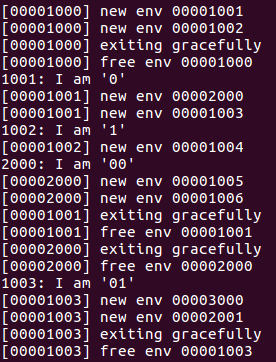
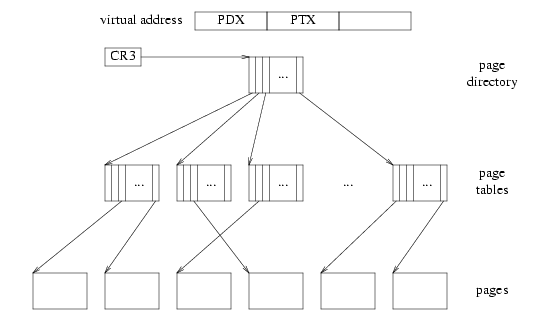
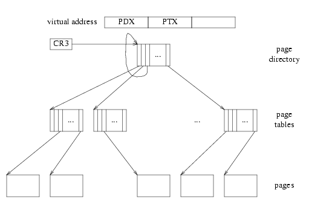
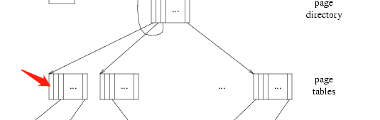

## Part B: Copy-on-Write Fork

Unix提供`fork()`system call作为主要的进程创建原语。`fork()`system call 复制调用进程（the parent）的地址空间，然后去创建一个新的进程（the child）。xv6实现的`fork()`是将parent  pages的所有数据复制到child的pages，这跟我们上面的实现的`dumbfork()`很像，这种复制是整个`fork()`操作中消耗最大的。但是，在调用`fork()`之后在子进程中往往会立即调用`exec()`函数，`exec()`这个函数会将会把child的内存替换成一个新的程序（shell经常就是这么干的）。这样子一来花在复制上的时间就被大量浪费了，因为子进程在调用`exec()`之前将会使用很少一部分的内存。

出于这种原因，Unix的后续利用虚拟地址硬件的优势，允许parent和child共享映射到他们各自的地址空间的内存，直到父子进程中有一个准备修改。**这种技术就叫做copy-on-write**。为了实现这个，在`fork()`中kernel将地址空间的映射从父进程复制到子进程（复制的不是映射页的内容），同时将现在的共享页标记为read-only。当其中一个进程想要对其中一个共享页执行写操作，那么将会发生page fault。这时unix kernel意识到这个页是一个“virtual”copy或者“copy on write”copy，所以对于这个faulting process来说，它将会创建一个新的、私有的、可写的、复制的页。这种优化使得子进程中对于`fork()`之后`exec()`这种方式的开销变得少了：在`exce()`之前child将可能只需要复制一个页（stack的当前页）。

### User-level page fault handling

当一个page fault发生在进程空间每一个区域的时候，Unix kernel 必须知道相应的该采取什么的措施。假如fault发生在stack region，那么将会分配和映射新的物理内存页；假如一个fault发生在BSS区，将会分配一个新的页，然后全都初始化为0，之后分配它；假如一个fault发生在text区，将会从磁盘上读取二进制到相应页，然后映射它。我们将会自己决定当一个fault发生在user space时会采取什么的样的措施，而不是Unix传统的方法，因为fault发生在user space的时候破坏性是相对较小的。而这种设计增加了另一个好处那就是允许在程序定义内存区域的时候更具灵活性，在接下来的实验中，我们将会使用user-level-page fault来映射和访问基于disk的系统文件的文件。

#### Setting the Page Fault Handler

为了处理自己的page faults，一个user environment将会使用`sys_env_set_pgfault_upcall` system call向JOS kernel 注册一个 page fault handler entrypoint。同时我们也在Env结构体中增加了一个新成员`env_pgfault_upcall`，这个成员变量用来记录这个信息。

实现`sys_env_set_pgfault_upcall`system call，在寻找目标environment的environment ID的时候确保permissions检查，因为它是一个危险的system call。

```c
static int
sys_env_set_pgfault_upcall(envid_t envid, void *func)
{
  // LAB 4: Your code here.
  int re;
  struct Env *e;

  if((re = envid2env(envid, &e, 1))){
    return re;
  }

  e->env_pgfault_upcall = func;
  return 0;
}
```

这个函数是用来给一个environment设置user-level page fault handler，在之后的实验中会被使用到。

#### Normal and Exception Stacks in User Environments

在正常的执行阶段中，JOS的一个user environment是运行在normal stack上，ESP最开始的时候指向USTACKTOP，之后stack data是被压入至USTACKTOP-PGSIZE到USTACKTOP-1(包含)之间的。当一个page fault发生在user mode，那么它将会进入kernel mode的page fault handle，之后kernel将会重启这个user environment，从新进入user mode，并让它运行指定好的user-level page fault handler，而此时运行的stack变成了user exception stack。JOS的user exception stack也是一个页的大小，这个stack的栈顶的虚拟地址是UXSTACKTOP，整个栈空间是从UXSTACKTOP-1到UXSTACKTOP-PGSZIE。当运行在exception stack上的时候，user-level page fault handler可以使用JOS一般的system call来映射或者调整映射，这样子可以修复导致page fault的问题。之后user-level page fault handler通过一系列的汇编语言返回到原始stack上的错误代码。

**但是Exception stack是没有提前分配好的，所以假如一个user environment想要去支持user-level page fault hanler，需要分配它自己的exception stack 的内存。可以使用`sys_page_alloc`system call。**

所以发生page fault之后，大致的流程是：用户态->内核态->用户态，对应的栈变换是：用户运行栈->内核栈->异常栈。

#### Invoking the User Page Fault Handler

下面我们需要改变kernel 中page fault handler，让它可以处理来自user mode的page fault。在发生fault的时候，user environment的状态是被叫做trap-time状态。

假如一个environment没有注册user-level page fault handler，那么该会destory 这个environment。假如已经注册了，那么kernel 需要在exception stack上设置一个trap frame，这个trap frame要符合`inc/trap.h`中的`struct UTrapframe`。如下所示，`fault_va`是发生page fault的虚拟地址。

```
                    <-- UXSTACKTOP
trap-time esp
trap-time eflags
trap-time eip
trap-time eax       start of struct PushRegs
trap-time ecx
trap-time edx
trap-time ebx
trap-time esp
trap-time ebp
trap-time esi
trap-time edi       end of struct PushRegs
tf_err (error code)
fault_va            <-- %esp when handler is run
```

设置好trap frame之后，kernel之后需要让user environment 在已经有了trap frame的exception stack上运行page fault hanlder。

假如一个user environment已经运行在exception stack上了结果又发生page fault了（通过判断`tf->tf_esp`是不是在UXSTACKTOP-PGSIZE至UXSTACKTOP之间来判断），那么这种情况下，你应该在当前`tf->tf_esp`下面建立新的stack frame。需要注意的是，记得要先压入空的32bit的内容，之后再是`struct UTrapframe`。

实现`kern/trap.c`中的`page_fault_handler`函数，让它可以将page fault转换到user mode hanndle中执行。

```c
void
page_fault_handler(struct Trapframe *tf)
{
  uint32_t fault_va;
  struct UTrapframe *utf;
  // Read processor's CR2 register to find the faulting address
  fault_va = rcr2();

  // Handle kernel-mode page faults.

  // LAB 3: Your code here.
  // user mode is 3, kernel mode is 0
  if(!(tf->tf_cs & 0x03)){
    panic("page fault in kernel mode\n");
  }
  
  // LAB 4: Your code here.
  if(curenv->env_pgfault_upcall){
      if(tf->tf_esp >= UXSTACKTOP - PGSIZE && tf->tf_esp < UXSTACKTOP){
        utf = (struct UTrapframe *)(tf->tf_esp-4-sizeof(struct UTrapframe));
      }else{
        utf = (struct UTrapframe *)(UXSTACKTOP - sizeof(struct UTrapframe));
      }
      user_mem_assert(curenv, (const void *)utf, sizeof(struct UTrapframe), PTE_U|PTE_W);

      utf->utf_esp = tf->tf_esp;
      utf->utf_eflags = tf->tf_eflags;
      utf->utf_eip = tf->tf_eip;
      utf->utf_regs = tf->tf_regs;
      utf->utf_err = tf->tf_trapno;
      utf->utf_fault_va = fault_va;
      tf->tf_eip = (uintptr_t)curenv->env_pgfault_upcall;
      tf->tf_esp = (uintptr_t)utf;

      env_run(curenv);
  }

  // Destroy the environment that caused the fault.
  cprintf("[%08x] user fault va %08x ip %08x\n",
    curenv->env_id, fault_va, tf->tf_eip);
  print_trapframe(tf);
  env_destroy(curenv);
}
```

> 上述代码中，我们按照要求来实现，首先是判断当前env有没有设置page fault handler，通过`curenv->env_pgfault_upcall`来判断，假如已经设置了。那么需要判断page fault是不是发生在exception stack，根据不同情况来设置trap frame的位置，之后将eip为user-level page fault handler开始的地址，将esp设置为exception stack已经压入trap frame之后的地址，那么这样在env_run执行之后，就会运行user-level page fault handler，并且运行在exception stack上。

假如user environment运行到exception stack外面，那么会发生什么呢？因为exception stack一旦溢出，那么这个地址是kernel都无法访问的，所以kerne中就会发生page fault，而针对kernel中的page fault，我们只能panic了。

#### User-mode Page Fault Entrypoint

在调用C语言的page fault handler之后，我们需要使用汇编来让user environment回复到刚开始出错的执行处。而整个C语言的page fault handler以及汇编语言是我们需要通过`sys_env_set_pgfault_upcall()`注册的。

实现`lib/pfentry.S`中的`_pgfault_upcall`，这一部分将会返回user mode下造成page fault的地方。这个返回是直接返回的，不用通过kernel。最困难是选择stack和重新加载eip的部分。

```assembly
.text
.globl _pgfault_upcall
_pgfault_upcall:
  // Call the C page fault handler.
  pushl %esp      // function argument: pointer to UTF
  movl _pgfault_handler, %eax 
  call *%eax
  addl $4, %esp     // pop function argument
  
  // LAB 4: Your code here.
  movl 40(%esp), %ebx
  subl $4, 48(%esp)
  movl 48(%esp), %eax
  movl %ebx, (%eax)

  // Restore the trap-time registers.  After you do this, you
  // can no longer modify any general-purpose registers.
  // LAB 4: Your code here.
  addl $8, %esp
  popal

  // Restore eflags from the stack.  After you do this, you can
  // no longer use arithmetic operations or anything else that
  // modifies eflags.
  // LAB 4: Your code here.
  addl $4, %esp
  popfl

  // Switch back to the adjusted trap-time stack.
  // LAB 4: Your code here.
  popl %esp

  // Return to re-execute the instruction that faulted.
  // LAB 4: Your code here.
  ret
```

> 在恢复过程中主要做的是，
>
> 1. 把用户进程的常规栈当前位置减去4字节（栈是向下生长的），然后将用户进程页面错误时的EIP存储到该位置，这样恢复常规栈的时候，栈顶存储的就是出错的EIP了。
> 2. 然后将异常栈中存储的用户进程页面错误时的通用寄存器和eflags寄存器的值还原，
> 3. 然后将异常栈中存储的esp的值还原到esp寄存器
> 4. 最后通过ret指令返回到用户进程出错时的地址继续执行（ret指令，指令执行的操作就是将弹出栈顶元素，并将EIP设置为该值，此时栈顶是我们之前设置的出错时的EIP的值）
>
> 下面我们来看一下不考虑循环page fault的情况，这是如下所示是C实现的page fault handler处理完之后exception stack的情况
>
> ```
> // 这是exception stack
> +------------------------------+ 	<------ 栈底
> |        trap-time esp         |	<------ 用户进程的常规栈的esp的值
> | - - - - - - - - - - - - - - -|
> |        trap-time eflags      |
> | - - - - - - - - - - - - - - -|
> |        trap-time eip         |
> | - - - - - - - - - - - - - - -|
> |        trap-time eax         |
> | - - - - - - - - - - - - - - -|
> |        trap-time ecx         |
> | - - - - - - - - - - - - - - -|
> |        trap-time edx         |
> | - - - - - - - - - - - - - - -|
> |        trap-time ebx         |
> | - - - - - - - - - - - - - - -|
> |        trap-time esp         |
> | - - - - - - - - - - - - - - -|
> |        trap-time ebp         |
> | - - - - - - - - - - - - - - -|
> |        trap-time esi         |
> | - - - - - - - - - - - - - - -|
> |        trap-time edi         |
> | - - - - - - - - - - - - - - -|
> |       tf_err(error code)     |
> | - - - - - - - - - - - - - - -|
> |            fault_va          |
> | - - - - - - - - - - - - - - -|	<------ 当前esp寄存器的指向
> ```
>
> - 我们首先把eip的值存到常规的数据寄存器中
>
> ```assembly
> movl 40(%esp), %ebx
> ```
>
> - 之后我们需要把用户进程的常规栈的esp减去4，并把这个值移到eax寄存器中暂存一下
>
> ```assembly
> subl $4, 48(%esp)
> movl 48(%esp), %eax
> ```
>
> 该步会对exception stack中的esp进行修改，如下所示
>
> ```
> // 这是exception stack
> +------------------------------+ 	<------ 栈底
> |       trap-time esp-4        |	<------ 用户进程的常规栈的esp
> | - - - - - - - - - - - - - - -|
> |        trap-time eflags      |
> | - - - - - - - - - - - - - - -|
> |        trap-time eip         |
> | - - - - - - - - - - - - - - -|	
> |    	    ......             |
> | - - - - - - - - - - - - - - -|
> |       tf_err(error code)     |
> | - - - - - - - - - - - - - - -|
> |            fault_va          |
> | - - - - - - - - - - - - - - -|	<------ 当前esp寄存器的指向
> ```
>
> - 在之后把ebx中的内容移到eax寄存器值中所指的位置
>
> ```assembly
> movl %ebx, (%eax)
> ```
>
> 那么这步的变换会对用户栈造成影响
>
> ```
> // 这是user stack
> +------------------------------+
> |			.....             |
> | - - - - - - - - - - - - - - -|	<------ 用户栈的esp
> |			 EIP              |
> | - - - - - - - - - - - - - - -|	
> ```
>
> - 之后把异常栈中的trap-time registers的寄存器弹出，这些寄存器是从eax到edi，所以需要先把esp寄存器的值加8，然后popal
>
> ```assembly
>   addl $8, %esp
>   popal
> ```
>
> 那么上述操作之后的exception stack如下所示
>
> ```
> // 这是exception stack
> +------------------------------+ 	<------ 栈底
> |       trap-time esp-4        |	<------ 用户进程的常规栈的esp
> | - - - - - - - - - - - - - - -|
> |        trap-time eflags      |
> | - - - - - - - - - - - - - - -|
> |        trap-time eip         |
> | - - - - - - - - - - - - - - -|	<------  当前esp寄存器的指向
> ```
>
> - 把异常栈中的trap-time eflags的值弹出
>
> ```assembly
> addl $4, %esp
> popfl
> ```
>
> 对应的exception stack变换为
>
> ```
> // 这是exception stack
> +------------------------------+ 	<------ 栈底
> |       trap-time esp-4        |	<------ 用户进程的常规栈的esp
> | - - - - - - - - - - - - - - -|	<------ 当前esp寄存器的指向
> ```
>
> - 之后需要把这个esp-4这个值弹出给esp寄存器
>
> ```assembly
>   popl %esp
> ```
>
> 那么此时的exception stack变为
>
> ```
> +------------------------------+ 	<------ 栈底	
> ```
>
> 这个esp-4的值是发生page fault时用户栈中esp的值减去4，那么经过变化之后，esp寄存器的值指向了user stack，如下所示
>
> ```
> // 这是user stack
> +------------------------------+
> |			.....             |
> | - - - - - - - - - - - - - - -|	
> |			 EIP              |
> | - - - - - - - - - - - - - - -|	<------ esp寄存器的值
> ```
>
> 假如发生的是循环page fault呢？因为我们之前对在发生循环page fault的时候多保留了4个字节，进行pop %esp之后，此时exception stack的状态变为
>
> ```
> +------------------------------+ 	<------ 栈底
> |       ..................     |	<------ 用户进程的常规栈的esp
> | - - - - - - - - - - - - - - -|
> |      tf_err (error code)     |
> | - - - - - - - - - - - - - - -|
> |           fault_va           |
> | - - - - - - - - - - - - - - -|
> |            ....              |
> | - - - - - - - - - - - - - - -|	<------ 循环page fault发生时的esp的指向
> |             EIP              |	<------ 原本是空字节
> | - - - - - - - - - - - - - - -|	<------ pop %esp之后，寄存器esp的值
> ```
>
> 所以我们可以看到发生循环page fault的要多保留4个字节的原因了，因为发生循环page fault时候，此时trap-time esp存储的是异常栈的，那么假如不空出4字节，那么就会覆盖掉原来的esp的值了。

最后我们需要实现user-level page fault handing机制中的C语言用户库，实现`lib/pgfault.c`中的`set_pgfault_handler()`函数，通过这个函数让user environment来分配映射相应的exception stack，以及给environment注册user-level page handler entroy point，同时也需要设置C实现的的page fault处理函数，这个函数是用户自定义的处理函数。

```c
void  
set_pgfault_handler(void (*handler)(struct UTrapframe *utf))
{
  int r;

  if (_pgfault_handler == 0) {
    // First time through!
    // LAB 4: Your code here.
    if(!(r = sys_page_alloc(thisenv->env_id, (void *)(UXSTACKTOP-PGSIZE), PTE_U | PTE_W | PTE_P))){
       sys_env_set_pgfault_upcall(thisenv->env_id, _pgfault_upcall);
    }else{
       panic("set_pgfault_handler not implemented");
    } 
  }

  // Save handler pointer for assembly to call.
  _pgfault_handler = handler;
}
```

> 记得首先要分配一物理页当做exception stack，并且映射到UXSTACKTOP的位置

#### Test

假如我们运行`user/faultread`会看到如下所示结果

```
......
[00000000] new env 00001000
[00001000] user fault va 00000000 ip 00800039
TRAP frame at 0xf02ae000 from CPU 0
......
[00001000] free env 00001000
No runnable environments in the system!
......
```

假如运行`user/faultdie`会看到如下所示结果

```
......
[00000000] new env 00001000
i faulted at va deadbeef, err 6
[00001000] exiting gracefully
[00001000] free env 00001000
No runnable environments in the system!
......
```

假如我们运行`user/faultalloc`会看到如下所示结果

```
......
[00000000] new env 00001000
fault deadbeef
this string was faulted in at deadbeef
fault cafebffe
fault cafec000
this string was faulted in at cafebffe
[00001000] exiting gracefully
[00001000] free env 00001000
No runnable environments in the system!
......
```

> 如果你只看到了第一个"this string"这一行，那么意味着你没有正确处理循环的page fault。

假如我们运行`user/faultallocbad`会看到如下所示结果

```
......
[00000000] new env 00001000
[00001000] user_mem_check assertion failure for va deadbeef
[00001000] free env 00001000
No runnable environments in the system!
......
```

那么下面我们来看一下`user/faultalloc`和`user/faultallocbad`为什么会表现的不同呢？通过查看这两个文件可以看到，两者C实现的page fault handler是一样的。因为在`user/faultallocbad.c`中，是直接调用`sys_cputs()`这个函数，那么这个函数会直接引发中断，在`kern/syscall.c`中这个函数会检查该地址是否有效等，结果无效。这个程序在user mode不涉及对地址的操作，所以不会引发page fault。而在`user/faultalloc.c`文件中调用的是`cprintf()`这个函数，会在格式化字符串输出的时候会涉及到返回错误的地址，所以会引发page fault。

### Implementing Copy-on-Write Fork

在`lib/fork.c`中已经提供`fork()`这个框架，像`dumbfork()`，`fork()`将会创建一个新的environment，然后扫描parent environment的地址空间并在child environment中建立相对应的page mapping。跟`dumbfork()`主要不同的是，`dumbfork()`是会复制pages，而`fork()`只复制页的映射，只有当其中一个environment尝试去写的时候才会复制page。

`fork()`基础的控制流程如下所示：

- parent 将`pgfault()`函数作为C-level的page fault handler，使用`set_pgfault_handler()`函数来

- parent调用`sys_exofork()`来创建child environment

- 对在UTOP下面地址空间的每一个page，parent调用`duppage()`函数，对于可写或者copy-on-write的页这个函数将会映射copy-on-write page到child的地址空间，然后重映射copy-on-write page到它自己的地址空间（parent）。`duppage()`将对两个PTEs都进行设置，设置为不可写，并且把“avail“字段设置为PTE_COW，这样子就可以将copy-on-write和原来只能读的页区分开了。而对于不是可写或者copy-on_write的页，那么也需要进行复制。

  但是上述中exception stack是还没有重新映射的。你需要在child中从新分配一个新的page来作为exception stack。由于page fault handler是被实际拷贝的，并且这个page fault handler运行在exception stack上，所以exception stack不能被设置为copy-on-write。

- parent为child设置page fault entrypoint，让child看起来就像是它自己的

- parent将child设置为runnable

当一个environment写一个还不能write的copy-on-write页的时候，那么将会发生page fault。kernel将page fault传递到了_pgfault _upcall，这里将会调用`fork()`的`pgfault()`

- `pgfault()`将会检查这fault是不是write（通过检查error code中`FEC_WR`）以及检查这PTE是不是被标记为PTE_COW，如果不是，panic
- `pgfault()`分配一个新的page，这个页被映射到临时区域，之后把faulting page的内容拷贝进去。
- 之后fault handler把新的页映射到带有read/write权限的合适的地址，从而来代替旧的只读的映射

下面我们来实现`lib/fork.c`中的`fork`、`duppage`和`pgfault`，在实现这些函数的时候，会参考environment的page table中相应的权限，为了方便查找PTEs的权限，kernel将environment的page table映射到`UVPT`，并且在`lib/entry.S`中设置了相应的`uvpt`和`uvpd`使得查找page-table的信息更容易。针对`uvpt`和`uvpd`访问相应页表的内容可以参考[appendix:UVPT](#appendix:UVPT)，也最好先阅读以下这个附录才能更好的理解代码。

首先是实现`fork()`函数，其中`fork()`函数的流程跟`dumbfork()`流程差不多。首先是设置相应的page fault handler，通过`set_pgfault_handler(pgfault);`，之后使用`sys_exofork();`创建一个child environment。根据返回的值来判断有没有创建成功，是child还是parent，假如是child的话需要对`thisenv`进行赋值，赋值完之后直接调用`env_run`运行child environment即可。假如是parent的话就需要进行上述的操作，针对UTOP下的地址空间进行复制，而针对exception stack则是创建一个新的页（参考`user/dumbfork.c`中的`duppage()`函数），之后是从parent这边给子进程注册page fault handler entrypoint，最后设置child environment状态为runnable。

> 为什么需要parent给子进程注册page fault handler entrypoint呢？假如在子进程中进行注册的话，那么在子进程从`sys_exofork()`中返回之后，假如有page fault的话，但是此时子进程还没有注册，那么就gg了。

```c
envid_t
fork(void)
{
  // LAB 4: Your code here. 
  envid_t envid;
  int re;
  uint8_t *addr;
  extern void _pgfault_upcall(void);

  set_pgfault_handler(pgfault); //  set the page fault handler for parent
  envid = sys_exofork();  // create child environment

  if(envid < 0){
    panic("sys_exofork: %e", envid);
  }

  if(envid == 0){
    // the child
    thisenv = &envs[ENVX(sys_getenvid())];
    return 0;
  }


  // the parent
  // copy the address space below UTOP
  for(addr = (uint8_t *)UTEXT; addr < (uint8_t *)(UXSTACKTOP - PGSIZE); addr += PGSIZE){
    if((uvpd[PDX(addr)]&PTE_P) && (uvpt[PGNUM(addr)]&PTE_P)){
      duppage(envid, PGNUM(addr));
    }
  }

  // UXSTACKTOP need alloc
  if((re = sys_page_alloc(envid, (void *)(UXSTACKTOP - PGSIZE), PTE_P|PTE_U|PTE_W)) < 0){
    panic("sys_page_alloc: %e \n", re);
  }
  if((re = sys_page_map(envid, (void *)(UXSTACKTOP - PGSIZE), 0, UTEMP, PTE_P|PTE_U|PTE_W)) < 0){
    panic("sys_page_map: %e \n", re);
  }
  memmove(UTEMP, (void *)(UXSTACKTOP -PGSIZE), PGSIZE);
  if((re = sys_page_unmap(0, UTEMP)) < 0){
    panic("sys_page_unmap: %e \n", re);
  }


  // set child's page fault handler
  sys_env_set_pgfault_upcall(envid, _pgfault_upcall);

  // set child environment  
  if((re = sys_env_set_status(envid, ENV_RUNNABLE))){
    panic("sys_env_set_status: %e", re);
  }
  return envid;
}
```

之后我们来实现`duppage()`这个函数，这个函数主要是复制页面映射。对于可写或者copy-on-write页面，child和parent的地址空间都需要操作，而且权限都需要设置为` PTE_P|PTE_U| PTE_COW`。而对于既不是可写也不是copy-on-write的page，那么只需要将映射到child的地址空间中，parent的地址空间就不用了。

```c
static int
duppage(envid_t envid, unsigned pn)
{
  int r;

  // LAB 4: Your code here.
  void *addr;
  int perm;

  addr = (void *)((uint32_t)pn * PGSIZE);
  perm = PTE_P|PTE_U;

  if((uvpt[pn] & PTE_W) || (uvpt[pn] & PTE_COW)){
    perm |= PTE_COW;
  }

  // map into the child address space
  if((r = sys_page_map(0, addr, envid, addr, perm)) < 0){
    panic("sys_page_map: %e \n", r);
  }

  // if is cow remap own address space
  if(perm & PTE_COW){
    if((r = sys_page_map(0, addr, 0, addr, perm)) < 0){
      panic("sys_page_map : %e \n", r);
    }
  }

  return 0;
}
```

最后来实现`pgfault()`这个函数，这个函数主要是页面错误的时候的处理函数。需要注意的是在获取当前environment的env_id的时候，需要使用`sys_getenvid()`而不能使用`thisenv->env_id`，当chilld environment被重新调度的时候，那么它会通过`sys_exofork()`返回，并尝试将返回值0存到stack的中，但是此时会发生page fault，而child environment的env_id还没有赋值给thisenv，那么在page fault中使用thisenv的话会出错。

> 参考：[MIT6-828操作系统工程Lab4-Preemptive-Multitasking实验报告](https://blog.codedragon.tech/2018/02/26/MIT6-828操作系统工程Lab4-Preemptive-Multitasking实验报告/)

```c
static void
pgfault(struct UTrapframe *utf)
{
  void *addr = (void *) utf->utf_fault_va;
  uint32_t err = utf->utf_err;
  int r;
  envid_t envid;

  // LAB 4: Your code here.
  if(!((err & FEC_WR) && (uvpt[PGNUM(addr)] & PTE_COW) && (uvpt[PGNUM(addr)] & PTE_P) && (uvpd[PDX(addr)] & PTE_P))){
    panic("pgfault:not writtable or not cow pages\n");
  }

  // LAB 4: Your code here.
  envid = sys_getenvid(); // thisenv->env_id is error

  if((r = sys_page_alloc(envid, PFTEMP, PTE_U|PTE_W|PTE_P)) < 0){
    panic("pgfault:sys_page_alloc: %e \n", r);
  }

  addr = ROUNDDOWN(addr, PGSIZE);
  memmove(PFTEMP, addr, PGSIZE);  // copy the content

  if((r = sys_page_unmap(envid, addr)) < 0){
    panic("pgfault:sys_page_unmap: %e \n", r);
  }
  if((r = sys_page_map(envid, PFTEMP, envid, addr, PTE_U|PTE_W|PTE_P)) < 0){
    panic("pgfault:sys_paga_map: %e \n", r);
  }
  if((r = sys_page_unmap(envid, PFTEMP)) < 0){
    panic("pgfault:sys_page_unmap: %e \n", r);
  }
}
```

下面我们测试`forktree`程序，测试效果如下。在不同的机器上测试的话可能打印的顺序会不一样。



## appendix:UVPT

讲解这块知识的时候，我们需要牢牢记住一点！**只要涉及到对地址的访问或者操作的话，都是会经过MMU部件的！**。

page table一个很好的概念模型是2^20entry的数组（1024张页表*每张页表1024项），通过一个物理页编号可以来进行索引。然而x86采用的2级页表将这种页表拆封成了很多page tables和一个page directory。在kernel中我们使用`pgdir_walk()`来寻找page table的条目，而`pgdir_walk()`是沿着两层页表的转换走的。那么有没有一种很方便的方式来恢复开头讲到那种简单的页表呢？

其实我们的页目录中就包含了指向所有页表的指针，也包含指向页目录自己本身的指针！！而包含了页目录指针的页目录，其实就可以把page directory作为一张页表，将我们概念上2^22byte（每项是4个字节）的page table页表映射到虚拟地址空间连续的2^22byte处。

怎么去理解呢？首先我们来回顾一下x86的二级页表是如何将一个虚拟地址转化为物理地址的过程



CR3指向了page directory，page directory通过PDX来找到一个页表，然后PTX作为page teble中的索引来找到page，之后我们把virtual address剩余的部分与page的首地址相加。在`mem_init()`函数中，我们把页目录的首地址也存到了页目录中:

```c
kern_pgdir[PDX(UVPT)] = PADDR(kern_pgdir) | PTE_U | PTE_P;
```

那么这个过程变成如下如图所示



接下去我们假设这个索引值为V，假设PDX和PTX都是等于V，那么进行转换之后最终还是指向了page directory，所以UVPD的值为`(V<<22)|(V<<12)`；假设PDX等于V，而PTX不等于V，那么经过PDX索引之后，它还是在page directory这一层，然后再经过PTX，跳转到page table中了。那么PDX=V的地址空间，形成了一个4MB的区域。那么UVPT的值为`(V<<22)`（因为page tables的第一个页表是index为0，那么PTX也就是0），就相当于整个page table的开头，这个page table就是整个概念模型的page table，可以直接通过索引值来找到相应页。

举个例子，会更好的理解，比如uvpt[0]（`lib/entry.S`中定义了uvpt），那么由于uvpt是个虚拟地址，我们需要访问它这个地址索引值为0的时候，需要经过地址转换，

- 第一次转换根据PDX还是回到page directory

- 第二次转换根据PTX来了，由于PTX等于0，那么会把该位置的page table的地址拿出来跟virtual adress剩余的部分进行相加，由于offset是0，所以uvpt最终指向的是page tables第0个页表的，再根据[0]来访问的是第0个页表索引为0的地方。

  

这种访问方式就相当于把整个page tables映射到了UVPT开始的地方。同理可得，uvpd[0]，访问的页目录的第1项（索引为0）。

> 对于处理器来说，是没有这种两级的概念的，它不知道page directory、page table、pages。所以内存中的页都是一样的，它可能充当page directory或page table或pages。最终对于处理来说访问是根据指针的： pd = lcr3(); pt = \*(pd+*PDX); page = *(pt+4\*PTX)。而这种访问也正好让我们可以巧妙的实现上述的技巧。