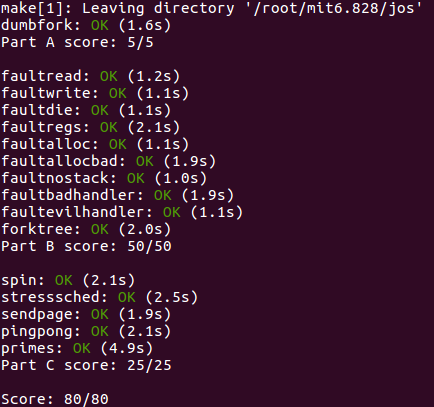

## Part C: Preemptive Multitasking and Inter-Process communication (IPC)

partC主要是实现抢占式调度以及允许environment之间传递消息。

### Clock Interrupts and Preemption

当运行`user/spin`测试程序的时候，会如下图所示：


测试程序的代码如下所示：

```c
#include <inc/lib.h>

void
umain(int argc, char **argv)
{
  envid_t env;

  cprintf("I am the parent.  Forking the child...\n");
  if ((env = fork()) == 0) {
    cprintf("I am the child.  Spinning...\n");
    while (1)
      /* do nothing */;
  }

  cprintf("I am the parent.  Running the child...\n");
  sys_yield();
  sys_yield();
  sys_yield();
  sys_yield();
  sys_yield();
  sys_yield();
  sys_yield();
  sys_yield();

  cprintf("I am the parent.  Killing the child...\n");
  sys_env_destroy(env);
}
```

测试程序将会fork出一个child environment，而这个child environment在它获得CPU的控制权之后，将会永远空转下去，kernel和parnet environment都不会再获得CPU的控制权。假如这样的话，user mode environment通过无限的循环，可以很容易的将整个系统停止并且不再将CPU还给kernel或者其他environment。所以为了解决这种情况，我们需要让kernel可以抢占一个正在运行的environment，强制性重新拿回CPU的控制权。为了实现这个，我们需要让JOS kernel支持来自时钟的硬件中断。

#### Interrupt discipline

外部的中断被称为IRQs，这里有16个可能的IRQs，编号为0-15。从IRQ number到IDT entry的映射是不固定的。`picirq.c`中的`pic_init`将IRQs 0-15映射到IDT entries的IRQ_OFFSET到IRQ_OFFSET+15，同时`inc/trap.h`中，IRQ_OFFSET被定义为32，所以IDT entries的32-47是跟IRQs 0-15相对应的。举个例子clock interrupt是IRQ 0，那么对应的IDT表的位置就是IRQ_OFFSET+0，所以IDT[IRQ_OFFSET+0]就包含了clock interrupt handler的地址。由于我们IRQ_OFFSET被选择为32，所以设备的中断不会和处理器的异常/中断等冲突。

> 在早期PC机运行MS-DOS的时候，IRQ_OFFSET是0，这个将会在处理硬件设备中断和处理处理器异常之间造成很大混淆。（设备中断、硬件中断、外部中断这三者概念上差不多，就目前来看的话）

在JOS中，我们相对xv6 Unix做了一个关键的简化。在kernel中外部设备中断是不允许的（这个跟xv6还是一样，都只有在user space的时候才是允许的）。外部中断是由eflags寄存器中FL_IF标志位控制的（`inc/mmu.h`），当这个位被设置的时候，外部中断是允许的。这个FL_IF通过几种方式修改来修改，但是由于我们的简化，所以我们仅仅在进入或者退出user mode的时候通过保存或者恢复eflags寄存器来修改。

在我们的environments运行的时候，我们需要确保FL_IF标志位已经被设置了，这样子当外部中断来的时候，我们将这个中断交给处理器然后通过相应的interrupt code来处理。但是bootloader的第一条指令把外部中断给屏蔽了，并且到目前为止都没有重新使能它。

```assembly
start:
 	.code16                     # Assemble for 16-bit mode
	cli                         # Disable interrupts 
```

下面我们修改`kern/trapentry.S`和`kern/trap.c`文件来初始化IDT表中合适的entryies，并且给IRQs 0-15提供handler。

跟我们当初给0-31初始化IDT表和设置handler类似，我们首先修改`kern/trapentry.S`文件的内容，在lab3后面加上以下内容即可

```assembly
TRAPHANDLER_NOEC(irq_timer_handler, IRQ_OFFSET + IRQ_TIMER)
TRAPHANDLER_NOEC(irq_kbd_handler, IRQ_OFFSET + IRQ_KBD)
TRAPHANDLER_NOEC(irq_serial_handler, IRQ_OFFSET + IRQ_SERIAL)
TRAPHANDLER_NOEC(irq_spurious_handler, IRQ_OFFSET + IRQ_SPURIOUS)
TRAPHANDLER_NOEC(irq_ide_handler, IRQ_OFFSET + IRQ_IDE)
TRAPHANDLER_NOEC(irq_error_handler, IRQ_OFFSET + IRQ_ERROR)
```

> 为啥不把0-15加个遍呢？因为`inc/trap.h`中只提到了以下这些
>
> ```c
> #define IRQ_OFFSET  32  // IRQ 0 corresponds to int IRQ_OFFSET
> 
> // Hardware IRQ numbers. We receive these as (IRQ_OFFSET+IRQ_WHATEVER)
> #define IRQ_TIMER        0
> #define IRQ_KBD          1
> #define IRQ_SERIAL       4
> #define IRQ_SPURIOUS     7
> #define IRQ_IDE         14
> #define IRQ_ERROR       19
> ```

之后修改`kern/trap.c`中的`trap_init()`函数，添加如下内容：

```c
void trap_init(){
    	......
    // LAB 4: Preemptive Multitasking
    void irq_timer_handler();
    void irq_kbd_handler();
    void irq_serial_handler();
    void irq_spurious_handler();
    void irq_ide_handler();
    void irq_error_handler();
		......
    // LAB 4: Preemptive Multitasking
    SETGATE(idt[IRQ_OFFSET + IRQ_TIMER], 0, GD_KT, irq_timer_handler, 3);
    SETGATE(idt[IRQ_OFFSET + IRQ_KBD], 0, GD_KT, irq_kbd_handler, 3);
    SETGATE(idt[IRQ_OFFSET + IRQ_SERIAL], 0, GD_KT, irq_serial_handler, 3);
    SETGATE(idt[IRQ_OFFSET + IRQ_SPURIOUS], 0, GD_KT, irq_spurious_handler, 3);
    SETGATE(idt[IRQ_OFFSET + IRQ_IDE], 0, GD_KT, irq_ide_handler, 3);
    SETGATE(idt[IRQ_OFFSET + IRQ_ERROR], 0, GD_KT, irq_error_handler, 3);
 		......
}
```

经过上面的步骤之后，当有收到外部设备中断的时候，有了相应的handler了。下面我们修改`kern/env.c`的`env_alloc()`函数来确保user environment运行的时候，外部设备中断是使能了的。

```c
// Enable interrupts while in user mode.
// LAB 4: Your code here.
e->env_tf.tf_eflags |= FL_IF;
```

同时把`sched_halt()`中的`sti`指令前面的注释去掉，这样空闲的CPU将会取消中断屏蔽。

```assembly
// Reset stack pointer, enable interrupts and then halt.
asm volatile (
    "movl $0, %%ebp\n"
    "movl %0, %%esp\n"
    "pushl $0\n"
    "pushl $0\n"
    // Uncomment the following line after completing exercise 13
    "sti\n"
    "1:\n"
    "hlt\n"
    "jmp 1b\n"
: : "a" (thiscpu->cpu_ts.ts_esp0));
```

#### Handling Clock Interrupts

`init.c`中的`i386_init()`调用了`lapic_init()`和`pic_init()`函数，这些函数已经设置了clock和中断控制器来产生中断。同时上面的实验中也使能了外部设备中断和设置了相应的IDT表，下面我们需要来处理这些中断。

修改kernel的`trap_dispatch()`函数，当一个clock interrupt发生的时候调用`sched_yield()`函数让它找到一个不同的environment来运行。

```c
// Handle clock interrupts. Don't forget to acknowledge the
// interrupt using lapic_eoi() before calling the scheduler!
// LAB 4: Your code here.
if(tf->tf_trapno == IRQ_OFFSET + IRQ_TIMER){
    lapic_eoi();
    sched_yield();
}
```

完成上面的代码之后，是可以成功运行`user/spin`的了。parent environment fork出一个child，`sys_yield()`将会把CPU的控制权交给child，但是在一定时间片之后，又会回到parent中。在最终运行完之后会kill child environment。

```
	......
SMP: CPU 0 found 1 CPU(s)
enabled interrupts: 1 2
[00000000] new env 00001000
I am the parent.  Forking the child...
[00001000] new env 00001001
I am the parent.  Running the child...
I am the child.  Spinning...
I am the parent.  Killing the child...
[00001000] destroying 00001001
[00001000] free env 00001001
[00001000] exiting gracefully
[00001000] free env 00001000
No runnable environments in the system!
Welcome to the JOS kernel monitor!
Type 'help' for a list of commands.
K> 
```


当我们运行`stresssched`的时候，也会通过，输出的效果如下所示

```
[00000000] new env 00001000
[00001000] new env 00001001
[00001000] new env 00001002
[00001000] new env 00001003
[00001000] new env 00001004
	......
[00001001] free env 00001001
[00001002] stresssched on CPU 0
[00001002] exiting gracefully
[00001002] free env 00001002
	......
[00001014] stresssched on CPU 0
[00001014] exiting gracefully
[00001014] free env 00001014
No runnable environments in the system!
```

### Inter-Process communication (IPC)

> 在JOS上应该叫做 "inter-environment communication" 或者"IEC"，但是其他人都称它为IPC，所以我们使用IPC这个术语。

我们一直关注操作系统隔离的方面，这种方式给每一个程序造成了它们都有属于自己的一台机器的假象。而另一个重要的服务是允许程序之间可以通信，这是相当强大的。Unix的pipe模型就是一个典型的例子。现在有很多进程间通信的模式，但是我们选择一个简单的IPC机制来实现，并让它工作起来。

#### IPC in JOS

我们将会实现一些JOS kernel system call，这些system calls共同合作提供了一个简单的进程之间通信的机制。我们将会实现两个system calls`sys_ipc_recv` 和`sys_ipc_try_send`，之后我们还要实现两个library的封装 `ipc_recv` 和`ipc_send`.

使用JOS的IPC机制，可以传给其他environment的“messages”由以下两部分组成：

- 一个32-bit的值
- 一个可选的页映射

允许environment在消息中传递页映射是一种很有效的方式，它可以传递比一个32bit的整型数据更合适的数据，并且这样允许了environment设置共享内存区。

#### Sending and Receiving Messages

一个environment使用`sys_ipc_recv`来获取消息。这个system call将不会调度当前的environment并且不会重新运行它，直到它收到一个message。当一个environment在等待收到消息的时候，任何一个environment可以向它发送消息。同样的，PartA实现的权限检查将不再适合IPC，因为IPC system call是需要很安全的，通过发送消息一个environment不能很容易造成另一个environment崩溃的（除非目标environment本身就buggy）。

一个environment使用`sys_ipc_try_send`来发送一个消息。 如果被指定的environment正在等待接收的（目标environment 调用了 `sys_ipc_recv`，但是还没有得到一个值），那么将会发送这个值然后返回0，否则将会返回`-E_IPC_NOT_RECV`表示指定的environment当前不希望收到一个值。

在user space的library函数`ipc_recv`将会调用`sys_ipc_recv` ，之后会在environment的`struct Env`寻找收到的值的相关信息。`ipc_send`将会反复调用`sys_ipc_try_send`直到发送成功。

#### Transferring Pages

当一个environment调用`sys_ipc_recv`之后，这个environment就开始等待收到一个页映射了。如果发送方发送了一个page，那么这page将会被映射到接受者地址空间的dstva处（dstva需要在UTOP下面）。如果在dstva已经有映射了，那么将取消前面的映射。

如果一个environment调用`sys_ipc_try_send`，那么意味发送方想把映射在`srcva`（在UTOP下面）的页发送过去，并且将页的权限设置为perm。

在一个成功的IPC之后，发送方将原始页的映射保留在地址空间的srcva处，同时接收方在接收方的地址空间的dstva也获得相同物理页的映射，那么最终这个传递的页在接收方和发送方之间变成了共享的。如果发送方和接受方都没有表明要传输一个page，那么就不传输页了。在任何IPC之后，kernel将接收方的Env结构体中的env_ipc_perm设置成接受到的页权限，如果是0那么表示没有页被接受到。

#### Implementing IPC

实现`kern/syscall.c`中`sys_ipc_recv()`和`sys_ipc_try_send`这两个system call，根据注释的提示内容来实现。同时在实现过程`envid2env()`的checkperm参数设置为0，这表示任何environment都可以给其他environment传递IPC messages，kernel仅仅检查target envid是不是有效的。

首先实现`sys_ipc_recv()`system call，根据提示首先是检查dstva，假如dstva小于UTOP的话那么就必须要对齐。之后设置env为not runnable，recving设置为true，目标地址设置为dstva，message来的envid设置为0，最后通过调度算法放弃CPU。

```c
static int
sys_ipc_recv(void *dstva)
{
  // LAB 4: Your code here.
  struct Env *env = curenv;

  if(dstva < (void *)UTOP && PGOFF(dstva)){
    return -E_INVAL;
  }

  env->env_status = ENV_NOT_RUNNABLE;
  env->env_ipc_recving = true;
  env->env_ipc_dstva = dstva;
  env->env_ipc_from = 0;
  sys_yield();

  return 0;
}
```

接下去实现`sys_ipc_try_send()`system call，这部分我们需要明白的两个重要的点是：

1. 进程间的通信，其实是修改目标env的相关信息来实现的；
2. `sys_ipc_try_send()`这个system call其实是传递value或者传递一个页，只是页是可选的，value是必须的。所以不管怎么样对于target value的赋值肯定是有的，但是page的传递是需要判断的，那么如何判断这个page是不是需要的呢，其实根据srcva这个值来判断，假如这个值大于等于UTOP，那么只剩下传递value了，而不传递页了。所以我们会发现大部分的检查都是在srcva小于UTOP的基础之上的，假如不满足小于UTOP这个条件，那么所有的if判断都不会成立，那么自然就只剩下传递value这个值了。

之后为什么`env->env_tf.tf_regs.reg_eax = 0;`因为在接受者返回之前执行的地方之后，需要返回0值才表示接受到消息了。

```c
static int
sys_ipc_try_send(envid_t envid, uint32_t value, void *srcva, unsigned perm)
{
  // LAB 4: Your code here.
  struct Env *env;
  struct PageInfo *pp;
  int re;
  pte_t *entry;

  // if environment envid doesn't currently exist(no need to check permissions)
  if((re = envid2env(envid, &env, 0)) < 0){
    return re;
  }

  if(!env->env_ipc_recving || env->env_ipc_from){
    return -E_IPC_NOT_RECV;
  }

  if(srcva < (void *)UTOP){
    if(PGOFF(srcva)){
      return -E_INVAL;
    }

    if(((perm & (PTE_U | PTE_P)) != (PTE_U|PTE_P)) || (perm & ~PTE_SYSCALL)){
      return -E_INVAL;
    }

    if(!(pp = page_lookup(curenv->env_pgdir, srcva, &entry))){
      return -E_INVAL;
    }

    if((perm & PTE_W) && !(*entry & PTE_W)){
      return -E_INVAL;
    }
    if(env->env_ipc_dstva){
      if((re = page_insert(env->env_pgdir, pp, env->env_ipc_dstva, perm)) < 0){
        return re;
      }
      env->env_ipc_perm = perm;
    }
  }

  // set the target env
  env->env_ipc_recving = 0;
  env->env_ipc_from = sys_getenvid();
  env->env_ipc_value = value;
  env->env_status = ENV_RUNNABLE;
  env->env_tf.tf_regs.reg_eax = 0;
    
  return 0;
}
```

最后我们实现`lib/ipc.c`中的`ipc_recv()`和`ipc_send()`这两个库函数。`ipc_recv()`这个函数，主要是负责调用`sys_ipc_recv`系统调用以及将接受到的值存在。其中pg可能为NULL，那么表示不传递页，但是直接把这个值当参数传进去的，因为NULL的值是0，0还是一个有效的还是会传递页，根据我们上面的分析，要想不想传递页，需要给一个大于等于UTOP的值，所以在pg为NULL的时候，我们将pg设置为UTOP。

```c
int32_t
ipc_recv(envid_t *from_env_store, void *pg, int *perm_store)
{
  // LAB 4: Your code here.
  int re;
  int env_from;
  int env_perm;
   
  if(pg == NULL){
    pg = (void *)UTOP;
  } 
  
  if(!(re = sys_ipc_recv(pg))){
    env_from = thisenv->env_ipc_from;
    env_perm = thisenv->env_ipc_perm;
    re = thisenv->env_ipc_value;
  }else{
    env_from = 0;
    env_perm = 0; 
  }
  
  if(from_env_store){
    *from_env_store = env_from;
  }
  if(perm_store){
    *perm_store = env_perm;
  }
 
  return re;
}
```

`ipec_send()`这个函数，则负责调用`sys_ipc_try_send()`发送消息直至发送成功，也就是返回值为0的时候。提示中说到当返回值为`-E_IPC_NOT_RECV`的时候不用panic，而这个返回值表示要接受message的target environment可能还没有处在接受message 状态或者其他environment正在给target发送message，那么也就意味着当前这个进程消息一直没有发送成功，所以需要一直执行发送这个操作，为了对CPU更友好一点，我们使用了`sys_yield()`，这个函数将会把调度其他的进程，之后当当前这个进程又被调度之后，那么会继续执行发送操作。一旦发送成功之后，那么则退出。

```c
void
ipc_send(envid_t to_env, uint32_t val, void *pg, int perm)
{
  // LAB 4: Your code here.
  int re;

  if(pg == NULL){
    pg = (void *)UTOP;
  }
  while(1){
    re = sys_ipc_try_send(to_env, val, pg, perm);
    if(re == -E_IPC_NOT_RECV){
      sys_yield();
    }else if(re == 0){
      break;
    }else{
      panic("ipc_send: %e", re);
    }
  }
}
```

最后的最后，我们使用`make grade`来测试一下实验的效果如何

