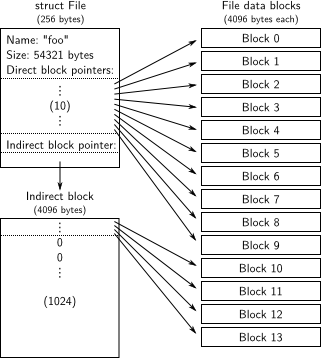

## Introduction

在这个Lab中我们将会实现`spawn`，这是一个library call可以加载和运行磁盘上的可执行文件。之后我们将会扩展kernel和library operating system在console上运行shell。这些功能都需要一个文件系统，所以这个Lab将会引入一个简单的读写文件系统。

### Getting Started

|    函数名     | 函数功能 |
| :-----------: | :------: |
|    fs/fs.c    |          |
|    fs/bc.c    |          |
|   fs/ide.c    |          |
|   fs/serv.c   |          |
|   lib/fd.c    |          |
|  lib/file.c   |          |
| lib/console.c |          |
|  lib/spawn.c  |          |


在mergel到新的Lab5的代码之后，再次运行Lab4中pingpong、primes和forktree等几个测试例子。不过在运行测试例子之前先注释掉`kern/init.c`中的`ENV_CREATE(fs_fs) `，因为`fs/fs.c`会尝试IO操作，但是这个IO操作JOS还没有实现，同时注释掉`lib/exit.c`中的`close_all()`，因为这个函数将会调用将要在这个lab中实现的程序。全都注释完之后，我们运行测试例子，如果Lab4代码没有包含任何bug的话，这几个测试例子是可以成功运行的。

```
// pingpong
SMP: CPU 0 found 1 CPU(s)
enabled interrupts: 1 2 4
send 0 from 1000 to 1001
1001 got 0 from 1000
1000 got 1 from 1001
1001 got 2 from 1000
1000 got 3 from 1001
1001 got 4 from 1000
1000 got 5 from 1001
1001 got 6 from 1000
1000 got 7 from 1001
1001 got 8 from 1000
1000 got 9 from 1001
1001 got 10 from 1000
No runnable environments in the system!
Welcome to the JOS kernel monitor!
Type 'help' for a list of commands.
K> 
```

```
......
CPU 0: 7951 CPU 0: 7963 CPU 0: 7993 CPU 0: 8009 CPU 0: 8011 CPU 0: 8017 CPU 0: 8039 CPU 0: 8053 CPU 0: 8059 CPU 0: 8069 CPU 0: 8081 CPU 0: 8087 CPU 0: 8089 CPU 0: 8093 CPU 0: 8101 CPU 0: 8111 CPU 0: 8117 CPU 0: 8123 CPU 0: 8147 [000013ff] user panic in <unknown> at lib/fork.c:133: sys_exofork: out of environments
Welcome to the JOS kernel monitor!
Type 'help' for a list of commands.
TRAP frame at 0xf0287f84 from CPU 0
  edi  0x00000000
  esi  0x0080153a
  ebp  0xeebfdf40
  oesp 0xefffffdc
  ebx  0xeebfdf54
  edx  0xeebfddf8
  ecx  0x00000001
  eax  0x00000001
  es   0x----0023
  ds   0x----0023
  trap 0x00000003 Breakpoint
  err  0x00000000
  eip  0x00800194
  cs   0x----001b
  flag 0x00000282
  esp  0xeebfdf38
  ss   0x----0023
K> 
```

> 需要注意的是，这个例子跟在Lab4运行的输出结果有点不一样，是因为在Lab5中`kern/env.c`的`env_free()`中将
>
> ```c
> // cprintf("[%08x] free env %08x\n", curenv ? curenv->env_id : 0, e->env_id);
> ```
>
> 这么一句话注销掉了，所以不会像Lab4那样输出了

```
// forktree test case
SMP: CPU 0 found 1 CPU(s)
enabled interrupts: 1 2 4
1000: I am ''
1001: I am '0'
1002: I am '1'
1003: I am '10'
2000: I am '00'
2002: I am '000'
1004: I am '11'
1006: I am '01'
1007: I am '001'
2001: I am '010'
3002: I am '110'
3000: I am '111'
1005: I am '100'
4002: I am '101'
1008: I am '011'
No runnable environments in the system!
Welcome to the JOS kernel monitor!
Type 'help' for a list of commands.
K> 
```

**测试完之后记得将上面的注释取消掉！！！**

## File system preliminaries

这个Lab中实现的文件系统相比Unix中的文件系统是简单了许多的，但是它也提供了基础的功能：创建、读取、写入、删除按层次目录结构组织的文件。

目前我们只开发只有一个用户的操作系统，这个系统对捕获bugs提供了足够多的保护，但是无法保护多个相互怀疑的用户。因此我们的文件系统不支持Unix中文件所属者或者权限等概念，同时我们的文件系统也不支持大部分Unix文件系统中的硬链接、符号链接、时间戳或者特殊设备文件等。

### On-Disk File System Structure

**大部分Unix文件系统将磁盘空间分成两个主要类型的区域：inode regions和data regions。**data region又被分成很多大的data blocks（通常是8KB或者更多），文件系统将文件数据和目录meta-data存储在这些data blocks中。Unix文件系统给文件系统中的每一个文件分配一个inode，一个文件的inode存储着文件关键的meta-data比如文件的`stat`属性和指向data blocks的指针。目录项包含了文件的名字和inode的指针，假如文件系统中很多个目录项都指向一个文件的inode，那么这个文件是hard-linked。

但是我们的文件系统不支持hard-link，所以我们不需要这种间接的等级，因此可以做一个简化：即我们的文件系统不使用inodes，相反我们会在描述文件的目录项中简单存储一个文件（或者子目录）所有的meta-data。文件和目录逻辑上都是由一系列data blocks组成，但是这些data blocks是分散在磁盘上的，就像一个environment的虚拟地址空间的页就是分散在物理内存上的。文件系统environment隐藏了block分布的细节，提供了对文件任意偏移量的位置读写一系列字节的接口。文件系统environment内部处理所有的目录的修改，作为执行文件创建或删除操作的一部分。我们的文件系统允许user environment直接读取目录的meta-data，这也就意味着user environments可以自己执行目录扫描操作（比如`ls`程序）而不是依赖于额外的对文件系统的特殊的调用。这种目录扫描的方式的缺点以及现代Unix阻止它的原因是应用程序会依赖于目录meta-data的格式，使得修改文件系统内部布局变得困难，因为还需要改变应用程序或者至少重新编译应用。

> 对于支持hard-linker的文件系统来说，对于一个文件可能会有多个指向这个文件的链接，那么存指向inode的指针的话，当文件内容变掉之后（可能inode也会变掉），这些文件链接指向的还是一样的，这种就类似于一种间接方式，存inode的地址，而inode又会指向。但是由于这个Lab中要实现的是不支持的hard-linker的，也就相当于指向文件的只有一个。那么我们直接在目录项中该文件的meta-data就好。

#### Sectors and Blocks

大部分磁盘不能按照字节来读取，而是按sector的单位来执行读写。在JOS中，每一个sector是512字节的。文件系统实际上分配和使用disk是按照block的来的。我们需要注意sector和block这两个术语之间的区别：sector的大小是磁盘硬件的性能，然而block的大小是操作系统使用disk的一方面（个人理解sector是硬件上的，block是软件上），并且文件系统的block 大小必须是磁盘上sector大小的整数倍。

Unix xv6文件系统的block大小跟sector是一样的都是512字节，但是大部分现代文件系统使用一个更大的block 大小，因为存储空间变得相当廉价了并且以更大的粒度来存储管理是更加有效的。

```c
// inc/fs.h
#define BLKSIZE   PGSIZE
// fs/fs.h
#define SECTSIZE  512     // bytes per disk sector
#define BLKSECTS  (BLKSIZE / SECTSIZE)  // sectors per block
```

#### Superblocks

文件系统通常把disk中容易找到的位置（比如在disk的最开始或者末端）的某些磁盘blocks拿来存储文件系统所有的meta-data描述符，比如block size、disk size、任何用于找到root目录的meta-data、上一次加载文件系统的时间、上一次检查文件系统是否有错误的时间等等。这些特殊的块就叫做*superblocks*.

我们的文件系统将只有一个superblock，这个superblock将总是在disk的block 1的位置，它的layout是由`inc/fs.h`中的`struct Super`定义的。block 0通常用来存储boot loader和分区表，所以文件系统通常不使用第一块。很多真正的文件系统维持着很多superblocks，这些superblocks被复制到几个间隔很宽的磁盘区域，所以即使这些区域中的一个坏了或者disk在那个区域发生了media error，那么仍然可以找到其他几个可以使用的superblocks，然后去访问文件系统。

```c
// inc/fs.h
struct Super {
  uint32_t s_magic;   // Magic number: FS_MAGIC
  uint32_t s_nblocks;   // Total number of blocks on disk
  struct File s_root;   // Root directory node
};
```

#### File Meta-data

文件系统中描述文件的meta-data的layout由`inc/fs.h`的`struct File`定义。这些meta-data包括了文件的名字、大小、类型（普遍文件还是目录）、包含文件内容的blocks的指针。正如上面我们所提到的，我们没有inode，所以这些meta-data是被存储在disk上的目录项中的。同时跟大多数真正的文件系统不同的是，为了简单起见对在disk和memory中的文件meta-data，使用同一个`struct File`来表示。

```c
// inc/fs.h
struct File {
  char f_name[MAXNAMELEN];  // filename
  off_t f_size;     // file size in bytes
  uint32_t f_type;    // file type

  // Block pointers.
  // A block is allocated iff its value is != 0.
  uint32_t f_direct[NDIRECT]; // direct blocks
  uint32_t f_indirect;    // indirect block

  // Pad out to 256 bytes; must do arithmetic in case we're compiling
  // fsformat on a 64-bit machine.
  uint8_t f_pad[256 - MAXNAMELEN - 8 - 4*NDIRECT - 4];
} __attribute__((packed));  // required only on some 64-bit machines
```

上述结构体中，最后的一个变量`f_pad`主要用来填充的，将整个结构体的大小填充到256字节。同时下面是一些与此相关的宏定义。

```c
// inc/fs.h

// Maximum size of a filename (a single path component), including null
// Must be a multiple of 4
#define MAXNAMELEN  128

// Number of block pointers in a File descriptor
#define NDIRECT   10
// Number of direct block pointers in an indirect block
#define NINDIRECT (BLKSIZE / 4)
#define MAXFILESIZE ((NDIRECT + NINDIRECT) * BLKSIZE)

// File types
#define FTYPE_REG 0 // Regular file
#define FTYPE_DIR 1 // Directory
```

`struct File`中的`f_direct`数组，用来存储文件前10（NDIRECT）个block的block number，这些blocks被叫做文件的direct block。对于大小为10*4096 = 40KB 的文件来说，这意味着该文件所有block的block number将直接适合`struct File`。但是对于任何大于40KB的文件来说，我们需要有一个空间来存储剩下的文件block number，因此我们分配了额外的一个block叫做indirect block来存储4096/4 = 1024个额外的block number，最终我们文件系统允许文件大小达到1034blocks。为了支持更大的文件，真正的文件系统通常支持double indirect blocks或者triple-indirect blocks。




#### Directories versus Regular Files

文件系统中的`File`结构体既可以表示一个普通文件也可以表示一个目录，使用`File`结构体中的`type`成员变量来区别这两种类型的文件。文件系统用完全相同的方式来管理普通文件和目录文件上，除了以下这点：假如是普遍文件类型，那么不会解释相关联的data block的内容；假如是目录文件类型，那么会将内容解析为一系列描述文件和子目录的`File`结构体。

```c
// inc/fs.h

// File types
#define FTYPE_REG 0 // Regular file
#define FTYPE_DIR 1 // Directory
```

supberblock包含了一个`File`结构体（`struct Super`中`root`成员变量），这个`File`结构体存储着文件系统中根目录的meta-data。这个目录文件的内容是一系列`Fille`结构体，这些结构体描述的是根目录中的文件和子目录。这些子目录可能又会包含更多的`File`结构体来表示sub-subdirectories，以此类推。

#### 总结

对于disk的读取，我们以sector为最小粒度，这个更多是硬件层面上的操作，同时还有block的概念，block是操作系统操作disk的最小粒度，或者可以说在操作系统层面，disk被分为一个一个block，而其中有一个特殊的block叫做superblock里面存着跟整个文件系统相关的信息。对于文件系统中的文件和目录我们采用的`struct File`结构体来管理，这个结构体中存着文件或者目录的meta-data。而整个文件系统的目录结构从superblock中存着的`struct File root`开始，由于`struct File`既可以表示普通文件也可以表示目录文件，因此`struct File root`中包含了子目录和一些文件，而这些子目录中又可以得到子子目录和一些文件，以此类推，那么这个是最终的文件系统的文件目录层次结构了。

## The File System

在这个Lab中，不需要去实现整个文件系统，但是需要去实现文件系统关键的部分。比如我们需要去实现将块读取到block cache中并且将他们flush回磁盘、分配磁盘blocks、映射文件的offset到磁盘blocks、实现IPC接口中的读写和打开。因为我们将不会实现整个文件系统，所以我们需要要对提供的代码和各种各样的文件系统的接口很熟悉。

### Disk Access

文件系统environment需要去访问disk，但是我们在kernel中还未实现任何访问disk的函数。我们没有采用传统的“monolithic”操作系统的策略，这种策略向kernel中添加一个IDE disk driver和必要的system calls来允许文件系统去访问它，相反我们将IDE disk driver的实现作为user-level file system environment的一部分。但是我们仍然需要修改内核，为了让fie system environment有访问disk的权限。

我们使用polling，基于programmed I/O的disk access和不使用disk 中断也可以很容易的实现在user space中访问disk。当然在user mode下实现 interrrupt-driven device drivers也是可能（就像L3、L4中kernel所做的那样），但这是更困难的，因为kernel必须field device interrupt和分派他们到正确的user-mode enviroment.

x86处理器使用EFLAGS寄存器中的IOPL位来决定被保护的代码（user-level environment）是否允许去执行特殊的设备IO指令，比如IN或者OUT指令。由于我们所需要去访问的所有IDE disk 寄存器都坐落在x86的 IO space，而不是已经被映射到内存，所以赋予文件系统environment “IO权限”是允许文件系统访问这些寄存器唯一的事情。但是实际上，EFLAGS寄存器中的IOPLbit给kernel提供了一个简单的“all-or-noting”的方式来控制user-mode code能否访问IO sapce。在我们的情况中，我们希望文件系统environment可以去访问IO space，但是我们不想让其他environment去访问IO space。针对这种情况，`i386_init()`函数通过传递`ENV_TYPE_FS`类型给environment创建函数`env_create()`来表示需要创建的environment是文件系统environment。那么我们只需要修改`env.c`中的`env_create()`函数，判断environment的类型即可，即假如是`ENV_TYPE_FS`类型那么赋予一定的IO权限，但是对于任何其他的environments不赋予权限。最终将`env_create()`函数修改为如下所示：

```c
void
env_create(uint8_t *binary, enum EnvType type)
{
  // LAB 3: Your code here.

  struct Env *e;

  if(env_alloc(&e, 0) != 0){
    panic("env_create faild!\n");
  }
  // If this is the file server (type == ENV_TYPE_FS) give it I/O privileges.
  // LAB 5: Your code here.
  if(type == ENV_TYPE_FS){
    e->env_tf.tf_eflags |=  FL_IOPL_MASK;
  }
  e->env_type = type;
  load_icode(e, binary);
}
```

> 上面总结来说就是，我们把文件系统实现成一个user environment，并且这个environment中包含了IDE disk driver的实现，那么这个environment去访问相应的disk需要有权限，这个权限是通过x86的EFLAGS寄存器的IOPL位来控制的，我们针对文件系统的environment中的EFLAGS寄存器设置IOPL权限，因为每个environment运行的时候都会加载它自己的寄存器值，针对文件系统environment来说设置了IOPL，但是其他environment没有设置，所以不用担心其他environment会访问disk。

Lab中的GNUmakefile文件使用`obj/kern/kernel.img`作为disk 0的image（通常是DOS/Windows下的Drive C），使用文件`obj/fs/fs.img`作为disk 1的image（Drive D）。在这个Lab中，我们的文件系统只能访问disk 1，disk 0是仅仅用于启动kernel的。如果你修改掉了其中任何一个image，那么需要将他们重置为原始的，通过输入以下命令即可：

```bash
$ rm obj/kern/kernel.img obj/fs/fs.img
$ make
```

或者

```bash
$ make clean
$ make
```

### The Block Cache

在我们的文件系统中，我们将会在基于处理器的虚拟内存系统的帮助下实现一个简单的"buffer cache"（就像是一个block cache），关于block cache的操作代码是在`fs/bc.c`中。

我们的文件系统将会被限制在访问3GB或者小于3GB的disks，同时我们在文件系统environment的address space中留下了一个固定的3GB的区域，从0x10000000 (`DISKMAP`)到0xD0000000 (`DISKMAP+DISKMAX`)，作为disk的内存映射。举个例子，disk block 0是被映射到虚拟地址0x10000000，disk block 1被映射到虚拟地址的0x10001000处。`fs/bc.c`中的`diskaddr`函数实现了从disk block number到虚拟地址的转化，同时有一些检查。

由于文件系统environment有它自己的虚拟地址空间，这个虚拟地址空间是独立于其他environment的虚拟地址空间的，所以文件系统environment唯一需要去做的就是实现文件访问，用这种方式来保留大部分文件系统environment的地址空间是合理的。当然仅有3GB的映射空间，对于32bit机器上真正的文件系统来说，这种方式是很尴尬的，因为当代的disks都是大于3GB的。但是这种buffer cache的管理方式在一个有着64bit的地址空间的机器上也是合理的。

从disk把内容都读取到内存将会花费很大的时间，所以我们实现了一种demand paging的方式，这种方式只有在该区域发生page fault，那么才会在disk映射区域分配pages，然后从disk中读取对应的block。这种方式可以假装整个disk都在内存中。很显然这种方式是现在大部分系统所采用的。

下面我们实现`fs/bc.c`中的`bc_pgfault()`函数和`flush_block()`函数。

- `bc_pgfault`是page fault handler，就像我们上一个Lab中copy-on-write fork的实现，不同的是`bc_pgfault`是从disk中加载pages内容。需要注意的是:

  - addr可能并没有跟一个block边界对齐
  - ide_read操作的是sectors而不是block

  ```c
  bc_pgfault(struct UTrapframe *utf)
  {
    void *addr = (void *) utf->utf_fault_va;
    uint32_t blockno = ((uint32_t)addr - DISKMAP) / BLKSIZE;
    int r;
  
    // Check that the fault was within the block cache region
    if (addr < (void*)DISKMAP || addr >= (void*)(DISKMAP + DISKSIZE))
      panic("page fault in FS: eip %08x, va %08x, err %04x",
            utf->utf_eip, addr, utf->utf_err);
  
    // Sanity check the block number.
    if (super && blockno >= super->s_nblocks)
      panic("reading non-existent block %08x\n", blockno);
      
    // LAB 5: you code here:
    addr = ROUNDDOWN(addr, BLKSIZE);
    if((r = sys_page_alloc(0, addr, PTE_U|PTE_P|PTE_W)) < 0){
      panic("page alloc error!i\n");
    }
    if((r = ide_read(blockno * BLKSECTS, addr, BLKSECTS)) < 0){
      panic("ide read error!\n");
    }
  
    // Clear the dirty bit for the disk block page since we just read the
    // block from disk
    if ((r = sys_page_map(0, addr, 0, addr, uvpt[PGNUM(addr)] & PTE_SYSCALL)) < 0)
      panic("in bc_pgfault, sys_page_map: %e", r);
  
    // Check that the block we read was allocated. (exercise for
    // the reader: why do we do this *after* reading the block
    // in?)
    if (bitmap && block_is_free(blockno))
      panic("reading free block %08x\n", blockno);
  }
  ```

- `flush_block`函数是如果一个block有需要的话，将它写到disk上去。假如一个block没有在block cache中也就是说没有被映射或者block在block cache中没有被修改，那么`flush_block`不需要做任何事。我们使用VM硬件来跟踪一个disk block自上次从disk读取或者写到disk后是否被修改了。我们可以通过uvpt entry中的PTE_D位（“dirty” bit，PTE_D位是由处理器设置的，为了响应对该page的写入，可以查看386 参考手册[chapter 5.2.4.3](http://pdos.csail.mit.edu/6.828/2011/readings/i386/s05_02.htm)）是否被设置来判断一个block是否需要被写到disk中。在把这个block写到disk之后，`flush_block`应该使用`sys_page_map`来清除PTE_D.

  > 个人对dirty的理解是修改的意思

  ```c
  void
  flush_block(void *addr)
  {
    uint32_t blockno = ((uint32_t)addr - DISKMAP) / BLKSIZE;
    int re;
  
    if (addr < (void*)DISKMAP || addr >= (void*)(DISKMAP + DISKSIZE))
      panic("flush_block of bad va %08x", addr);
  
    // LAB 5: Your code here.
    if(!va_is_mapped(addr) || !va_is_dirty(addr)){
       return;
    }
    addr = ROUNDDOWN(addr, PGSIZE);
    if((re = ide_write(blockno * BLKSECTS, addr, BLKSECTS)) < 0){
      panic("flush_block: ide write error\n");
    }
    if((re = sys_page_map(0, addr, 0, addr, PTE_SYSCALL)) < 0){
      panic("flush_block: sys_page_map error\n");
    }
  }
  ```

`fs/fs.c`中的`fs_init`函数是如何使用block cache的一个典型的例子，在初始化block cache之后，它将指向disk 映射区域的指针存储到全局变量`super`中。之后，我们可以从`super`结构体中读取就像它们都在内存中一样，我们的page fault handler将会在必要的时候从disk读取。

```c
void
fs_init(void)
{
  static_assert(sizeof(struct File) == 256);

  // Find a JOS disk.  Use the second IDE disk (number 1) if available
  if (ide_probe_disk1())
    ide_set_disk(1);
  else
    ide_set_disk(0);
  bc_init();

  // Set "super" to point to the super block.
  super = diskaddr(1);
  check_super();

  // Set "bitmap" to the beginning of the first bitmap block.
  bitmap = diskaddr(2);
  check_bitmap();
}
```

**附：fs/bc.c源文件讲解**

| 函数名       | 函数功能                                                     |
| ------------ | ------------------------------------------------------------ |
| diskaddr     | 根据disk block number转换为block cache中的虚拟地址           |
| va_is_mapped | 检测该虚拟地址是否被映射了                                   |
| va_is_dirty  | 检测该虚拟地址的块是否被修改过了                             |
| flush_block  | 将block cache中的block刷新到diks中                           |
| check_bc     | 通过对superblock的smash和read 来检测block cache是否可以正常使用 |
| bc_init      | 主要是初始化block cache包括设置bc_pgfault、check_bc等        |

**附：block cache的硬件实现**

页目录表中的PTE_D位是没有作定义的，但是页表项中的PTE_D位是有定义的。当向一个地址写入时，处理器会把相应的二级页表的PTE_D位设置为1。

### The Block Bitmap

从上面我们可以看到，`fs_init`也设置了`bitmap`的指针，我们把`bitmap`当做压缩的位数组，每一个位对应着disk上的每一块。

```c
uint32_t *bitmap;   // bitmap blocks mapped in memory
```

举个例子，`block_is_free`函数将会简单检查给定的block是不是在bitmap中被标志为free。

```c
// Check to see if the block bitmap indicates that block 'blockno' is free.
// Return 1 if the block is free, 0 if not.
bool
block_is_free(uint32_t blockno)
{
  if (super == 0 || blockno >= super->s_nblocks)
    return 0;
  if (bitmap[blockno / 32] & (1 << (blockno % 32)))
    return 1;
  return 0;
}
```

> 检查block是不是被标记为free，主要是通过`bitmap[blockno / 32] & (1 << (blockno % 32))`这一语句来判断，举个例子，比如我们的block number是16，对应位的位置应该是第16位，将1左移16位并且与bitmap数组索引为0的内容相与，那么得就可以判断是否第16位是不是被标记为1，如果标记为1，那么整个的结果是一个大于0的值，如果没有被标记为1，那么返回的值是0。那么为什么取余和除数使用的都是32位的呢？因为bitmap是指向uint32_t的指针，对于一个block number为bn的来说，bitmap[blockno / 32]可以确定bn所在区域位置，比如bn为45，那么是在索引为1的区域位置，bn%32来确定在一个区域内的偏移量。

使用`free_block`作为一个模板来实现`fs/fs.c`中的`alloc_block`函数，这个函数应该在bitmap中找到一个free的disk block，标记它为被使用的，然后返回分配的block number。一旦分配了一个block之后，需要立马将已经改变的bitmap flush到disk中来保证文件系统的一致性。

```c
int
alloc_block(void)
{
  int bi = 0;
  // LAB 5: Your code here.
  for(bi = 0; bi < super->s_nblocks; bi++){
    if(block_is_free(bi)){
      bitmap[bi / 32] &= ~(1 << (bi % 32));
      flush_block(bitmap);
      return bi;
    }
  }
  // panic("alloc_block not implemented");
  return -E_NO_DISK;
}
```

**附：fs/fs.c中关于block bitmap的相关操作**

| 函数名        | 函数功能                                                     |
| ------------- | ------------------------------------------------------------ |
| block_is_free | 通过bitmap来检查某block是否是free的，1是free                 |
| free_block    | 将一个block标记为free，将bitmap中相应位置的位标记为1         |
| alloc_block   | 分配一个block，分配一个block，将bitmap中相应位置的位标记为0，并返回该block的编号， |
| check_bitmap  | 检查bitmap是否正确22                                         |

### File Operations

在`fs/fs.c`中已经提供了很多解析和管理`File`结构体的基础函数，包括扫描和管理目录文件的entries的函数、从根目录开始遍历(walk)整个文件系统来解释一个绝对路径。

实现`file_block_walk`函数和`file_get_block`函数

- `file_block_walk`将一个文件中的block offset映射到指向`struct File`中block的地址或者指向indirect block中的地址。这跟`pgdir_walk`在page tables上做的操作是一样的。

  这一步操作简单来说就是根据给的block offset找到`struct File`中相对应的块的地址！

  ```c
  static int
  file_block_walk(struct File *f, uint32_t filebno, uint32_t **ppdiskbno, bool alloc)
  {
    // LAB 5: Your code here.
    int re ;
    if(filebno >= NDIRECT + NINDIRECT){
      return -E_INVAL;
    }
    // direct block
    if(filebno < NDIRECT){
      if(ppdiskbno){ 
        *ppdiskbno = &(f->f_direct[filebno]);
      }
      return 0;
    }
    filebno -= NDIRECT;
    
    // indirect block
    if(f->f_indirect == 0 && alloc){
      if((re = alloc_block()) < 0){
        return re;  // -E_NO_DISK
      }
      memset(diskaddr(re), 0, BLKSIZE);
      f->f_indirect = re;
      flush_block(diskaddr(f->f_indirect));
    }else if(f->f_indirect == 0 && !alloc){
      return -E_NOT_FOUND;
    }
  
    if(ppdiskbno){ 
      *ppdiskbno = (uint32_t *)diskaddr(f->f_indirect) + filebno;
    }
    return 0;
  }
  ```

- `file_get_block`相对上面更进一步，会映射整个disk block，如果有必要的话会分配一个block。

  这一步操作是建立在上述函数之上，会根据block offset返回相应相应的block number。

  ```c
  int
  file_get_block(struct File *f, uint32_t filebno, char **blk)
  {
    // LAB 5: Your code here.
    uint32_t *ppdiskbno;
    int re;
  
    if(filebno >= (f->f_size + BLKSIZE -1)/BLKSIZE){
      return -E_INVAL;
    }
    if((re = file_block_walk(f, filebno, &ppdiskbno,true)) < 0){
      return re;
    }
    if(!(*ppdiskbno)){
      if((re = alloc_block()) < 0){
        return re;
      }
      *ppdiskbno = re;
      memset(diskaddr(*ppdiskbno), 0, BLKSIZE);
      flush_block(diskaddr(*ppdiskbno));
    }
  
    *blk = (char *)diskaddr(*ppdiskbno);
    return 0;
  }
  ```

`file_block_walk`和`file_get_block`是文件系统中工作任务比较重的函数。`file_read`和`file_write`都是基于`file_get_block`在分散的block和连续的buffer之间互相拷贝。‘

**fs/fs.c中关于文件系统结构操作的函数**

| 函数名          | 函数功能                                                     |
| --------------- | ------------------------------------------------------------ |
| fs_init         | 用来初始化整个文件系统，包括设置disk，设置全局变量super、bitmap |
| file_block_walk | 对一个File结构体，根据给出的参数fileno（逻辑block number）找到该结构体中与之对应的block的地址，有点类似于pgdir_walk |
| file_get_block  | 是file_block_walk的进一步操作，根据给出的参数fileno（逻辑block number）找到该结构体中与之对应的物理块号 |
| dir_lookup      | 查找一个目录中是否存在指定名字的文件，**这边目录文件使用的结构体还是File，只是对这个File的block number区会进行解析** |
| dir_alloc_file  | 主要是在目录中找到一个空闲的区域来存放File结构体，假如在现有的已经分配的块中没找到空闲的区域，那么分配一个新的块，来存放这个结构体 |
| walk_path       | 对一个绝对路径进行解析，假如这个返回文件的File结构体和文件所在目录的File结构体 |

**fs/fs.c中关于文件操作的函数**

| 函数名               | 函数功能                                                     |
| -------------------- | ------------------------------------------------------------ |
| file_create          | 针对传入的path参数进行解析，创建相应的文件（可以是普通文件也可以是子目录） |
| file_open            | 这个就是根据传入的绝对路径找到返回相应的文件结构体           |
| file_read            | 从指定的offset处开始读取count字节到buf数组中                 |
| file_write           | 将buf数组中的内容写到offset开始的地方                        |
| file_free_block      | 将File结构体中的指定filebno的块free掉                        |
| file_truncate_blocks | 针对缩小文件来说的 ，假如文件缩小了，把多余的块都去掉        |
| file_set_size        | 设置新的文件大小，假如新的文件大小比原来的小需要移掉多余的块 |
| file_flush           | 将整个文件的内容都flush到disk中，包括文件名这些              |
| fs_sync              | 同步当前的文件系统，把当前block cache中的内容都flush到disk中 |

### The file system interface

到这一步，在file system environment本身中有了必要的函数（这些函数fs environment本身可以访问），但是这些函数需要让其他想要使用file system的environment访问。由于其他environment不能直接调用file system environment中的函数，所以我们通过构建在JOS IPC机制基础上的*remote procedure call*（**RPC**）来访问file system environment中的函数。下面是对file system server调用（read操作）的一个示意图

```
      Regular env           FS env
   +---------------+   +---------------+
   |      read     |   |   file_read   |
   |   (lib/fd.c)  |   |   (fs/fs.c)   |
...|.......|.......|...|.......^.......|...............
   |       v       |   |       |       | RPC mechanism
   |  devfile_read |   |  serve_read   |
   |  (lib/file.c) |   |  (fs/serv.c)  |
   |       |       |   |       ^       |
   |       v       |   |       |       |
   |     fsipc     |   |     serve     |
   |  (lib/file.c) |   |  (fs/serv.c)  |
   |       |       |   |       ^       |
   |       v       |   |       |       |
   |   ipc_send    |   |   ipc_recv    |
   |       |       |   |       ^       |
   +-------|-------+   +-------|-------+
           |                   |
           +-------------------+
```

上图中，虚线下面的是从普通的environment中获取read请求到文件系统中处理的简化版机制。

- 首先，`read`可以使用任何文件描述符（file descriptor），并且会分派到合适的设备读取函数；
- 当分派到`devfile_read`情况时（有好多种device type，比如pipes），`devfile_read`实现对磁盘上文件的特殊的`read`。这个函数以及在`lib/file.c`中的其他`devfile_*`函数，都实现了文件系统操作的客户端，并且工作方式大致相同，都是将参数绑定在一个请求结构体中，然后调用`fsipc`来发送IPC请求，同时会解包和返回结果；
- `fsipc`函数简单处理发送给server请求的共同细节以及获取回复；
- FS server相关的代码在`fs/serv.c`中，`serve`函数中，通过循环来不断获取来自IPC的请求，之后将请求分派到合适的处理函数，然后通过IPC把结果返回。在read的例子中，server将请求分派到`serve_read`函数
- `serve_read`函数将会对读请求的结构体进行解包，最后调用`file_read()`函数来完全执行文件的读取工作；

回顾JOS的IPC通信机制，一个environment会发送一个32-bit数字以及一个可选的共享页。对于发送一个从client到server的请求来说，我们使用32bit的数字作为请求类型（FS server RPCs是被编号了的，就像syscalls被编号了一样），并且将请求参数存储到IPC共享page上的`union Fsipc`中。在客户端，总是共享在`fsipcbuf`处的页；在服务端，我们将进来的请求页映射到`fsreg(0x0ffff000)`上。

服务端通过IPC将回复（response）返回，我们使用32bit数字作为函数的返回码。对于大部分RPCs来说都会返回，并且针对不同类型的RPCs会有不同的返回

- `FSREQ_READ` 和`FSREQ_STAT` 类型的还会返回数据，这些数据是被简单的写到客户端请求时传来的页上。由于客户端和FS server共享这个页，所以FS server没有必要发送这个页作为回复。
- `FSREQ_OPEN`类型的话，将会和客户端共享一个新的“Fd page”，这样我们将会很快回到文件描述page。

实现`fs/serv.c`中的`serve_read`函数，该函数大部分工作由已经实现的`file_read`函数来。`serve_read`需要为文件读取提供RPC接口，可以阅读`serve_set_size`函数中的代码和注释，来获得如何实现`serve_read`的大致想法。

```c
int
serve_read(envid_t envid, union Fsipc *ipc)
{
  struct Fsreq_read *req = &ipc->read;
  struct Fsret_read *ret = &ipc->readRet;
  int re, req_n;
  struct OpenFile *o;

  if (debug)
    cprintf("serve_read %08x %08x %08x\n", envid, req->req_fileid, req->req_n);

  // Lab 5: Your code here:
  if((re = openfile_lookup(envid, req->req_fileid, &o)) < 0){
    return re;
  }

  req_n = req->req_n;
  // if read bytes size > ret->ret_buf's size
  if(req_n > sizeof(ret->ret_buf)){
    req_n = sizeof(ret->ret_buf);
  }

  if((re = file_read(o->o_file, ret->ret_buf, req_n, o->o_fd->fd_offset)) < 0){
    return re;
  }
  o->o_fd->fd_offset += re;
  return re;
}
```

> 上述实现比较麻烦的是`file_read`函数的参数问题，`struct Fsipc`是RPC请求过程中的使用结构体，里面包含了客户端environment的请求等，也包含了服务端返回的信息等，这个是客户端environment和文件系统environment共享的，他们通过这个结构体来相处传递消息实现通信。整个结构体的如下所示：
>
> ```c
> union Fsipc {
>   	......
>   struct Fsreq_read {
>     int req_fileid;
>     size_t req_n;
>   } read;
>   struct Fsret_read {
>     char ret_buf[PGSIZE];
>   } readRet;
> 	......
> };
> ```
>
> 所以我们先打开req请求中要求我们打开的文件，将需要打开文件的相关信息放在`struct OpenFile`中，
>
> ```c
> struct OpenFile {
>   uint32_t o_fileid;  // file id
>   struct File *o_file;  // mapped descriptor for open file
>   int o_mode;   // open mode
>   struct Fd *o_fd;  // Fd page
> };
> ```
>
> 那么对于`file_read()`函数所需要的参数来说，对于第一个参数`struct File *f`，`struct OpenFile`中已经包含了相应的成员变量，同时OpenFile结构体中的fd成员变量还包含了相关的文件偏离量，最终我们把读取到的内容存放到同一个`Fsipc`结构体的ret->ret_buf中，那么客户端environment也就能访问到读取的内容。

实现`fs/serv.c`中`serve_write`函数和`lib/file.c`中的`devfile_write`函数。首先来看一下`serve_write`函数

```c
int
serve_write(envid_t envid, struct Fsreq_write *req)
{
  int re, req_n;
  struct OpenFile *o;
  
  if (debug)
    cprintf("serve_write %08x %08x %08x\n", envid, req->req_fileid, req->req_n);

  // LAB 5: Your code here.
  if((re = openfile_lookup(envid, req->req_fileid, &o)) < 0){
    return re;
  }

  req_n = req->req_n;
  if(req_n > sizeof(req->req_buf)){
    req_n = sizeof(req->req_buf);
  }
  
  if((re = file_write(o->o_file, req->req_buf, req_n, o->o_fd->fd_offset)) < 0){
    return re;
  } 
  o->o_fd->fd_offset += re; 
    
  return re;
}
```

之后来看一下`devfile_write`函数的实现，`devfile_write`函数可以参考`devfile_read`函数。

```c
static ssize_t
devfile_write(struct Fd *fd, const void *buf, size_t n)
{ 
  // Make an FSREQ_WRITE request to the file system server.  Be
  // careful: fsipcbuf.write.req_buf is only so large, but
  // remember that write is always allowed to write *fewer*
  // bytes than requested.
  // LAB 5: Your code here
  int r;
  
  if(n > sizeof(fsipcbuf.write.req_buf)){
    n = sizeof(fsipcbuf.write.req_buf);
  } 
 
  fsipcbuf.write.req_fileid = fd->fd_file.id;
  fsipcbuf.write.req_n = n;
  memmove(fsipcbuf.write.req_buf, buf, n);
  
  if((r = fsipc(FSREQ_WRITE, NULL)) < 0){
    return r;
  }
  assert(r <= n);
  assert(r <= PGSIZE);
    
  return r;
}
```

> `devfile_write`函数将要写入的文件id和文件内容存到fsipcbuf中，之后就是调用fsipc函数，传入相应的请求类型。

## Spawning Processes

spawn将会创建一个新的environment，然后从文件系统中加载一个程序的镜像到这个environment中，然后启动child environment来运行这个程序。之后parent environment继续独立于child 运行。spawn函数执行起来类似于UNIX fork之后在child process 中立即执行`exec`函数这一系列操作。

我们没有像UNIX风格的`exec`那样来实现spawn，因为spawn更容易在从user space以"exokernel fashion"来实现，而不用kernel的特殊帮助。

spawn的实现依赖于新的system call `sys_env_set_trapframe`来初始化新创建environment的状态。在`kern/syscall.c`中实现`sys_env_set_trapframe`，不要忘记在`syscall()`中分派这个新的system call。

```c
static int
sys_env_set_trapframe(envid_t envid, struct Trapframe *tf)
{
  // LAB 5: Your code here.
  // Remember to check whether the user has supplied us with a good
  // address!
  int re;
  struct Env *e;

  if((re = envid2env(envid, &e, 1)) < 0){
    return re;
  }
  // check whethe the tf is a good address
  user_mem_assert(e, tf, sizeof(struct Trapframe), PTE_U);
  tf->tf_cs |= 0x03;
  tf->tf_eflags |= FL_IF;
  tf->tf_eflags &= ~FL_IOPL_MASK;
  e->env_tf = *tf;
    
  return 0;
}
```

同时记得修改`syscall()`函数，增加对新system call调用的情况

```c
int32_t
syscall(uint32_t syscallno, uint32_t a1, uint32_t a2, uint32_t a3, uint32_t a4, uint32_t a5)
{
 	......
    
 case SYS_env_set_trapframe:
    return (int32_t)sys_env_set_trapframe(a1, (struct Trapframe *)a2);
	
	......
}
```

**下面我们来具体看一下spawn的实现**，首先是打开程序文件

```c
 // Open the program file
if ((r = open(prog, O_RDONLY)) < 0)
    return r;
fd = r;
```

接下来是读取ELF格式的可执行程序文件文件头的相关信息

```c
// Read elf header
elf = (struct Elf*) elf_buf;
if (readn(fd, elf_buf, sizeof(elf_buf)) != sizeof(elf_buf)
    || elf->e_magic != ELF_MAGIC) {
    close(fd);
    cprintf("elf magic %08x want %08x\n", elf->e_magic, ELF_MAGIC);
    return -E_NOT_EXEC;
}
```

之后是通过`sys_exofork()`来创建新的child environment

```c
// Create new child environment
if ((r = sys_exofork()) < 0)
    return r;
child = r;
```

创建完新的child environment之后，开始对cihld environment的stack进行初始化，这个具体初始化是在`init_stack`函数中，该函数首先在parent environment中UTEMP建立stack之后将这块区域的内容拷贝到child environment的USTACKTOP处

```c
// Set up trap frame, including initial stack.
child_tf = envs[ENVX(child)].env_tf;
child_tf.tf_eip = elf->e_entry;

if ((r = init_stack(child, argv, &child_tf.tf_esp)) < 0)
    return r;
```

初始化完栈之后，就是将程序的所有段（被标记了ELF_PROG_FLAG_WRITE的）都映射到child environment的地址空间中。

```c
// Set up program segments as defined in ELF header.
ph = (struct Proghdr*) (elf_buf + elf->e_phoff);
for (i = 0; i < elf->e_phnum; i++, ph++) {
    if (ph->p_type != ELF_PROG_LOAD)
        continue;
    perm = PTE_P | PTE_U;
    if (ph->p_flags & ELF_PROG_FLAG_WRITE)
        perm |= PTE_W;
    if ((r = map_segment(child, ph->p_va, ph->p_memsz,
                         fd, ph->p_filesz, ph->p_offset, perm)) < 0)
        goto error;
}
close(fd);
fd = -1;
```

之后将parent environment的share pages复制到child environment中（这个函数具体我们会在下面实现）

```c
// Copy shared library state.
if ((r = copy_shared_pages(child)) < 0)
    panic("copy_shared_pages: %e", r);
```

再之后设置child 的Trapframe，因为之前都是对局部变量的child_tf进行赋值，这一步操作把这个child_tf设置为child environment的Trapframe

```c
child_tf.tf_eflags |= FL_IOPL_3;   // devious: see user/faultio.c
if ((r = sys_env_set_trapframe(child, &child_tf)) < 0)
    panic("sys_env_set_trapframe: %e", r);
```

最后将child environment设置为runnable

```c
if ((r = sys_env_set_status(child, ENV_RUNNABLE)) < 0)
    panic("sys_env_set_status: %e", r);
```

为什么这边不用处理`sys_exofork()`返回值等于0的情况，因为child environment的stack和eip都已经被重新设置而不是复制，所以当child environement开始运行的时候将会从eip（即child environment中程序开始的地方）开始。

### Sharing library state across fork and spawn

Unix的文件描述符是一个通用的概念，除包含文件外它还包含了pipes、console IO等等。在JOS中，每一个device类型都有一个相关联的`struct Dev`，这种结构体中有指向读写等操作函数的指针。

```c
struct Dev {
  int dev_id;
  const char *dev_name;
  ssize_t (*dev_read)(struct Fd *fd, void *buf, size_t len);
  ssize_t (*dev_write)(struct Fd *fd, const void *buf, size_t len);
  int (*dev_close)(struct Fd *fd);
  int (*dev_stat)(struct Fd *fd, struct Stat *stat);
  int (*dev_trunc)(struct Fd *fd, off_t length);
};
```

`lib/fd.c`在上述的基础之上实现了通用的Unix-like的文件描述符接口。每一个`struct Fd`表明它的device type，`lib/fd.c`中的大部分函数会调用`struct Dev`中合适的函数。`lib/fd.c`同时也在每一个应用程序environment的地址空间中维护着文件描述符表（file descriptor table），文件描述符表从虚拟地址FDTABLE（0xD0000000）处开始。这个区域为每一个文件描述符（一共有MAXFD文件描述符，当前MAXFD是32）保留着一个页的大小，这些文件描述可以被应用程序同时打开。在任何时候，一个特殊的文件描述符表页只有在相关联的文件描述符被使用时才会被映射。每一个文件描述符在FILEDATA开始的区域也还有可选的"data page"，如果选了的话，那么device将会使用它选择的。

我们希望在`fork`和`spawn`之间共享file descriptor state，但是FD state 是被保存在用户地址空间。在`fork`中，内存将会被标记为copy-on-write，所以state将会被复制而不是共享，假如child environment复制了一个页，某一时刻child environment修改了文件数据，但是parent environment中是没有修改的。在`spawn`中，地址空间的内容将不会被复制也没有共享，那么spawn出来的environment将没有打开的文件描述符。我们将改变`fork`来知道“library opearting system”正在使用内存的哪些区域，这些区域应该是共享的。我们将会在page table entries中设置一个没有使用过的位来表示这些区域而不是通过硬编码（hard-code）出一系列的区域来当做这些区域（就像在`fork`中使用`PTE_COW`一样）。

我们在`inc/lib.h`中定义了一个新的`PTE_SHARE`，这是在Intel 和 AMD手册中用于标记“available for software use”三位中的一位。下面我们这样子规定，假如一个page table entry的这一位被设置了，那么在`fork`和`spawn`中，这个PTE将会从parent直接复制到child。需要注意的是这跟标记它为copy-on-write是不同的，因为我们想要确保这个页共享更新的。

修改`lib/fork.c`中的`duppage`函数，让他可以遵循上述的新约定。如果page table entry的PTE_SHARE已经被设置了，那么直接复制映射就好（我们需要使用PTE_SYSCALL，而不是0xfff，来屏蔽page table entry中相关的位），最终将`duppage`修改为如下所示，相比之前的话，是在最开始的地方加了对PTE_SHARE的判断。

```c
static int
duppage(envid_t envid, unsigned pn)
{
  int r;

  // LAB 4: Your code here.
  void *addr;
  int perm;

  addr = (void *)((uint32_t)pn * PGSIZE);
  perm = PTE_P|PTE_U;

  if(uvpt[pn] & PTE_SHARE){ 
    if((r = sys_page_map(0, addr, envid, addr, PTE_SYSCALL)) < 0){
      return r;
    }
    return 0;
  }

  if((uvpt[pn] & PTE_W) || (uvpt[pn] & PTE_COW)){
    perm |= PTE_COW;
  }
     
  // map into the child address space
  if((r = sys_page_map(0, addr, envid, addr, perm)) < 0){
    panic("sys_page_map: %e \n", r);
  }

  // if is cow remap own address space
  if(perm & PTE_COW){
    if((r = sys_page_map(0, addr, 0, addr, perm)) < 0){
      panic("sys_page_map : %e \n", r);
    }
  }

  return 0;
}
```

类似的，实现`lib/spawn.c`中的`copy_shared_pages`，这个函数会遍历所有当前进程page table entries，将有设置了PT_SHARE bit的page mappings复制到child process中。

```c
static int
copy_shared_pages(envid_t child) 
{ 
  // LAB 5: Your code here.
  uint8_t *addr;
  
  for(addr = (uint8_t *)UTEXT; addr < (uint8_t *)(UXSTACKTOP - PGSIZE); addr += PGSIZE){
    if((uvpd[PDX(addr)] & PTE_P) && (uvpt[PGNUM(addr)] & PTE_P) && (uvpt[PGNUM(addr)] & PTE_SHARE)){
     sys_page_map(0, addr, child, addr, PTE_SHARE|PTE_U|PTE_P|PTE_W);
    }
  }
  return 0;
} 
```


> 上面提到fork是无法共享file descriptor state的，这是因为子进程复制了页之后，假如子进程修改了文件数据，此时会新分配一个页来保存修改数据，而父进程里面对应页面是没有变化的，这样无法在父子进程共享文件的变化。
>

## The keyboard interface

为了让shell可以工作，我们需要实现在shell中输入。QEMU将我们输入的显示到CGA display和serial port，但是到目前为止我们只有在kernel monitor中接受输入。在QEMU中，在图形窗口键入的输入将显示为从keyboard到JOS的输入，而在console键入的输入将会显示为serial port上的字符。`kern/console.c`已经包含了keyboard和serial 驱动，这些自从lab1开始就被kernel monitor所使用，但是现在在剩下的系统中我们需要关注这些了。

> 这边的图形窗口显示指的是qemu生成的图形窗口，make qemu-nox将不会有这个图形窗口。
>
> 对于keyboard到JOS的输入个人的理解是，这些显示出来的内容是准备输入到JOS的，这是QEMU给实现的；而我们在console中键入的输入，它在console中显示出来的是serial port上的内容。

在你的`kern/trap.c`中对trap `IRQ_OFFSET+IRQ_KBD` 的情况调用`kbd_intr`，对trap `IRQ_OFFSET+IRQ_SERIAL`的情况调用`serial_intr`

```c
static void
trap_dispatch(struct Trapframe *tf)
{
  	......
  // Handle keyboard and serial interrupts.
  // LAB 5: Your code here.
  if(tf->tf_trapno == IRQ_OFFSET + IRQ_KBD){
    kbd_intr();
    return;
  }

  if(tf->tf_trapno == IRQ_OFFSET + IRQ_SERIAL){
    serial_intr();
    return;
  }
    ......
}
```

> 在`trap_dispatch`中添加相应情况的处理即，当然前提是需要对IDT表进行初始化，由于在Lab4的时候已经设置keyboard和serial两种中断的handle，也在IDT进行了设置，所以这边只需要添加对相应情况的处理即可。

在`lib/console.c`中实现了console input/output file type。`kbd_intr`和`serial_intr`将会使用最近读取的输入来填充buffer，而console file type将会清空这些buffer，这个console file type是stdin/stdout默认使用的，除非用户重定向了这些。

> 个人的理解的大致过程是：当我们在敲键盘的时候，会发生一个键盘中断，`kbd_intr`将会被调用，将键盘中输入的内容存到buffer中去，而console file type将会把buffer的内容清空作为正式的输入。

检查实现是否成功：运行`make run-testkbd`，然后输入一些内容，那么将会回显你输入的。用console和图形窗口同时来尝试。

## The Shell

运行`make run-icode-nox`，这个程序将会运行kernel并开始`user/icode`程序，icode将会执行`init`将console设置为file descriptor 0和1（标准输入和标准输出）。之后 spawn sh程序（the shell）。下面你将可以运行下面这些命令：

```bash
echo hello world | cat
cat lorem |cat
cat lorem |num
cat lorem |num |num |num |num |num
lsfd
```

需要注意的是用户库例程`cprintf`是直接print到console的，没有使用文件描述符的代码。这点在debug中是很好的，但是在使用管道进入其他程序中不怎么好。假如想要打印一个特殊的文件描述符（比如标准输出）可以使用`fprintf(1, "...", ....)`或者`printf("...", ...)`，其中`printf`是输出到FD 1的缩写版，默认输出到FD 1。可以看`user/lsfd.c`。

现在的shell暂时不能支持IO重定向，请在`user/sh.c`中增加`<`的重定向。

```c
	......
case '<': // Input redirection
      // Grab the filename from the argument list
      if (gettoken(0, &t) != 'w') {
        cprintf("syntax error: < not followed by word\n");
        exit();
      }

      // LAB 5: Your code here.
      if((fd = open(t, O_RDONLY)) < 0){
        cprintf("open %s for read: %e", t, fd);
        exit();
      }
      if(fd != 0){
        dup(fd, 0);
        close(fd);
      }
      // panic("< redirection not implemented");
      break;
	
	......
```

> 上述的实现可以参考重定向`>`的实现。

实现完成之后，在shell中输入`sh <script`来进行测试

```
$ sh <script
main-loop: WARNING: I/O thread spun for 1000 iterations
This is from the script.
    1 Lorem ipsum dolor sit amet, consectetur
    2 adipisicing elit, sed do eiusmod tempor
    3 incididunt ut labore et dolore magna
    4 aliqua. Ut enim ad minim veniam, quis
    5 nostrud exercitation ullamco laboris
    6 nisi ut aliquip ex ea commodo consequat.
    7 Duis aute irure dolor in reprehenderit
    8 in voluptate velit esse cillum dolore eu
    9 fugiat nulla pariatur. Excepteur sint
   10 occaecat cupidatat non proident, sunt in
   11 culpa qui officia deserunt mollit anim
   12 id est laborum.
These are my file descriptors.
fd 0: name script isdir 0 size 132 dev file
fd 1: name <cons> isdir 0 size 0 dev cons
This is the end of the script.
```

同样也可以运行`make run-testshell-nox`来测试你的shell，`testshell`将上述的命令（可以在`fs/testshell.sh`中找到）输入到shell中，之后检查输出是否匹配`fs/testshell.key`.

```
	.....
SMP: CPU 0 found 1 CPU(s)
enabled interrupts: 1 2 4
FS is running
FS can do I/O
Device 1 presence: 1
block cache is good
superblock is good
bitmap is good
alloc_block is good
file_open is good
file_get_block is good
file_flush is good
file_truncate is good
file rewrite is good
running sh -x < testshell.sh | cat
shell ran correctly
Welcome to the JOS kernel monitor!
	......
```

## Lab中的Question

1.有没有其他方式来确保在environment切换之间，IO 权限的设置是可以被保存和恢复的？

在environments切换的时候，会eflags的寄存器的值是会被保存下来的，而当恢复的时候会使用`env_pop_tf`将寄存器的值恢复，其中eflags的值也会被恢复，那么IO权限也跟着相应被保存和恢复。

## 总结

### 整个文件系统的理解

文件系统是对磁盘的管理，并抽象出文件和目录的概念以及提供文件和目录的操作。这个是相比于内核的，内核更多的是对CPU、内存等相关的硬件的管理。下面是个人对文件系统的理解（针对这个Lab来说的）：


- 首先是对磁盘的管理，在这个实验中我们使用了block来作为文件系统管理操作磁盘的最小粒度，我们可以理解成文件系统将磁盘切割成一个个block（类似于虚拟地址空间的感觉）。在这些block当中有一些比较特殊的block，比如superblocks、bitmap等，前者主要是存储这个文件系统相关的信息比如文件系统中总的block数量和根目录等相关信息，后者则是对整个文件系统block使用的记录。同时在这个Lab中还实现了block cache，作为disk的缓存；
- 之后将一些blocks组织起来，同时赋予一些相关的记录信息，也就是我们的 File Meta-data，之后为了隐藏这些File Meta-data，我们提出了File的概念（这个File包含了普通文件和目录文件）；
- 在抽象出的File概念的基础之上，我们实现了一些文件操作的接口，比如`file_read`、`file_write`等函数；

### RPC整个通信的过程---以read file为例

从`lib/fd.c`的`read()`函数开始，用户传入需要read的文件的fdnum，由于我们read的是file类型的（根据我们创建文件时指定的dev_id），表面上我们调用的是统一的dev_read函数，但是实际上调用的是`devfile`中的`devfile_read()`函数。

```c
ssize_t
read(int fdnum, void *buf, size_t n)
{
	......
  if ((r = fd_lookup(fdnum, &fd)) < 0
      || (r = dev_lookup(fd->fd_dev_id, &dev)) < 0)
    return r;
  	......
  return (*dev->dev_read)(fd, buf, n);
}
```

从`devfile_read()`函数开始，就是整个RPC的开始了，在`devfile_read()`函数中首先会将请求的文件id和待读取的字节数存储到`fsipcbuf`中，之后调用`fsipc()`函数并将请求的类型`FSREQ_READ`作为参数传进去，当`fsipc()`函数返回之后，将读取的到内容移到指定的`buf`中去。

```c
static ssize_t
devfile_read(struct Fd *fd, void *buf, size_t n)
{
	......
  fsipcbuf.read.req_fileid = fd->fd_file.id;
  fsipcbuf.read.req_n = n;
  if ((r = fsipc(FSREQ_READ, NULL)) < 0)
    return r;
	......
  memmove(buf, fsipcbuf.readRet.ret_buf, r);
  return r;
}
```

在`fsipc()`函数中首先找到文件系统environment，找到后会调用`lib/ipc.c`中的`ipc_send()`函数发送IPC请求，请求的类型作为IPC message中的32-bit的值，fsipcbuf做为要传递的页，发送之后调用`ipc_recv()`函数接受文件系统服务返回的结果。

```c
static int
fsipc(unsigned type, void *dstva)
{
  	......
  if (fsenv == 0)
    fsenv = ipc_find_env(ENV_TYPE_FS);
  	......
  ipc_send(fsenv, type, &fsipcbuf, PTE_P | PTE_W | PTE_U);
  return ipc_recv(NULL, dstva, NULL);
}
```

---

下面我们从文件系统服务这边来继续阐述，`fs/serv.c`中的`serve`函数会一直调用`lib/ipc.c`的`ipc_recv()`函数在那接受IPC请求，`ipc_send`发送的`fsipcbuf`就会被映射到`fsreq`处，之后根据请求的类型来调用的函数，并将请求的envid和请求页的首地址当做参数传进去，针对read来说会调用`serve_read`函数。

```c
void
serve(void)
{
  uint32_t req, whom;
  int perm, r;
  void *pg;

  while (1) {
    perm = 0;
    req = ipc_recv((int32_t *) &whom, fsreq, &perm);
    	......
    pg = NULL;
    if (req == FSREQ_OPEN) {
      r = serve_open(whom, (struct Fsreq_open*)fsreq, &pg, &perm);
    } else if (req < ARRAY_SIZE(handlers) && handlers[req]) {
      r = handlers[req](whom, fsreq);
    } else {
      cprintf("Invalid request code %d from %08x\n", req, whom);
      r = -E_INVAL;
    }
    ipc_send(whom, r, pg, perm);
    sys_page_unmap(0, fsreq);
  }
}
```

> 这边会根据req的值来判断调用何种函数，假如是`FSREQ_READ`类型的话，则会调用`serve_read`函数。
>
> ```c
> typedef int (*fshandler)(envid_t envid, union Fsipc *req);
> 
> fshandler handlers[] = {
>   // Open is handled specially because it passes pages
>   /* [FSREQ_OPEN] = (fshandler)serve_open, */
>   [FSREQ_READ] =    serve_read,
>   [FSREQ_STAT] =    serve_stat,
>   [FSREQ_FLUSH] =   (fshandler)serve_flush,
>   [FSREQ_WRITE] =   (fshandler)serve_write,
>   [FSREQ_SET_SIZE] =  (fshandler)serve_set_size,
>   [FSREQ_SYNC] =    serve_sync
> };
> ```

对于`serve_read()`函数先调用`openfile_lookup`函数获取相应的文件信息，之后调用`file_read()`函数，这个函数是文件系统中对文件操作的函数

```c
int
serve_read(envid_t envid, union Fsipc *ipc)
{
    ......
  // Lab 5: Your code here:
  if((re = openfile_lookup(envid, req->req_fileid, &o)) < 0){
    return re;
  }

  req_n = req->req_n;
  // if read bytes size > ret->ret_buf's size
  if(req_n > sizeof(ret->ret_buf)){
    req_n = sizeof(ret->ret_buf);
  }

  if((re = file_read(o->o_file, ret->ret_buf, req_n, o->o_fd->fd_offset)) < 0){
    return re;
  }
  o->o_fd->fd_offset += re;
  return re;
}
```

当`file_read()`函数执行完之后，会返回读取到的字节数，将读取到的内容放在共享页中。之后返回到`serve()`函数中执行`ipc_send()`函数，将读取到的字节数（作为32bit传递的值）和共享页再次发送出去。此时客户端一直等待的`ipc_recv()`函数将会收到结果，`ipc_recv`返回的是32bit的值，而这个值正式读取到的字节数，最后依次将这个值返回到`read()`函数，同时读取到的内容memmove到read函数的buf参数中。

至此其他environment也可以通过RPC来调用文件系统environment相应的函数来操作文件系完成，整个过程如下所示：


### 用户文件操作的理解


在其他environments中，对file、pipe、console IO等实现了统一的抽象，都将其抽象为`struct Fd`文件描述符，然而我们并没有将文件描述符`struct Fd`提供给用户，而是将与每一个文件描述符唯一对应的fdnum提供给用户操作。

```c
struct FdFile {
  int id;
};
struct Fd {
  int fd_dev_id;
  off_t fd_offset;
  int fd_omode;
  union {
    // File server files
    struct FdFile fd_file;
  };
};
```

同时我们对file、pipe、console IO的操作也实现了统一封装，都将其封装`struct Dev`

```c
// Per-device-class file descriptor operations
struct Dev {
  int dev_id;
  const char *dev_name;
  ssize_t (*dev_read)(struct Fd *fd, void *buf, size_t len);
  ssize_t (*dev_write)(struct Fd *fd, const void *buf, size_t len);
  int (*dev_close)(struct Fd *fd);
  int (*dev_stat)(struct Fd *fd, struct Stat *stat);
  int (*dev_trunc)(struct Fd *fd, off_t length);
};
```

在针对不同类型的dev时我们会调用不同的`struct Dev`的实例，比如针对file类型的调用的则是devfile。

```c
extern struct Dev devfile;
extern struct Dev devcons;
extern struct Dev devpipe;
```

之后devfile会通过RPC机制来访问文件系统environment的相关接口函数，从而实现访问相关的文件。从上面可以看到，对于用户进程来说，只需要对fdnum进行操作，即可实现对文件系统中相应的文件操作。具体的实现细节可以参考源代码。

## Appendix

### 幂等函数

在编程中一个**幂等**操作的特点是其任意多次执行所产生的影响均与一次执行的影响相同。 **幂等**函数，或**幂等**方法，是指可以使用相同参数重复执行，并能获得相同结果的函数。

### 文件系统实例

- MS-DOS系统

  MS-DOS系统又叫做FAT-16，通过内存中的文件分配表来跟踪文件块。FAT文件系统有FAT-12、FAT-16和FAT-32有三个版本，取决于磁盘地址包含有多少二进制位，FAT-32只用到了地址空间的低28位，但是为了规整使用2的幂，所以采用32位。

- UNIX V7系统

  从根目录开始形成树状，加上链接，形成一个有向无环图。一个目录项中包含了两个域，文件名14字节和i节点的编号（2个字节）。

- CD-ROM文件系统

  CD-ROM是为一次性写介质设计的，所以非常简单。例如，该文件系统不需要记录空闲块，这是因为一旦光盘生产出来后，CD-ROM上的文件就不能被删除或者创建了。

- NTFS

  NT文件系统，windows使用的。

- ext2

  Linux的主要文件系统，之后发展出了ext3，这是支持日志功能的。

### windows和Linux文件系统发展

- windows95、windows98用的都是MS-DOS文件系统，即FAT-16，windows98对FAT-16进行了扩展从而成为了FAT-32。较新版本的的操作系统拥有更先进的本地文件系统（NTFS）,该文件系统具有一些新的特性，比如基于Unicode编码的文件名，同时NTFS文件系统有日志功能；
- Linux系统中，最初的文件系统是MINIX 1 文件系统，之后对MINIX 1文件系统进行第一次改进后的文件系统是ext文件系统，但是ext文件系统仍有改进的地方，所以ext2文件系统被开发出来了，那么ext2文件系统成为了Linux主要的文件系统。ReiserFS是第一个有日志功能的文件系统，但是与标准化的ext2文件系统不相匹配。ext3具有日志文件系统功能同时可以和ext2共存。

### 文件系统的差异

各个文件系统的差异主要有

1. 如何记录哪个块分给了哪个文件，可能的方案有连续文件、链表、文件分配表和inode等；
2. 不同的目录结构，文件的属性可以存在目录中也可以存在inode中；
3. 磁盘空间的空闲block的管理，比如通过bitmap来管理空闲表，通过链表来管理等；
4. 或者文件系统中有无日志功能等；