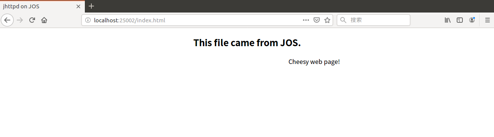

## Introduction

在实现完Lab5之后，我们有了一个文件系统，然而没有network stack的OS是没有灵魂的OS。所以在这个Lab中，我们准备写一个network interface card的驱动。这网卡是基于Intel 82540EM芯片，也被称为E1000。network card driver 可以让我们的OS连上因特网。在Lab6的，已经提供了一个network stack和network server。相关新的代码在`net/`目录和`kern/`中。下面来说说相关的实现事项：

- 实现网卡驱动之外，并且创建一个system call使得可以访问这个驱动；
- 实现缺掉的network server code ，使得在network stack和驱动之间可以传输数据包；
- 完成web server，将所有的事情捆绑在一起。使用新的web server将可以从文件系统中提供文件；

大部分内核设备驱动的代码需要我们自己从头开始写，同时这个Lab比之前的Lab提供了更少的指导：没有一个文件框架、没有已经固定的system call 接口并且很多设计的决策都是由自己决定的。所以，建议你开始做练习之前先阅读所有的作业。

### 相关资源

1. [QEMU's documentation ](https://qemu.weilnetz.de/doc/qemu-doc.html#Using-the-user-mode-network-stack)
2. [lwIP - A Lightweight TCP/IP stack - Summary](https://savannah.nongnu.org/projects/lwip/)

## QEMU's virtual network

我们将使用qemu 的用户模式network stack因为它不需要任何管理的权限即可运行。Makefile文件已经被修改，可以使用qemu的用户模式network stack和虚拟的E1000网卡。

默认的，qemu提供了一个虚拟的路由器，该路由器运行在IP 10.0.2.2上，同时给JOS分配了一个IP地址10.0.2.15。为了让事情简单，我们在`net/ns.h`中将这些默认的参数硬编码进network server。

```c
#define IP "10.0.2.15"
#define MASK "255.255.255.0"
#define DEFAULT "10.0.2.2"
```

在QEMU内部虚拟网络之外，JOS的10.0.2.15的地址将毫无意义，然而qemu的虚拟网络允许JOS连上因特网，这也就是说QEMU充当了NAT的角色，所以我们不能直接连接到运行在JOS内部的serves，即便从运行qemu的宿主机上都不能直接连接到。为了解决这个，我们配置QEMU，在宿主机的某些端口上运行一个server，这个server简单连接到JOS上的一些端口，并在宿主机和虚拟网络之间传输数据。

你将会运行JOS的servers在ports 7（echo）和80（http）。要了解qemu将这些端口转发到你宿主机的哪些端口，可以使用`make which-ports`.

```bash
$ make which-ports
Local port 25001 forwards to JOS port 7 (echo server)
Local port 25002 forwards to JOS port 80 (web server)
```

makefile同时提供了` make nc-7`和`make nc-80`，这两个命令可以让你在你的终端中直接跟运行在这些端口上的服务通信（但是这些只会连接到运行的qemu实例，所以必须单独启动qemu，也就是得让qemu运行着）。

> 在这块你可能不好理解，假如你接触过VMware 虚拟机的话，你会发现Vmware有两种方式连上网络一种是桥接，一种是NAT。NAT的意思就是说，内部网络（如局域网）一些主机已经分配到IP地址了，但是这些是仅仅可以在内部网络使用的（如192.168.200.2），无法跟外网通信，这是来一台NAT路由器，NAT路由器有两个IP地址，一个是内部网路的地址（如192.168.200.254），一个是外网的地址（218.197.10.2)。那么内部网络想与外网通信时都会使用这个外网的IP地址来跟外界通信，而外网发给这个网络的地址都是发送到218.197.10.2。NAT的全称是网络地址转换，也就相当把内网的地址转换成了一个外网的地址，这样子可以使用少量公有IP地址代表较多的私有IP地址了。
>
> 

### Packet Inspection（查看数据包）

同时makefile 也配置了qemu的network stack将所有的进来或者出去的packets记录到qemu.pcap中。要获得捕获的packets的hex/ASCII的形式可以使用tcpdump比如：

```bash
tcpdump -XXnr qemu.pcap
```

当然，你还可以使用wireshark以图形的方式来审查这些pcap文件。Wireshark还知道如何解码和检查数百个网络协议。

### Debugging the E1000（E1000的调试）

我们使用的E1000是仿真硬件，也就是说E1000是以软件运行的，那么仿真的E1000可以用一种用户可读的格式来报告它内部的状态和任何遭遇的问题。E1000将会产生大量的debug输出，所以我们必须使能一些特定的log通道。一些比较有用的通道如下：

| Flag      | Meaning                                            |
| --------- | -------------------------------------------------- |
| tx        | Log packet transmit operations                     |
| txerr     | Log transmit ring errors                           |
| rx        | Log changes to RCTL                                |
| rxfilter  | Log filtering of incoming packets                  |
| rxerr     | Log receive ring errors                            |
| unknown   | Log reads and writes of unknown registers          |
| eeprom    | Log reads from the EEPROM                          |
| interrupt | Log interrupts and changes to interrupt registers. |

为了使能`tx`和`txerr`，使用如下命令。需要注意的是`E1000_DEBUG` 标志只有在QEMU 6.828版本中有效。

```bash
make E1000_DEBUG=tx,txerr ....
```

可以使用软件仿真硬件来进一步调试，如果你被卡住了，并且无法理解为什么E1000没有回复你想要的，你可以看一下`hw/net/e1000.c`中qemu E1000的实现。

## The Network Server

从头开始（from scratch）写一个network stack是一项很艰难的工作。所以我们将会使用IwIP，一个轻量级开源的TCP/IP协议套件，IwIP里面就包含了一个network stack。在这个作业中，对于我们来说，IwIP就是一个黑盒，它实现了一个BSD 的socket接口并且有一个packet输入端口和packet output端口。

network server是四个environments的组合：

- core network server environment（包括了socket call分派和IwIP）
- input environment
- output environment
- timer environment

下面的这张图展示了这四个不同的environments和它们的关系，同时展示了包含设备驱动程序在内的完整的系统。在这个Lab中将要实现的图中绿色突出的部分。


### The Core Network Server Environment

core network server environment由socket call dispatcher和IwIP组成。socket call dispatcher工作原理同file server一样。user environment使用stubs（在`lib/nsipc.c`）发送IPC messages给core network environment。如果查看`lib/nsipc.c`你将会发现，我们找到core network server的方法跟找到file server的方法是一样：`i386_init`使用`ENV_TYPE_NS`创建了NS environment，那么使用`ENV_TYPE_NS`类型可以找到NS environment。从而实现与NS environment的IPC通信。

```c
// core network server
static int
nsipc(unsigned type)
{
  static envid_t nsenv;
  if (nsenv == 0)
    nsenv = ipc_find_env(ENV_TYPE_NS);

  static_assert(sizeof(nsipcbuf) == PGSIZE);

  if (debug)
    cprintf("[%08x] nsipc %d\n", thisenv->env_id, type);

  ipc_send(nsenv, type, &nsipcbuf, PTE_P|PTE_W|PTE_U);
  return ipc_recv(NULL, NULL, NULL);
}

// file server
static int
fsipc(unsigned type, void *dstva)
{
  static envid_t fsenv;
  if (fsenv == 0)
    fsenv = ipc_find_env(ENV_TYPE_FS);
    
  static_assert(sizeof(fsipcbuf) == PGSIZE);

  if (debug)
    cprintf("[%08x] fsipc %d %08x\n", thisenv->env_id, type, *(uint32_t *)&fsipcbuf);
    
  ipc_send(fsenv, type, &fsipcbuf, PTE_P | PTE_W | PTE_U);
  return ipc_recv(NULL, dstva, NULL);
} 
```

对于每一个user environment IPC，在networks server中的dispatcher调用合适的BSD socket interface 函数来代表相应的用户。

常规的user environment不会直接调用`lib/nsipc.c`中 `nsipc_*`等函数（如`nsipc_close`、`nsipc_send`等），相反他们会调用的是`lib/sockets.c`中的函数，这个文件中的函数提供了基于**文件描述符的sockets API**。因此user environment通过文件描述符来指向sockets，就像使用文件描述符指向在disk上的file一样。

```c
struct Dev devsock =
{
  .dev_id = 's',
  .dev_name = "sock",
  .dev_read = devsock_read,
  .dev_write =  devsock_write,
  .dev_close =  devsock_close,
  .dev_stat = devsock_stat,
};
```

有一些操作是socket特有的（比如`connect`、`accept`等），但是`read`、`write`和`close`等操作使用`lib/fd.c`中正常文件描述符设备分派代码。跟file server内部为所有打开的文件维持不同的ID一样，IwIP为所有打开的sockets分配不同的ID。在file server和network server中，我们使用存储在`struct Fd`中的信息把per-environment的文件描述符映射到不同的ID空间。

尽管file server的IPC dispatchers和network server的IPC dispatcher可能表现的差不多，但是他们也有一个根本的区别。BSD socket calls比如`accept`和`recv`可以无限期阻塞。如果dispatcher让IwIP执行这些阻塞calls中的一个，那么dispatcher也会阻塞，这样子在一个时间只能有一个network call。dispatcher为每一个进来的IPC message创建一个线程，然后在新创建的线程中处理请求。如果线程阻塞了，那么只有这个线程sleep而其他线程继续运行。

除了core network environment之外，还有3个帮助的environments。除了从user application接受message之外，core network environment dispatch也可以从input enviorment和timer environment中接收messages。

### The Output Environment

在服务user environment的socket calls的时候，IwIP将会产生让网卡transmit的packets。LwIP使用`NSREQ_OUTPUT` IPC messag把每个需要transmit的packet发送给output helper environment，这个IPC message的页面参数中附带了这个packet。output environment负责接收这些messages，通过system call接口把packet转发到设备驱动上。

### The Input Environment

从网卡处接收到packet需要注入lwIP。对于设备驱动接收到的每一个packet，input environment使用kernel system calls把每一个packet移除kernel space，之后使用`NSREQ_INPUT`IPC message把这个packet发送给core server environment。

因为JOS同步接收IPC message和轮询或等待来自设备驱动的packet是很困难的，所以packet输入功能从core network environment分离出来了。在JOS中没有一个`select`system call，这个system call允许environments去监控多个输入源来识别准备处理哪一个输入。

我们需要同时实现`net/input.c`和`net/output.c`，这个主要是因为这两个文件的实现依赖于我们的system call接口。在实现设备驱动和system call接口之后，我们需要实现这两个helper environment。

### The Timer Environment

Timer environment定时发送类型为`NSREQ_TIMER` 的messages给core network server，来告诉core network server定时器已经过期了。LwLP使用timer messages来实现不同的网络超时。

### 小总结

上面大致讲述了一下整个网络功能实现的大致流程，我们拿web服务作为例子的时候，当我们向这个web服务进请求的时候，那么请求的数据包最终是先由网卡接收--->接收之后使用system call 接口传送到了input helper environment--->通过IPC通信传送到core network server--->core network server的dispatcher通过IPC再把收到的packet传给web服务--->web服务对数据处理之后可能会需要返回一些数据--->这些数据通过IPC再次发送给core network environment--->core network environment的lwIP对数据进行封装--->之后再通过IPC发送给output helper environment--->output helper environment通过system call接口发送给网卡。

## Set time notion

现在的JOS kernel还没有时间概念，所以我们需要添加一个。现在有一个硬件每10ms会产生一个clock interrupt，在每一个clock interrupt的时候，我们将会增加一个变量来表明时间前进了10ms。上述所描述的在`kern/time.c`中实现了，但是还没有完全整合到kernel中。

```c
// kern/time.c
// This should be called once per timer interrupt.  A timer interrupt
// fires every 10 ms.
void
time_tick(void)
{
  ticks++;
  if (ticks * 10 < ticks)
    panic("time_tick: time overflowed");
}
```

在`kern/trap.c`中为每一次的clock interrupt调用`time_tick`函数。

```c
static void
trap_dispatch(struct Trapframe *tf)
{
	......
  if(tf->tf_trapno == IRQ_OFFSET + IRQ_TIMER){
    if(cpunum() == 0){
      time_tick();
    }
    lapic_eoi();
    sched_yield();
  }
	......
}
```

> 因为在多处理器环境下，每一个CPU都会触发clock interrupt。假如不加判断的话，那么同一个变量可能会被加很多次。所以我们选择判断`cpunum`是不是0，假如是的话那么则执行，为啥采用cpunum为0呢？因为单处理器情况下和多处理器情况下 cpu0肯定有。

实现`sys_time_msec`并且将它添加到`kern/syscall.c`的syscall中，这样user sapce才可以访问这个时间。

```c
// Return the current time.
static int
sys_time_msec(void)
{ 
  // LAB 6: Your code here.
  return time_msec();
  // panic("sys_time_msec not implemented");
}

int32_t
syscall(uint32_t syscallno, uint32_t a1, uint32_t a2, uint32_t a3, uint32_t a4, uint32_t a5)
{
		......
	switch (syscallno) {
 		......
	case SYS_time_msec:
     	return (int32_t)sys_time_msec();
     	......
    }
}
```

运行`make INIT_CFLAGS=-DTEST_NO_NS run-testtime`来测试上述代码，你将会看见在一秒内从5开始倒数。其中`-DTEST_NO_NS`禁止开始运行network server environment，因为它现在会panic。

```bash
	......
bitmap is good
starting count down: 5 4 3 2 1 0 
Welcome to the JOS kernel monitor!
	......
```

## The Network Interface Card

编写一个驱动需要深入了解硬件和提供给软件的接口。Lab文本将提供如何与E1000交互的高级概述，但是在写驱动的时候需要充分利用好Intel的手册。浏览关于E1000的Intel的软件开发者手册，这个手册包含了几个紧密相关的Ethernet控制器，qemu仿真了82540EM。

- 浏览chapter 2来获得对这个设备的整体印象；
- 对chapte3和14以及4.1章要熟悉一点，才能写驱动；
- 使用chapter 13作为参考
- 其他的chapters主要是讲E1000的组件，但是你的设备不会跟这些组件交互

不用太担心这些细节，对这个文档是如何组织的有一个感觉就好，这样下面我们才可以找到相关的内容。在阅读的这个手册的时候，需要记住E1000是一个复杂的设备，它有很多先进的特性。但是运作一个E1000设备仅仅需要部分特性以及只需要network interface card提供的部分接口。仔细思考如何用最简单的方法与这个网卡交互，同时强烈推荐在使用先进的特性之前先使用一个最基础的驱动程序。

对于上述chapter 2的内容，较为详细的话可以看[附录](#附录)

### PCI Interface

E1000是一个PCI设备，那么也就意味着它可以插入主板的PCI总线上。PCI总线有地址、数据和中断行，并且允许CPU和PCI设备交流以及PCI设备读写内存。在使用PCI设备之前，需要先发现和初始化PCI设备。发现是在PCI总线上寻找相关devices的过程。**初始化是分配IO和内存空间以及协商设备使用的IRQ line的过程。**

我们在`kern/pci.c`中提供了PCI code。为了在boot阶段执行PCI的初始化，PCI code沿着PCI 总线来寻找设备。当找到一个设备之后，读取该设备的vendor ID和device ID，然后使用这两个ID作为key来搜索`pci_attach_vendor`数组。这个数组是由一系列的 `struct pci_driver` 组成的

```c
// pci_attach_vendor matches the vendor ID and device ID of a PCI device. key1
// and key2 should be the vendor ID and device ID respectively
struct pci_driver pci_attach_vendor[] = {
  { 0, 0, 0 },
};

// PCI driver table
struct pci_driver {
  uint32_t key1, key2;
  int (*attachfn) (struct pci_func *pcif);
};
```

如果发现该设备的vendor ID和 device ID跟数组中的一个条目匹配，PCI code调用该条目中的`attachfn`函数来执行设备初始化（Hint：结合上面的结构体）。设备也可以由类别来是识别，这个就是`kern/pci.c`中另一个驱动表的作用。

attach function被传入一个PCI function来初始化（Hint：结合上面的结构体）。一个PCI card可以使用很多函数，但是E1000只有一个。下面是我们如何在JOS中表示一个PCI函数的

```c
struct pci_func {
    struct pci_bus *bus;  // Primary bus for bridges

    uint32_t dev;
    uint32_t func;

    uint32_t dev_id;
    uint32_t dev_class;

    uint32_t reg_base[6];
    uint32_t reg_size[6];
    uint8_t irq_line;
};
```

上面结构体对应了开发手册section 4.1中的Table4-1中的某些条目。`struct pci_func` 结构体中最后的三个条目是需要我们去关注的，因为这些记录了协商好了的关于设备的内存、I/O和中断源。 

-  `reg_base` 和 `reg_size`数组包含了最多六个BAR（Base Address Register）的信息。BARs的具体含义可以看table4-2的后半段。`reg_base`记录了MMIO区域的基础内存地址（或者是IO port资源的基础IO port）。  `reg_size`包含了`reg_base`中内存区域的大小或者IO ports的数量。
- `irq_line`包含了分配给device 用来中断的IRQ line。

当一个设备的attach function被调用的时候，设备已经被找到但是没有使能。这也就意味着PCI code还没有决定分配给设备的资源，比如地址空间和IRQ line。因此`reg_base`、`reg_size`和`irq_line`还没有被填充。attch function需要调用`pci_func_enable`来使能设备，分配这些资源，然后把这些资源填充到`struct pci_func`中。

但是我们目前的代码中还没法调用attach function，因为数组中暂时没有对应设备的相关信息。首先在`kern/pci.c`中`pci_attach_vendor`数组中添加一个新的条目，这样当匹配到一个PCI device的时候会触发添加的函数。确保在`{0,0,0}`条目之前将这个新条目添加进去，因为`{0,0,0}`这个条目代表着这个数组的结束。我们可以在开发手册的5.2节找到82540EM的 vendor ID和device ID。在启动的时候，你也会看到JOS扫描PCI bus，并把相关的ID打印出来。下面在`kern/e100.h`中添加如下内容（因为练习提到的是fill实现的内容填写到`kern/e1000.h`和`kern/e1000.c`）

```c
#include <kern/pci.h>

/* functions */
int pci_e1000_attach(struct pci_func *pcif);

/* PCI Vendor ID */
#define E1000_VENDOR_ID_82540EM 0x8086
  
/* PCI Device IDs */
#define E1000_DEV_ID_82540EM 0x100E
```

之后在`kern/e1000.c`中添加如下内容

```c
// LAB 6: Your driver code here
int pci_e1000_attach(struct pci_func *pcif){
  pci_func_enable(pcif);
  return 1;
}                         
```

最后修改`kern/pci.c`中的内容

```c
struct pci_driver pci_attach_vendor[] = {
  {E1000_VENDOR_ID_82540EM, E1000_DEV_ID_82540EM, pci_e1000_attach},
  { 0, 0, 0 },
};
```

> 查看section5.2可得到vendor ID(**厂商标识**( **Vendor Id**) 是一个用于唯一标识PCI设备生产厂商的数值)和device ID.
>
> 
>
> 同时我们需要创建相应的attach function，这样子当找到之后调用的就会是`pci_e1000_attach`函数了。

现在通过`pci_func_enable`来使能E1000即可，也就相当于在我们实现的attach function中调用该函数，这样就能使能E1000了。

当你启动kernel的时候，你将会看见kernel打印出了 PCI function of the E1000 card was enable。你的代码也能通过`make grade`中的`pci attach`测试。

```bash
pci attach: OK (2.2s)
```

#### PCI总结

下面我们来看一下整个PCI初始化的流程，在讲解整个流程之间先来了解一下PCI的相关知识：

PCI是外围设备互连(Peripheral Component Interconnect)的简称，是在目前计算机系统中得到广泛应用的通用总线接口标准：　　

- 在一个PCI系统中，最多可以有256根PCI总线，一般主机上只会用到其中很少的几条。

- 在一根PCI总线上可以连接多个物理设备，可以是一个网卡、显卡或者声卡等，最多不超过32个。

- 一个PCI物理设备可以有多个功能，比如同时提供视频解析和声音解析，最多可提供8个功能。

- 每个功能对应1个256字节的PCI配置空间。其中前64字节是标准化的，提供了厂商号、设备号、版本号等信息，唯一标识了一个PCI设备，同时提供了6个的IO地址区域。

  

  

`kern/pci.c`中有几个函数是对配置空间的操作：

- pci_conf_read函数是读取PCI配置空间中特定位置的配置值
- pci_conf_write函数是设置PCI配置空间中特定位置的配置值
- pci_conf1_set_addr函数是负责设置需要读写的具体设备

那么下面来讲一下整个流程，首先是`kern/init.c`中`i386_init()`函数调用`pci_init()`函数

```c
int
pci_init(void)
{
  static struct pci_bus root_bus;
  memset(&root_bus, 0, sizeof(root_bus));

  return pci_scan_bus(&root_bus);
} 
```

之后`pci_init()`函数对`root_bus`全部清0，然后调用`pci_scan_bus()`函数扫描总线上所有设备，说明在JOS中E1000网卡是连接在0号总线上的。在这函数中还会读取配置空间中的interrupt line并存到`pci_bus`中。

```c
static int
pci_scan_bus(struct pci_bus *bus)
{
  int totaldev = 0;
  struct pci_func df;
  memset(&df, 0, sizeof(df));
  df.bus = bus;

  for (df.dev = 0; df.dev < 32; df.dev++) {
    uint32_t bhlc = pci_conf_read(&df, PCI_BHLC_REG);
    if (PCI_HDRTYPE_TYPE(bhlc) > 1)     // Unsupported or no device
      continue;

    totaldev++;

    struct pci_func f = df;
    for (f.func = 0; f.func < (PCI_HDRTYPE_MULTIFN(bhlc) ? 8 : 1); f.func++) {
      struct pci_func af = f;

      af.dev_id = pci_conf_read(&f, PCI_ID_REG);
      if (PCI_VENDOR(af.dev_id) == 0xffff)
        continue;

      uint32_t intr = pci_conf_read(&af, PCI_INTERRUPT_REG);
      af.irq_line = PCI_INTERRUPT_LINE(intr);

      af.dev_class = pci_conf_read(&af, PCI_CLASS_REG);
      if (pci_show_devs)
        pci_print_func(&af);
      pci_attach(&af);
    }
  }

  return totaldev;
}
```

`pci_scan_bus`函数顺次查找总线上32个设备，如果发现设备存在，那么顺次扫描设备每个功能对应的配置地址空间，将一些关键的控制参数读取到`pci_func`进行保存。之后调用`pci_attach`函数，传入得到的`pci_func`，查看是否是需要初始化的设备，并用相应的初始化函数来初始化设备。

```c
static int
pci_attach(struct pci_func *f)
{ 
  return
    pci_attach_match(PCI_CLASS(f->dev_class),
         PCI_SUBCLASS(f->dev_class),
         &pci_attach_class[0], f) ||
    pci_attach_match(PCI_VENDOR(f->dev_id),
         PCI_PRODUCT(f->dev_id),
         &pci_attach_vendor[0], f);
}
```

`pci_attach_class`和`pci_attach_vendor`2个数组就是设备数组，上述代码先在`pci_attach_class`中进行查找，如果没找到再去`pci_attach_vendor`中查找。下面再来看一下`pci_attach_match`函数

```c
static int __attribute__((warn_unused_result))
pci_attach_match(uint32_t key1, uint32_t key2,
     struct pci_driver *list, struct pci_func *pcif)
{
  uint32_t i;

  for (i = 0; list[i].attachfn; i++) {
    if (list[i].key1 == key1 && list[i].key2 == key2) {
      int r = list[i].attachfn(pcif);
      if (r > 0)
        return r;
      if (r < 0)
        cprintf("pci_attach_match: attaching "
          "%x.%x (%p): e\n",
          key1, key2, list[i].attachfn, r);
    }
  }
  return 0;
}
```

这个函数就是遍历`pci_attach_class`或`pci_attach_vendor`数组，当找到key值匹配的设备之后，调用对应的attach function函数。那么在这个实验中对于E1000会调用上述实现的`pci_e1000_attach`函数

```c
int pci_e1000_attach(struct pci_func *pcif){
  pci_func_enable(pcif);
  return 1;
}
```

而`pci_e1000_attach`函数只是简单的调用一下`pci_func_enable`函数。该函数的主要功能是对`reg_base`、`reg_size`的值进行初始化。

```c
void
pci_func_enable(struct pci_func *f)
{
  pci_conf_write(f, PCI_COMMAND_STATUS_REG,
           PCI_COMMAND_IO_ENABLE |
           PCI_COMMAND_MEM_ENABLE |
           PCI_COMMAND_MASTER_ENABLE);
	......
  for (bar = PCI_MAPREG_START; bar < PCI_MAPREG_END; bar += bar_width){
	uint32_t oldv = pci_conf_read(f, bar);

    bar_width = 4;
    pci_conf_write(f, bar, 0xffffffff);
    uint32_t rv = pci_conf_read(f, bar);

    if (rv == 0)
      continue;

    int regnum = PCI_MAPREG_NUM(bar);
    uint32_t base, size;
    if (PCI_MAPREG_TYPE(rv) == PCI_MAPREG_TYPE_MEM) {
      if (PCI_MAPREG_MEM_TYPE(rv) == PCI_MAPREG_MEM_TYPE_64BIT)
        bar_width = 8;

      size = PCI_MAPREG_MEM_SIZE(rv);
      base = PCI_MAPREG_MEM_ADDR(oldv);
      if (pci_show_addrs)
        cprintf("  mem region %d: %d bytes at 0x%x\n", regnum, size, base);
    } else {
      size = PCI_MAPREG_IO_SIZE(rv);
      base = PCI_MAPREG_IO_ADDR(oldv);
      if (pci_show_addrs)
        cprintf("  io region %d: %d bytes at 0x%x\n", regnum, size, base);
    }     
    
    pci_conf_write(f, bar, oldv);
    f->reg_base[regnum] = base;
    f->reg_size[regnum] = size;    
    ......
  }     
  	......
}
```

### Memory-mapped I/O（MMIO）

软件层面通过MMIO跟E1000进行交互。这种方式你之前在JOS中看到过两次：CGA console和LAPIC都是通过写和读”memory“来控制和查询的设备。但是这些写和读没有到DRAM中去，他们是直接到设备中去了。

`pci_func_enable`给E1000分配一个MMIO区域，并且将该区域的base和size存在BAR 0中，也就是 `reg_base[0]` 和`reg_size[0]`。这个区域是分给这个设备的一系列的物理内存地址，但是意味着你得先做一些事情才能通过虚拟地址来访问它。由于MMIO区域被分配在比较高的物理地址空间（通常是3GB以上），你不能使用`KADDR`来访问，因为JOS的物理内存空间被限制在256MB中。所以得创建一个新的内存来映射，这里我们使用在MMIOBASE上面区域（Lab4中的`mmio_map_region`将会确保我们将不会重写已经被LAPIC使用的区域）。在JOS创建environment之前PCI设备的初始化就已经发生了，所以我们可以在`kern_pgdir`中创建映射，这种方式总是可以的。

在上述实现的attach function中通过调用`mmio_map_region`为E1000的BAR 0创建一个虚拟内存，`mmio_map_region`是在Lab4中为了支持LAPIC的映射而实现的。你将会把这个映射的位置记录在一个变量中，这样你可以稍后访问你刚刚映射的寄存器。看一下`kern/lapic.c`中的`lapic`变量，将它作为一个例子来参考。如果你想要使用一个指针指向device寄存器映射的区域，确保将这个变量声明为`volatile`，否则编译器被允许去缓存值和重新排序对内存的访问。同时为了测试你的映射，可以打印输出device status 寄存器的内容（section13.4.2是将讲这个寄存器的）。这是从寄存器空间8字节处开始的一个4字节的寄存器。你会得到`0x80080783`，这个值表明的是全双工链路速度达到了 1000 MB/s。

Hint：你需要大量的常量，比如寄存器的位置和掩码。假如从直接从开发手册中实现这些值将会很容易出错，一旦出错之后调试就更崩溃了。所以我们推荐使用qemu的 [e1000_hw.h](https://pdos.csail.mit.edu/6.828/2018/labs/lab6/e1000_hw.h)头文件作为一个指导。但是我们又不推荐你把这个里面所有的值拷贝下来，因为这个头文件定义了比我们所需要还要多的内容同时可能没有定义你想要的内容，但是还是值得参考的。

按照上述的要求，我们从`e1000_hw.h`文件中截取这个exercise所需要的内容到`kern/e1000.h`，具体可以看我的Github（上个exercise中我们就有使用一些）

```c
	......
/* Register Set */
#define E1000_STATUS   0x00008  /* Device Status - RO */
	......
```

下面我们修改`kern/e1000.c`的内容

```c
volatile void *e1000_mmio;
#define E1000REG(offset)  (void *)(e1000_mmio+offset)

// LAB 6: Your driver code here
int pci_e1000_attach(struct pci_func *pcif){
  // pci e1000 init
  pci_func_enable(pcif);
  cprintf("PCI BAR information: 0x%x, 0x%x\n", pcif->reg_base[0], pcif->reg_size[0]);

  //e1000 set mmio
  e1000_mmio = (void *)mmio_map_region(pcif->reg_base[0], pcif->reg_size[0]);
  cprintf("PCI E1000 status is 0x%x\n", *(uint32_t *)E1000REG(E1000_STATUS));

  return 1;
}
```

最终实验的测试结果如下所示：

```c
PCI E1000 status is 0x80080783
```

> C语言volatile关键词影响编译器编译的结果，编译器有一种技术叫做数据流分析，分析程序中的变量在哪里赋值、在哪里使用、在哪里失效，分析结果可以用于常量合并，常量传播等优化，进一步可以消除一些代码。但有时这些优化不是程序所需要的，这时可以用volatile关键字禁止做这些优化。当要求使用volatile声明变量值的时候，系统总是重新从它所在的内存读取数据，即使它前面的指令刚刚从该处读取过数据。

### DMA

可以想象通过读写E1000的寄存器来传递和接收packets，但是这种方式会很慢，同时要求E1000内部缓存packet数据。相反，E1000使用Direct Memory Access（DMA）从内存中直接读写packet data，这种方式不用调用CPU。驱动负责给发送和接收队列分配内存、设置DMA描述符和使用队列所处的位置来配置E1000，但是驱动在这些操作之后都将会是异步的。为了传输一个packet，驱动将这个packet拷贝到传输队列中的下一个DMA描述符中，然后通知E1000下一个packet已经到了；当到了发送这个packet的时候，E1000将这些数据从DMA描述符拷贝出来。类似的，当E1000收到一个packet，E1000将会把这个packet拷贝到接收队列的下一个DMA描述符中，这样驱动程序可以在下一次机会来的时候从这个DMA描述符读取内容。

在高层次上，接收和传输队列是很相似的，两个都是由一系列描述符组成。虽然这些描述符的确切结构都不相同，但是每一个描述符都包含了flags和包含packet数据的缓存区的物理地址（可能是网卡要发送的数据也可能是OS分配的缓存区，网卡把接受到的packet写到这个缓存区）。

队列被实现成循环数组，这也就意味着当网卡或者驱动到达数组末尾的时候，将会回到开头。两个队列都有一个头指针和一个尾指针，两个指针之间的队列内容是描述符。硬件总是从头开始消耗描述符并移动描述符指针，然而驱动程序总是会增加描述符并移动尾指针。在传输队列中的描述符表示等待要发送的描述符（因此一个稳定的状态是传输队列将会为空）。对于接收队列来说，网卡可以将接收到的packet存放到空闲的描述符中（因此一个稳定的状态是接收队列由所有可获得的接收到的描述符组成）。正确的更新尾指针寄存器而不混淆E1000是有技巧的请小心点。

#### DMA总结

E1000中采用的DMA来传输和收发数据，在发送packet的时候，驱动程序会把packet拷贝到memory，然后通知E1000，之后DMA将这个packet发送出去；在接收到packet之后，DMA会把接收到的packet拷贝到内存接收队列中，之后驱动程序从这块驱动读取相应的内容。

## Transmitting Packets

E1000的发送和接收功能基本上是相互独立的，所以我们可以一次处理一个。我们首先会实现发送packet，因为如果没有首先发送“I'm here”packet，我们是不能测试接收功能的。

首先，需要初始化网卡让它可以发送packet， 这块按照section14.5中描述的步骤来（不用再去关注subsections）。步骤中第一步是设置发送队列，队列的结构在section3.4中有相关描述，并且描述符的结构体在section3.3.3有相关描述。我们不会使用E1000的TCP offload的功能，所以可以专注于“保留发送描述符格式”。我们需要阅读这些sections并且熟悉他们。

> **C Structures**
>
> 使用C structs可以很方便的描述E1000的结构。正如`struct Trapframe`，C structs可以让你在内存中精确的排列数据。C可以在成员变量之间插入padding，但是E1000结构体的排列方式将不会存在这个问题。如果真的发生了边界对齐问题，可以看一下GCC的“packet”属性。
>
> 举个例子，手册中table 3-8 中给出的保留的发送描述符如下所示：
>
> ```
> 63            48 47   40 39   32 31   24 23   16 15             0
>   +---------------------------------------------------------------+
>   |                         Buffer address                        |
>   +---------------+-------+-------+-------+-------+---------------+
>   |    Special    |  CSS  | Status|  Cmd  |  CSO  |    Length     |
>   +---------------+-------+-------+-------+-------+---------------+
> ```
>
> 这个结构的第一个字节从右上角开始，当把这个转换为C struct那么是按照从右到左，从上到下的顺序的。
>
> ```c
> struct tx_desc
> {
> 	uint64_t addr;
> 	uint16_t length;
> 	uint8_t cso;
> 	uint8_t cmd;
> 	uint8_t status;
> 	uint8_t css;
> 	uint16_t special;
> };
> ```

驱动程序必须为发送描述符数组和发送描述符所指的packet buffer保留内存。有几种方式来实现，这些方式从动态页面分配到简单地在全局变量中声明。无论你选择了哪种方式，E1000都是直接访问物理内存的，那么也就意味着它访问的物理内存必须是连续的。

处理packets buffer也有很多种方式。最简单的也是我们推荐的，就是在驱动初始化期间给每一个描述符的packet buffer保留一段空间，并且只需要将packet 数据复制到这些分配的buffer或者从这些buffer中取出。Ethernet最大的packet大小是1518字节，这也就限制了这些buffer需要多大。更多复杂的驱动可以自动分配packet buffer，比如当network使用的比较少的时候减少内存的负担或者甚至传递user space直接提供的buffers（一种技术叫做“zero copy“）。

下面我们来实现实验的要求

- 按照section 14.5中描述的那样来进行初始化（不用考虑该section中的subsections）;
- section 13作为初始化过程中所指寄存器的参考；
- section3.3.3和section3.4作为发送描述符和发送描述符数组的参考；

确保发送描述符数组是线性以及这个数组长度的限制。由于TDLEN必须是128-byte对齐的，每一个发送描述符都是16bytes，所以你的发送描述符数组得是8个发送描述符的整数倍。然而不要使用超过64个描述符，否则我们的测试程序将无法测试发送循环溢出。

对于TCTL.COLD，你可以采用全双工操作。对于TIPG，请参考section 13.4.34中表13-77描述的默认值，这个值是针对IEEE 802.3标准IPG的，不要使用section 14.5 中表的值。

针对上面所描述的和实现的要求，大致流程如下所示：

1. 实现整个发送描述符队列和发送描述符所指的packet buffer。在这块当中，我们首先根据开发者文档实现所需要的结构体，包括发送描述符、TDBAL、TDBAH、TDLEN、TDH、TDT、TCTL、TIPG（发送描述符的格式可以参考3.3.3，后面的寄存器参考13），之后初始化整个发送描述符队列；（Hint：可以参考`e1000_hw.h`）
2. 在实现相应的队列之后，再对寄存器的值进行初始化，对于其他寄存器参考section 3.4和section ,对于TIPG，请参考section 13.4.34中表13-77描述的默认值；

下面我们修改`kern/e1000.h`文件，添加如下内容（完全的内容可以去看看我的github的地址哈）

```c
/* functions */
void e1000_transmit_init();

/* transmit queue */
#define E1000_MAXTXQUEUE 56
#define E1000_TXPKTSIZE 1518

/* Register Set */
#define E1000_STATUS   0x00008  /* Device Status - RO */
#define E1000_TDBAL    0x03800  /* TX Descriptor Base Address Low - RW */
#define E1000_TDBAH    0x03804  /* TX Descriptor Base Address High - RW */
#define E1000_TDLEN    0x03808  /* TX Descriptor Length - RW */
#define E1000_TDH      0x03810  /* TX Descriptor Head - RW */
#define E1000_TDT      0x03818  /* TX Descripotr Tail - RW */
#define E1000_TCTL     0x00400  /* TX Control - RW */
#define E1000_TIPG     0x00410  /* TX Inter-packet gap -RW */

/* Register Bit Masks */
/* Transmit Descriptor bit definitions */
#define E1000_TXD_CMD_EOP    0x01 /* End of Packet */
#define E1000_TXD_CMD_IFCS   0x02 /* Insert FCS (Ethernet CRC) */
#define E1000_TXD_CMD_IC     0x04 /* Insert Checksum */
#define E1000_TXD_CMD_RS     0x08 /* Report Status */
#define E1000_TXD_CMD_RPS    0x10 /* Report Packet Sent */
#define E1000_TXD_CMD_DEXT   0x20 /* Descriptor extension (0 = legacy) */
#define E1000_TXD_CMD_VLE    0x40 /* Add VLAN tag */
#define E1000_TXD_CMD_IDE    0x80 /* Enable Tidv register */
#define E1000_TXD_STAT_DD    0x01 /* Descriptor Done */
#define E1000_TXD_STAT_EC    0x02 /* Excess Collisions */
#define E1000_TXD_STAT_LC    0x04 /* Late Collisions */
#define E1000_TXD_STAT_TU    0x08 /* Transmit underrun */

/* struct */
// transmit descriptor
struct e1000_tdesc{
  uint64_t addr;
  uint16_t length;
  uint8_t cso;
  uint8_t cmd;
  uint8_t status;
  uint8_t css;
  uint16_t special;
}__attribute__((packed));

// transmit descriptor base address low
struct e1000_tdbal{
  uint32_t tdbal;
};

// transmit descriptor base address high
struct e1000_tdbah{
  uint32_t tdbah;
};

// transmit descriptor length
struct e1000_tdlen{
  uint32_t zero     : 7;
  uint32_t len      : 13;
  uint32_t reserved : 12;
};

// transmit descriptor head
struct e1000_tdh{
  uint16_t tdh;
  uint16_t reserved;
};

// transmit descriptor tail
struct e1000_tdt{
  uint16_t tdt;
  uint16_t reserved;
};

// transmit control
struct e1000_tctl{
  uint32_t        : 1;
  uint32_t en     : 1;
  uint32_t        : 1;
  uint32_t psp    : 1;
  uint32_t ct     : 8;
  uint32_t cold   : 10;
  uint32_t swxoff : 1;
  uint32_t        : 1;
  uint32_t rtlc   : 1;
  uint32_t nrtu   : 1;
  uint32_t        : 6;
};

// transmit IPG
struct e1000_tipg{
  uint32_t ipgt     : 10;
  uint32_t ipgr1    : 10;
  uint32_t ipgr2    : 10;
  uint32_t reserved : 2;
};
```

>在修改头文件中需要注意以下几点：
>
>1.队列的最大长度不能超过64，我在实验过程中设置为64，在下一个联系的测试结果中无法测试通过；
>
>2.相应的位掩码需要修改，直接从`e1000_hw.h`中把相应的内容拷贝过来，是不符合的；

下面我们修改`kern/e1000.c`中的内容，

```c
// transmit descriptor queue
struct e1000_tdesc e1000_tdesc_queue[E1000_MAXTXQUEUE];

// transmit paackets buffer
char e1000_tx_pkt_buffer[E1000_MAXTXQUEUE][E1000_TXPKTSIZE];

struct e1000_tdh *tdh;
struct e1000_tdt *tdt;

// LAB 6: Your driver code here
int pci_e1000_attach(struct pci_func *pcif){
    ......
  // e1000 transmit init
  e1000_transmit_init();
    
  return 1;
}  
// refer to section 14.5
void e1000_transmit_init(){
  int i;

  struct e1000_tdbal *tdbal;
  struct e1000_tdbah *tdbah;
  struct e1000_tdlen *tdlen;
  struct e1000_tctl *tctl;
  struct e1000_tipg *tipg;

  for(i = 0; i < E1000_MAXTXQUEUE; i++){
    e1000_tdesc_queue[i].addr = PADDR(e1000_tx_pkt_buffer[i]);
    e1000_tdesc_queue[i].cmd  |= E1000_TXD_CMD_RS;
    e1000_tdesc_queue[i].status |= E1000_TXD_STAT_DD;
  }

  tdbal = (struct e1000_tdbal *)E1000REG(E1000_TDBAL);
  tdbal->tdbal = PADDR(e1000_tdesc_queue);

  tdbah = (struct e1000_tdbah *)E1000REG(E1000_TDBAH);
  tdbah->tdbah = 0;

  tdlen = (struct e1000_tdlen *)E1000REG(E1000_TDLEN);
  tdlen->len = E1000_MAXTXQUEUE;

  tdh = (struct e1000_tdh *)E1000REG(E1000_TDH);
  tdh->tdh = 0;

  tdt = (struct e1000_tdt *)E1000REG(E1000_TDT);
  tdt->tdt = 0;

  tctl = (struct e1000_tctl *)E1000REG(E1000_TCTL);
  tctl->en = 1;
  tctl->psp = 1;
  tctl->ct = 0x10;
  tctl->cold = 0x40;

  tipg = (struct e1000_tipg *)E1000REG(E1000_TIPG);
  tipg->ipgt = 10;
  tipg->ipgr1 = 4;
  tipg->ipgr2 = 6;
}
```

运行`make E1000_DEBUG=TXERR,TX qemu`的时候，如果你使用的是课程的qemu，当你设置TDT寄存器的时候（这一步发生在设置TCTL.EN之前）那么你将会看见一条"e1000: tx disabled"消息，但是没有进一步的"e1000"的消息。

```bash
e1000: tx disabled
```

----

上面已经对发送功能进行了初始化，下面我们编写发送packet的代码同时编写相应的system call让user space可以通过system call来调用。为了发送packet，你必须在发送队列的末尾添加这个packet，这意味着把packet data拷贝到下一个packet buffer然后更新TDT（transmit descriptor tail）寄存器来通知网卡这里有packet在transmit queue了。需要注意的是，TDT是一个transmit  descriptor数组而不是字节偏移量。

但是发送队列只有那么大，如果网卡有下一个要发送的packet，但是发送队列已经满了，那该怎么办呢？为了检测这种情况，需要从E1000获得一些反馈。不幸运的是，你不能仅仅只使用TDH（transmit descriptor head）寄存器，手册中明确表明在软件层面读取这个寄存器是不可信赖的。如果你在transmit descriptor的cmd成员变量中设置了RS位，那么当网卡准备使用这个descriptor发送packet的时候，那么网卡将会在这个descriptor的status成员变量中设置DD位。如果descriptor的DD（Descriptor Done）位被设置了，那么；使用这个descriptor和使用它发送另一个packet是安全的。

但是假如用户调用system call，但是下一个descriptor的DD位没有被设置，这也就表明发送队列已经满了，那么该怎么办呢？所以我们需要决定该怎么解决这种情况，你可以简单的丢弃这个packet。网络协议对丢包有相应的弹性，但是如果丢了一大堆包那么网络协议可能也无法恢复了。相反，你可以告诉user environment重试，这就很像`sys_ipc_try_send`中的那样，这对回推environment产生的数据有好处。

编写一个函数来发送一个数据包，大致流程如下：检查下一个descriptor是不是free，假如是的话将数据拷贝到下一个descriptor中，然后更新TDT。同时记得处理发送队列已满的情况。

首先我们实现packet发送函数

```c
// transmit packet
int e1000_transmit_packet(char *data, int len){
  uint16_t tail = tdt->tdt;

  // the transmit queue is full
  if(!(e1000_tdesc_queue[tail].status & E1000_TXD_STAT_DD)){
    return -1;
  }

  e1000_tdesc_queue[tail].length = len;
  e1000_tdesc_queue[tail].status &= ~E1000_TXD_STAT_DD;
  e1000_tdesc_queue[tail].cmd |= (E1000_TXD_CMD_EOP | E1000_TXD_CMD_RS);
  memcpy(e1000_tx_pkt_buffer[tail], data, len);
  tdt->tdt = (tail + 1) % E1000_MAXTXQUEUE;

  return 0;
}
```

> 这边需要注意的是描述符cmd域的相应位的设置，一个是EOP表示这是最后一个packet，RS设置之后，那么网卡在发送完数据之后将会设置STAT_DD位。

下面测试发送数据包的代码也就是上述实现的函数。从kernel直接调用发送函数来发送一些数据包，这些数据包不用符合任何网络协议，因为我们仅仅是测试这个函数。所以我们在发送初始化完成之后调用该函数如下所示：

```c
// LAB 6: Your driver code here
int pci_e1000_attach(struct pci_func *pcif){
  char *test_string = "I'm here!";
  	......
  e1000_transmit_init();
  // e1000 transmit test
  e1000_transmit_packet(test_string, 9);

  return 1;
}
```

运行`make E1000_DEBUG=TXERR,TX qemu`，那么你将会看见类似于下面的内容的：

```c
e1000: index 0: 0x2ed040 : 9000009 
```

上述只打印了一行发送信息，假如你有发送多个数据包的话，那么将会看到多行这样的信息。每一行包含的信息依次为：transmit array中的index，transmit descriptor对应的buffer address（这个地址可能会不一样），cmd/cso/length等域的值（**cmd也就是刚开始的9都是一样的** ，最后一个9是发送的长度，这个值根据你发送的数据包大小来），special/CSS/status域。一旦你运行qemu，你之后可以运行`tcpdump -XXnr qemu.pcap`来查看你发送的数据包内容。如下所示：

```
reading from file qemu.pcap, link-type EN10MB (Ethernet)
03:10:36.375591 [|ether]
	0x0000:  4927 6d20 6865 7265 21                   I'm.here!
```

增加一个system call，让从user space也可以调用数据包发送功能。整个接口的实现完全取决于你自己，不要忘记检查任何从user space传到kernel的指针。下面我们按照system call的流程来实现，首先是在是`lib/syscall.c`中添加供user space调用的接口

```c
int
sys_transmit_packet(char *data, int len)
{
  return syscall(SYS_transmit_packet, 1, (uint32_t)data, len, 0, 0, 0);
}
```

在`inc/lib.h`中添加相应的函数声明

```c
int sys_transmit_packet(char *data, int len);
```

同时别忘记在`inc/syscall.h`中添加相应的system call number

```c
/* system call numbers */
enum {
  	......
  SYS_transmit_packet,
  NSYSCALLS
};
```

最后实现kernel中的system call，修改`kern/syscall.c`中的`syscall`函数，实现`sys_transmit_packet`函数，同时记得添加头文件

```c
#include <kern/e1000.h>

// transmit packet
static int sys_transmit_packet(char *data, int len){
  user_mem_assert(curenv, data, len, 0);
  return e1000_transmit_packet(data, len);
}

int32_t
syscall(uint32_t syscallno, uint32_t a1, uint32_t a2, uint32_t a3, uint32_t a4, uint32_t a5)
{
    ......
    case SYS_transmit_packet:
    	return (int32_t)sys_transmit_packet((char *)a1, a2);
	......
}
```

## Transmitting Packets: Network Server

现在设备驱动的发送端已经有了一个system call接口，那么是时候来发送packet了。output helper environmentd的目标是循环执行下面这些事：从core network server接受`NSREQ_OUTPUT` IPC messages，然后使用system call发送IPC message中带着的packet给network device驱动（这个system call是上面添加的）。`NSREQ_OUTPUT`是`net/lwip/jos/jif/jif.c`中的`low_level_output`函数发送的，这个函数将lwip stack绑定在JOS的network system上。每一个IPC都将带有由`union Nsipc`组成的一个页，这个页中有一个packet存在它的`field`领域中。

```c
union Nsipc { 
   	......
	struct jif_pkt pkt;
    // Ensure Nsipc is one page
    char _pad[PGSIZE]; 
}

struct jif_pkt {
    int jp_len;
    char jp_data[0];
};
```

`jp_len`表示packet的长度。IPC page上所有接下来的字节都是用来存packet contents。使用长度为0的数组作为结构体最后的元素，比如`jp_data[0]`，是C语言中的一个常见技巧，表示这个buffer长度是未预先决定的。如果C不会进行数组边界检查，只要你确保结构体后面有足够多的未使用的内存，你就可以把`jp_data`当做任何大小的数组。

当core network server使用IPC给output environment 发送packet的时候，如果发送 packet的system call因为驱动没有更多的buffer space来存放packet而导致output environment挂起，那么core network server将会等待直到output server接受了IPC call。

下面实现`net/output.c`

```c
void
output(envid_t ns_envid)
{
  binaryname = "ns_output";
  
  // LAB 6: Your code here:
  //  - read a packet from the network server
  //  - send the packet to the device driver
  int re;

  envid_t from_env;
  int perm;
  struct jif_pkt *pkt;

  while(1){
    re = ipc_recv(&from_env, &nsipcbuf, &perm);
    if(re != NSREQ_OUTPUT){
      continue;
    }

    pkt = &(nsipcbuf.pkt);
    while((sys_transmit_packet(pkt->jp_data, pkt->jp_len)) < 0){
      sys_yield(); 
    }
 
  }
}
```

同时别忘记把`pci_e1000_attach`中测试发送的代码注释掉

```c
// LAB 6: Your driver code here
int pci_e1000_attach(struct pci_func *pcif){
  // char *test_string = "I'm here!";
	......
  // e1000 transmit test
  // e1000_transmit_packet(test_string, 9);

  return 1;
}
```

使用`net/testoutput.c`来测试output code而不用调用整个network server。运行`make E1000_DEBUG=TXERR,TX run-net_testoutput-nox`，你会看到类似下面这样的信息

```
Transmitting packet 0
e1000: index 0: 0x2ed040 : 9000009 0
Transmitting packet 1
e1000: index 1: 0x2ed62e : 9000009 0
......
```

使用`tcpdump -XXnr qemu.pcap`将会输出

```
reading from file qemu.pcap, link-type EN10MB (Ethernet)
04:01:37.322935 [|ether]
	0x0000:  5061 636b 6574 2030 30                   Packet.00
04:01:37.332148 [|ether]
	0x0000:  5061 636b 6574 2030 31                   Packet.01
......
```

假如想要测试一个更大数量的数据包，运行`make E1000_DEBUG=TXERR,TX NET_CFLAGS=-DTESTOUTPUT_COUNT=100 run-net_testoutput`。这条命令将会测试100个数据包，如果溢出了你的发送队列，请同时检查你处理DD位和RS位（RS位将会告诉硬件去设置DD位）。你的代码如果实现正确的话，那么将会通过`make grade`的`testoutput`测试

```c
testtime: OK (9.3s) 
pci attach: OK (2.5s) 
testoutput [5 packets]: OK (3.9s) 
testoutput [100 packets]: OK (3.3s) 
Part A score: 35/35
```

## Receiving Packets

就像实现发送packet一样，你也需要配置E1000可以接收packet并且提供一个接收描述符队列和接收描述符。**section 3.2描述了数据包接收是如何工作的**，包括接收队列的结构和接收描述符；**section 14.4是详细的初始化过程**。在阅读section 3.2的时候，你可以忽略关于中断和校验和卸载的任何内容（当然你可以回到这些section，如果你之后准备使用这些功能），同时你不用去关心阈值的细节和网卡内部的caches工作的细节。

接收队列跟发送队列很像，只是接收队列是由空的等待收到的packets填充的packet buffer组成。因此当网络是空闲的时候，发送队列是空的，因为所有的packet都已经被发送，但是接收队列是满的，由空的packet buffer组成。

当E1000接收到一个packet的时候，E1000先检查这个packet是否符合网卡的配置过滤器（比如，查看这个packet是否指向E1000的MAC地址），假如不符合任何过滤器那么忽视这个packet。假如符合的话，E1000会尝试从接收队列的头部开始检索下一个接收描述符。如果RDH跟RDT碰头了，那么接收队列就没有空闲描述符了，所以网卡将会丢掉这个packet。假如存在空闲的接收描述符，网卡把这个packet数据拷贝到这个描述符所指的缓冲区，设置描述符的DD（Descriptor Done）位和EOP（End of Packet）位，然后增加RDH。

如果E1000接收到一个packet比接收描述符所指的packet buffer还要大的话，那么E1000将会从接收队列中检索尽可能多的描述符来存储packet的全部内容。为了表明这种情况发生了，那么这些描述符的DD位都会被设置，但是只有最后一个描述符的EOP位会被设置。你可以在你的驱动程序中处理这种可能性，或者简单的配置网卡不要接收“long packet”（也称为巨型帧），并且确保接收缓存区是足够大的来存放最大标准的Ethernet packet（1518字节）。

创建接收队列并且按照section 14.4中的流程来配置E1000，同时需要结合以下内容

- 不需要支持“long packet”或者multicast

- 现在不要配置网卡使用interrupt，你可以之后改变这个配置，如果你决定使用接收interrupt。

- 同样，配置E1000卸载掉Ethernet CRC，由于grade script希望它被卸载的

- 默认情况下，网卡将会过滤掉所有的packet，所以需要配置Receive Address Registers（RAL和RAH）为网卡自己的MAC address，这是为了接收指向网卡的packet。你可以简单硬编码qemu默认的MAC地址`52:54:00:12:34:56`（在lwIP中已经对这个地址进行硬编码了，所以这么做问题不大）。请注意字节的顺序，MAC address是从低字节到高字节排序的，所以 52:54:00:12是网卡地址的低32位，34:56是网卡地址的高16位。

- E1000只支持特定一系列特定的接收缓存区长度，在section 13.4.22的RCTL.BSIZE中有描述，如下所示：

  ```
  RCTL.BSEX = 0b:
  00b = 2048 Bytes.
  01b = 1024 Bytes.
  10b = 512 Bytes.
  1b1 = 256 Bytes.
  RCTL.BSEX = 1b:
  00b = Reserved; software should not program this value.
  01b = 16384 Bytes.
  10b = 8192 Bytes.
  11b = 4096 Bytes
  ```

  如果将接收数据包的缓存区设置的足够大，并且禁止掉long packets，那么你就不用担心packets分散在多个接收缓存区中。

- 跟发送类似，接收队列和相应的packet buffer必须是物理地址连续的，同时至少使用128个接收描述符。

总的来说，我们需要配置RDESC、RDBAL、RDBAH、RDLEN、RDH、RDT、RCTL、RAL、RAH、MTA、IMS、RDTR等寄存器。首先我们在`kern/e1000.h`中添加相应的宏定义和定义相应的结构体：

```c
/* functions */
void e1000_receive_init();

/* receive queue */
#define E1000_MAXRXQUEUE  256
#define E1000_RXPKTSIZE   1518

/* Register Set */
#define E1000_IMS      0x000D0  /* Interrupt Mask Set - RW */
#define E1000_RCTL     0x00100  /* RX Control - RW */
#define E1000_RDBAL    0x02800  /* RX Descriptor Base Address Low - RW */
#define E1000_RDBAH    0x02804  /* RX Descriptor Base Address High - RW */
#define E1000_RDLEN    0x02808  /* RX Descriptor Length - RW */
#define E1000_RDH      0x02810  /* RX Descriptor Head - RW */
#define E1000_RDT      0x02818  /* RX Descriptor Tail - RW */
#define E1000_RDTR     0x02820  /* RX Delay Timer - RW */
#define E1000_MTA      0x05200  /* Multicast Table Array - RW Array */
#define E1000_RA       0x05400  /* Receive Address - RW Array */

/* Register Bit Masks */
#define E1000_RXD_STAT_DD       0x01    /* Descriptor Done */
#define E1000_RXD_STAT_EOP      0x02    /* End of Packet */
#define E1000_RCTL_EN           0x00000002    /* enable */
#define E1000_RCTL_LPE          0x00000020    /* long packet enable */
#define E1000_RCTL_LBM          0x000000C0    /* no loopback mode */
#define E1000_RCTL_MO_3         0x00003000    /* multicast offset 15:4 */
#define E1000_RCTL_BAM          0x00008000    /* broadcast enable */
#define E1000_RCTL_BSEX         0x02000000    /* Buffer size extension */
/* these buffer sizes are valid if E1000_RCTL_BSEX is 0 */
#define E1000_RCTL_SZ_2048      0x00000000    /* rx buffer size 2048 */
#define E1000_RCTL_SZ_1024      0x00010000    /* rx buffer size 1024 */
#define E1000_RCTL_SZ_512       0x00020000    /* rx buffer size 512 */
#define E1000_RCTL_SZ_256       0x00030000    /* rx buffer size 256 */
/* these buffer sizes are valid if E1000_RCTL_BSEX is 1 */
#define E1000_RCTL_SZ_16384     0x00010000    /* rx buffer size 16384 */
#define E1000_RCTL_SZ_8192      0x00020000    /* rx buffer size 8192 */
#define E1000_RCTL_SZ_4096      0x00030000    /* rx buffer size 4096 */
#define E1000_RCTL_SECRC        0x04000000    /* Strip Ethernet CRC */
#define E1000_RAH_AV            0x80000000    /* Receive descriptor valid */ 

// receive descriptor
struct e1000_rdesc{
  uint64_t addr;
  uint16_t length;
  uint16_t cksum;
  uint8_t  status;
  uint8_t  errors;
  uint16_t special;
}__attribute__((packed));


// receive descriptor base address low 
struct e1000_rdbal{
  uint32_t rdbal;
};

// receive descriptor base address high
struct e1000_rdbah{
  uint32_t rdbah;
};

// receive descriptor length
struct e1000_rdlen{
  uint32_t zero     : 7;
  uint32_t len      : 13;
  uint32_t reserved : 12;

};

// receive descriptor head
struct e1000_rdh{
    uint16_t rdh;
    uint16_t reserved;
};

// receive descriptor tail
struct e1000_rdt{
  uint16_t rdt;
  uint16_t reserved;
};

// receive control register
struct e1000_rctl{
  uint32_t rcb      : 27;
  uint32_t reserved : 5;
};

// receive delay timer register
struct e1000_rdtr{
  uint16_t dtimer;
  uint16_t      : 15;
  uint16_t  fpd : 1;
};

// interrupt mask set 
struct e1000_ims{
  uint16_t  ims;
  uint16_t  reserved;
};
```

> 需要注意以下几点：
> 1.有些寄存器没有必要实现成对应的结构体形式；
>
> 2.位掩码的问题需要根据你实际的情况来进行修改，而不是直接从`e1000_hw.h`中直接拷贝过来；
>
> 3.接收队列中描述符的大小这边填相应小一点，因为在实验过程中使用了4096，结果爆出了page fault等一些无法解决的问题

接下去我们再在`kern/e1000.c`中添加相应内容

```c
// receive descriptor queue 
struct e1000_rdesc e1000_rdesc_queue[E1000_MAXRXQUEUE];
// receive packets buffer
char e1000_rx_pkt_buffer[E1000_MAXRXQUEUE][E1000_RXPKTSIZE];

// receive descriptor queue head & tail
struct e1000_rdh *rdh;
struct e1000_rdt *rdt;

// default mac address
#define MACADDR 0x563412005452

// LAB 6: Your driver code here
int pci_e1000_attach(struct pci_func *pcif){
	......
  // e1000 receive init
  e1000_receive_init();
	......
}
// receive init refer to section 14.4
void e1000_receive_init(){
  int i;

  uint64_t *ra;
  uint64_t *mta;
  struct e1000_ims *ims;
  struct e1000_rdtr *rdtr;
  struct e1000_rdbal *rdbal;
  struct e1000_rdbah *rdbah;
  struct e1000_rdlen *rdlen;
  struct e1000_rctl *rctl;

  // pointers to buffers should be stored in the receive descriptor 
  for(i = 0; i < E1000_MAXRXQUEUE; i++){
    e1000_rdesc_queue[i].addr = PADDR(e1000_rx_pkt_buffer[i]);
  }

  // set the mac address
  ra = (uint64_t *)E1000REG(E1000_RA);
  *ra = (uint64_t)MACADDR | ((uint64_t)E1000_RAH_AV << 32);

  mta = (uint64_t *)E1000REG(E1000_MTA);
  *mta =  0x0;
  *(mta + 1) = 0x0;

  ims = (struct e1000_ims *)E1000REG(E1000_IMS);
  ims->ims = 0;

  rdtr = (struct e1000_rdtr *)E1000REG(E1000_RDTR);
  rdtr->dtimer = 0;

  // set receive descriptor base address low
  rdbal = (struct e1000_rdbal *)E1000REG(E1000_RDBAL);
  rdbal->rdbal = PADDR(e1000_rdesc_queue);
  // set receive descriptor base address high
  rdbah  = (struct e1000_rdbah *)E1000REG(E1000_RDBAH);
  rdbah->rdbah = 0;

  // set receive descriptor queue length
  rdlen = (struct e1000_rdlen *)E1000REG(E1000_RDLEN);
  rdlen->len = E1000_MAXRXQUEUE;

  // set receive descriptor queue head
  rdh = (struct e1000_rdh *)E1000REG(E1000_RDH);
  rdh->rdh = 0;
    
  // set receive desciptor queue tail 
  rdt = (struct e1000_rdt *)E1000REG(E1000_RDT);
  rdt->rdt = E1000_MAXRXQUEUE - 1;

  // set receiver control register
  rctl = (struct e1000_rctl *)E1000REG(E1000_RCTL);
  rctl->rcb |= E1000_RCTL_EN;
  rctl->rcb &= ~E1000_RCTL_LPE;
  rctl->rcb &= ~E1000_RCTL_LBM;
  rctl->rcb &= ~E1000_RCTL_MO_3;
  rctl->rcb |= E1000_RCTL_BAM;
  rctl->rcb |= E1000_RCTL_SECRC;
}
```

> 需要注意以下几点要求：
>
> 1.E1000_RAH_AV位记得设置，这是根据后面的提示添加上去的;
>
> 2.对寄存器置0的一些语句可以省略，但是为了严谨起见还是加上去为好；

对接收功能现在可以做一个基础的测试，即使没有实现接收packets的函数。运行`make E1000_DEBUG=TX,TXERR,RX,RXERR,RXFILTER run-net_testinput-nox`，`testinput`将会使用我们上面实现的packet transmit system call发送一个ARP（Address Resolution Protocol，地址解析协议）通知包，qemu针对这个包将会自动回复。虽然驱动现在不能收到这个回复，但是你还是会看见"e1000: unicast match[0]: 52:54:00:12:34:56"的消息，这个消息表明发送的数据包已经被E1000接收，并且这个数据包符合配置的接收过滤器。如果你看见“e1000: unicast mismatch: 52:54:00:12:34:56”消息，那么表示E1000过滤出这个数据包了，也就意味着你可能没有正确地配置好RAL和RAH。请确保正确处理了字节的顺序，同时不要忘记在RAH中设置“Address Valid”位。假如你没有获得任何“e1000”的消息，可能没有正确使能接收功能。

```
Sending ARP announcement...
e1000: index 0: 0x36d860 : 900002a 0
e1000: unicast match[0]: 52:54:00:12:34:56
```

---

现在需要去实现接收packets了。为了接收一个packet，驱动必须跟踪哪一个描述符是被期望用来存放下一个接收到的packet（Hint：跟踪的方法取决于你的设计，E1000可能已经有一个寄存器用来跟踪这个）。跟发送类似，开发手册中提到RDH寄存器在软件层面上操作不能被信赖，所以为了判断一个packet是否被递送到描述符的packet buffer，需要去读取这个描述符中的DD status位。

- 如果DD位被设置了，那么你可以把packet data从描述符的packet buffer中取出来，之后通过更新queue的tail指针（RDT），告诉网卡这个描述符已经是空闲了的。

- 如果DD位没有被设置，那么则表示没有接收到packet。这是接收端等效于发送队列已满的情况，那么在这种情况下可以有以下几种方式来应对。

  第一种方式：你可以简单的返回一个“try again”错误并且尝试重复调用。然而这种方法对于完整的发送队列是有效的，因为那是一个瞬态条件，但是对于空的接收队列就显得不合理了，因为接收队列可能会维持空状态很长一段时间。

  第二种方式：挂起调用的environment，直到在接收队列中有packet等待处理为止。这种方式跟`sys_ipc_recv`是很类似的。就像IPC的情况，由于对每一个CPU，我们只有一个kernel stack，一旦我们离开了kernel那么stack上的状态就会丢失。所以我们需要设置一个标志位来表示一个environment已经由于接收队列下溢被挂起同时记录system call的参数。这种方式的缺点就是复杂：必须指示E1000产生receive interrupts，同时驱动必须处理这些中断为了恢复因等待packet而阻塞的environment。

编写一个函数从E1000中接收一个packet，并且添加一个system call让user space可以调用。最后请确保将接收队列处理为空。首先是来编写接收packet的函数：

```c
// receive packet
int e1000_receive_packet(char *data_store, int *len_store){
  uint16_t tail = (rdt->rdt + 1) % E1000_MAXRXQUEUE;

  if(!(e1000_rdesc_queue[tail].status & E1000_RXD_STAT_DD)){
    return -1;
  }

  *len_store = e1000_rdesc_queue[tail].length;
  e1000_rdesc_queue[tail].status &= ~E1000_RXD_STAT_DD;
  memcpy(data_store, e1000_rx_pkt_buffer[tail], *len_store);
  rdt->rdt = (tail) % E1000_MAXRXQUEUE;
    
  return 0;
}
```

> 这边需要的注意的是`rdt->rdt`指向接收队列的最后一个，那么真正有接收数据在的描述符是`rdt->rdt`的下一个，所以需要+1.

之后我们再添加一个system call，首先在`kern/syscall.c`中添加相应的内容

```c
// kern/syscall.c
// receive packet
static int
sys_receive_packet(char *data_store, int *len_store){
  return e1000_receive_packet(data_store, len_store);
}

// Dispatches to the correct kernel function, passing the arguments.
int32_t
syscall(uint32_t syscallno, uint32_t a1, uint32_t a2, uint32_t a3, uint32_t a4, uint32_t a5)
{
    ......
    case SYS_receive_packet:
    	return (int32_t)sys_receive_packet((char *)a1, (int *)a2);
	......
}
```

之后跟上述添加syscall的步骤一样，在`inc/syscall.h`中添加实system call number

```c
/* system call numbers */
enum {
  	......
  SYS_receive_packet,
  NSYSCALLS
};
```

在`lib/syscall.c`中添加

```c
int sys_receive_packet(char *data_store, int *len_store){
  return syscall(SYS_receive_packet, 1, (uint32_t)data_store, (uint32_t)len_store, 0, 0, 0);
}
```

在`inc/lib.h`中添加声明

```c
int sys_receive_packet(char *data_store, int *len_store);
```

## Receiving Packets: Network Server

在network server的input environment中，你需要使用上述实现的 receive system call 来接收packets，并且使用`NSREQ_INPUT` IPC message把这些packets发送到core network server environment。这些IPC input message应该会有一个带有`union Nsipc`的page，`union Nsipc`中的`struct jif_pkt pkt`的值被接收到的packet所填充。下面我们来实现`net/input.c`。

```c
void sleep(int msec){
  unsigned now = sys_time_msec();
  unsigned end = now + msec;

  if((int)now < 0 && (int)now > -MAXERROR){
    panic("sys_time_msec: %e", (int)now);
  }

  if(end < now){
    panic("sleep: wrap");
  }

  while(sys_time_msec() < end){
    sys_yield();
  }
}

void
input(envid_t ns_envid)
{
  binaryname = "ns_input";

  // LAB 6: Your code here:
  //  - read a packet from the device driver
  //  - send it to the network server
  // Hint: When you IPC a page to the network server, it will be
  // reading from it for a while, so don't immediately receive
  // another packet in to the same physical page.
  int len ;
  char buf[E1000_RXPKTSIZE];

  while(1){
    while((sys_receive_packet(buf, &len)) < 0){
      sys_yield();
    }

    nsipcbuf.pkt.jp_len = len;
    memcpy(nsipcbuf.pkt.jp_data, buf, len);

    ipc_send(ns_envid, NSREQ_INPUT, &nsipcbuf, PTE_U | PTE_P | PTE_W);
    sleep(50);
  }
}
```

> 这边为啥需要加一个sleep呢？因为在下面的`make grade`中，不加sleep或者sleep的时间特别少的时候，总是会提示少第一个包或者少几个包。加上之后，包不会缺少了。但是sleep的时间不能太长，否则在`make grade`中会超时。但是不加sleep的话，`make grade`中的`echosrv`是可以通过的。

使用` make E1000_DEBUG=TX,TXERR,RX,RXERR,RXFILTER run-net_testinput`再次运行`testinput`，你将会看见如下内容，以“input:”开始的行表示的是qemu的arp reply的16进制形式。

```c
Sending ARP announcement...
e1000: index 0: 0x350e60 : 900002a 0
e1000: unicast match[0]: 52:54:00:12:34:56
input: 0000   5254 0012 3456 5255  0a00 0202 0806 0001
input: 0010   0800 0604 0002 5255  0a00 0202 0a00 0202
input: 0020   5254 0012 3456 0a00  020f 0000 0000 0000
input: 0030   0000 0000 0000 0000  0000 0000 0000 0000
```

> 我的`Waiting for packets...`打印的位置跟Lab中给出的情况不一样，但是影响不大，主要是看上述接收到的数据包是否正确。

我们的代码也应该通过`make grade`的testinput测试。注意：如果不发送至少一个ARP包来通知qemu jos的IIP地址，那么是无法测试数据包的接收的，所以你的发送代码中有bug的话将会造成这个测试失败。

为了更彻底的测试你的网络代码，我们提供了一个daemon叫做`echosrv`，`echosrv`建立了一个echo服务并且运行在port 7上，这个服务会echo back任何通过TCP连接发送的内容。使用`make E1000_DEBUG=TX,TXERR,RX,RXERR,RXFILTER run-echosrv`在一个终端中开启echo 服务，然后再另一个终端中使用`make nc-7`去连接它。你输入的每一行都会被这个服务回显。每一次仿真的E1000收到一个packet，qemu都会像下面这样打印到控制台上

```bash
e1000: unicast match[0]: 52:54:00:12:34:56
e1000: index 8: 0x353dd0 : 9000036 0
e1000: index 9: 0x3543be : 9000036 0
e1000: unicast match[0]: 52:54:00:12:34:56
```

同时你应该通过了`make grade`中的`echosrv`测试

```bash
testinput [5 packets]: OK (3.2s)
testinput [100 packets]: OK (7.7s)
tcp echo server [echosrv]: OK (2.0s)
```

## The Web Server

一个web 服务用它最简单的形式发送一个文件的内容给请求的客户端。我们已经在`user/httpd.c`中提供了一个相当简单的web服务器的框架代码，这个框架代码已经提供了对进来的连接处理的代码和解析头部的代码。但是这个web server缺少了返回一个文件内容的代码。所以需要实现`send_file`和`send_data`两个函数

```c
static int
send_data(struct http_request *req, int fd)
{
  // LAB 6: Your code here.
  struct Stat stat;
  int r;
  char *buf;

  if((r = fstat(fd, &stat)) < 0){
    return r;
  }

  buf = malloc(stat.st_size);
  if(! (r = readn(fd, buf, stat.st_size))){
    return -1;
  }

  if(write(req->sock, buf, r) != r){
    return -1;
  }

  free(buf);

  return 0;
}
static int
send_file(struct http_request *req)
{
  int r;
  off_t file_size = -1;
  int fd;

  // open the requested url for reading
  // if the file does not exist, send a 404 error using send_error
  // if the file is a directory, send a 404 error using send_error
  // set file_size to the size of the file

  // LAB 6: Your code here.
  // panic("send_file not implemented");
  struct Stat stat;

  if((fd = open(req->url, O_RDONLY))< 0){
    send_error(req, 404);
    goto end;
  }

  if((r = fstat(fd, &stat)) < 0){
    goto end;
  }

  if(stat.st_isdir){
    send_error(req, 404);
    goto end;
  }

  file_size = stat.st_size;

  if ((r = send_header(req, 200)) < 0)
    goto end;

  if ((r = send_size(req, file_size)) < 0)
    goto end;

  if ((r = send_content_type(req)) < 0)
    goto end;

  if ((r = send_header_fin(req)) < 0)
    goto end;
  
  r = send_data(req, fd);

end:
  close(fd);
  return r;
}
```

一旦你完成了web服务的编写，使用`make run-httpd-nox`启动webserver，然后打开浏览器输入`http://host:port/index.html`，host是运行qemu的计算机名称，由于我的实验平台是在我自己的linux主机上，所以输出localhost即可，port是通过`make which-ports`显示出来的port数，比如我的是25002

```bash
Local port 25002 forwards to JOS port 80 (web server)
```

由于我们已经做了端口映射，JOS的80端口被映射到了25002端口，所以当我们访问25002端口的时候，实际会访问JOS的80端口。浏览器的运行效果如下所示：



此时运行`make grade`你将会得到105/105分哦

```c
testtime: OK (8.6s) 
pci attach: OK (2.1s) 
testoutput [5 packets]: OK (3.8s) 
testoutput [100 packets]: OK (3.3s) 
Part A score: 35/35

testinput [5 packets]: OK (3.7s) 
testinput [100 packets]: OK (8.3s) 
tcp echo server [echosrv]: OK (2.6s) 
web server [httpd]: 
  http://localhost:25002/: OK (2.6s) 
  http://localhost:25002/index.html: OK (3.1s) 
  http://localhost:25002/random_file.txt: OK (3.6s) 
Part B score: 70/70

Score: 105/105
```

---

`user/httpd.c`跟发送相关的函数如下所示：

| 函数名            | 功能                                           |
| ----------------- | ---------------------------------------------- |
| send_header       | 返回头部信息"HTTP/" HTTP_VERSION " 200 OK\r\n" |
| send_data         | 返回发送数据                                   |
| send_size         | 返回长度"Content-Length: %ld\r\n"              |
| send_content_type | 返回文件类型"Content-Type: %s\r\n"             |
| send_header_fin   | 返回"\r\n"                                     |
| send_error        | 返回错误                                       |
| send_file         | 返回文件内容                                   |

## Lab中的Question

1. question1和question2相应的处理方式看实现的代码即可。
2. question3：说明了http的数据包通过一层层封包再通过一层层拆包可以在两台计算机中成功传输。

## 总结

1. 驱动实现这个网卡驱动，顺便看一下IDE DISK的实现。
2. 画一下qemu的网络拓扑图
3. 总结一下整个网络通信的过程
5. 这边接收的还有点不了解的，为什么需要延迟
5. 上层httpd与core network server的再开一下

## 附录

### Microarchitecture


#### PCI/PCI-X Core Interface

The PCI/PCI-X core provides a complete glueless interface to a 33/66 MHz, 32/64-bit PCI bus or a
33/66/133 MHz, 32/64 bit PCI-X bus. 

When the Ethernet controller serves as a PCI target, it follows the PCI configuration specification,
which allows all accesses to it to be automatically mapped into free memory and I/O space at
initialization of the PCI system.

When processing transmit and receive frames, the Ethernet controller operates as master on the PCI
bus. 

The PCI/PCI-X bus interfaces to the DMA engine.

#### DMA Engine and Data FIFO

The DMA engine handles the receive and transmit data and descriptor transfers between the host
memory and the on-chip memory.

In the receive path, the DMA engine transfers the data stored in the receive data FIFO buffer to the
receive buffer in the host memory, specified by the address in the descriptor. It also fetches and
writes back updated receive descriptors to host memory.

In the transmit path, the DMA engine transfers data stored in the host memory buffers to the
transmit data FIFO buffer. It also fetches and writes back updated transmit descriptors.

#### 10/100/1000 Mb/s Receive and Transmit MAC Blocks

The controller’s CSMA/CD unit handles all the IEEE 802.3 receive and transmit MAC functions
while interfacing between the DMA and TBI/internal SerDes/MII/GMII interface block.

#### MII/GMII/TBI/Internal SerDes Interface Block

#### 10/100/1000 Ethernet Transceiver (PHY)

The physical layer (PHY) blocks are 802.3 compliant and capable of operating in half-duplex or full-duplex modes.

Because the Ethernet controller is IEEE-compliant, the PHY blocks communicate with the MAC blocks through an internal GMII/MII bus operating at clock speeds of 2.5 MHz up to 125 MHz.

The Ethernet controller also uses an IEEE-compliant internal Management Data interface to communicate control and status information to the PHY.

是物理层的内容，负责模数转换和数模转换。

#### EEPROM Interface

#### FLASH Memory Interface

### DMA Addressing

### Ethernet Addressing

Several registers store Ethernet addresses in the Ethernet controller. Two 32-bit registers make up
the address: one is called “high”, and the other is called “low”. 


