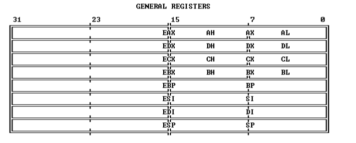
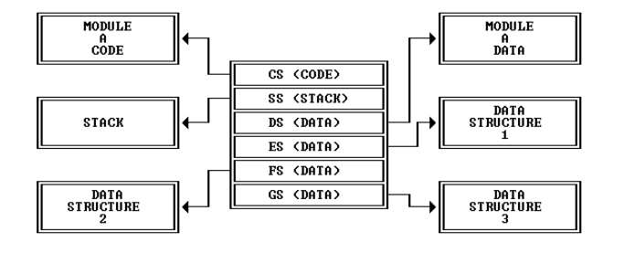
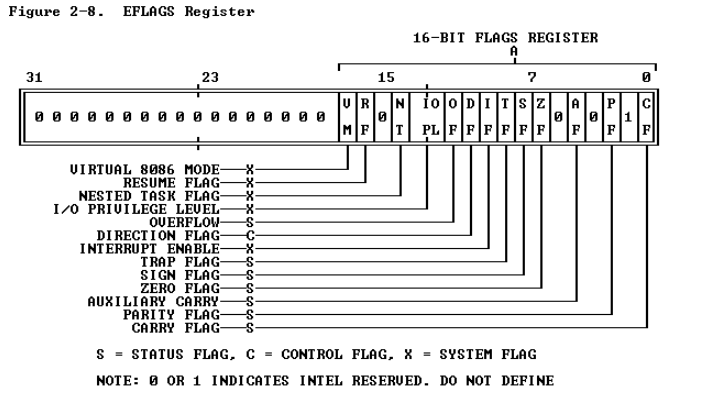

# 80386

## 80386的内存组织结构

80386的物理内存是由一系列的8位的字节组成，每一个字节被分配不同的IP地址（0\~2^32-1）。80386的程序是独立于物理内存的，也就是说不用太多的物理内存知识也不用知道物理内存中有什么指令或者数据就可以写程序。应用程序开发者所看到的内存组织模式是由系统软件设计师设计的。内存组织的模式可以在两个极端中选择（The model of memory organization can range between the following extremes）

- 一种“平面”地址空间，由一个高达4GB的数组组成。（A "flat" address space consisting of a single array of up to 4 gigabytes.）
- 一种分段的地址空间，由最多16383（0x3FFF）个线性地址空间组成，每个线性地址空间可以高达4GB地址空间（A segmented address space consisting of a collection of up to 16,383 linear address spaces of up to 4 gigabytes each.）

上述两种模式都可以提供内存保护。不同的任务可以选择不同的内存组织模式，系统设计人员使用上述标准去决定一个内存组织模式，并且系统程序员去实现这种模式是被包含在编程中的。

### 平面模式（The “Flat” Model）

在这种平面模式下，应用程序员可以看到一个高达2^32字节（4GB）的数组。虽然物理内存空间也可以容纳4GB的东西，但是实际上它往往更小。处理通过地址转换机制，映射这4GB的平面地址到物理地址空间上，当然应用程序员不需要知道映射的细节。这种平面地址空间的指针是一个从2^32-1\~1的32位有序的数字，在这空间中单独编译模块的重新定位必须由系统软件执行（比如链接器（linker）、加载器（loader）等等）

### 分段模式

在这种分段模式下，应用程序程序员可以看到的地址空间高达2^46字节。处理器通过地址转化机制来映射这2^46字节的逻辑地址空间到物理地址上，同样应用程序程序员不需要知道映射的细节。应用程序程序员将这种80386逻辑地址空间视为由16383个一维子空间构成，每一个子空间有着指定的长度。每一个线性子序列被叫做段，一个段是一个连续地址空间单元，段大小可以从1\~2^32字节。那么在这种模式下，一个完整的指针由两部分组成：

1. 段选择器，16bit的区间定义了一个段
2. 偏移量，一个32bit有序数，来定位是哪个字节的

由于段的大小是可以变的，所以一个段的大小可以是它所包含模块的大小。并且在运行时，单独编译的模块可重新加载通过改变段的起始地址。

## 80386寄存器

80386一共有16个程序员感兴趣的寄存器，这些寄存器可以被分为3类：

1. 第一类是通用寄存器，有8个，每个32位。这些寄存器被用来包含用于算数和逻辑操作的操作数；
2. 第二类是段寄存器，有6个。这些寄存器可以允许系统软件设计师选择flat模式的内存组织模式还是分段模式的内存组织模式。在任何时候，这6个段寄存器决定了内存的哪个段是当前可以访问的。
3. 状态和指令寄存器，有2个。这些寄存器用来记录和修改80386处理器状态的某些方面。

这些寄存器的示意图如上所示，下面我们来详细阐述一些这些寄存器：

### 通用寄存器（General Registers）

32位的通用的寄存器有EAX、EBX、ECX、EDX、EBP、ESP、ESI、EDI。这些寄存器可以互换地用于包含逻辑运算和算数运算的操作数，也互换地用于地址计算的操作数（除了ESP寄存器不能用于索引操作数）。如下图所示，这些寄存器的低字部分有一个单独的名字，比如EAX的低字部分叫做AX，类似还有AX, BX, CX, DX, BP, SP, SI和DI。这些低字部分可以像一个单元一样被处理，这种特性在处理16位数据或者兼容8086和80286处理器中是十分有用的。

类似的，AX, BX, CX, DX中每一个字节都有一个独立的名字，比如AX中分为AH（高字节）和AL（低字节）。每一个字节也同样可以被当成一个单元进行处理。这种特性在处理字符或者其他八字节数据的时候是相当有用的。

所有的通用寄存器都可以用于地址计算和绝大多数算数运算、逻辑运算的结果。然而，一些函数专用使用某些寄存器，这些使用特定寄存器的指令包括：双精度乘和除，I/O，字符串指令，翻译，循环，变量移位和旋转，堆栈操作。下面讲一下这些寄存器的用途：

- ESP寄存器x86堆栈指针寄存器
- EBP寄存器寄存器的值代表该子程序的栈帧的最高地址，EBP寄存器和ESP寄存器之间的内容即为栈桢

### 段寄存器（Segment Registers）

简单来说段寄存器是存放程序中段的相关信息的，如CS寄存器存放的是代码段的相关信息。六个段寄存器CS, DS, SS, ES, FS和GS用来指明六个段，每个寄存器从组成程序的段中唯一地确定一个特定的段。对于一个正在执行的80386程序来说，任何时候都可以立即访问六个段的内容，并且将以最快的速度访问。如下所示：

- 代码段（Code Segement），**包含了当前执行的指令序列，由CS寄存器指定。**80386从这个CS中获取所有的指令，并且将指令对应的指针内容作为偏移量。CS段将由一些段间控制指令、中断和异常被隐式的修改。

- 栈段（Stack Segement）,所有的栈操作使用SS寄存器来定位栈的位置。因为SS寄存器可以被显示的加载不像CS一样，所以允许程序员动态的定义栈。

- 数据段一共有四个。DS、ES、FS、GS段寄存器指向对应的数据段，每一个段都可以被当前执行的程序所寻址的。划分成四个不同的数据段有利于程序高效的访问不同类型的数据结构。

  处理器会将基址与被段寄存器选择的段进行相关联，一旦选择了某个段（通过把段选择器加载到段寄存器），那么只需要指定其偏移量即可，而偏移量可以直接在指令中说明或者通过通用寄存器间接地来说明，之后这个这个32位的偏移量加上段的基址，就可以寻址得到这个元素。简单的规则定义当只指定偏移量时，对应的段寄存器就会使用，从而用来形成地址。

  有时程序可能还需要访问四个以上的数据段，为了去访问额外的数据段，在程序的执行期间可以把DS、ES、FS、GS这四个寄存器中的值进行修改。过程也就变成了，只要求程序在访问数据之前先执行加载适当段寄存器的指令。

### Flags 寄存器（Flags Register）&&Instruction Pointer

Flags寄存器是一个32位寄存器，叫做EFLAGS。如下所示：

这个寄存器中的标志位用来控制某些操作，和显示80386的状态。这个寄存器中的低16位是叫做FLAGS并且可以像一个单元来处理。这种特性同上述所阐述的一样在执行8086或者80286处理器的时候是很有用的，因为EFLAGS中的这个部分跟8086和80286中的FLAGS寄存器是一模一样的。在这些flags中可以被分为三类：

1. status flags，这种状态标志位允许一条指令的结果去影响接下去的指令。比如算数指令使用 OF, SF, ZF, AF, PF和CF。SCAS (Scan String),CMPS(Compare String), and LOOP指令使用ZF标识他们的操作是结束了的。在执行算数指令之前有些指令是去设置、清楚或者补充CF的。
2. control flags，比如DF（Direction Flag）是控制字符串指令。当DF被设置了，那么会造成字符串指令自动递减的，或者说处理字符串从高地址到低地址；假如清楚DF位，那么将会造成字符串指令增加的，或者说处理字符串从低地址到高地址的。
3. system flags

---

指令指针寄存器（ instruction pointer register (EIP)）存着下一条连续的被执行的指令的偏移量的地址，这个偏移量是相对当前代码段（Code Segement）开始处的。这个指令指针程序员是无法直接看到的，它由控制转移指令、中断和异常来控制。如下图所示，EIP的低16位被叫做IP，可以被当成一个单元来处理。这一点在执行8086或者80286处理器的指令时是十分有用的。

### CR*

- 控制寄存器cr2和cr3都是和分页机制相关的寄存器。其中cr3寄存器存放页表的物理起始地址。
- CR0和CR1~CR3寄存器都是80x86的控制寄存器
- he physical address of the current page directory is stored in the CPU register CR3, also called the page directory base register (PDBR)
- Page translation is in effect only when the PG bit of CR0 is set. 

## 80386指令格式

- 指令前缀（PREFIX）

  分为4组，每组至多用一个字节编码，4组顺序可以随意。

  **Segment override**：显式指定指令应该使用哪个段寄存器，覆盖掉80386为这条指令默认使用的寄存器。CS、SS、DS、ES、FS、GS的段覆盖前缀的编码分别是2EH、36H、3EH、26H、64H、65H.

  **Address size **：地址长度覆盖，编码为67H，用于16位和32位地址切换；

  **Operand size**：操作数长度覆盖，编码为66H，用于在16位和32位操作数切换；

  **Repeat**：与字符串指令一起使用，使指令作用于字符串的每一个元素.

- 指令码（OPCODE）

  长度为1或2个字节，这个是必须有的。指定这条指令需要执行的操作。

- MODR/M与SIB

  许多指令的内存操作数需要使用ModR/M字节作为寻址模式说明符。其中mod与r/m组合有32个值，表示8个寄存器与24中寻址模式。reg/opcode表示寄存器号或者额外的3位指令码，这个具体含义得看基本指令码。某些ModR/M字节表示的寻址模式，需要SIB字节来补充寻址方式。其中scale表示比例系数，index表示变址寄存器号，base表示变址寄存器号。比如当寻址模式设置为用一个索引寄存器去计算操作数的地址的时候，那么SIB字节就会出现了。

  

- 位移（DISPLACEMENT）

  当寻址模式设置为需要一个位移来计算操作数地址的时候，那么位移字节就会被编进指令中。位移是32位、16位或8位带符号的整数。当位移很小的时候，通常采用8位的形式。

- 直接数（IMMEDIATE）

  直接在指令中提供操作数的值。直接数可以是8位、16位或者32位的。在8位直接数与16位或32位操作数组合的情况下，处理器自动扩展8位操作数的大小，同时考虑到符号。

  

> 基于x86指令集的汇编语言有两套格式（指令集只有一套，但是汇编有两套）
>
> - Intel syntax: op dst, src
> - AT&T (gcc/gas) syntax: op src, dst 

**本段参考链接**：

1.[https://zh.wikipedia.org/wiki/X86#x86%E6%8C%87%E4%BB%A4%E6%A0%BC%E5%BC%8F](https://zh.wikipedia.org/wiki/X86#x86指令格式)

2.https://pdos.csail.mit.edu/6.828/2018/readings/i386/s02_04.htm

3.https://pdos.csail.mit.edu/6.828/2018/readings/i386/s17_02.htm#fig17-1