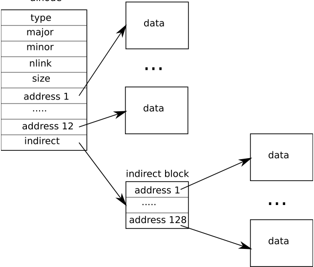
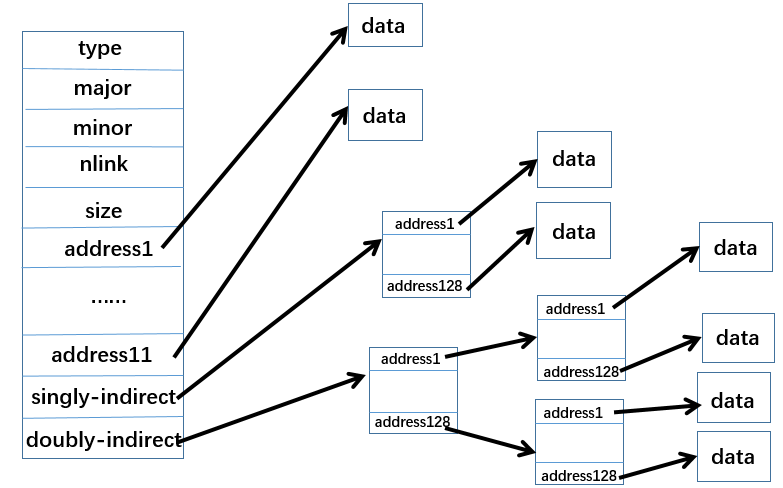
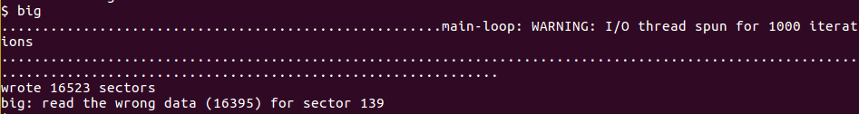

在这个实验中我们将会增加xv6文件最大的大小。当前的xv6 文件的大小是被限制在140 sectors，这个限制是因为xv6 inode包含了12个“直接”的 block numbers和一个“单间接”的block number，这个“单间接”的block number指向了一个包含128 block number的block，所以总共有12+128=140 sectors。如下所示：



我们需要改变xv6 文件系统的代码让每一个inode支持“double-indirect”block，“double-indirect”block包含了128“单间接”blocks的地址，而每一个又包含了128data block的地址，最终包含了128*128+128+11=16523 sectors。



## 实验准备

1. 修改Makefile文件中CPU的定义，`CPUS :=1`

2. 在`QEMUOPTS`前面添加`QEMUEXTRA = -snapshot`

3. 修改`param.h`中的FSSIZE为20000（因为`mkfs.c`初始化文件系统，使文件系统只有少于1000个空闲数据块。太少的话，不能展示这个实验的效果）

   ```c
   #define FSSIZE       20000  // size of file system in blocks
   ```

4. 下载[big.c](https://pdos.csail.mit.edu/6.828/2018/homework/big.c) ，并放到你的xv6目录中

5. 在`UPROGS`列表最后加上big这个程序。

   ```makefile
   UPROGS=\
    ......
     _big\
   ```

假如启动xv6之后，在xv6的shell中输入big运行的话，那么它会创建xv6允许创建最大的文件的，然后报告这最终的结果，你将会看到的是140 sectors。

## 实验文件了解

`fs.h`中定义了on-disk inode的格式（`struct dinode`），`NDIRECT`表示“直接”地址块的数量，`NINDIRECT`表示“单间接”地址块的大小，`MAXFILE`表示文件最大的block数量，`addrs[]`表示数据块的地址。整个dinode的结构如下图所示：


`fs.c`中定义了找到磁盘上文件数据的函数`bmap()`。

- `bmap()`在写文件或者读文件的时候都会被调用，当写文件的时候，`bmap()`根据需要来判断是否分配一个新的block来保存文件数据，同时根据需要来分配一个indirect block来保存block 地址。
- `bmap()`将会处理两种类型的block numbers，第一种是`bn`，`bn`表示的是一个“logical block number”，这个编号是相对于文件的开始处的；第二种是 `ip->addrs[]`，和bread()所需要的参数，这些都是disk block number。`bmap()`相当于把文件的logical block number映射了disk block number。

## 实验过程

我们需要做的就是修改`bmap()`，在direct blocks和singly-indirect block之外，再实现doubly-indirect block。因为我们不能去改变on-disk inode的大小，所以为了让新的doubly-indirect block有空间存放，那么direct blocks的数量将会减少一个，只有11个。也就是说`ip->addrs[]`前面的11个元素是direct block，12th是singly-indirect block，13th将会是新的doubly-indirect block。你不需要修改xv6来处理doubly-indirect blocks文件的删除。下面是更改之后的on-disk inode的格式


Hint:

1. 考虑使用logical block number如何索引doubly-indirect block和indirect block
2. 如果你改变了`NDIRECT`的定义，可能还需要修改`file.h`中`struct inode`中`addrs[]`的大小；同时保证`struct inode`和`struct dinode`在它们的`addr[]`数组中有着相同数量的元素；
3. 如果你改变了`NDIRECT`的定义，确保创建一个新的`fs.img`（因为刚开始的时候，`mkfs`使用之前定义的`NDIRECT`创建了文件系统）。如果你删除了`fs.img`在unix上使用`make`将会创建一个新的；
4. 如果你的系统进入了一种bad state，可能是被crashingle，删除`fs.img`，`make`将会给你创建一个新的干净的文件系统镜像给你。
5. 不要忘记`brelse()`掉每一个你之前使用`bread()`过的block
6. 你只根据需要来分配indirect blocks和duobly-indirect blocks，就像原来的`bmap()`那样

根据上的提示最终将`bmap()`函数修改如下，对于如何使用`bn`来索引doubly-indirect block和indirect block，使用取余和除法。

```c
static uint
bmap(struct inode *ip, uint bn)
{
  uint addr, *a, *a2;
  struct buf *bp, *bp2;

  if(bn < NDIRECT){
    if((addr = ip->addrs[bn]) == 0)
      ip->addrs[bn] = addr = balloc(ip->dev);
    return addr;
  }
  bn -= NDIRECT;

  if(bn < NINDIRECT){
    // Load indirect block, allocating if necessary.
    if((addr = ip->addrs[NDIRECT]) == 0)
      ip->addrs[NDIRECT] = addr = balloc(ip->dev);
    bp = bread(ip->dev, addr);
    a = (uint*)bp->data;
    if((addr = a[bn]) == 0){
      a[bn] = addr = balloc(ip->dev);
      log_write(bp);
    }
    brelse(bp);
    return addr;
  }
  bn -= NINDIRECT;

  if(bn < NDINDIRECT){
    // Load double indirect block, allocating if necessary
    // the inode NDIRECT+1
    if((addr = ip->addrs[NDIRECT + 1]) == 0){
      ip->addrs[NDIRECT +1] = addr = balloc(ip->dev);
    }

    // the first indirect block
    bp = bread(ip->dev, addr);
    a = (uint *)bp->data;
    if((addr = a[bn/NINDIRECT]) == 0){
      a[bn/NINDIRECT] = addr = balloc(ip->dev);
      log_write(bp);
    }

    // the second indirect block
    bp2 = bread(ip->dev, addr);
    a2 = (uint *)bp->data;
    if((addr = a[bn%NINDIRECT]) == 0){
      a2[bn%NINDIRECT] = addr = balloc(ip->dev);
      log_write(bp2);
    }
    brelse(bp2);
    brelse(bp);

    return addr;

  }
  panic("bmap: out of range");
}
```

同时记得修改`fs.h`文件的内容，修改的内容如下，`addrs[]`也需要修改是因为，我们需要保证`struct dinode`的大小不变，一旦`NDIRECT`从12变成了11，那么`adrs[]`也就要要从`NDIRECT+1`变成`NDIRECT+2`.

```c
#define NDIRECT 11
#define NINDIRECT (BSIZE / sizeof(uint))
#define NDINDIRECT (NINDIRECT * NINDIRECT)
#define MAXFILE (NDIRECT + NINDIRECT + NDINDIRECT)
  
  
// On-disk inode structure
struct dinode {
  short type;           // File type
  short major;          // Major device number (T_DEV only)
  short minor;          // Minor device number (T_DEV only)
  short nlink;          // Number of links to inode in file system
  uint size;            // Size of file (bytes)
  uint addrs[NDIRECT+2];   // Data block addresses
};
```

最后也不要忘记修改`in-memory inode`中的格式

```c
// in-memory copy of an inode
struct inode { 
  uint dev;           // Device number
  uint inum;          // Inode number
  int ref;            // Reference count
  struct sleeplock lock; // protects everything below here
  int valid;          // inode has been read from disk?

  short type;         // copy of disk inode
  short major; 
  short minor; 
  short nlink; 
  uint size;
  uint addrs[NDIRECT+2];
};
```

最后依次执行`maek clean`（也会把fs.img删掉）、`make`之后，再次运行`make qemu-nox`在xv6的shell中输入big。结果如下所示




> 实验过程中fs.h、fs.c、file.h这三个文件都有备份