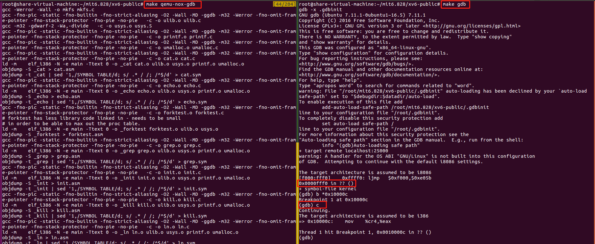

## 整个HW准备

!!!!!!需要注意的是，这个homework所需要的不再是lab中的内容了，而是**需要重新clone一份git仓库**，之前Lab用到的是JOS,而HW系列用到的是xv6.

```bash
git clone git://github.com/mit-pdos/xv6-public.git
```

之后执行make，形成kernel文件

```bash
cd xv6-public
make
```

## 运行到内核程序开始的地方

通过上述的操作，生成kernel文件之后，我们首先需要找到内核程序开始的地方，通过下面的命令，我们可以找到内核程序开始的地方nm

```bash
$ nm kernel | grep _start
```

> `nm` 命令：names， nm命令主要是用来列出文件中的某些符号（一些函数和全局变量等）。

输出内容如下所示，那么也就是说内核在0x0010000c地方开始

```
8010a48c D _binary_entryother_start                                                   8010a460 D _binary_initcode_start                                                     0010000c T _start
```

得到内核程序开始的地址之后，接下去我们需要用到`make qemu-nox-gdb`和`make gdb` 两个命令实现调试，分别打开两个窗口，都进入到源代码目录后，依次输入上述命令。再在`make gdb`的调试界面中依次输入`b*0x10000c`和`c`,就可以运行到了断点处了，整个操作过程，如下图所示：



> 1.如果运行make gdb的时候说没有gdb这个规则，那么需要在Makefile文件中加入如下内容：
>
> ```bash
> gdb:
> 	gdb -x .gdbinit
> ```
>
> 2.make qemu-nox-gdb同make qemu-gdb，只是前者没有再跳出一个框

## 查看寄存器中的内容

在如上的调试界面，我们依次输入`info reg`和`x/24x $esp`，得到如下内容：


下面我们来看一下`bootasm.S`文件中对栈的初始化：

```assembly
# Set up the stack pointer and call into C.
movl    $start, %esp
call    bootmain
```

之后就是调用bootmain.c中的bootmain函数了。接下去我们看一下bootblock.asm这个文件的内容，找到对esp寄存器进行初始化的地方（esp是栈相关的寄存器）：

```assembly
mov    $0x7c00,%esp
```

那么栈是相当于从0x7C00开始的，并且是向下生长的，因为boot loader是被放在0x7c00开始的地方的。那么结合文件和上述输出的内容，栈中7C4d的值为`call bootmain`下一条指令的值，这是因为在调用函数的时候，也会把当前程序下一条指令的地址压入栈，之后在跳转到调用函数处执行。


同理可得7db4是调用entry()函数后的返回地址，也就是当前程序`((void (*)(void)) (ELFHDR->e_entry))();`指令下一条指令的地址。


