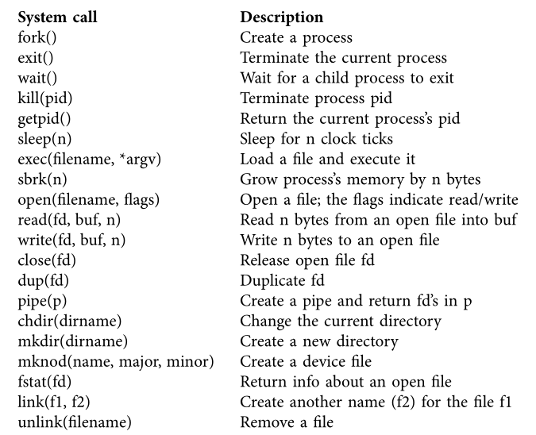
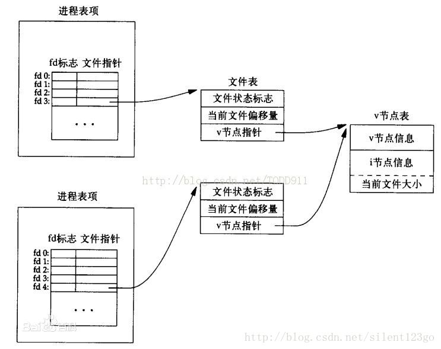
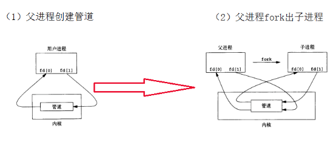
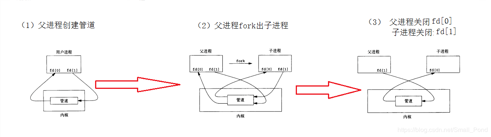

Shell这一个作业的目的是为让我们更加了解Unix API，要实现一些shell命令，比如简单命令的执行、重定向的实现、通道的实现。

## 0. 环境及所需文件

**环境**：在任何支持Unix  API的操作系统上实现都可以。

**所需文件**：[shell.c](https://pdos.csail.mit.edu/6.828/2018/homework/sh.c)，这个作业就是在这个已给的文件上实现shell命令、重定向、管道（pipe）等，这个文件主要分为命令解释部分和命令执行部分，命令解释部分只能解释简单的命令，如下：

```shell
ls > y
cat < y | sort | uniq | wc > y1
cat y1
rm y1
ls |  sort | uniq | wc
rm y
```

**需要提前阅读**：[xv6_book](https://pdos.csail.mit.edu/6.828/2018/xv6/book-rev10.pdf)，需要阅读第0章

## 1.xv6理论知识块

操作系统通过一个接口给用户程序提供服务。每一个正在运行的程序都被叫做进程，每个进程都有一块内存，内存中包含了指令、数据、和栈。当一个程序需要去调用一个内核服务的时候，它将会通过一个进程来调用操作系统的接口，如此一个过程就被叫做system call。这个system call会进入内核，内容执行这个服务并且返回。因此，该进程在用户空间和内核空间交替执行。内核使用CPU的硬件保护机制确保每一个进程只执行在用户空间，只访问他能访问到的内存。内核带着硬件特权在那运行着，这些硬件特权被要求实现上述的保护机制了。当一个用户程序调用一个system call，硬件将会产生一个硬件特权，在内核中将会开始执行一个提前安排的函数。内核提供的system calls的集合是用户程序可以看得见的。xv6内核提供了传统Unix系统提供的服务和system calls的一部分子集。



对于传统的类Unix来说，shell是一个主要的用户接口。shell是一个用户程序而不是内核的一部分，它实现了从用户那读取命令，并执行这些命令的功能。shell只是一些system calls的实现，它可以很好的展示system calls的强大。xv6的shell只是一个简单的实现，它的本质是Unix的Bourne shell。

### 进程和内存

一个xv6的进程包含了用户空间的内存并且每一个进程的状态对于kernel都是私有的。xv6可以分时处理进程，也就是挑CPU有空的时候，这个时候其他进程是在那等待被执行。当然一个进程没有在执行，那么xv6保存它的CPU寄存器，当它是下一个被执行的进程时，恢复这些内容。内核通过进程标志符pid与每一个进程进行联系。

一个进程可以通过`fork`这个system call创建一个新的进程，这个新的进程被叫做子进程（child process），这个子进程与调用它的进程拥有完全一样的内存，调用子进程的进程被叫做父进程。`fork`函数在父进程和子进程中都会返回函数值，在父进程中返回的是子进程的PID，在子进程中返回的是0。如下面这段代码所示：

```c
int pid = fork();
if(pid > 0){
    printf("parent: child=%d\n", pid);
    pid = wait();
    printf("child %d is done\n", pid);
} else if(pid == 0){
	printf("child: exiting\n");
	exit();
} else {
	printf("fork error\n");
}
```

`exit`这个system call会导致调用它的进程停止执行，并且释放内存和打开文件等资源。`wait`这个system call返回当前进程中一个已经退出的子进程的pid，如果没有已经退出的，那么等待一个子进程退出。所以上述可能先打印，下面的输出的顺序可能不一样：

```
parent: child=1234
child: exiting
```

当子进程退出之后，父进程中的`wait()`将会返回，所以会打印出

```
parent: child 1234 is done
```

虽然子进程有着跟父进程一样的内存内容，但是他们执行在不同的内存区域和不同的寄存器（registers）,当改变进程中的一个变量时不影响另一个。`exec()`system call将会把调用进程的内容替换为一个存储在文件系统中的文件的新的内存镜像，这个文件有着一个特定的格式。xv6采用ELF文件格式，当一个`exec()`执行成功的时候，它不会返回到调用它的程序，而是从加载的指令中找到ELF文件指定的入口地址开始执行。`exec`的例子如下：

```c
char *argv[3];
argv[0] = "echo";
argv[1] = "hello";
argv[2] = 0;
exec("/bin/echo", argv);
printf("exec error\n");
```

假如一个进程在运行过程中需要更多的内存，它们可以调用`sbrk(n)`，让数据内存增加n字节，然后返回新内存的地址。xv6没有用户这个概念，或者保护一个用户免受其他用户的攻击，用unix的术语来说，所有的xv6进程都像一个root一样。


### 输入输出和文件描述符（I/O and File descriptors）

文件描述符是一个很小的整型值，代表进程可以写入或读取的内核对象。一个进程可以通过打开一个文件、一个目录、一个设备，创建一个管道（pipe），复制一个已存在的文件描述符来获得一个文件描述符。为了简单起见，我们通常将一个文件描述符所指的对象称为"file"，文件描述符抽象出files、pipes和devices之间的差异，使它们看起来像字节流。每个进程都有一个从零开始的文件描述符私有空间。按照惯例，0是标准输入，1是标准输出，2是标准错误输出。shell确保它一定有3个文件描述符打开，这三个文件描述符是默认的对于console来说。



`read`和`write`这两个system call从打开的名字为文件描述符的文件中读取或者写入。每一个指向文件的文件描述符都有一个offset，他们从当前文件的offset处开始读取，并且将offset向前推进读取的字节数。当没有更多bytes的时候读取的时候，`read`返回0表示文件的结束；与读取文件类似，将数据写入到文件也是从offset处开始写，并且同样将offset向前推进写入的字节数。

`close`system call释放一个文件描述符，让它可以被之后的`open`、`pipe`或者`dup`等system call重新使用。一个新分配的文件描述符，总是当前进程中一个数很小没有被使用过的描述符。文件描述符和`fork`相互作用使得IO重定向很容易实现。`fork`复制父进程的文件描述符表和内存，这样子进程从与父进程完全相同的打开的文件开始。`exec`system call虽然把调用进程的内存给替代了，但是保留了文件描述符表。这样子可以让shell很容易的通过forking、重新打开已经关掉的文件描述符然后执行新的程序来实现I/O重定向。



虽然`fork`复制了一份文件描述符表，但是每一个文件的offset是在子进程与父进程之间共享，比如下面代码中最终输出的内容是`hello world`

```
if(fork() == 0) {
    write(1, "hello ", 6);
    exit();
} else {
    wait();
    write(1, "world\n", 6);
}
```

`dup`system call复制一个存在的file descriptor，返回一个新的file descriptor指向相同的I/O对象，并且共享一个offset。下面的代码，输出效果同上面一样，都是输出`hello world`

```
fd = dup(1);
write(1, "hello ", 6);
write(fd, "world\n", 6);
```

对于上述`fork`和`dup`的操作，假如两个文件描述符，是从同一个原始的文件描述符通过一系列`fork`或`dup`操作衍生出来的，那么他们还是共享一个offset。否则就算是用`open`打开了相同的文件，它们的offset也是不共享的。`dup`可以让shell实现像`ls existing-file non-existing-file > tmp1 2>&1`这样子的命令。`2>&1`告诉shell给这个命令一个文件描述符2，这个2是描述符1的复制品。假如这样的话，那么存在的文件的文件名和不存在文件产生的错误信息都会被输入到tmp1中。但是xv6不支持error file descriptor的重定向。

文件描述符是一个很强大的抽象，因为它们隐藏了细节，一个进程向文件描述符1写入，可能是向一个文件写、也可能是向一个设备写，比如控制台，或者是一个管道（pipe）。


### 管道（pipes）

**一个管道是一块很小的内核缓存**，这个内核缓存是作为**一对file descriptors（一个用于写，一个用于读）展示给进程**的。**通道为进程之间的通信提供了一种方法，**下面这段代码将wc的标准读取端与管道的读取断联系起来了：

```c
int p[2];
char *argv[2];
argv[0] = "wc";
argv[1] = 0;
pipe(p);
if(fork() == 0) {
    close(0);
    dup(p[0]);
    close(p[0]);
    close(p[1]);
    exec("/bin/wc", argv);
} else {
    close(p[0]);
    write(p[1], "hello world\n", 12);
    close(p[1]);
}
```

上面这段程序，首先父进程通过调用`pipe`创建了一个管道（pipe）和两个文件描述符，并将这两个文件描述符存到了p数组中，其中p[0]表示管道的读取端（也就是通过这个描述符可以从管道中读取数据）。之后进行`fork`出一个子进程，这个子进程和父进程拥有相同的指向管道的文件描述符。之后子进程关掉了文件描述符0，通过`dup`操作把p[0]这个文件描述复制给了文件描述符0，然后把子进程的两个用于管道描述符的给关掉了，并开始调用`exec`，这个时候wc当从文件描述符0读取内容的时候，实际上是从管道中读取内容，在父进程中首先将管道读取端的描述符close掉，然后通过p[1]将`hello world\n`写到管道中，在之后管道描述符。大致流程如下所示：



**在管道中假如没有数据，那么`read`调用会一直等待管道的数据被写入，或者指向管道写入端的文件描述符全都被关掉，对于后者来说`read`返回的是0。**

管道与临时文件的比较，比如下面两条命令实现的效果是一样，只是前者采用了管道这种方式，后者采用了临时文件的方式，那么管道有哪些优势呢？

```shell
echo hello world | wc
echo hello world >/tmp/xyz; wc </tmp/xyz
```

1. pipes是自动清除的，而采用文件重定向方式的临时文件，需要手动被清除；
2. pipes可以传递不断传输长的数据流的，然而文件重定向要求磁盘中有足够多的空闲空间去存储这些数据；
3. pipes可以运行进程同时执行的，而后者必须要求第一个程序执行完了，第二个才能执行；
4. 假如想要实现进程间的通信，pipes的方式是更有效的‘

---

xv6中的shell实现管道是简单的，可以看代码（8650）。

### 文件系统（File system）

xv6的文件系统提供了文件（the data file are uninterpreted byte arrays）和目录（directories contain named references to data files and other directories）。目录形成了一棵树，这树开始于一个特殊的目录叫做root。一个路径如`/a/b/c`代表一个叫做c的文件或目录，在b目录中，b目录又在a目录中，a是在root目录`/`中。假如一个路劲不以`/`开始的，那么这个路径是相对于调用程序的当前路径的相对路径，这个路径可以通过`chdir`system call来改变的。

有很多system calls可以创建一个目录或者一个文件，比如`mkidr`创建了一个新的目录，`open`当传入一个O_CREATE的标志符的时候，那么将会创建一个文件，`mknod`创建一个新的device file。

```shell
mkdir("/dir");
fd = open("/dir/file", O_CREATE|O_WRONLY);
close(fd);
mknod("/console", 1, 1);
```

`mknod`在file system中创建了一个文件，但是这个文件是没有任何内容的。然而，文件的元数据（metadata）将其标志为一个device file，并且记录主设备号和副设备号，这两个设备号唯一标识一个内核设备。当一个进程打开这个文件，内核将`read`和`wrtite`system call转移到内核设备的实现，而不是将他们交给文件系统。

> 任何文件系统中的数据分为数据和元数据。数据是指普通文件中的实际数据，而元数据指用来描述一个文件的特征的系统数据，诸如访问权限、文件拥有者、文件的创建者、文件的创建日期、文件的大小以及文件数据块的分布信息(inode...)等等。

`fstat`检查一个文件描述符所指的对象的信息，它将信息填到定义在stat.h中`struct stat`中

```c、
#define T_DIR 1  // Directory
#define T_FILE 2  // File
#define T_DEV 3  // Device
struct stat {
    short type; // Type of file
    int dev;  // File system’s disk device
    uint ino;  // Inode number
    short nlink; // Number of links to file
    uint size;  // Size of file in bytes
};
```

文件的名字和文件本身是不同的。相同隐藏的文件被叫做inode，但是这个文件可以有多个名字，这个名字被叫做链接（links）。`link`system  call可以创建一个另外的文件系统名字，这个名字用来指向现有文件相同的inode。如下代码所示，就创建了一个文件即可以叫做a也可以叫做b

```c
open("a", O_CREATE|O_WRONLY);
link("a", "b");
```

> 储存文件元信息的区域就叫做inode，中文译名为"索引节点"

通过a来读取文件和通过b来读取文件是一样的。通过不同的inode number来进行标记一个inode，你可以通过`fstat`来查看上述a和b所指向的内容是不是一样的，你会发现会返回同样的inode number（ino）。

`nlink`返回指向这个文件的链接数（the number of links to file），`unlink`system call会从文件系统中移除掉指定名字的链接。文件的inode和存放这个文件的磁盘空间，只有在这个文件的link count变为0时，并且没有file descriptors指向它时才会被释放。

```c
fd = open("/tmp/xyz", O_CREATE|O_RDWR);
unlink("/tmp/xyz");
```

上述这种方式就是一种很常规的方式去创建一个临时的inode，这个inode将会被清理掉当进程关掉fd或者退出的时候。

对于文件系统操作的shell命令来说，这些命令是作为user-level programs去实现的，比如mkdir、ln、rm等等。这么设计可以让任何人用新的用户命令去扩展shell，而这一实现只需要增加一个新的user-level program。但是在设计UNIX操作系统的那个时代，其他的操作系统是将上述这些命令设计进shell，并且将shell设计进内核。然而有一个例外的，就是cd。cd是被设计进了shell，因为cd必须要改变当前shell自身的工作目录。如果cd是被作为一个常规的命令，那么当前的shell会fork出一个子进程，这个子进程里面会运行cd，从而改变子进程的工作目录，而父进程的工作目录不会改变。

### Real Word

UNIX将‘‘standard’’ file descriptors、pipes和对操作来说方便的shell语法格式整合到自己上面，这点对于编写general-purpose reusable programs是一个很大的进步。这种想法激发了“sofeware tools”的文化，而这种文化是UNIX的强大和流行的主要原因。同时，这个shell被第一个叫做"脚本语言"的。UNIX的system call接口至今存在在操作系统中，比如BSD、Linux和Mac OS X。UNIX接口已经通过POSIX（Portable Operating System Interface ）标准的标准化了，但是xv6没有，xv6少了一些system calls（包括最基础的一些比如lseek），xv6只实现了部分的system calls。当提供一个简单的类UNIX的sytem calls interface的时候，xv6的主要目标是简单和清晰。

对于当代大部分Unix衍射出来的操作系统，他们没有再按照早起的Unix模式那样将devices作为一个特别的file。Unix的前身Multics，将file storage抽象成让它们看起来像memory，然而这产生了很困难的接口。Multics复杂的设计对Unix的设计有了一个直接的影响，所以Unix尝试做的很简单。


## 2. 需要用到的函数

需要用到的函数可以用`man`指令查看函数详情，下面只是做一下简单阐述。`man 2 fun_name`中的2表示内核提供的函数，`man 3 fun_name`中的3表示库函数。

**int execv(const char *path, char *const argv[]);**

第一个参数是一个执行程序的路径，第二参数是执行程序的参数（但是这个参数是包括了命令名字的）。调用这个函数的时候，当前进程的镜像会被第一个参数所指的进程镜像代替。

> The  exec()  family  of functions replaces the current process image with a new process image.  The functions described in this manual page are front-ends for execve(2).  (See the manual page for execve(2) for further details about the replacement of the current process image.)


**int close(int fd);**

关掉一个文件描述符，返回0表示成功，返回-1表示错误。

> close()  closes  a  file  descriptor,  so  that  it  no longer refers to any file and may be reused. 
>
> close() returns zero on success.  On error, -1 is returned, and errno is set appropriately.


**int open(const char *pathname, int flags, mode_t mode);**\

这个函数会返回一个文件描述符，这个文件描述符是当前进程没有打开的文件描述符中最小的。传入第一个参数是一个文件的pathname，第二个参数必须包括以下的其中一个O_RDONLY, O_WRONLY或O_RDWR，当然这个参数可以通过或的方式与其他flag相结合，比如O_CLOEXEC, O_CREAT；最后一个参数，只有当第二个参数指定了O_CREAT或者O_TMPFILE的时候才有效，否则是没用的。

> Given  a  pathname  for  a  file,  open()  returns  a file descriptor, a small, nonnegative integer for use in subsequent system calls (read(2), write(2), lseek(2), fcntl(2), etc.).  The file descriptor returned by a successful call will be the lowest-numbered file descriptor not currently open for the process.
>
> The argument flags must include one of the following access modes: O_RDONLY, O_WRONLY, or O_RDWR.  These request opening the file read-only, write-only, or read/write, respectively.
>
> mode specifies the mode to use in case a new file is created.  This argument must be supplied when O_CREAT or O_TMPFILE is specified in flags; if neither O_CREAT nor O_TMPFILE is specified,  then mode is ignored.


**int pipe(int pipefd[2]);**

创建一个pipe，一个直连的数据通道将会用于进程之前的通信。pipefd用于返回两个指向管道了两端的文件描述符。pipefd[0]指向pipe的读取端，pipefd[1]指向pipe的写入端。

> pipe()  creates  a  pipe,  a unidirectional data channel that can be used for interprocess communication.  The array pipefd is used to return two file descriptors referring to the ends of the pipe.  pipefd[0] refers to the read end of the pipe.  pipefd[1] refers to the write end of the pipe.  Data written to the write end of the pipe is buffered by the kernel until it is read from the read end of the pipe.


**pid_t fork(void);**

创建一个新的进程，通过复制创建它的线程。新的线程是子线程，调用的线程是父线程。子线程和父线程运行在两块分开的内存空间上，在fork()执行期间，两块内存空间中的内容是一样的。

> fork() creates a new process by duplicating the calling process.  The new process is referred to as the child process.  The calling process is referred to as the parent process. The  child  process  and the parent process run in separate memory spaces.  At the time of fork() both memory spaces have the same content.
>


**int dup(int oldfd)**

复印oldfd这个旧的文件描述符，使用数字小的没有被使用过的描述符作为新的描述符。一旦创建成功，新旧描述符可以交换使用。成功后返回新的描述符，错误则返回-1。

> The dup() system call creates a copy of the file descriptor oldfd, using the lowest-numbered unused descriptor for the new descriptor. After a successful return, the old and new file descriptors may be used interchangeably.

On success, these system calls return the new descriptor.  On error, -1 is returned


本段内容参考：

1.[linux下使用man查看C函数用法](https://blog.csdn.net/smilefyx/article/details/23055651)

## 3. 动手实践

在完善这个sh.c的之前，我们首先大体上来看一下这个c文件的内容，首先是main函数：

```c
int main(void)
{
  static char buf[100];
  int fd, r;

  // Read and run input commands.
  while(getcmd(buf, sizeof(buf)) >= 0){ 
    if(buf[0] == 'c' && buf[1] == 'd' && buf[2] == ' '){
      // Clumsy but will have to do for now.
      // Chdir has no effect on the parent if run in the child.
      buf[strlen(buf)-1] = 0;  // chop \n
      if(chdir(buf+3) < 0)
        fprintf(stderr, "cannot cd %s\n", buf+3);
      continue;
    }   
    if(fork1() == 0)
      runcmd(parsecmd(buf));
    wait(&r);
  }
  exit(0);
}
```

main函数主要是负责读取用户输入的命令，之后通过`fork`创建一个新的进程（`fork1()`是`fork()`的进一步封装），然后在这个新的进程即子进程中对输入的命令进行解析，之后执行解析出来的命令。`wait`的操作表示，只有等子进程结束之后，才会继续执行获取命令的操作。从文件刚开始的地方可以看到，命令有普通命令、带有重定向符号的命令、带有管道符号的命令三种。

```c
struct cmd {
  int type;          //  ' ' (exec), | (pipe), '<' or '>' for redirection
};

struct execcmd {
  int type;              // ' '
  char *argv[MAXARGS];   // arguments to the command to be exec-ed
};

struct redircmd {
  int type;          // < or > 
  struct cmd *cmd;   // the command to be run (e.g., an execcmd)
  char *file;        // the input/output file
  int flags;         // flags for open() indicating read or write
  int fd;            // the file descriptor number to use for the file
};

struct pipecmd {
  int type;          // |
  struct cmd *left;  // left side of pipe
  struct cmd *right; // right side of pipe
};
```

那么接下来我们再来看一下对命令进行解析的函数`parsecmd`，这个函数是一系列解析函数的开始，程序会将用户输入的命令解析成一个一个结构体然后封装起来，比如`ls | wc | grep`就会被封装成pipecmd结构体，其中pipecmd.left是ls，right是pipecmd结构体（这个结构体左边是wc，右边是grep），而对于`ls /root`这种命令，那么使用的结构体就是简单的execmd。

解析完命令之后，调用`runcmd`函数执行命令，`runcmd`通过对cmd的类型进行switch，分类执行，也就是下面要实现的3种。这个`runcmd`函数是这个作用中，我们真正要实现的。

### 1.简单命令的执行

简单命令执行的意思是执行例如`ls`、`ls -l`这样子的命令，主要用到`execv`这个system call（man 3 execv可以查看这个函数的使用、参数、返回值等）。`execv`的第一个参数是命令的路径，第二个是shell输入的参数（这个是包括了命令名的，第一个参数就是命令名）。所以在使用`execv`实现的时候，只要把argv的第一个参数（下标为0），作为第一个参数传进去，argv作为第二参数传进去即可。所以一开始简单的代码是就一行的：

```c
execv(ecmd->argv[0], ecmd->argv)
```

然而没有如课程里说的可能会出错那样，这个主要是因为我使用的是一个可以搜索路径的高版本的`exec`（没有报错的主要原因有两个：一个是你当前目录就有`ls`这个文件，一个是你用的是高版本的`exec`），所以当输入`ls`的时候没有报错，但是为了更严谨起见，我们还是多加一些判断。假如这个函数执行错误的时候，它是会返回的-1的，所以我们当返回-1之后，可能是找不到这个`ls`程序在哪，所以我们先到`/bin/`目录下去找，假如还是没有，再到`/usr/bin/`下面去找。所以修改之后的代码如下所示：

```c
 case ' ':
    ecmd = (struct execcmd*)cmd;
    if(ecmd->argv[0] == 0)
      _exit(0);
    // fprintf(stderr, "exec not implemented\n");
    // Your code here ...
    if(execv(ecmd->argv[0], ecmd->argv) == -1){
        char cmdpath[15] = "/bin/";
        strcat(cmdpath, ecmd->argv[0]); // if fail use /bin/***
        if(execv(cmdpath, ecmd->argv) == -1){
             strcpy(cmdpath, "/usr/bin/");      // if fail again use /usr/bin/***
             strcat(cmdpath, ecmd->argv[0]);
             if(execv(cmdpath, ecmd->argv) == -1){
                fprintf(stderr, "Command does not found %s", ecmd->argv[0]);
             }
        }
    }
    break;
```

### 2. I/O重定向（I/O redirection）

我们来一个重定向的例子`echo "6.828 is cool" > x.txt`，命令的意思是：原本`6.828 is cool`会被输出到控制台的，但是现在会将其输出到x.txt文件中。所以我们需要先将进程的输出改掉，之后再执行`echo`程序的话，那么就会输出到我们指定的文件了。主要用到的两个函数是`open`和`close`，首先是将标准输出/输入关掉，这个redircmd结构体的fd成员变量已经指明了是关掉标准输入的文件描述符还是标准输出的文件描述符，调用`close`函数即可。关掉标准输出/标准输入之后，需要使用`open`创建一个新的输出/输入，这个结构体变量`file`也已经指定了，所以第一个参数传入rcmd->file即可，第二参数是需要flags，传入rcmd->flags，最后是文件的权限（可以使用man查看详情）。最后，我们还需要执行这个命令，所以还得再次调用`runcmd`函数。

```c
case '>':
case '<':
    rcmd = (struct redircmd*)cmd;
    // fprintf(stderr, "redir not implemented\n");
    // Your code here ...
    close(rcmd->fd); //  close stdin and stdout
    if(open(rcmd->file, rcmd->flags, S_IRWXU|S_IRWXG|S_IRWXO)<0){
        fprintf(stderr, "Try to open :%s failed\n", rcmd->file);
        exit(0);
    }
	// the above operation only change the data out or data in, wo still need run the cmd
    runcmd(rcmd->cmd);
    break;
```

### 3.实现管道（implement pipes）

最后是实现可以运行这样子的管道命令

```shell
ls | sort | uniq | wc
```

管道的实现，使用的函数有`pipe`、`fork`、`close`、`dup`。我们以一个简单的例子比如`ls | wc`，来阐述一下shell中如何实现管道。首先我们需要创建一个管道，使用`pipe`函数即可获得管道两端的描述符，那么我们要做的就是把`|`左边命令的标准输出改成输出到管道，`|`右边命令的标准输入改成从管道输入。所以针对左边的命令来说，首先将标准输出关掉，1这个文件描述符就被释放了，之后`dup`函数又会复制一个，因为文件描述符是选择最小的那个，所以1又被重新用起来，但是这时候1需要指向管道的输入端，所以`dup(子进程中指向管道输入端的文件描述符)`先，之后还需要将原本指向管道的两个文件描述符`close`掉，这样子左边的命令输出的内容就都输出到了管道中了，但是同重定向一样的，这个只是改变了输出的方式，命令还没有执行，所以再次调用`runcmd`。那么针对`|`右边的指令是同理的。那么因为fork出来的两个子进程是和父进程使用同一个管道的，为了防止父进程使用管道，所以在父进程中将管道的输入端和输出段`close`接口，这样子两个子进程就能实现通信了。最后需要等待两个子进程都结束了，才能结束，所以使用`wait()`。（Hint：上述过程最好自己画一下图，因为能力有限没办法整出好看的动图来）

```c
case '|':
    pcmd = (struct pipecmd*)cmd;
    // fprintf(stderr, "pipe not implemented\n");
    // Your code here ...
    if(pipe(p)<0){      // create a pipe
        fprintf(stderr, "The pipe create error\n");
        exit(0);
    }

    if(fork1() == 0){   // create a child process
        close(1);       // close the stdout
        dup(p[1]);      // for close(1) and dup(p[1]) we can also use dup2(p[1], 1);
        close(p[0]);    // close 
        close(p[1]);
        runcmd(pcmd->left);
    }

    if(fork1() == 0){
        close(0);
        dup(p[0]);
        close(p[0]);
        close(p[1]);
        runcmd(pcmd->right);
    }
    close(p[0]);
    close(p[1]);
    wait(&r);
    wait(&r);
    break;
```

### 4.实验总结

shell是一个用户程序，这个实验让我们去实现一个简单的shell，虽然没有像bash shell这么强大，但是通过自己去实现shell，当自己在shell下执行命令的时候会更加清楚，比如当我们在shell中执行一条`ls`指令的时候，ls其实是在一个子进程中运行的，而这当初使用Linux的时候完全是靠记的。


​    