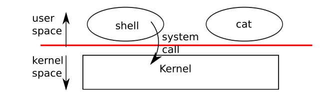
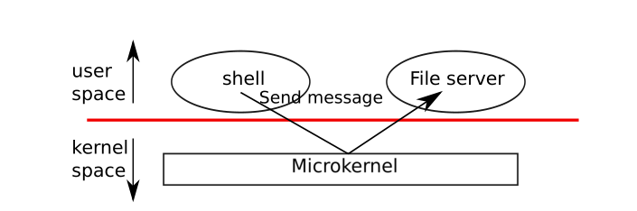
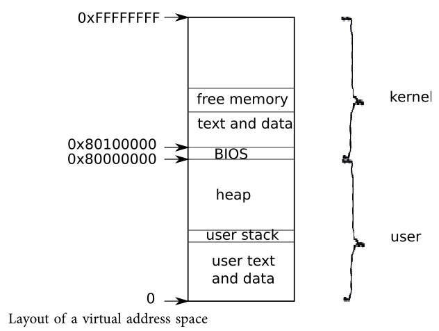
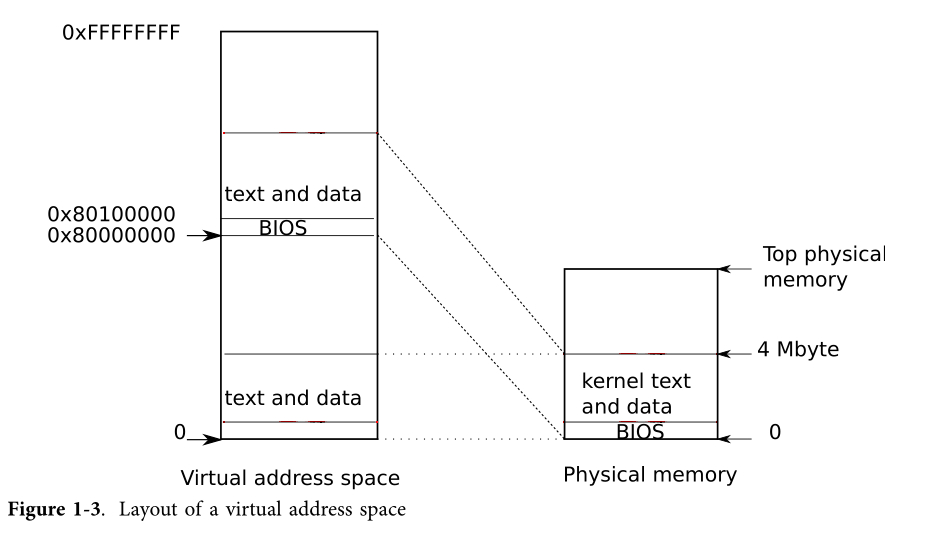
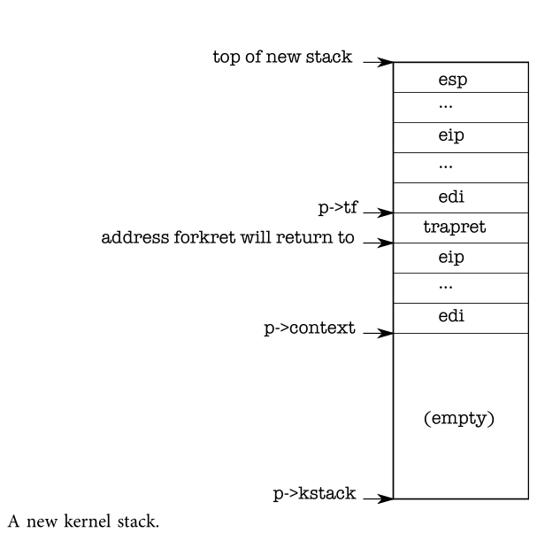
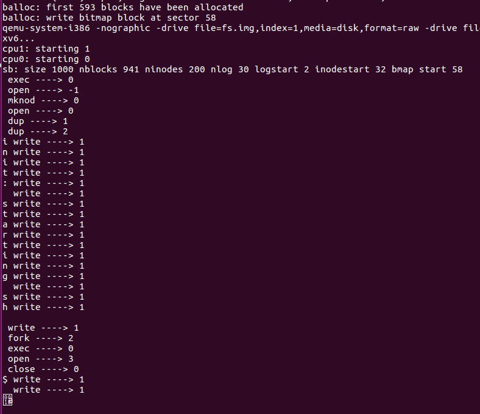
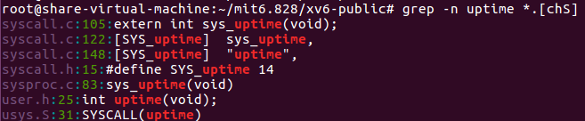
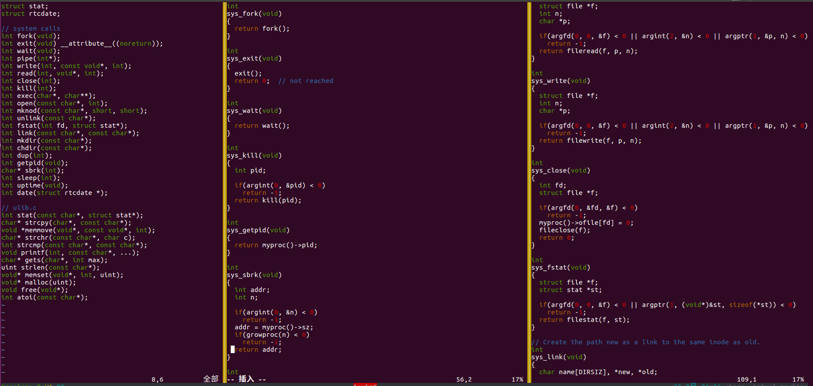

## 理论知识

### User mode，kernel mode，and sytem calls

强大的隔离需要一个坚固的边界在application和操作系统之间。当一个application出错了，我们不希望操作系统运行失败也不希望其他applications运行失败，相反操作系统需要去清除掉这个运行出错的程序，同时继续运行其他程序。为了实现强大的隔离（isolation），操作系统必须安排应用程序不能修改甚至读取操作系统的数据结构和指令，并且不能访问其他进程的内存。

处理器为强隔离提供了硬件上的支持，举个例子，x86处理器可以在执行指令的时候有两种模式：kernel mode 和user mode，这点很多其他的处理器也一样。在kernel mode下，处理器允许执行privileged instructions，比如读写磁盘文件或者其他I/O设备需要privileged instructions。如果一个user mode下的程序想要尝试执行，privileged instructions，处理器将不会执行这条指令，而是切换到kernel mode，这样子在kernel mode下的software可以清楚掉这个应用程序，因为它做了它不该做的。an application只能执行user mode下可以使用的指令，并且只能跑在用户空间上，然而kernel mode下的software也可以执行privileged instructions，这个是跑在kernel space上的。跑在kernel space上或者kernel mode下的软件叫做kernel。



an application想要读写一个在disk上的file，必须转变到内核里去执行，因为application本身不能执行I/O指令。处理器提供了一个特殊的指令，可以将处理器从user mode转变为kernel mode，并且在特定的内核进入点进入kernel（x86就提供了`int`指令）。一旦处理器转变为kernel mode，内核就可以验证system call的参数了，决定是否允许这个application去执行请求的操作，可能拒绝也可能执行。内核设置了转变为kernel mode的进入点这点是很重要。如果一个程序可以决定这个内核进行点，那么一个恶意的程序可以跳过参数检验而直接进入内核。

### kernel organization

设计中一个关键的问题是操作系统那一部分应该在kernel model下运行呢？一种是操作系统整块都在kernel中，这种organization是被叫做monolithic kernel。在这种organization下，整个操作系统带着全部的hardware privilege在那运行着。这种organization是很方便的，因为操作系统设计者不用去决定操作系统的哪一部分不需要全部的hardware privilege。而且，操作系统不同的部分的合作是很方便的。举个例子，操作系统可能有一个buffer cache，这个cache可以同时被文件系统和虚拟内存系统分享。而一个不好的一点就是monolithic kernel在实现操作系统不同部分的接口的时候是很复杂的，并且操作系统开发者很容易make a mitake。而对于monolithic kernel来说，一个错误是致命的，因为在kernel mode下的一个错误会经常导致整个kernel fail。那么kernel fail，整个计算机停止了工作，因此所有的应用程序也就fail。

为了减少kernel错误的风险，OS设计师必须让最小量的操作系统的代码，跑在kernel model中，而操作系统大部分代码则执行在用户模式。这种内核organization叫做microkernel。如下图所示，文件系统则作为一个user-level的进程。



系统的一些服务如上述的文件系统，则被叫做servers。为了可以和file server通信，内核提供了一个进程间通信的机制，将消息从一个user-mode的进程发送到另一个。举个例子，shell进程想要读写一个文件，那么shell将会发送一个消息给file server，然后等待回复。在microkernel中，kernel的接口由一些low-level的函数组成，用于启动一个应用程序，发送消息，访问硬件设备。这种organization允许内核可以相对简单的，因为操作系统的大部分是作为user-level servers的。

xv6内核的实现是monolithic kernel，这点遵循大部分Unix操作系统。因此在xv6中，内核接口和操作系统接口是一致的，内核实现了整个完成的操作系统。然而由于xv6没有很多services，它的内核比一些microkernels还要小。

> 这一块主要讲的是kernel的组织有两种方式，一是内核即整个操作系统，大部分unix系统采用的就是这种方式，第二种内核是主要部分，操作系统的其他部分是作为user-level的servers在那提供services。

### Process overview

xv6隔离的单元是一个进程，其他Unix操作系统也是这么做的。一个抽象的进程会阻止一个进程破坏或窥探另一个进程的内存、CPU、文件描述符等，也阻止一个进程破坏内核，所以一个进程不能推翻内核的隔离机制。内核必须小心的实现进程抽象，因为一个有bug的应用程序或者一个恶意的应用程序会窃取内核或者硬件去做something bad（比如绕过隔离机制）。内核用来实现进程的机制，包括了user/kernel mode flag、address spaces和时间切片线程。为了加强隔离，抽象的进程给程序提供了一个它只有自己私有机器的假象。一个进程给一个程序提供了一个看起来是私有的内存系统或者地址空间，这地址空间或者内存系统其它进程是不能读写的，同时提供了一块看起来属于它自己用于执行指令的CPU。

xv6使用通过硬件实现的page tables给每一个进程它自己的地址空间。x86的page table 将一虚拟地址转换（translates or maps）为一物理地址，这个物理地址是处理器芯片（process chips）发送到主存储器的地址。xv6为**每一个进程维持着一张单独的页表（separate page table）,这张表定义了进程的地址空间。 **一个地址空间包括了从虚拟地址0开始的进程的user memory，按照顺序依次为指令，global variables，stack，以及最后的堆区（for malloc），当然process需要的时候可以扩展。如下图所示：



每一个进程的地址空间都映射着内核的指令和数据以及用户程序的内存。当一个process调用一个system call，这system call在进程地址空间的内核映射区执行。而正是因为这种安排，内核的system call code可以直接引用user memory。为了给user memory留下足够的空间，xv6的地址空间把kernel映射到从0x80000000开始的高地址处。

xv6内核为每一个进程维护着许多状态块，状态块的信息收集在`struct proc`中。一个进程最重要的内核状态块是它的page table、kernel stack和它的run state。每一个进程都有一个执行线程（也就是线程）去执行进程的指令，一个线程可以被挂起和恢复。为了在线程之间切换，内核挂起当前正在执行的线程，然后恢复另一个线程。线程的大部分状态比如局部变量（local variable）、函数调用的返回地址，都存储在线程的stack中。每一个进程有两个栈 ，一个用户栈（user stack）一个内核栈（kernel stack）。当进程正在执行用户指令的时候，只有user stack是在使用的，这个时候它的kernel stack是空的。当一个进程进入内核（为了system call或者interrupt），内核代码执行在内核的stack上，在内核执行期间，user stack仍然保留保存的数据，但是不能使用了。因为内核栈是独立的所以即使一个进程破坏了它的user stack，内核还是可以执行的。

当一个进程调用了一个system call，处理器转移到内核栈，提高hardware privilege level，然后开始执行实现了system call的内核指令。当system call执行完成，内核返回到user space，降低hardware privilege level，切换回到user stack并且重新执行用户指令。一个进程的线程可以在内核中阻塞（block）去等待I/O，当他执行完I/O操作之后，然后从它结束的地方重新开始。



p->state表明进程是否已经被分配了的，是否准备好运行了，等等。

p->pgdir，存着进程的page table，这个page table是以x86期待的格式。xv6在执行这个进程的时候，会让分页的硬件去使用进程的p->pgdir。一个进程的页表还充当着记录存储进程内存的物理页的地址（A process’s page table also serves as the record of the addresses of the physical pages allocated to store the process’s memory.）

> 这块主要讲的是进程的大体情况，每一个进程都有自己的地址空间，从虚拟地址0开始依次为global variables，stack，以及最后的堆区（for malloc），同时还有内核程序。同时进程还有自己的一个进程状态信息块，以及进程在user mode和kernel中切换之后的一些变换。

### Code: the first address space

当一台PC机开启之后，它初始化它自己，然后从disk中加载一个boot loads到内存中，然后执行它。xv6的boot loader把xv6的内核加载到内存中，从内核的`entry`处开始执行（1044），此时x86的paging hardware还是没有启动的，虚拟地址直接映射到物理地址上（然而lab2的实验我们发现这个虚拟地地址是叫做线性地址的）。boot loader把xv6的内核加载到物理地址为0x100000的地方。为什么不将内核加载到0x80100000的原因是因为对于小机器来说可能没有如此高的物理地址，而为什么不将kernel加载到0x处是因为从0xa0000到0x100000的物理内存处包含了I/O设备。

为了允许内核剩下的部分可以跑起来，entry建立了一个page table，这个page table将虚拟地址0x80000000开始的地方映射到了物理地址0x0开始的地方了。将两块虚拟地址映射到这相同的物理地址区域是一种page tables中很常见的方法，我们会看到很多这样子的例子。entry中定义的page table定义在main.c中，这个是简单版本的，简单来说这个page table映射虚拟地址0x0:0x400000到物理地址0x0:0x400000，当运行在低地址的时候，这种映射是需要的，但是后面会将这个移掉，同时这个page table还映射了虚拟内存KERNBASE:KERNBASE+0x400000到物理地址0x0:0x400000，这块区域的映射是用于内核的，因为它将内核期望待的高的虚拟地址映射到了低的物理地址。但是这种映射只限制了4MB。

```c
1305 __attribute__((__aligned__(PGSIZE)))
1306 pde_t entrypgdir[NPDENTRIES] = {
1307 // Map VA’s [0, 4MB) to PA’s [0, 4MB)
1308 [0] = (0) | PTE_P | PTE_W | PTE_PS,
1309 // Map VA’s [KERNBASE, KERNBASE+4MB) to PA’s [0, 4MB)
1310 [KERNBASE>>PDXSHIFT] = (0) | PTE_P | PTE_W | PTE_PS,
1311 };
```

之后会将`entrypgdir`的物理地址加载到控制寄存器`%cr3`，在`%cr3`中的值必须是物理地址，假如`%cr3`里面存的是虚拟地址的话，那么paging hardware都不知道怎么转换这个虚拟地址，因为paging hardware需要从`%cr3`里面存的地址找到page tables表。entrypgdir指的是一个高内存的地址，我们需要减去KERNBASE就能得到它对应的物理地址。并且为了使能paging hardware，xv6对`%cr0`中的CR0_PG位进行设置。

```assembly
1044 entry:
1045 # Turn on page size extension for 4Mbyte pages
1046 movl %cr4, %eax
1047 orl $(CR4_PSE), %eax
1048 movl %eax, %cr4
1049 # Set page directory
1050 movl $(V2P_WO(entrypgdir)), %eax
1051 movl %eax, %cr3
1052 # Turn on paging.
1053 movl %cr0, %eax
1054 orl $(CR0_PG|CR0_WP), %eax
1055 movl %eax, %cr0

1057 # Set up the stack pointer.
1058 movl $(stack + KSTACKSIZE), %esp
1059
1060 # Jump to main(), and switch to executing at
1061 # high addresses. The indirect call is needed because
1062 # the assembler produces a PC−relative instruction
1063 # for a direct jump.
1064 mov $main, %eax
1065 jmp *%eax
```

当paging is enabled之后，处理器仍然在低地址处执行指令，这是因为entrypgdir映射了低地址。假如省略了ertry时entrypgdir中条目0的映射，那么当计算机执行启动paging之后的那条指令时将会崩溃。现在entry需要转移到内核的C代码，并且需要运行在高地址区。在此之前它首先需要让栈指针%esp指向将会被用作stack的内存地址。所有的符号都是高地址，包括stack，所以当低地址的映射区被移除掉了那么stack还是有效的。最后entry跳转到main处执行，这个main自然也是一个高地址。然而这个间接跳转是必需的，假如不是间接的话，汇编器将会另外的产生一个相当PC的直接跳转，而这将执行低地址处的main了。执行完main之后，不能return，因为stack上没有main返回的地址。完成上述的步骤之后，kernel在main函数中就跑在高地址区了。

> 个人总结：上述的第一块地址空间，主要是讲kernel中entry.S这个文件中怎么建立第一块地址空间的，以及建立之后相应执行的流程。

### Code: creating the first process

下面将会介绍内核如何建立第一个user-level的进程，并且确保它是strongly isolated。在main函数初始几个devices和subsystems之后，main函数将会调用userinit函数创建第一个进程

```c
1216 int
1217 main(void)
1218 {
1219 	kinit1(end, P2V(4*1024*1024)); // phys page allocator
1220 	kvmalloc(); // kernel page table
1221 	mpinit(); // detect other processors
1222 	lapicinit(); // interrupt controller
1223 	seginit(); // segment descriptors
1224 	picinit(); // disable pic
1225 	ioapicinit(); // another interrupt controller
1226 	consoleinit(); // console hardware
1227 	uartinit(); // serial port
1228 	pinit(); // process table
1229 	tvinit(); // trap vectors
1230 	binit(); // buffer cache
1231 	fileinit(); // file table
1232 	ideinit(); // disk
1233 	startothers(); // start other processors
1234 	kinit2(P2V(4*1024*1024), P2V(PHYSTOP)); // must come after startothers()
1235 	userinit(); // first user process
1236 	mpmain(); // finish this processor’s setup
1237 }
```

```c
2518 // Set up first user process.
2519 void
2520 userinit(void)
2521 {
2522 	struct proc *p;
2523 	extern char _binary_initcode_start[], _binary_initcode_size[];
2524
2525 	p = allocproc();
2526
2527 	initproc = p;
2528 	if((p−>pgdir = setupkvm()) == 0)
2529 		panic("userinit: out of memory?");
2530 	inituvm(p−>pgdir, _binary_initcode_start, (int)_binary_initcode_size);
2531 	p−>sz = PGSIZE;
2532 	memset(p−>tf, 0, sizeof(*p−>tf));
2533 	p−>tf−>cs = (SEG_UCODE << 3) | DPL_USER;
2534 	p−>tf−>ds = (SEG_UDATA << 3) | DPL_USER;
2535 	p−>tf−>es = p−>tf−>ds;
2536 	p−>tf−>ss = p−>tf−>ds;
2537	p−>tf−>eflags = FL_IF;
2538 	p−>tf−>esp = PGSIZE;
2539 	p−>tf−>eip = 0; // beginning of initcode.S
2540
2541 	safestrcpy(p−>name, "initcode", sizeof(p−>name));
2542 	p−>cwd = namei("/");
2543
2544 	// this assignment to p−>state lets other cores
2545 	// run this process. the acquire forces the above
2546 	// writes to be visible, and the lock is also needed
2547 	// because the assignment might not be atomic.
2548 	acquire(&ptable.lock);
2549 
2550 	p−>state = RUNNABLE;
2551
2552 	release(&ptable.lock);
2553 }
```

---

在userinit函数中，刚开始就是调用allocproc函数，这个函数的工作就是在process table中分配一个slot，然后初始化内核线程执行所需要的部分进程状态。allocproc函数会被每一个进程所调用，userinit只是为了第一个进程调用了它。**allocproc扫描process table寻找一个UNUSED slot，一旦找到一个unused slot之后，将会把这状态设置为EMBRYO（标志着它被使用了），并且给它一个pid。**

```c
//PAGEBREAK: 32
// Look in the process table for an UNUSED proc.
// If found, change state to EMBRYO and initialize
// state required to run in the kernel.
// Otherwise return 0.
static struct proc*
allocproc(void)
{
  struct proc *p;
  char *sp;

  acquire(&ptable.lock);

  for(p = ptable.proc; p < &ptable.proc[NPROC]; p++)
    if(p->state == UNUSED)
      goto found;
  
  release(&ptable.lock);
  return 0;

found:
  p->state = EMBRYO;
  p->pid = nextpid++;
  
  release(&ptable.lock);
```

之后会尝试给这个进程的kernel分配一个kernel stack。如果内存分配失败，allocproc将这个slot的状态改为UNUSED并且返回0标识失败信号。一旦分配成功，allocproc必须对新进程的kernel stack进行设置。

```c
  // Allocate kernel stack.
  if((p->kstack = kalloc()) == 0){
    p->state = UNUSED;
    return 0;
  } 
  sp = p->kstack + KSTACKSIZE;
  
  // Leave room for trap frame.
  sp -= sizeof *p->tf;
  p->tf = (struct trapframe*)sp;
  
  // Set up new context to start executing at forkret,
  // which returns to trapret.
  sp -= 4;
  *(uint*)sp = (uint)trapret;

  sp -= sizeof *p->context;
  p->context = (struct context*)sp;
  memset(p->context, 0, sizeof *p->context);
  p->context->eip = (uint)forkret;
  
  return p;
}
```

经过上述步骤，一个配置好的kernel stack如下图所示：



`allocproc`将会对这个新的进程配置一个准备好的特别格式的kernel stack和一组kernel寄存器，这组寄存器可以让它在第一次执行的时候返回user space。（部分返回的工作，主要借助于返回程序计数器来实现，这些返回程序计数器的值将会让进程的内核线程首先执行`forkret`然后再执行`trapret`。这点主要是因为内核线程会执行从p->context拷贝过来的寄存器内容，因此当设置p->context->eip为forkret时将会导致内核线程先执行forkret，而forkret将会返回stack底部的任何地址。然后context switch code将会设置stack pointer指向刚刚超过p->context末尾位置的地方。在`allocproc`函数中，它把p->context置于stack中，并且让一个指针指向它上方的trapret，而这个位置也是forkret将会返回的地方。之后trapret通过存储在kernel stack上方的值来恢复用户寄存器，并且跳转到进程中）。普通`fork`和创建第一次进程时候都会执行上述返回的步骤，只是后者将会在user-space为0的地方开始执行而不是从`fork`返回的地方执行。

将user software转换到内核是通过中断机制来的，中断机制被用于system calls、interrupts和exceptions。每当进程在运行的时候，控制转移到内核之后，hardward和xv6会trap entry code，把user寄存器的值保存在进程的kernel stack上。而在`userinit`中写到stack上面的值看起来就像通过一个中断（2553-2539）进入内核的值，这样子做对于从kernel返回到进程的user code也可以被顺利执行。stack上面的值是一个`struct trapframe`，这个结构体中存储着user寄存器。

---

进程的一些初始化工作完成之后，将准备执行第一个进程的第一个程序（initcode.S（8400））。进程需要物理内存来存储该程序，之后该程序会复制到该内存，并且进程需要一个页表来将用户空间地址映射到该内存。`userinit`调用`setupkvm`给一个进程创造一个page table，在最开始的时候，这个page table仅仅映射kernel 使用的内存。我们将会在chapter2学习这个函数细节，但是在高级的`setupkvm`和`userinit`中，将会创造一个地址空间就像下图所示一样：


第一个进程的user-space内存的初始化内容是initcode.S的编译形式。作为kernel build process的一部分，linker将该二进制代码嵌入到内核中，并且定义了两个特殊的符号_binary_initcode_start and _binary_initcode_size，这两个符号表示binary的起始位置和大小。userinit通过调用inituvm把这个二进制文件拷贝到新进程的内存：inituvm分配一个物理页，然后映射虚拟地址0到该内存，然后将二进制文件拷贝进那个物理页。

`userinit`用初始的user mode state来初始化trap frame：%cs寄存器包含了一个SEG_UCODE段的段选择子，这个SEG_UCODE段运行在privilege为DPL_USER(这是user mode而不是kernel mode)下。%ds,%es和%ss则是SEG_UDATA，运行在privilege 为DPL_USER下。%eflags FL_IF位是被设置为允许硬件中断的。stack pointer %esp被设置为最大有效的虚拟地址p->sz。指令pointer被设置为initcode的entry point，地址0。p->name被userinit设置为initcode主要是为了方便调试；p->cwd表示进程当前的工作目录，我们在chapter 6将会更详细地检查namei。经过上面这些步骤之后，userinit通过设置p->state为RUNNABLE，表示这个进程是可以用的了。

> 本节主要是讲第一个进程的初始化过程，首先是通过`allocproc`在进程表中寻找一个slot，一旦找到之后则分配一个kernel stack，并对这个stack进行一些“规划”，设置栈的格式。之后通过`setupkvm`来设置进程的page table，然后通过`inituvm`分配一个物理页，然后映射虚拟地址0到上述程序拷贝的内存，最后将需要运行的程序拷贝到那个物理页中。再之后就是来初始化`trap frame`了，最后的最后这是将这个进程的状态修改为RUNNABLE.

### Code: Running the first process

创建完一个进程之后，接下来就是运行该进程了。在main函数调用完`userinit`之后，是`mpmain`，这个函数会调用`scheduler`开始运行一个进程。

```c
//PAGEBREAK: 42
// Per-CPU process scheduler.
// Each CPU calls scheduler() after setting itself up.
// Scheduler never returns.  It loops, doing:
//  - choose a process to run
//  - swtch to start running that process
//  - eventually that process transfers control
//      via swtch back to the scheduler.
void
scheduler(void)
{
  struct proc *p;
  struct cpu *c = mycpu();
  c->proc = 0;
  
  for(;;){      
    // Enable interrupts on this processor.
    sti();

    // Loop over process table looking for process to run.
    acquire(&ptable.lock);
    for(p = ptable.proc; p < &ptable.proc[NPROC]; p++){
      if(p->state != RUNNABLE) 
        continue;

      // Switch to chosen process.  It is the process's job
      // to release ptable.lock and then reacquire it
      // before jumping back to us.
      c->proc = p;
      switchuvm(p);
      p->state = RUNNING;

      swtch(&(c->scheduler), p->context);
      switchkvm();

      // Process is done running for now.
      // It should have changed its p->state before coming back.
      c->proc = 0;
    }
    release(&ptable.lock);

  }
}
```

`scheduler`函数中首先会在process table中寻找一个p->state =RUNNABLE的进程（上面我们只创建了一个进程`initproc`）。之后它设置c->proc为当前找到的一个进程，然后调用`switchuvm`函数，告诉硬件开始使用目标进程的page table（当在kernel中执行时，更改page table是有效的，因为`setupkvm`让所有进程的page tables对kernel的数据和data有了相同的映射）。`switchuvm`还设置了一个任务状态段：SEG_TSS，这个任务状态段表明硬件在进程的kernle stack执行system call和中断。在chapter 3中，我们将会重新检查这个任务状态段。

```c
// Switch TSS and h/w page table to correspond to process p.
void
switchuvm(struct proc *p)
{
  if(p == 0)    
    panic("switchuvm: no process");
  if(p->kstack == 0)
    panic("switchuvm: no kstack");
  if(p->pgdir == 0)
    panic("switchuvm: no pgdir");

  pushcli();
  mycpu()->gdt[SEG_TSS] = SEG16(STS_T32A, &mycpu()->ts,
                                sizeof(mycpu()->ts)-1, 0);
  mycpu()->gdt[SEG_TSS].s = 0;
  mycpu()->ts.ss0 = SEG_KDATA << 3;
  mycpu()->ts.esp0 = (uint)p->kstack + KSTACKSIZE;
  // setting IOPL=0 in eflags *and* iomb beyond the tss segment limit
  // forbids I/O instructions (e.g., inb and outb) from user space
  mycpu()->ts.iomb = (ushort) 0xFFFF; 
  ltr(SEG_TSS << 3);
  lcr3(V2P(p->pgdir));  // switch to process's address space
  popcli();
}
```

再这之后，`scheduler`设置p->state为RUNNING，并且调用`swtch`来执行一个context switch到目标进程的kernel thread。`swtch`首先保存当前寄存器的值：因为当前context不是一个进程而是一个特殊的cpu scheduler conext（cpu调度的上下文），所以`scheduler`通过`swtch`保存当前硬件寄存器的值到per->cpu storage（cpu->scheduler）而不是保存到任何进程的kernel thread context。然后`swtch`将目标kernel thread已保存的寄存器的值（p->context）加载到x86硬件寄存器，包括stack指针和instruction指针。~~我们将会在chapter 5详细地检查swtch。~~最后的`ret`指令从stack中将目标进程的%eip弹出，完成这个上下文转换。自此，处理器运行在进程p的kernel stack上。

```assembly
# Context switch
#
#   void swtch(struct context **old, struct context *new);
.globl swtch    
swtch:
  movl 4(%esp), %eax
  movl 8(%esp), %edx

  # Save old callee-saved registers 
  pushl %ebp    
  pushl %ebx
  pushl %esi    
  pushl %edi    
      
  # Switch stacks
  movl %esp, (%eax)
  movl %edx, %esp

  # Load new callee-saved registers
  popl %edi     
  popl %esi
  popl %ebx     
  popl %ebp     
  ret
```

因为`allocporc`中之前已经设置initproc的p->context->eip为`forkret`，所以这个返回值先开始执行`forkret`。

```c
// A fork child's very first scheduling by scheduler()
// will swtch here.  "Return" to user space.
void
forkret(void)
{
  static int first = 1;
  // Still holding ptable.lock from scheduler.
  release(&ptable.lock);

  if (first) {
    // Some initialization functions must be run in the context
    // of a regular process (e.g., they call sleep), and thus cannot
    // be run from main().
    first = 0;
    iinit(ROOTDEV);
    initlog(ROOTDEV);
  }

  // Return to "caller", actually trapret (see allocproc).
}
```

在`forkret`中，首先执行初始化函数，这个初始化函数不能从main那被调用，是因为它们必须在有自己kernel stack的进程的上下文中运行。之后`forkret`返回。`allocproc`在p->context被弹出之后，栈顶的元素将会是`trapret`，那么之后`trapret`将会开始执行，%esp将会设置为p->tf。trapret使用pop指令从trap frame中回复寄存器，就像`swtch`中对kernel context进行转化一样：`popal`恢复一些通用寄存器，然后`popl`指令恢复 %gs, %fs, %es, and %ds。`addl`跳过两个字段trapno和errcode。最后，`iret`指令从栈中弹出 %cs, %eip, %flags, %esp, and
%ss。完成之后，trap frame的内容都转移到CPU的状态中去了，而trap frame中指明%eip的值，所以处理器继续在%eip中运行。

```assembly
.globl trapret
trapret:
  popal
  popl %gs
  popl %fs
  popl %es
  popl %ds
  addl $0x8, %esp  # trapno and errcode
  iret
```

对于`initproc`来说，虚拟地址为0的地方即是initcode.S的第一条指令。%eip为0，%esp为4096，这些都是进程地址空间中的虚拟地址，处理器的paging hardware将他们转化为物理地址。由于`allocuvm`设置了进程的page table，所以虚拟地址0才可以指向分配给这个进程的物理内存，并且设置了一个PTE_U，这个标识告诉paging hardware允许user code访问内存。事实上`userinit`在设置%cs的低位的时候，让进程的user code运行在CPL=3时，这也就意味着user code只有在设置了PTE_U的时候才能使用pages，并且不能修改敏感的hardware 寄存器比如%cr3，所以进程只能使用它自己的内存。

### The first system call: exec 

下面我们来看一下一个use-level的进程是如何在重新进入kernel请求它服务的。initcode.S的第一个行为就是去请求一个`exec`system call。正如我们在chapter 0看到的那样，`exec`会当前进程的memory和寄存器用一个新的程序替代掉，但是它留下file descriptors、process id 和父进程没有替换。initcode.S开始的时候把\$argv、\$init、\$0这三个值放入栈中，然后设置%eax为SYS_exec然后执行`int $T_SYSCALL`。这会让kenrel开始执行`exec`system call，如果一切顺利，exec将永远不返回：它开始运行由\$init命名的程序（\$init指向了/init\0的字符串），另一个参数是`argv`数组，这个数组包括了命令行参数，这个数组的末尾的0标识着它是结束符。如果exec执行失败并且返回了，那么initcode将会循环执行反复调用`exit`system call，这个system call定义了将不会返回。这里面的代码手动实现第一次system call就像一个普通的system call一样。这个跟之前一样，这一步避免了对第一个进程的特殊封装，而是重复使用xv6必须为给标准操作提供的代码。

```assembly
#include "syscall.h"
#include "traps.h"


# exec(init, argv)
.globl start
start:
  pushl $argv
  pushl $init
  pushl $0  // where caller pc would be
  movl $SYS_exec, %eax
  int $T_SYSCALL

# for(;;) exit();
exit:
  movl $SYS_exit, %eax
  int $T_SYSCALL
  jmp exit

# char init[] = "/init\0";
init:
  .string "/init\0"

# char *argv[] = { init, 0 };
.p2align 2
argv:
  .long init
  .long 0
```

chapter 2将会详细介绍`exec`的实现细节，但是站在一个高层次的角度来看，上述操作拿/init binary的操作代替了initcode的内容。现在initcode已经结束了，进程将会开始运行/init的内容了。init根据需求来创建了一个新的console device file，然后打开它的file descriptor0,1,2。然后开始循环，开启一个console shell处理orphaned zombies直到shell，然后重复。这样整个系统就是开起来了。

### Real world

在现实世界中，可以同时找到monolithic kernels和microkernels。很多unix kernels是monolithic kernels，比如Linux，虽然Linux有些OS function是作为user-level servers，但是Linux的内核是monolithic。但是有些kernels比如L4、Minix、QNX是microkernel的，并且带有服务的，这种已经在嵌入式当中有很大的部署了。

大部分操作系统采用了进程的概念，并且大部分进程看起来像xv6。但是现实的操作系统中会通过一个显示的空闲链表在常数时间中找到一个空闲的proc structure，而不是像allocproc那样通过线性时间查找。xv6是为了简单起见，所以才使用一个线性查找。

## 实验

### 系统调用跟踪（System call tracing）

修改xv6的内核，为每一次的系统调用打印一行内容。**打印的内容包括系统调用的名字以及它的返回值**，不需要打印系统调用时候的参数值。主要通过修改syscall.c中的syscall()函数来实现。从syscall的一开始注释的内容，我们可以知道：

```c
// User code makes a system call with INT T_SYSCALL.
// System call number in %eax.
// Arguments on the stack, from the user call to the C
// library system call function. The saved user %esp points
// to a saved program counter, and then the first argument.
```

user code 通过`INT T_SYSCALL`来进行一次system call，这个system call的数字存在`eax`这个寄存器中，参数是存放在stack中，这点很关键哦。那么下面来看一下这个函数：

```c
static int (*syscalls[])(void) = {
[SYS_fork]    sys_fork,
[SYS_exit]    sys_exit,
......
};

void
syscall(void)
{
  int num;
  struct proc *curproc = myproc();  
  
  num = curproc->tf->eax; 
  if(num > 0 && num < NELEM(syscalls) && syscalls[num]) {
    curproc->tf->eax = syscalls[num]();    
  } else {
    cprintf("%d %s: unknown sys call %d\n", curproc->pid, curproc->name, num);
    curproc->tf->eax = -1; 
  }
}
```

`num = curproc->tf->eax`，这个数就是上面注释所说的system call number，那么这个数是和一个system call函数相关对应的，只要拿到这个数，那么就可以调用相应的函数。代码中的`static int (*syscalls[])(void)`，表示一个函数指针数组（即数组里面的元素都是函数指针）。只要得到了相应的system call number，那么我们就可以调用相应的函数。同理我们也可以申请一个字符串数组，数组里面存着system call的函数名，当传入system call number的时候，就可以拿到这个system call的函数名了。代码中`curproc->tf->eax = syscalls[num]();  `，这句表示执行相应的函数，并将返回值存到`curproc->tf->eax`中，因此根据上面，我们可以写出如下代码：

```c
static char *syscall_names[] = { 
[SYS_fork]    "fork",
[SYS_exit]    "exit",
[SYS_wait]    "wait",
[SYS_pipe]    "pipe",
[SYS_read]    "read",
[SYS_kill]    "kill",
[SYS_exec]    "exec",
[SYS_fstat]   "fstat",
[SYS_chdir]   "chdir",
[SYS_dup]     "dup",
[SYS_getpid]  "getpid",
[SYS_sbrk]    "brk",
[SYS_sleep]   "sleep",
[SYS_uptime]  "uptime",
[SYS_open]    "open",
[SYS_write]   "write",
[SYS_mknod]   "mknod",
[SYS_unlink]  "unlink",
[SYS_link]    "link",
[SYS_mkdir]   "mkdir",
[SYS_close]   "close",
[SYS_date]    "date",
};


void
syscall(void)
{
  int num;
  struct proc *curproc = myproc();  // create a process

  num = curproc->tf->eax; // the number of system call
  if(num > 0 && num < NELEM(syscalls) && syscalls[num]) {
    curproc->tf->eax = syscalls[num]();//the return of system call 
    cprintf("%s ----> %d\n", syscall_names[num], curproc->tf->eax);
  } else {
    cprintf("%d %s: unknown sys call %d\n",
            curproc->pid, curproc->name, num);
    curproc->tf->eax = -1; 
  }
}
```

> 可能会有疑问，有没有不自己加函数名字符串数组的方法？一开始的时候，我觉得内核代码中应该给我们弄好了函数名，但是找遍了结构体之后，发现只有进程的名字而没有函数名。其实简单想一下，也知道，对于内核代码中函数名并没有啥用，所以内核当然不会加了。（有点强行的解释吧）

上述添加的代码保存之后，依次`make clean`、`make`、`make qemu-nox`，运行结果竟然如下图所示：



其实上述是正常的结果，因为shell的输出和system call trace里面的输出是一样的，所以它们会混淆，所以测试完之后，记得注销掉添加的代码。

### 日期系统调用

添加一个系统调用，这个系统调用会得到当前UTC时间，并将这个时间返回。可以使用lapic.c中的`cmostime()`函数读取真正的时间。date.h包含了`struct rtcdate`的定义，这个结构体的指针类型可以作为`cmostime()`函数的参数。为了调用新编的system call函数，我们首先需要一个user-level的程序去调用它，homework里面给出了一段user-level的程序，在这段代码中需要添加的只是时间输出的问题，其中`struct rtcdate`如下：

```c
struct rtcdate {
  uint second;
  uint minute;
  uint hour;
  uint day;
  uint month;
  uint year;
};
```

最终date.c中的代码修改为（按照自己的想要的格式来输出）：

```c
#include "types.h"
#include "user.h"
#include "date.h"

int
main(int argc, char *argv[])
{
  struct rtcdate r;

  if (date(&r)) {
    printf(2, "date failed\n");
    exit();
  }

  // your code to print the time in any format you like...
  printf(1, "The time now is %dyear %dmonth %dday %dhour %dminute %dsecond\n", r.year, r.month, r.day, r.hour, r.minute, r.second);
  exit();
}
```

从上述的user-level程序可以看到，`date(&r)`这个函数会让我们去调用相应的system call函数，那么相应的system call的函数名是什么勒？homework中提示让我们参考`uptime`来，如下图所示



那么通过`user.h`中的`int uptime(void);`和`sysproc.c`中的`sys_uptime()`可以看出，user-level中调用`uptime`函数的话，最后会去调用`sys_uptime()`函数，其实我们可以查看一下`user.h`和`sysproc.c`和`sysfile.c`这三个文件，发现都是这样子的套路，所以我们添加的查看时间的system call函数名应该是`sys_date`，



下面就按照uptime的输出的来依次再相应文件中添加上相应的内容，

- syscall.h中填上对`SYS_date`的宏定义，`#define SYS_date   22`

- 在syscall.c中添加`extern int sys_date(void);`，syscalls这个函数指针数组中最后添加上`[SYS_date]    sys_date,`，system call的函数名数组最好也添加上。

- user.h中相应的位置添加上`int date(struct rtcdate *); `

- usys.S中相应的位置添加上`SYSCALL(date)`

- 最后是在`sysproc.c`中实现这个system call函数

  ```c
  // return current UTC time
  int sys_date(void){
    struct rtcdate *r;
    if(argptr(0, (void *)&r, sizeof(*r))){
      return -1;
    }
    cmostime(r);
    return 0;
  }
  ```

  其中`argptr`是对参数进行初始化，之前提到，调用system call的时候，会把相应的调用参数放在栈中,那么这部操作就是取这个参数的。（HIin：设计到多级指针操作，画图会更加直观）

  ```c
  // Fetch the nth word-sized system call argument as a pointer
  // to a block of memory of size bytes.  Check that the pointer
  // lies within the process address space.
  int argptr(int n, char **pp, int size);
  ```
  
  
  
  
  
  

