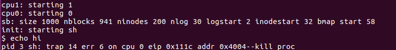

xv6应用程序使用`sbrk()`system call来向kernel 请求heap memory。在kernel中已经实现了，sbrk()分配物理内存并且映射它到进程的虚拟地址。有些程序分配了内存，但不使用他们，比如在实现大型稀疏矩阵的时候。复杂的kernel延迟分配每一页的内存直到应用程序尝试使用这个页，这是由页面错误发出的信号。在这个练习中，我们要添加这种延迟分配的特点到xv6上。

## Part One: Eliminate allocation from sbrk()

这个任务主要是从`sbrk`system call的实现中把页分配给删掉，这个实现在`sysproc.c`中的`sys_sbrk()`中。`sbrk(n)`system call让进程的内存增长n个字节，然后返回新分配区域的开始地方。你现在新的`sbrk(n)`不应该分配内存，所以你可以删掉`growproc()`的调用，但是你仍然需要增加进程的大小！！

下面按照实验要求，将`sys_sbrk()`中分配内存的代码删除掉，但是进程的大小仍然要增加，如下

```c
int
sys_sbrk(void)
{
  int addr, newsz;
  int n;

  if(argint(0, &n) < 0)
    return -1;
  addr = myproc()->sz;
  newsz = addr + n;
  if(newsz >= KERNBASE){
    return -1;
  }
  myproc()->sz = newsz;
  //if(growproc(n) < 0)
  //  return -1;
  return addr;
}
```

重新`make`（记得先`make clean`），然后`make qemu-nox`，等待shell提示输入的符号出来，之后输入`echo hi`，如下图所示：



这是因为没有实际分配给他们，而只是将大小增加，这样在真正执行的时候会出错，而这个出错的类型是`T_PGFLT`。而在trap.c中的trap函数中，没有对`T_PGFLT`这种情况进行处理，所以就提示出错了。

```c
//PAGEBREAK: 13
  default:
    if(myproc() == 0 || (tf->cs&3) == 0){
      // In kernel, it must be our mistake.
      cprintf("unexpected trap %d from cpu %d eip %x (cr2=0x%x)\n",
              tf->trapno, cpuid(), tf->eip, rcr2());
      panic("trap");
    }
    // In user space, assume process misbehaved.
    cprintf("pid %d %s: trap %d err %d on cpu %d "
            "eip 0x%x addr 0x%x--kill proc\n",
            myproc()->pid, myproc()->name, tf->trapno,
            tf->err, cpuid(), tf->eip, rcr2());
    myproc()->killed = 1;
```

## Part Two: Lazy allocation

上面既然针对`T_PGFLT`的情况没有进行处理，那么我们下面修改`trap.c`中的代码，让它可以对来自用户空间的page fault有所回应，主要通过将一个新分配的物理内存页映射到错误的地址上，然后返回用户空间继续执行。

从cprintf函数结合错误的提示，我们可以知道`rcr2()`为出错位置的虚拟地址。根据提示以及参考vm.c中的` allocuvm() `代码之后，我们可以知道当出现`T_PGFLT`的情况之后，我们应该处理的是分配一块物理页，然后把出错的虚拟地址映射过去。根据上述步骤，在`trap.c`的`trap()`函数中添加一个case情况，如下所示：

```c
 // modify in hw4
case T_PGFLT:
    a = PGROUNDDOWN(rcr2());
    mem = kalloc();
    if(mem == 0){
        cprintf("trap out of memory\n");
        break;
    }
    memset(mem, 0 ,PGSIZE);
    if(mappages(myproc()->pgdir, (char*)a, PGSIZE, V2P(mem), PTE_W|PTE_U)<0){
        cprintf("trap out of memory (2)\n");
        kfree(mem);
    }
    break;
```

需要注意的是，要想使用`mappages`函数，需要将`vm.c`中mappages实现前面的staic关键字去掉，并且需要在`trap.c`中声明。vm.c中修改如下：

```c
int
mappages(pde_t *pgdir, void *va, uint size, uint pa, int perm)
{
    ......
}
```

在trap.c中添加声明

```c
// modify in hw4                                                                                 
int mappages(pde_t *pgdir, void *va, uint size, uint pa, int perm);
```

最后重新make之后，再次运行`echo hi`，效果如下：


