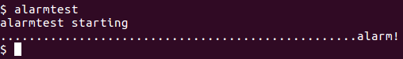
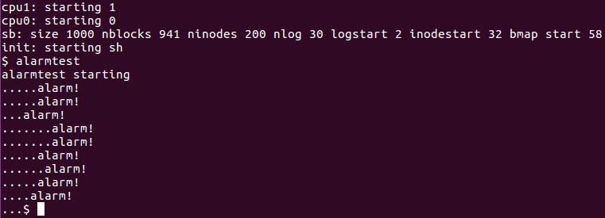

在这个实验中，我们将会向xv6里面添加一个特性，这个特性将会定期发出一个警告当一个进程在使用CPU time的时候。这对compute-bound 进程来说是相当有用的，因为我们可以限制他们消耗CPU的时间，或者对于那些想要定期的行为的进程来说也是很有用的。更加普遍的来说，你将会实现一个用户级的中断错误处理的基本方式，而这跟HW4这个实验很相似（Hint：在HW4中我们延迟了页面分配的时间点，而这会产生一个page fault，我们主要是在对这个page fault进行处理）。

在这个实验中，我们需要新增一个alarm system call。如果一个应用程序调用了`alarm(n, fn)`，那么在程序消耗n个”tick“的CPU时间之后（tick在xv6中是一个相当随意的单元时间，由硬件时间产生中断的评率决定），kernel会调用函数`fn`。需要注意的是：当`fn`返回之后，应用程序将会从它之前离开的地方重新开始（Hint：这一步需要用到栈tf）。

综合上述，简单来说我们需要实现的就是类似定时器一样的东西，它会定时执行一条函数。那么下面我们根据homework中给出的代码和提示来完成。

首先是在alarmtest.c中添加如下代码：

```c
#include "types.h"
#include "stat.h"
#include "user.h"

void periodic();

int
main(int argc, char *argv[])
{
  int i;
  printf(1, "alarmtest starting\n");
  alarm(10, periodic);
  for(i = 0; i < 25*500000; i++){
    if((i % 250000) == 0)
      write(2, ".", 1);
  }
  exit();
}

void
periodic()
{
  printf(1, "alarm!\n");
}
```

上述添加的代码中会调用`alarm(10, periodic)`，而这个调用的意思是让kernel每隔10ticks调用一次`periodic()`。添加完上述代码之后，我们需要在`Makefile`文件中，添加编译项，让新添加的`alarmtest.c`编译成一个xv6用户程序。这些步骤和HW3中是很相似的（Hint：HW3让我们添加一个system call）。如下所示在`Makefile`的`UPROGS`中添加`_alarmtest\`

```makefile
UPROGS=\
	......
  _alarmtest\
```

之后修改`user.h`文件，添加`alarm`的声明：

```c
int alarm(int ticks, void (*handler)());
```

修改`syscall.h`和`usys.S`，让`alarm`可以调用alarm system call

```c
// syscalll.h中添加如下
#define SYS_alarm  23

// usys.S中添加如下
SYSCALL(alarm)
```

接下来就是`sys_alarm`的实现，在`sysproc.c`中添加：

```c
//hw5 CPU alarm
int sys_alarm(void){
  int ticks;
  void (*handler)();

  if(argint(0, &ticks) < 0){
    return -1;
  }

  if(argptr(1, (char **)&handler, 1) < 0){
    return  -1;
  }
  myproc()->alarmticks = ticks;
  myproc()->alarmhandler = handler;
  return 0;
}
```

并且在`syscall.c`中添加如下内容：

```c
extern int sys_alarm(void);

static int (*syscalls[])(void) = {
		......
[SYS_alarm]   sys_alarm,
};
```

因为上述代码中把alarm interval和handler函数的指针存储到了`struct proc`中，而且我们还需要跟踪当前过了多少ticks了，所以我们还需要在`proc`中添加一个记录值，最终往`proc.h`中的`struct proc`中添加如下内容：

```c
int alarmticks;              // hw5 alarmticks
void (*alarmhandler)();      // hw5 alarmhandler
int tickspassed;             // hw5 alarmticks passed
```

并且在`proc.c`的`allocproc()`中对`tickspassed`进行初始化：

```c
found:
  p->state = EMBRYO;
  p->pid = nextpid++;
  p->tickspassed = 0; // hw5 alarmticks passed
```

下面就是最重要的实现了！！！！！！每一个ticks，硬件时钟都会强制中断，在`trap.c`的`trap()`中，` case T_IRQ0 + IRQ_TIMER`就是针对这个中断进行处理的，最终我们将这个case的代码修改为如下所示：

```c
case T_IRQ0 + IRQ_TIMER:
    // hw5 alarmhandler
    if(myproc() != 0 && (tf->cs &3) == 3){
      struct proc *p = myproc();
      p->tickspassed ++;  // ticks need ++
      if(p->tickspassed >= p->alarmticks){// the passed ticks more and equal the ticks user set
        p->tickspassed = 0;
        tf->esp -= 4;
        (*(uint *)(tf->esp)) = tf->eip; // resume where it left off
        tf->eip = (uint)p->alarmhandler;  // handler
      }
    }
    if(cpuid() == 0){
      acquire(&tickslock);
      ticks++;
      wakeup(&ticks);
      release(&tickslock);
    }
    lapiceoi();

    break;
```

晚上上述代码之后，重新`make`，运行效果如下：



修改`alarmtest.c`中循环的条件

```c
for(i = 0; i < 25*5000000; i++){
    if((i % 2500000) == 0)
        write(2, ".", 1);
}
```

运行`make`并运行之后的效果如下




> 总体感觉对进程这块理解还不够透彻。

