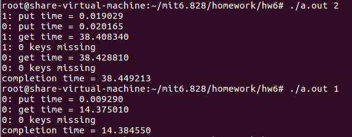

在这个作业中，我们将会使用hash table来研究threads和locks的并行编程。

1. 这个HW需要运行在一台真正的计算机上（not xv6，not qemu），并且**这台机器是要求多核的**；
2. 作业所需要的源代码：[ph.c](https://pdos.csail.mit.edu/6.828/2018/homework/ph.c)

## 源代码的讲解

首先我们来看一下`ph.c`中的`main()`函数

```c
int
main(int argc, char *argv[])
{
  pthread_t *tha;
  void *value;
  long i;
  double t1, t0;
    
  if (argc < 2) {
    fprintf(stderr, "%s: %s nthread\n", argv[0], argv[0]);
    exit(-1);
  }
  nthread = atoi(argv[1]); //the number of threads
  tha = malloc(sizeof(pthread_t) * nthread);
  srandom(0);
  assert(NKEYS % nthread == 0);
  for (i = 0; i < NKEYS; i++) {
    keys[i] = random();
  }
  t0 = now();
  for(i = 0; i < nthread; i++) {
    assert(pthread_create(&tha[i], NULL, thread, (void *) i) == 0);
  }
  for(i = 0; i < nthread; i++) {
    assert(pthread_join(tha[i], &value) == 0);
  }
  t1 = now();
  printf("completion time = %f\n", t1-t0);
}
```

`main()`中主要是创建nthread数量的线程数，然后对nthread数量的线程运行时间进行计时。下面我们来看一下线程函数

```c
static void *
thread(void *xa)
{
  long n = (long) xa;
  int i;
  int b = NKEYS/nthread;
  int k = 0; 
  double t1, t0;

  //  printf("b = %d\n", b);
  t0 = now(); 
  for (i = 0; i < b; i++) {
    // printf("%d: put %d\n", n, b*n+i);
    put(keys[b*n + i], n);
  }
  t1 = now();
  printf("%ld: put time = %f\n", n, t1-t0);

  // Should use pthread_barrier, but MacOS doesn't support it ...
  __sync_fetch_and_add(&done, 1);
  while (done < nthread) ;

  t0 = now(); 
  for (i = 0; i < NKEYS; i++) {
    struct entry *e = get(keys[i]);
    if (e == 0) k++;
  }
  t1 = now();
  printf("%ld: get time = %f\n", n, t1-t0);
  printf("%ld: %d keys missing\n", n, k);
  return NULL;
}
```

线程主要是分成两部分，第一部分是把`NKEYS/nthread`数量的keys put 到 hash table中，然后会打印出线程中put操作所需要的时间；第二部分是从hash table中获取`NKEYS`数量的值，也会打印出get操作所需要的时间。

## DO HOMEWORK

我们首先对`ph.c`这个文件进行编译，然后运行编译出来的程序

```bash
$ gcc -g -O2 ph.c -pthread
$ ./a.out 2
```

> 这里的2表示在hash table上执行put和get操作的线程数量

测试效果如下所示


下面我们使用一个线程来执行

```bash
$ ./a.out 1
```

测试效果如下所示：


上述的结果表明一个线程的情况和两个线程的情况完成的时间是差不多的，但是两个线程的情况在get阶段相当于做了两倍的工作量，因此对于get操作来说两个线程的情况在两个cores上实现了近2倍的加速，相当实现了很好的并行性。

> 如果你在一台只有一个core的机器上运行，或者这台机器忙于其他的程序，你将不会看到并行性。

但是两个线程的情况中出现了很多keys missing，而一个线程的情况中却没有miss任何keys。这个主要是因为两个线程中在put操作的时候都会涉及到`insert`操作，然而该操作会涉及到修改一个全部变量table。举个例子，假如线程1正好要操作table[2]（比如0x0011），但是线程1在insert函数中还没有改变table[2]的值时，线程0也要操作table[2]，并且也进到insert函数了，此时线程0操作的table[2]还是原来那个值（0x0011），当线程1先执行完之后，table[2]的值假如是0x12，下一个entry的地址是0x11，当线程0之后执行完，那么线程0中又将table[2]的值改为0x13，下一个entry0x11而不是0x12，那么0x12就消失了。

```c
static void
insert(int key, int value, struct entry **p, struct entry *n)
{
  struct entry *e = malloc(sizeof(struct entry));
  e->key = key;
  e->value = value;
  e->next = n;
  *p = e;
}

static
void put(int key, int value)
{
  int i = key % NBUCKET;
  insert(key, value, &table[i], table[i]);
}
```

为了避免keys missing，需要在put和get中插入lock和unlock，可以让keys missing变为0。相关的变量和函数有：

```c
pthread_mutex_t lock;     // declare a lock
pthread_mutex_init(&lock, NULL);   // initialize the lock
pthread_mutex_lock(&lock);  // acquire lock
pthread_mutex_unlock(&lock);  // release lock
```

我们在`get`和`put`函数中都插入lock和unlock操作，

```c
static
void put(int key, int value)
{
  int i = key % NBUCKET;
  pthread_mutex_lock(&lock);
  insert(key, value, &table[i], table[i]);
  pthread_mutex_unlock(&lock);
}

static struct entry*
get(int key)
{
  struct entry *e = 0;
  pthread_mutex_lock(&lock);
  for (e = table[key % NBUCKET]; e != 0; e = e->next) {
    if (e->key == key) break;
  }
  pthread_mutex_unlock(&lock);
  return e;
}
```

实验结果如下



但其实对于get来说，其实没有必要插入lock和unlock，因为get操作并不涉及到table的改变，它只是访问而已。比如线程1访问table[2]，线程0也在那访问table[2]，线程1找到了table[2]中的某个值，并返回，此时table[2]还是原来的那个table[2]。

```c
static struct entry*
get(int key)
{
  struct entry *e = 0; 
  for (e = table[key % NBUCKET]; e != 0; e = e->next) {
    if (e->key == key) break;
  }
  return e;
}

```

下面我们仅仅在在`put()`函数中插入lock和unlock操作，如下所示

```c
tatic
void put(int key, int value)
{
  int i = key % NBUCKET;
  pthread_mutex_lock(&lock);
  insert(key, value, &table[i], table[i]);
  pthread_mutex_unlock(&lock);
}
```

> Hint：别忘记将lock定义为全局变量以及对它的初始化

实验结果如下，两个线程的情况并没有miss key，而且相比之下两个线程的情况略快一些。


对于提示来说，假如我们在`put`函数中加入lock和unlock来说，它是对table（bucket array）加了一个lock。