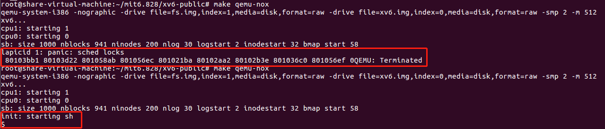

在这个HW中，我们将探索interrupt和lock之间的相互作用。首先我们来看一下`spinlock.c`和`spinlock.h`中的一些函数和定义

```c
struct spinlock;
initlock();
acquire();
release()
```

这些主要是lock的具体实现，比如`struct spinlock`是lock的结构体，`initlock()`是初始化一个锁，`acquire()`是获得一个锁，`release()`是释放一个lock。

## Don't do this

```c
struct spinlock lk;
initlock(&lk, "test lock");
acquire(&lk);
acquire(&lk);
```

上面这段操作，连续两个`acquire()`，将会造成panic。

## Interrupts in ide.c

`acquire()`函数通过cli指令（使用 `pushchi()`）来保证当前的处理器的中断是关闭了的，中断关闭状态持续到处理器的最后一个lock被release掉（通过`popsti()`来使用sti指令）。

```c
// Acquire the lock.
// Loops (spins) until the lock is acquired.
// Holding a lock for a long time may cause
// other CPUs to waste time spinning to acquire it.
void
acquire(struct spinlock *lk)
{
  pushcli(); // disable interrupts to avoid deadlock.
  if(holding(lk))
    panic("acquire");

   ......
}

// Release the lock.
void
release(struct spinlock *lk)
{
  if(!holding(lk))
    panic("release");

  lk->pcs[0] = 0;
  lk->cpu = 0;
  ......
  // Release the lock, equivalent to lk->locked = 0.
  asm volatile("movl $0, %0" : "+m" (lk->locked) : );

  popcli();
}
```

假如我们在持有ide lock的时候，打开了interrupt会发生什么勒？我们在`ide.c`中`iderw()`函数中，在`acquire`后面调用 `sti()`，并且在`release`之前调用`cli()`（`sti()`函数会打开interrupt，而`cli()`函数会关闭中断）。

```c
void
iderw(struct buf *b)
{
  ......

  acquire(&idelock);  //DOC:acquire-lock
  sti();
  ......
  cli();
  release(&idelock);
}
```

重新编译kernel和启动QEMU，有些时候kernel在启动之后会panic，多尝试几次之后直到kernel正常启动。



有几次kernel的启动会panic，只要是因为我们在`acquire`关闭中断之后，又打开了中断，这样子会陷入死锁。比如在启动过程中，发生了中断，而这个中断又会去申请一个锁，然而锁又被其他所持有，但是其他又在等待中断处理结束，那么就陷入死锁了。

## Interrupts in file.c

将你添加在`ide.c`中添加的`sti()`和`cli()`移掉。下面我们来看一下当hold file_table_lock的时候，打开中断会发生什么。这lock是用来保护file descriptor table的，当一个应用程序open或close一个文件的时候kernel会修改这个表。那么下面我们在`file.c`的`filealloc()`函数中，在`acquire()`后面调用`call()`，同时在每一个`re`

`lease()`之前调用`cli()`，并且我们也需要把`x86.h`这个头文件include进去

```c
......
#include "x86.h"
......
// Allocate a file structure.
struct file*
filealloc(void)
{
  struct file *f;

  acquire(&ftable.lock);
  sti();
  for(f = ftable.file; f < ftable.file + NFILE; f++){
    if(f->ref == 0){
      f->ref = 1;
      cli();
      release(&ftable.lock);
      return f;
    }
  }
  cli();
  release(&ftable.lock);
  return 0;
}
```

之后重新编译kernel并运行，你会发现启动多少次后都不会panic。这个主要是因为`filealloc()`在alloc的时候，时间很短，所以很难发生死锁。

## xv6 lock implementation

为什么`release()`函数要先清理掉`lk->pcs[0]`和`lk->cpu`，之后再清理掉`lk->locked`。

因为假如先清理掉`lk->locked`，那么lock就没了，新的进程可能就会在`lk->pcs[0]`和`lk->cpu`被清零之前获得lock，但是此时的`lk->cpu`和`lk->pcs[0]`还是之前的那个，那么就会导致不一致。