# 编程基本模型

## 80386的内存组织结构

80386的物理内存是由一系列的8位的字节组成，每一个字节被分配不同的IP地址（0\~2^32-1）。80386的程序是独立于物理内存的，也就是说不用太多的物理内存知识也不用知道物理内存中有什么指令或者数据就可以写程序。应用程序开发者所看到的内存组织模式是由系统软件设计师设计的。内存组织的模式可以在两个极端中选择（The model of memory organization can range between the following extremes）

- 一种“平面”地址空间，由一个高达4GB的数组组成。（A "flat" address space consisting of a single array of up to 4 gigabytes.）
- 一种分段的地址空间，由最多16383（0x3FFF）个线性地址空间组成，每个线性地址空间可以高达4GB地址空间（A segmented address space consisting of a collection of up to 16,383 linear address spaces of up to 4 gigabytes each.）

上述两种模式都可以提供内存保护。不同的任务可以选择不同的内存组织模式，系统设计人员使用上述标准去决定一个内存组织模式，并且系统程序员去实现这种模式是被包含在编程中的。

### 平面模式（The “Flat” Model）

在这种平面模式下，应用程序员可以看到一个高达2^32字节（4GB）的数组。虽然物理内存空间也可以容纳4GB的东西，但是实际上它往往更小。处理通过地址转换机制，映射这4GB的平面地址到物理地址空间上，当然应用程序员不需要知道映射的细节。这种平面地址空间的指针是一个从2^32-1\~1的32位有序的数字，在这空间中单独编译模块的重新定位必须由系统软件执行（比如链接器（linker）、加载器（loader）等等）

### 分段模式

在这种分段模式下，应用程序程序员可以看到的地址空间高达2^46字节。处理器通过地址转化机制来映射这2^46字节的逻辑地址空间到物理地址上，同样应用程序程序员不需要知道映射的细节。应用程序程序员将这种80386逻辑地址空间视为由16383个一维子空间构成，每一个子空间有着指定的长度。每一个线性子序列被叫做段，一个段是一个连续地址空间单元，段大小可以从1\~2^32字节。那么在这种模式下，一个完整的指针由两部分组成：

1. 段选择器，16bit的区间定义了一个段
2. 偏移量，一个32bit有序数，来定位是哪个字节的

由于段的大小是可以变的，所以一个段的大小可以是它所包含模块的大小。并且在运行时，单独编译的模块可重新加载通过改变段的起始地址。


## 80386寄存器

80386一共有16个程序员感兴趣的寄存器，这些寄存器可以被分为3类：

1. 第一类是通用寄存器，有8个，每个32位。这些寄存器被用来包含用于算数和逻辑操作的操作数；
2. 第二类是段寄存器，有6个。这些寄存器可以允许系统软件设计师选择flat模式的内存组织模式还是分段模式的内存组织模式。在任何时候，这6个段寄存器决定了内存的哪个段是当前可以访问的。
3. 状态和指令寄存器，有2个。这些寄存器用来记录和修改80386处理器状态的某些方面。

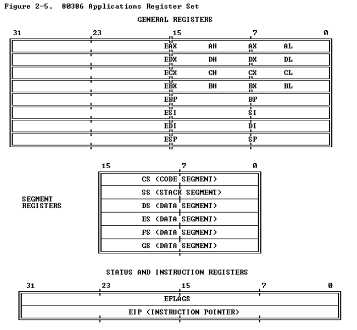

这些寄存器的示意图如上所示，下面我们来详细阐述一些这些寄存器：

### 通用寄存器（General Registers）

32位的通用的寄存器有EAX、EBX、ECX、EDX、EBP、ESP、ESI、EDI。这些寄存器可以互换地用于包含逻辑运算和算数运算的操作数，也互换地用于地址计算的操作数（除了ESP寄存器不能用于索引操作数）。如下图所示，这些寄存器的低字部分有一个单独的名字，比如EAX的低字部分叫做AX，类似还有AX, BX, CX, DX, BP, SP, SI和DI。这些低字部分可以像一个单元一样被处理，这种特性在处理16位数据或者兼容8086和80286处理器中是十分有用的。

类似的，AX, BX, CX, DX中每一个字节都有一个独立的名字，比如AX中分为AH（高字节）和AL（低字节）。每一个字节也同样可以被当成一个单元进行处理。这种特性在处理字符或者其他八字节数据的时候是相当有用的。

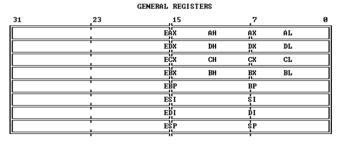

所有的通用寄存器都可以用于地址计算和绝大多数算数运算、逻辑运算的结果。然而，一些函数专用使用某些寄存器，这些使用特定寄存器的指令包括：双精度乘和除，I/O，字符串指令，翻译，循环，变量移位和旋转，堆栈操作。下面讲一下这些寄存器的用途：

- ESP寄存器x86堆栈指针寄存器
- EBP寄存器寄存器的值代表该子程序的栈帧的最高地址，EBP寄存器和ESP寄存器之间的内容即为栈桢

### 段寄存器（Segment Registers）

简单来说段寄存器是存放程序中段的相关信息的，如CS寄存器存放的是代码段的相关信息。六个段寄存器CS, DS, SS, ES, FS和GS用来指明六个段，每个寄存器从组成程序的段中唯一地确定一个特定的段。对于一个正在执行的80386程序来说，任何时候都可以立即访问六个段的内容，并且将以最快的速度访问。如下所示：

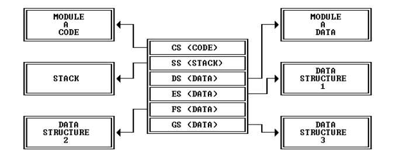

- 代码段（Code Segement），**包含了当前执行的指令序列，由CS寄存器指定。**80386从这个CS中获取所有的指令，并且将指令对应的指针内容作为偏移量。CS段将由一些段间控制指令、中断和异常被隐式的修改。

- 栈段（Stack Segement）,所有的栈操作使用SS寄存器来定位栈的位置。因为SS寄存器可以被显示的加载不像CS一样，所以允许程序员动态的定义栈。

- 数据段一共有四个。DS、ES、FS、GS段寄存器指向对应的数据段，每一个段都可以被当前执行的程序所寻址的。划分成四个不同的数据段有利于程序高效的访问不同类型的数据结构。

  处理器会将基址与被段寄存器选择的段进行相关联，一旦选择了某个段（通过把段选择器加载到段寄存器），那么只需要指定其偏移量即可，而偏移量可以直接在指令中说明或者通过通用寄存器间接地来说明，之后这个这个32位的偏移量加上段的基址，就可以寻址得到这个元素。简单的规则定义当只指定偏移量时，对应的段寄存器就会使用，从而用来形成地址。

  有时程序可能还需要访问四个以上的数据段，为了去访问额外的数据段，在程序的执行期间可以把DS、ES、FS、GS这四个寄存器中的值进行修改。过程也就变成了，只要求程序在访问数据之前先执行加载适当段寄存器的指令。

### Flags 寄存器（Flags Register）&&Instruction Pointer

Flags寄存器是一个32位寄存器，叫做EFLAGS。如下所示：

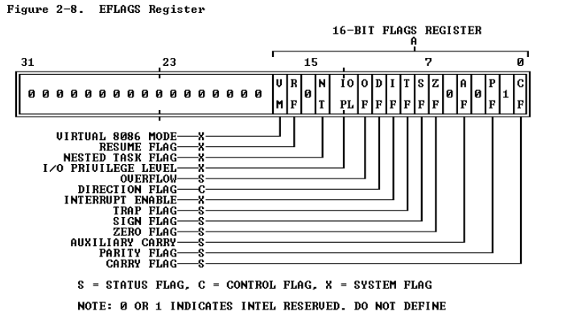

这个寄存器中的标志位用来控制某些操作，和显示80386的状态。这个寄存器中的低16位是叫做FLAGS并且可以像一个单元来处理。这种特性同上述所阐述的一样在执行8086或者80286处理器的时候是很有用的，因为EFLAGS中的这个部分跟8086和80286中的FLAGS寄存器是一模一样的。在这些flags中可以被分为三类：

1. status flags，这种状态标志位允许一条指令的结果去影响接下去的指令。比如算数指令使用 OF, SF, ZF, AF, PF和CF。SCAS (Scan String),CMPS(Compare String), and LOOP指令使用ZF标识他们的操作是结束了的。在执行算数指令之前有些指令是去设置、清楚或者补充CF的。
2. control flags，比如DF（Direction Flag）是控制字符串指令。当DF被设置了，那么会造成字符串指令自动递减的，或者说处理字符串从高地址到低地址；假如清楚DF位，那么将会造成字符串指令增加的，或者说处理字符串从低地址到高地址的。
3. system flags

---

指令指针寄存器（ instruction pointer register (EIP)）存着下一条连续的被执行的指令的偏移量的地址，这个偏移量是相对当前代码段（Code Segement）开始处的。这个指令指针程序员是无法直接看到的，它由控制转移指令、中断和异常来控制。如下图所示，EIP的低16位被叫做IP，可以被当成一个单元来处理。这一点在执行8086或者80286处理器的指令时是十分有用的。

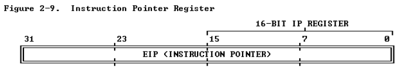


### CR*

- 控制寄存器cr2和cr3都是和分页机制相关的寄存器。其中cr3寄存器存放页表的物理起始地址。
- CR0和CR1~CR3寄存器都是80x86的控制寄存器
- he physical address of the current page directory is stored in the CPU register CR3, also called the page directory base register (PDBR)
- Page translation is in effect only when the PG bit of CR0 is set. 

## 80386指令格式

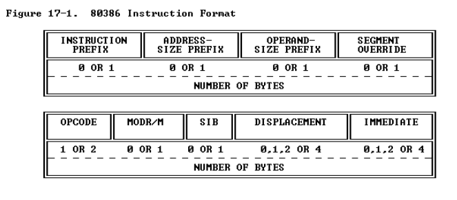

- 指令前缀（PREFIX）

  分为4组，每组至多用一个字节编码，4组顺序可以随意。

  **Segment override**：显式指定指令应该使用哪个段寄存器，覆盖掉80386为这条指令默认使用的寄存器。CS、SS、DS、ES、FS、GS的段覆盖前缀的编码分别是2EH、36H、3EH、26H、64H、65H.

  **Address size **：地址长度覆盖，编码为67H，用于16位和32位地址切换；

  **Operand size**：操作数长度覆盖，编码为66H，用于在16位和32位操作数切换；

  **Repeat**：与字符串指令一起使用，使指令作用于字符串的每一个元素.

- 指令码（OPCODE）

  长度为1或2个字节，这个是必须有的。指定这条指令需要执行的操作。

- MODR/M与SIB

  许多指令的内存操作数需要使用ModR/M字节作为寻址模式说明符。其中mod与r/m组合有32个值，表示8个寄存器与24中寻址模式。reg/opcode表示寄存器号或者额外的3位指令码，这个具体含义得看基本指令码。某些ModR/M字节表示的寻址模式，需要SIB字节来补充寻址方式。其中scale表示比例系数，index表示变址寄存器号，base表示变址寄存器号。比如当寻址模式设置为用一个索引寄存器去计算操作数的地址的时候，那么SIB字节就会出现了。

  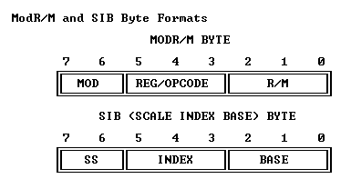

- 位移（DISPLACEMENT）

  当寻址模式设置为需要一个位移来计算操作数地址的时候，那么位移字节就会被编进指令中。位移是32位、16位或8位带符号的整数。当位移很小的时候，通常采用8位的形式。

- 直接数（IMMEDIATE）

  直接在指令中提供操作数的值。直接数可以是8位、16位或者32位的。在8位直接数与16位或32位操作数组合的情况下，处理器自动扩展8位操作数的大小，同时考虑到符号。

  

> 基于x86指令集的汇编语言有两套格式（指令集只有一套，但是汇编有两套）
>
> - Intel syntax: op dst, src
> - AT&T (gcc/gas) syntax: op src, dst 


**本段参考链接**：

1.[https://zh.wikipedia.org/wiki/X86#x86%E6%8C%87%E4%BB%A4%E6%A0%BC%E5%BC%8F](https://zh.wikipedia.org/wiki/X86#x86指令格式)

2.https://pdos.csail.mit.edu/6.828/2018/readings/i386/s02_04.htm

3.https://pdos.csail.mit.edu/6.828/2018/readings/i386/s17_02.htm#fig17-1


# 中断和异常

中断和异常是特殊控制转换，它们有点像unprogrammed calls。它们改变正常程序的流程去处理额外的事件或者报告错误或异常的情况。中断和异常的区别在于，**中断是处理处理器外不同步的事件，而异常是处理处理器在执行指令时检测到的情况**。

中断的来源有两个

- 可屏蔽的，通过INTR引脚发出；
- 不可屏蔽的，通过NMI引脚发出；

异常的来源也有两个：

- 处理器检测到的，被分为faults, traps,和aborts；
- 程序中，INTO、INT 3、INT n和BOUND等指令都可以引起异常，这些指令被叫做“软件中断”，但是处理器把他们当成异常来处理。

中断和异常都有特定的编号。NMI中断和异常使用0\~31的之间的数字来标识，以便被处理器识别出来。但是80386没有全部使用这些数字，没有分配的数字被Intel保存起来了，以便以后的扩展。可屏蔽的中断是由额外的中断控制器确定（比如Intel的8259A可编程终中断控制器），并且在处理器的中断确认序列的时候与处理器进行交流。8259A PIC分配的数字可由软件来指定，在32\~255之间的数字都可以被使用。下表是中断和异常的标识：

| Identifier |                  Description                   |
| :--------: | :--------------------------------------------: |
|     0      |                  Divide error                  |
|     1      |                Debug exceptions                |
|     2      |           **Nonmaskable interrupt**            |
|     3      |    Breakpoint (one-byte INT 3 instruction)     |
|     4      |          Overflow (INTO instruction)           |
|     5      |        Bounds check (BOUND instruction)        |
|     6      |                 Invalid opcode                 |
|     7      |           Coprocessor not available            |
|     8      |                  Double fault                  |
|     9      |                   (reserved)                   |
|     10     |                  Invalid TSS                   |
|     11     |              Segment not present               |
|     12     |                Stack exception                 |
|     13     |               General protection               |
|     14     |                   Page fault                   |
|     15     |                   (reserved)                   |
|     16     |               Coprecessor error                |
|   17-31    |                   (reserved)                   |
|   32-255   | Available for external interrupts via INTR pin |

## Enabling and Disabling Interrupts

处理器只在一条指令的结束和一条指令的开始才会提供中断和异常。当字符串指令使用了重复前缀（repeat prefix），那么重复期间将会发生中断和异常，所以长字符指令也不会延迟中断响应。某些环境或者flags的设置将会导致处理器在指令边缘（instruction boundaries）禁止掉中断和异常。

- NMI Masks Further NMIs

  当正在执行一个NMI程序时，处理器将会忽略接下来在NMI pin的中断信号，直到下一条`IRET`指令被执行。

- IF Masks INTR

  IF(interrupt-enable flag)控制是否通过INTR pin来接受额外的中断信号。当IF=0，INTR中断是被禁止了的，反之是允许的。

  - 跟其他标志位一样，处理器在响应REST信号之后，将IF标识位清除。

  - `CLI(clear IF)`和`STI(set IF)`显式指令可以改变IF位，这些指令只有在CPL<=IOPL的时候才会被执行，如果这些指令在CPL>IOPL时候执行的话将会发生一个保护异常。

  - IF也可以被下面这些隐式的改掉：

    `PUSHF`指令在它能检查的stack中存储了所有的flags（包括了IF）；

    Task转换和`POPF`、`IREF`指令可以加载flags寄存器，因此，他们被用来修改IF;

    通过中断门的中断自动重置IF，禁止掉中断；

- RF Masks Debug Faults

  EFLAGS中的RF位控制debug faults的识别。无论一条指令执行多少次了，这一位将允许给定的指令最多一次引发debug fault；

- MOV or POP to SS Masks Some Interrupts and Exceptions

  软件改变stack segement经常需要一对指令：

  ```assembly
  MOV SS, AX
  MOV ESP, StackTop
  ```

  如果一个中断或者异常被执行在ESP之前，但是在ss被改变，这时候stack指针ss:esp的两部分对于中断处理程序或者异常处理程序来说是不一致了的。为了避免这种情况，80386在`MOV `to SS和`POP`to SS指令之后，将会在指令边界处禁止NMI、debug exceptions和single-step traps。可能仍然会有一些异常发生，也就说page fault和general protection fault这些仍然会发生，通常使用80386的`LSS`质量，那么这个问题就不会发生了。

> "instruction boundaries":在X86中, 使用的是非精简指令,会占用很多的cycle才可以完成一条指令,而且不同的指令占用的cycle数是不同的,复杂的指令会占用很多的cycle才可以完成; 不是像ARM一样,指令的执行占用固定的cycle.这里说的是中断会发生在指令的边界上，也就是假如一个复杂指令需要100cycle才可以完成逻辑，但是在第50个cycle发生了中断，那么中断也会在执行完整个逻辑，即在第100个cycle的地方发生，而不会在第50个cycle的地方立即发生。

## Priority Among Simultaneous Interrupts and Exceptions

如果在指令边缘出现了一个或多个待解决的中断或者异常，然而处理器在一个时间中只能处理一个那该怎么办呢？处理器会根据优先级来进行处理，处理器会先处理高优先级的中断和异常，将控制权转到中断处理程序的第一条。低优先级的异常是直接被忽视的，低优先级的中断保持待执行，但是被忽视的异常将会重新被找到当中断处理程序将控制权返回到中断点的时候。下图中展示的是中断源和异常源类别之间的优先级：

| Priority |   Class of Interrupt or Exception    |
| :------: | :----------------------------------: |
| HIGHEST  |      Faults except debug faults      |
|          | Trap instructions INTO, INT n, INT 3 |
|          |   Debug traps for this instruction   |
|          |  Debug faults for next instruction   |
|          |            NMI interrupt             |
|  LOWEST  |          L::INTR interrupt           |

## Interrupt Descriptor Table

IDT( interrupt descriptor table)将中断或者异常的标识符与提供相关联的事件的指令描述符联系起来。IDT是一个8byte描述符组成的一个数组，它的第一条（索引为0）就可以包含一个描述符（这跟GDT和LDTs是不一样的）。只要将中断或者异常的标识符乘以8，就可以在IDT表中找到相应的位置了。因为只有256个标识符，所以IDT所包含的描述符可以少于256个，只有实际使用的中断标识符才需要一个条目。IDT可以在内存的任何地方存储，通过IDTR（IDT寄存器）来加载IDT表。

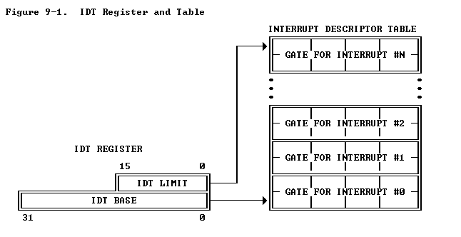

`LIDT`和`SIDT`指令可以用来操作IDTR，这两个指令都有显示的操作数：一个6字节的地址，这个6字节的地址结构如下图所示：

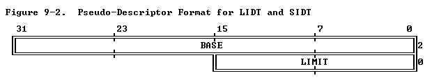

- LIDT(Load IDT register)通过包含在内存操作数中的linear基础地址和limit值来加载IDT寄存器。这条指令只有在CPL是0的时候才能被执行，当创建一个IDT表的时候，操作系统的初始化逻辑通常使用这条指令。当然，当一个操作系统可能也会使用它去从一个IDT改变到另一个IDT。
- SIDT(Store IDT register)将存储在IDTR中的base和limit拷贝到一个内存位置。在任何的特权等级下都可以执行这条指令。

下面来讲一下IDT Descriptors：

IDT可能会包含三种descriptor：

- Task gates
- Interrupt gates
- Trap gates

下图展示了task gates和80386的interrupt gate以及trap gate：

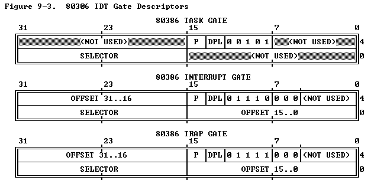

## Interrupt Tasks and Interrupt Procedures

跟`CALL`指令可以调用任何一个task或者procedure，一个中断或者异常也可以调用一个中断处理程序（interrupt handler），这个中断程序可能是一个**过程（procedure）或者一个任务（task）**。当响应中断或者异常时，处理器将会使用中断或者异常标识符在IDT中找到相应的位置，如果相应的位置指的是interrupt gate或者trap gate，那么处理器调用过程（procedure）；如果相应的位置是task gate，那么将会引发任务切换。

### Interrupt Procedures

一个interrupt gate或者trap gate间接的指向了当前执行任务的上下文中将会执行的程序。gate的selector指向了GDT或者当前LDT中可执行的段描述符，gate的offset指向了中断或者异常处理程序的开始处。

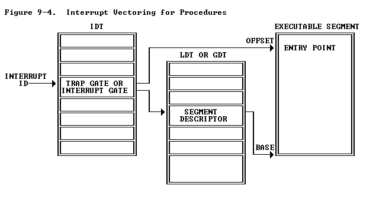

同`CALL`指令会转换控制权，中断或者异常也会转移控制权，当控制转换到中断或者异常的处理程序时，它将会使用stack来保存那些用来返回到原来程序所需要的信息。比如会把EFLAGS寄存器的值压入栈中；也有一些异常也会把错误代码压入栈中，异常处理程序会使用错误代码来诊断异常。

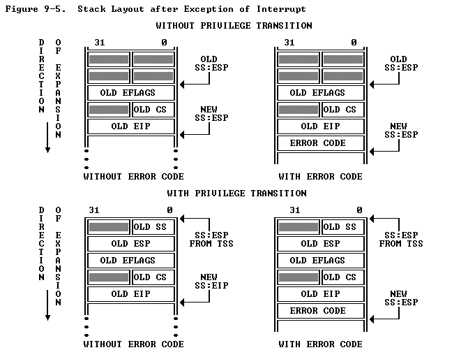

中断过程（interrupt procedure）在离开这个过程的方法和正常过程不同。`IRET`指令是用来退出一个中断过程，同`RET`指令类似。但是`IRET`指令会让ESP寄存器额外增加4个字节（因为flags在stack中），并且将保存的flags的值移到ELFAGS寄存器中。

> EFLAGS中IOPL只有CPL为0时才会修改，IF位只有在CPL<=IOPL的时候才会修改。 

在中断过程中一些flags也会变化，比如在当前TF的值被作为EFLAGS的一部分被保存到stack中后可以通过 interrupt gates or trap gates中断可以让TF(trap flag)重置。而通过这一行为，处理器可以阻止单步调试行为影响中断响应。接下去的`IRET`指令会通过stack中的EFLAGS中的值来恢复TF的值。而 interrupt gates 和trap gates不同的一点是IF (the interrupt-enable flag)的值。中断通过 interrupt gates来重置IF的值，因此阻止了其他中断影响当前的中断处理程序。接下去的`IRFT`指令会将IF的值变为存在stack上EFLAGS的值。然而中断通过`trap gate`不会改变IF。

CPU不允许一个中断将控制权转移到比当前特权等级更低的段的过程中去，假如试图违反此规则那么将会引发一个通用的保护异常。因为中断的发生通常是无法预测的，所以这样的规则有效的限制了中断和异常处理过程可以执行的特权等级。下面的一些方法可以确保特权规则没有被违反：

①将处理程序放在合适的段。这一点适合某些异常的处理程序，比如divide error。这样一来，这个处理程序只能使用stack中他能获得的数据，假如它需要来自数据段的数据，数据段得拥有特权等级3，从而导致处理程序没有被保护的。

②将处理过程放在特权等级为0的段。

### Interrupt Tasks

一个task gate也间接指向了一个task，gate中的selector指向了一个GDT中的TSS描述符。

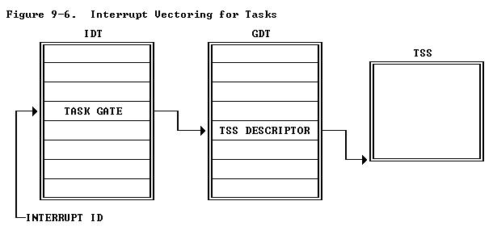

当一个中断或者异常指向IDT中的task gate，那么将会导致task switch。使用一个单独的task来处理中断有两个好处：

①整个上下文是可以自动保存的；

②通过给中断处理程序提供一个单独的地址空间（使用它的LDT或者page directory），那么这个中断程序可以与其他task隔离开的

中断task通过执行`IRET`指令返回被中断的task。如果一个带有错误代码的异常导致了task switch，处理器将会自动把错误代码押到栈里面去，这个栈是与中断task将要执行的第一条指令的特权等级是一致的。

> 80386中的interrupt tasks有两个scheduler：一个是软件scheduler（操作系统的一部分）另一个是硬件scheduler（处理器中断机制的一部分）。软件scheduler的设计必须考虑到硬件scheduler可能随时会产生一个中断（当中断是被允许的时候）。

## Error code

每一个异常都跟特定的段相关联，处理器把error code 压入异常处理程序的stack。error code的格式如下：

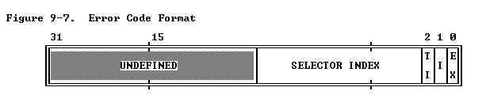

这个格式跟一个段选择子的格式有点像，但是不包含RPL段，error code包含了两个位：

①如果一个程序外的事件造成了这个异常，那么EXT位将会被设置；

②如果error code的索引（index）部分指向IDT中gate  descriptor，那么这I位（IDT bit）将会被设置；如果I位没有被设置，TI位表示error code指向的是GDT（TI==0）还是LDT(TI==1)。因此剩下的14bits正好是segement selector涉及的。

## Exception Conditions

下面是一些异常情况的详细描述，大致分为3类：fault, trap和abort. 

- fault

  当一个fault发生的时候，保存的CS和EIP的值指向造成fault的指令；

- traps

  当一个trap发生的时候，保存的CS和EIP的值动态地指向了发生trap指令。如果在改变程序控制流程的指令中检测到了trap，那么CS和EIP将会指向这个改变程序控制流程的指令。比如在`JMP`期间的时候检测到了trap，那么被压入栈中的CS和EIP的值指向了`JMP`而不是`JMP`之后的指令。

- aborts

  aborts是用来报告严重error的，比如hardware error和系统表中不一致或者违法的值。abort既不允许造成异常的指令的精确定位也不要求造成异常的程序重启。

[每一个异常的情况详细阐述](https://pdos.csail.mit.edu/6.828/2018/readings/i386/s09_08.htm)

[异常汇总表](https://pdos.csail.mit.edu/6.828/2018/readings/i386/s09_09.htm)

[每一个exception所对应的error信息](https://pdos.csail.mit.edu/6.828/2018/readings/i386/s09_10.htm)