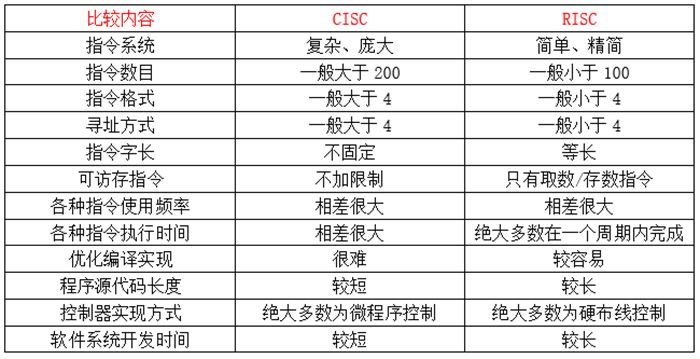

## ARM架构和x86架构

Architecture ，结构、架构，这个词用于 CPU 的时候是指 CPU “接受和处理信号的方式”，及其内部元件的组织方式。现在常见的CPU架构，从大的层面分为两类：CISC、RISC。CISC主要有x86架构，RISC主要有ARM架构，MIPS架构等等。下面简单介绍一下x86架构和ARM架构。

> 现代的CPU往往采用了CISC的外围，而内部则加入了部分RISC的特性，这个也是Intel处理器的开始拥有RISC的典型例子。

### x86架构

目前的PC架构绝大多数都是Intel的x86架构。

其中 x86 又叫 IA32，即 Intel Architecture 32（Intel32位架构），不管是Intel生产的 x86 CPU，还是AMD或者VIA生产的，都是 IA32，IA32 并非没有专利保护而是 AMD 和 VIA/Cyrix 通过交叉专利授权获得了 IA32 的使用权。

x86-64 又叫 AMD64，它的 Intel 版本叫做 EM64T（换个名字而已），是AMD在 IA32 的基础上扩展出来的一套 64位 CPU 架构，Intel 可以使用的原因也是因为 Intel和AMD之间的交叉专利授权。

> i386 : Intel 386 ( 老的386机器，也泛指IA32体系的CPU)

### ARM架构

ARM全称为Advanced RISC Machine，意为进阶精简指令集机器。其广泛应用于许多嵌入式系统设计。由于节能的特点，ARM处理器非常适用于移动通讯领域，符合其主要设计目标为低耗电的特性。

### ARM架构和x86架构有什么区别

#### 1.性能

x86结构的电脑无论如何都比ARM结构的系统在性能方面要快得多、强得多。但是ARM的优势不在于性能强大而在于效率，ARM采用RISC流水线指令集，在完成综合性工作方面根本就处于劣势，而在一些任务相对固定的应用场合其优势就能发挥得淋漓尽致。

#### 2.功耗

x86电脑因考虑要适应各种应用的需求，其发展思路是：性能+速度。但是这样子发展的方向和模式，使其功耗一直居高不下，一台电脑随便就是几百瓦，即使是号称低功耗节能的手提电脑或上网本，也有十几、二十多瓦的功耗，这与ARM结构的电脑就无法相比。

#### 3.扩展能力

x86结构的电脑采用“桥”的方式与扩展设备（如：硬盘、内存等）进行连接，而且x86结构的电脑出现了近30年，其配套扩展的设备种类多、价格也比较便宜，所以x86结构的电脑能很容易进行性能扩展，如增加内存、硬盘等。

而ARM结构的电脑是通过专用的数据接口使CPU与数据存储设备进行连接，所以ARM的存储、内存等性能扩展难以进行（一般在产品设计时已经定好其内存及数据存储的容量），所以采用ARM结构的系统，一般不考虑扩展。基本奉行“够用就好”的原则。

#### 4 操作系统兼容性

x86系统在硬件和软件开发方面已经形成统一的标准，几乎所有x86硬件平台都可以直接使用微软的视窗系统及现在流行的几乎所有工具软件，所以x86系统在兼容性方面具有无可比拟的优势。

ARM系统几乎都采用Linux的操作系统，而且几乎所有的硬件系统都要单独构建自己的系统，与其他系统不能兼容，这也导致其应用软件不能方便移植，这一点一直严重制约了ARM系统的发展和应用。当然google开发的Android系统为ARM的发展提供了强大的支持和动力。

**本块内容参考及推荐**

1.[CSDN_cpu有哪些架构](https://blog.csdn.net/yyyljw/article/details/79419190)

2.[CPU架构有多少种？X86与ARM有哪些不同之处？看完这篇你就懂了](http://www.elecfans.com/d/711805.html)

3.[CSDN_一文看懂arm架构和x86架构有什么区别](https://blog.csdn.net/kdsde/article/details/84567834)

## CISC和RISC

CISC：复杂指令集计算机，RISC：精简指令集计算机。如上所述的那样，x86架构使用的是CISC，ARM架构使用的是RISC。这两种架构使用的指令集不同在于面向的设备、对象、性能不同。

CISC复杂指令系统就是为了增强原有指令的功能，设置**更为复杂的新指令实现部分大量重复的软件功能的硬件化**。由于早期的电脑主频低、运行速度慢，为了提高运算速度，不得已将更多的复杂指令加入到指令系统中来提高电脑的处理效率，慢慢形成以桌面电脑为首的复杂指令系统计算机。CISC可以实现高性能CPU设计，但是设计起来就相当麻烦了，要保持庞大硬件设计正确是一件不容易的事情，还要确保性能有所提升，不能开倒车，因此桌面CPU研发时间也慢慢地变长。

RISC可以说是从CISC中取其精华去其糟粕，**简化指令功能，让指令的平均执行周期减少**，达到提升计算机工作主频的目的，同时引入大量通用寄存器减少不必要的读写过程，提高子程序执行速度，这样一来程序运行时间缩短并且减少了寻址，提高了编译效率，最终达到高性能目的。

从CISC、RISC的设计思路来看，CISC专注于高性能方向，但也带来了高功耗，而后者专注于做低功耗的嵌入式，而性能不是很强劲。下面附上这两种指令集的差异：

不同的指令集有合不同呢？比如在某种指令集中1010代表add，所以这条指令的指令码部分就是1010，在有的指令集里面，0000代表add，所以同样的二进制串在不同的指令集下有不同的解读。

**本块内容参考及推荐**

1.[CPU架构有多少种？X86与ARM有哪些不同之处？看完这篇你就懂了](http://www.elecfans.com/d/711805.html)

## CPU和SoC的关系和区别

SoC(System on Chip): 称为系统级芯片，也称为片上系统，意指它是一个产品，是一个有专有目标的集成电路，其中包含完整系统并嵌入软件的全部内容；

CPU = 运算器 + 控制；

CPU通过外部总线将各种外部设备（外设，即除CPU之外的其他部件，如LCD控制器，UART,Nand控制器等）连接起来构成SoC， 比如ARM公司生产的就是CPU,他将自己的所生产的CPU设计卖给其他公司，而其他公司就根据ARM提供的CPU自己添加上自己所需要的各种外设控制器，这就是SoC。

> 题外话：
>
> 对于Intel而言，它的CPU由它设计好后，并制作成成品。这个成品的下面有很多针脚，这个就是CPU，之后将这个成品卖给其他厂家，此时CPU和各类控制器是分开的，CPU通过总线与这些相连。而ARM不一样，想用ARM的CPU，需要直接购买授权，而后ARM就直接将它的CPU的源代码发给你。而往往因为ARM的功耗较低面积较小，所以各大厂商通常会把它的CPU和各类外围IP都放在一起，然后拿着整合在一起之后的图纸去进行制作。这个制作出来的成品，不仅包含了CPU，还包含了其他的控制器。这个东西就叫做SOC(system on chip)。相比Intel，Intel绝对不会给你看它的RTL代码。所以SOC更多的会见于手机操作系统。买来ARM的授权之后，自己搞一下外围，组成一个SOC。不同的SOC，架构不同（就是CPU和其他外围的连接方式不同，有些是以总线为核心，有些是以DDR为核心），所以海思是拥有自助产权的SOC架构，可是无论再怎么折腾，都没怎么动过CPU，ARM核心就在那，那么就不能说成自己的CPU。

## 汇编语言程序

NASM全称The Netwide Assembler，是一款基于80x86和x86-64平台的汇编语言编译程序，它的语法被设计的简单易懂，相较Intel的语法更为简单，支持目前已知的所有x86架构之上的扩展语法，同时也拥有对宏命令的良好支持。NASM是使用Intel的语法格式的。

> 8086，是一个由Intel于1978年所设计的16位微处理器芯片，是x86架构的鼻祖；继8086之后，又相继推出了8088、80186、80286直至80586。80x86中的“x”，代指后续的升级版本80186、80286等。  

GNU汇编，DOS/Windows 下的汇编语言，这些汇编代码都是 Intel 风格的。但在 Unix 和 Linux 系统中，更多采用的还是 AT&T 格式，两者在语法格式上有着很大的不同：[Linux汇编语法格式与Windows的差异](https://www.cnblogs.com/hojor/p/3517163.html)。

不同的汇编语言有什么不同呢？比如add r1,r2,r3，在不同的汇编语言中它有不同的意思，比如它可以表示r1=r2+r3 , 也有可能是代表r3=r2+r1。

https://blog.csdn.net/u013234805/article/details/24796483

## CPU架构和指令集以及汇编语言的联系

上面介绍了一些常见的CPU架构、指令集、汇编语言等知识。下面讲一下他们之间的联系：

1. CPU架构和指令集之间没有特别的对应关系。如采用x86指令集的也可以用在MIPS的微结构上。同时指令集并没有决定CPU的架构。
2. 汇编语言和指令集也没有特别的对应关系。
3. 三者之间的联系是，处理器识别汇编指令之后，将其转化为二进制码，比如某汇编语句add r1, r2, r3，在某种指令集里面被解析成1011 11 11 11这条指令，之后处理器执行这条指令。那么如何执行这条指令呢？比如你可以设计三个加法ALU，在一个周期里面同时执行三条加法指令，也可以设计一个加法+两个乘法ALU，在一个周期里面同时执行一条加法+两条乘法指令。

**本文参考及推荐**

1.[(转)处理器架构、指令集和汇编语言，三者有何关系？](https://www.cnblogs.com/voidobject/p/3975552.html)

