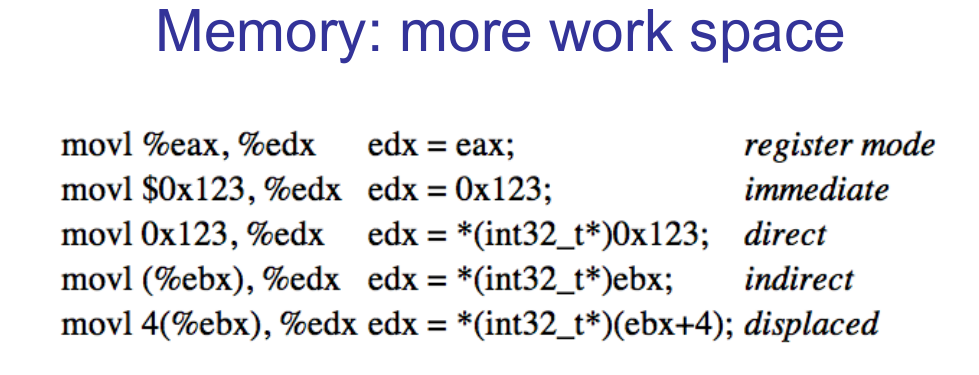
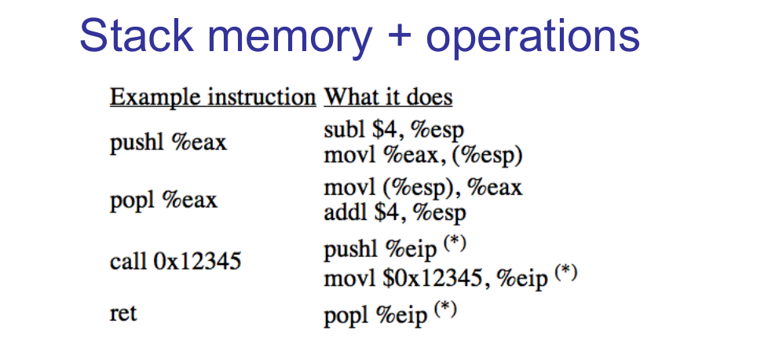

在详细讲解堆栈的使用之前时候，我们首先来提一下堆栈会用到的几个寄存器。

- **esp**寄存器

  x86的堆栈指针寄存器，指向整个堆栈正在被使用的部分的最低地址，在这个地址下面的更低的地址空间都是还没有被利用的堆栈空间（堆栈是向下生张长的）。当计算机要完成一个值压入堆栈的动作时，通常它需要先把esp寄存器中的值减4（减4还是减1，由机器字长决定），然后把需要压入的值存放到当前esp寄存器中存放的地址值。而从堆栈中弹出一个值，则需要计算机首先从esp寄存器中存放的地址值处读取一个数据，然后将esp寄存器中的值加4。简单来说esp寄存器中存放的值就是栈顶的位置。

- **ebp寄存器**

  ebp寄存器是记录每一个函数栈帧相关信息一个非常重要的寄存器。每一个函数在运行时都会分配一个栈帧，栈帧用于存放一些局部变量和函数返回地址。当在函数A中调用另一个函数B的时候，最先要做的就是先把函数A的ebp寄存器的值压入堆栈中保存起来，然后ebp的值更新为当前esp寄存器的值。之后函数B有新的局部变量产生时还是压入栈堆，因此ebp\~esp中间的内容即为函数B的栈帧，即ebp寄存器的值是栈帧的一个边界。假如所有程序都遵守这样子的规则，那运行到这个程序的任何一点时，都可以通过保存在堆栈中ebp寄存器的值来回溯。

这些是堆栈讲解过程中会用到的寄存器

leave：这个指令是函数开头的`pushl %ebp`和`movl %esp, %ebp`的逆操作，即将 ebp的值赋给 esp，这样esp指向的栈顶保存着上一个函数的 ebp 的值。然后执行 popl %ebp，将栈顶元素弹出到 ebp 寄存器，同时esp的值加4指向上一个函数的下一条指令地址。

ret：弹出栈顶元素并将eip设置为该值，跳转到该地址执行。